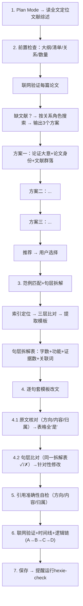
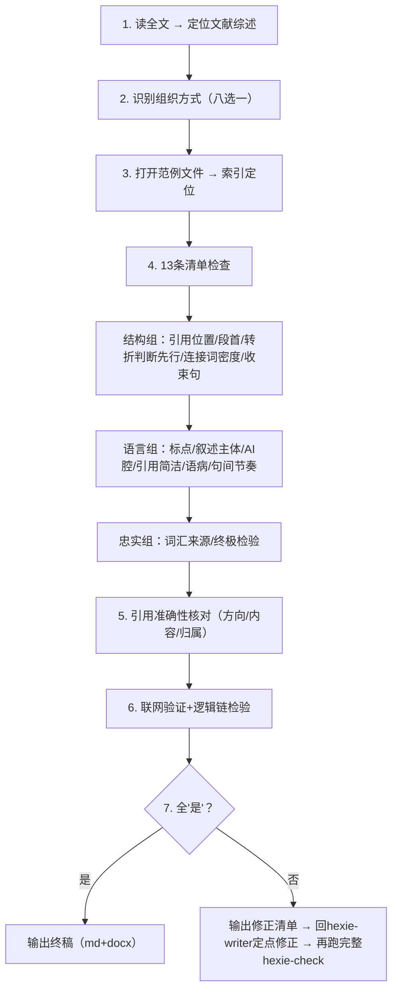
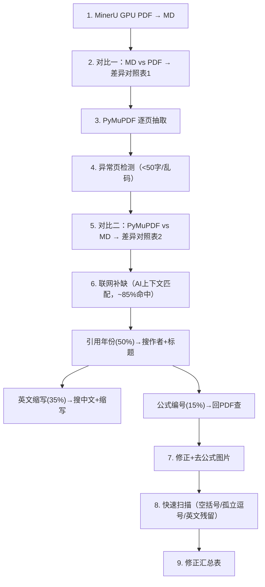

# Hexie —— 文献综述全流程

三个 Claude Code skill。

---

## hexie-writer（写）



---

## hexie-check（查）



---

## hxpdf（PDF转MD校对）



---

## 范例库

22个已发表论文范例，八种组织方式。每个含四层：前8000字原文(去公式图片) + AI上下文分析(段落判断/句层功能标注/引用群落关系图) + 结构大纲 + 正文段落。

## 安装

```
~\.claude\skills\
├── hexie/          (范例库，共享)
├── hexie-writer/
├── hexie-check/
└── hxpdf/
```

## 依赖（仅hxpdf）

MinerU 3.x + PyMuPDF + CUDA版PyTorch。模型：`mineru-models-download -s modelscope -m all`
