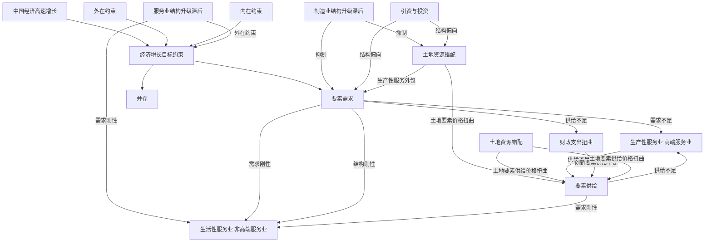

## 一 、 引 言

党的十九大报告指出，当前我国经济发展已由高速增长阶段转向以深化供给侧结构性改革为主线的高质量增长阶段，而瞄准国际标准推进产业结构升级，加快现代服务业发展是推进我国供给侧结构性改革的必由之路。 根据发达国家发展经验，加快服务业发展，推进服务业结构优化是保持经济持续增长的关键。 但这一经济增长的 “一般规律”似乎与中国事实相悖。 改革开放以来，中国经济创造了四十年持续高速增长的 “奇迹”，但在这一经济增长过程中，服务业结构却未得到显著提升。 根据国家统计局数据，2004—2014 年的十年间，中国生产性服务业增加值占第三产业增加值比重由35. 0%增长至37. 1%，仅增长 2. 1 个百分点。 中国虽然整体上已经进入后工业化时期( 赵昌文等，2015; 胡鞍钢，2017) ，但服务业发展状况仍与西方发达国家 “四个70% ”的标准相去甚远。①此外，现阶段我国服务业增加值的增长主要来源于传统服务业部门，这使得中国“脱实向虚”趋势日益凸显( Baumol，1967; 江小涓，2011) 服务业发展水平与经济增长速度脱节现象由何而来? 针对这一问题，本文认为可以从根源，即影响二者发展的驱动力视角去寻找其原因所在。

基于以往学者研究，影响中国经济增长的因素主要可以分为市场性因素与政府性因素两大类。其中市场性因素主要包括以要素投入与配置效率提高为主的供给侧因素( 丁志国等，2012) 和以消费、出口、投资三驾马车为主的需求侧因素; 政府性因素研究中比较具有代表性是周黎安( 2007) 在研究中国经济发展模式后发现，政府官员之间的“晋升锦标赛”的竞争机制是中国近年来经济增长的主要驱动力。 相对于经济增长，服务业发展的影响因素研究主要可分为基础性因素和一般性因素两个方面。 基础性因素主要强调目前中国经济的客观条件，主要有人力资本( Romer，1990;Ciccone ＆ Papaioannou，2009; 张若雪，2010; 张国强等，2011) 、 技术创新( 周叔莲和王伟光，2001; 付宏等，2013) 、需求结构等( Zwemuller ＆ Brunner，2005; 孙军，2008; 刘志彪和张杰，2009) ; 而一般性因素则更加强调中国产业经济的发展环境，主要有政府职能( Lahorgue ＆ Cunha，2004; 褚敏和靳涛，2013; 宋 凌 云 等，2013 ) 、 对 外 开 放 程 度 ( Camilla，2002; 陈 继 勇 和 盛 杨 怿，2009 ) 、 外 部 环 境 等( Levinson ＆ Taylor，2008; 江小涓，2005; 涂正革，2008; 钟茂初等，2015) 。 与经济增长不同的是，在产业结构优化中，政府的制度安排会显著影响产业结构高级化进程( Hashi ＆ Toci，2010; 高远东等，2015) 。

纵观已有文献，从政府性因素视角解读经济高速增长与服务业结构升级滞后并存困境的文献尚不多见。 谭洪波和郑江淮( 2012) 从部门全要素生产率视角剖析了相关问题后发现生产率较高的生产性服务业并未与制造业大规模主副分离是导致经济高速增长与服务业发展滞后并存的主要原因，但这一研究是从市场性因素视角出发的。 中国正处于经济转轨期，市场化程度与发达国家相比仍然不高，各级地方政府行为对地区经济发展的干预作用不容小觑。 在 “晋升锦标赛”机制下，各级政府通常会选择设定经济增长目标这一方式来 “保增长” 。 并且，与市场机制较为完善的欧美国家采用预期经济增长目标有所不同的是，中国的经济增长目标常常采取 “干预”的设定方式并伴随着强约束特征 ① 这一经济增长目标设定方式的差异是否是导致中国服务业结构升级滞后的重要原因? 其作用机制又如何? 遗憾的是，目前尚未有学者针对这一问题进行研究，笔者将以此为出发点探讨经济增长目标约束与服务业结构升级的关系，旨在对这一领域的研究进行弥补 。

本文的创新与研究意义在于: ( 1) 在研究视角上，本文从经济增长目标约束视角去解释 “中国经济高速增长与服务业结构升级滞后并存之谜”，不仅有助于理解中国长期以来产业结构转型的困境问题，也在一定程度上弥补了转型经济体下的产业结构变迁理论研究的不足 ( 2) 在研究数据上，本文手工搜集了2004—2014 年230 个地级市政府工作报告中的经济增长目标数据，研究了地级市层面经济增长目标约束对服务业结构升级的影响，尤其是对经济增长的软硬约束性特征进行了刻画，从而使结论更具新意。 ( 3) 在研究意义上，从经济增长目标约束视角展开的研究，可以为理解我国服务业长期发展的 “结构刚性”提供了一个新的解决思路，研究结论对于中国如何通过调节经济增长目标管理实现服务业结构高级化，以及建设现代化经济体系具有重要启示意义 。

## 二、 理论机制分析

## ( 一) 经济增长目标约束的制度特征

通过梳理近十年各省和各地级市政府工作报告中经济增长目标的设定方式，可以观察到以下三个典型现象: ( 1) 大部分省市的经济增长指标的设定都显著高于全国的预期增长目标，经济增长目标“层层加码”现象广泛存在。 2016 年，从省级层面来看，经济增长目标高于全国目标的省份有25 个，占全国的81%; 从市级层面来看，在资料所及的 230 个地级市中，有 197 个地级市经济增长目标高于全国目标，比重达到86% 。 ( 2) 地方政府更倾向于使用硬约束的方式设定经济增长目标，且政府层级越低，这一倾向越明显。 ( 3) 经济增长目标存在超额完成情况，但政府层级越低，超额完成情况越差。 地方政府普遍制定了较高的经济增长目标，但是从目标的完成情况来看，2004—2014 年省级政府经济增长目标完成率为79.72%，而230 个地级市经济增长目标完成率不足70%，仍有35.33%的地级市没有完成预定的经济增长目标

综上所述，经济增长目标约束的基本方式大体可分为以 “层层加码”为主要特征的外在约束和以软硬约束为主要特征的内在约束两大类 从外在约束来看，为了降低由中央政府与地方政府间信息不对称产生的监督成本( Oates，1972) ，中央政府常采用具有显性特征的 GDP 增长速度指标考核地方发展状况，这一指标也成为地方官员能否获得晋升机会的重要标准 在以 GDP 考核为主的“晋升锦标赛”机制下，地方经济增长速度将与地方官员晋升高度直接 “挂钩” 。 地方官员在这一外在约束下依赖制定较高的经济增长目标来向上级政府释放 “能力信号”( 周黎安，2007) ，表现为各级政府在制定经济增长目标时往往以上级政府目标为基准并进行加码，产生 “层层加码”现象( 周黎安等，2015) 此外，各地方的 “标尺竞争”机制使得这一加码幅度维持在较高水平( 张军等，2007) ，这也使得地方经济增长目标的设定普遍存在过高现象。 从内在约束看，中央政府对地方官员主要采取垂直集中的治理模式，这一“垂直管理”体系形成了下级官员对上级政府负责的激励机制。 “向上负责体制”使得各级政府在制定经济增长目标时往往需要使用“硬约束”的方式以确保目标的超额完成。 以GDP 考核为主的外在约束机制使得地方官员通过“层层加码”制定较高的经济增长目标向上级政府释放“能力信号”，而兑现前期承诺则是拿到锦标赛“入场券”的关键。 因此地方政府官员为获得晋升锦标赛的“入场券”通常会采用“硬约束”的内在约束方式设定经济增长目标。

基于本文研究主题，结合上述经验事实，本文将从经济增长目标特征出发建立基本框架对经济增长目标约束与服务业结构升级的关系进行理论机制的梳理，图1 给出了相关理论机制分析图。

flowchart

图1 理论机制分析

## ( 二) 经济增长目标约束对服务业结构升级的影响机制

## 1． 服务业内部结构异质性特征

由于服务业内部结构具有一定的复杂性，国际上对服务业的分类方式也多种多样，鉴于研究目的，本文按服务对象将服务业分为能够提高制造业生产效率的生产性服务业和不能提高制造业生产效率的生活性服务业两大类。① 不同于生活性服务业不能进行标准化生产、不能形成规模经济、生产与消费同步等特点，随着计算机技术的进步，生产性服务业逐渐形成可标准化生产、规模经济显著、可外包生产等特点。 上述特征使得服务业内部各行业发展在面对宏观经济变化时表现出较大的差异。 考虑到生产性服务业中的交通、仓储、邮电业也存在部分生活性服务业不可外包、生产和消费同步的特征，本文还特别将服务业划分为高端服务业和非高端服务业两大类。②在下文的分析中，本文拟从要素错配视角出发研究经济增长目标约束与服务业结构升级的关系 。

## 2． 经济增长目标约束、要素错配与服务业结构升级滞后

依上文所言，外在与内在的双重约束确实可以在一定程度上激励地方政府推动经济高速增长，但在“GDP 增长让位于结构改革”的新宏观背景下，这一约束方式是否可取却值得商榷。 表现为地方政府在预期按照市场规律发展经济无法达成经济增长目标时，将采取 “揠苗助长”的方式促进地方实现短期经济增长。 20 世纪80 年代以来，中央政府逐渐将经济管理权下放至地方，这使得地方政府拥有对地方的绝对控制权。 在面对经济增长目标 “层层加码”和“硬约束”双重压力时，地方政府将分别从供给端和需求端扭曲要素配置，从而抑制地方生产性服务业发展，影响服务业结构升级 。

## ( 1) 经济增长目标约束、要素供给与服务业结构升级滞后

第一，经济增长目标约束下，地方政府财政支出失衡导致的创新要素供给不足对生产性( 高端) 服务业和生活性( 非高端) 服务业的异质性影响。 从地方政府的财政支出行为来看，经济增长目标约束使得地方政府在预期经济增长目标无法达成时，通常会选择投资基础设施建设的方式以确保经济增长速度在短期内超过目标值，这也是各地方频繁产生重复建设 政绩工程的重要原因政府对有限财政资源的错配问题将主要通过两种方式影响地方服务业发展。 一方面，基础设施建设竞争将会引起财政资源的错配问题进而不利于地方服务业结构优化。 政府财政资源有限，对基础设施的过度投资势必会挤占地方对教育 科技的财政投入( 傅勇和张晏，2007) 国家统计局数据显示，2015 年国家财政教育、科技支出仅占国家财政总支出的18.27% 。 教育和科技投入的缺失将会减少创新要素的供给进而冲击以知识密集型为主要特征的生产性( 高端) 服务业发展。 而生活性( 非高端) 服务业通常为劳动密集型，创新要素供给的减少对相关产业影响相对较小。 另一方面，地方基础设施建设将会带来以建筑业与房地产业比重不断上升为主要特征的过度 “工业化”( 陈志勇和陈莉莉，2011) 房地产业作为生活性服务业的重要组成部分，其产值的增加又会造成当前阶段我国生活性服务业发展大大超前于研发、金融和物流等生产性服务业，致使 “产业结构虚高”和二、三产业互动不足( 郭志勇和顾乃华，2013) ，不利于地方服务业结构升级。 基于此，本文认为经济增长目标约束下，地方政府基础设施的过度建设将通过减少生产性服务业发展所必需的创新要素供给，进而抑制服务业结构升级。

## 第二，经济增长目标约束下，地方政府土地资源错配导致的土地要素供给不足对生产性( 高

端) 服务业和生活性( 非高端) 服务业的异质性影响。 从地方政府的土地资源配置行为来看，经济增长目标约束使得地方政府需要不断积累财政收入以备经济发展之需，而当前我国地方政府获得财政收入的手段主要有两种: 一是依靠税收; 二是通过出让土地的方式获得土地出让金，即土地财政。 分税制改革后，地方税收不断向中央政府集中，事权和财权的不匹配使得地方政府不得不选择采取土地财政的方式透支未来发展空间以保持短期经济增长。 但地方政府间的 “标尺竞争”机制使得降低土地价格成为各地政府招商引资的 “筹码”( 陶然等，2007) 在此情境下，“两块地”策略成为地方政府化解扩大土地财政收入和降低土地价格吸引外资之间矛盾的主要方式。 具体为降低工业用地价格以吸引 “投资周期短、见效快、风险低、不确定性小”的生产性投资，提高商服用地价格以弥补工业用地出让金损失进而实现财政收入最大化的目标。 根据国土资源部数据显示，2014年中国商服用地平均价格为工业用地的1.74 倍。 地方政府 “两块地”策略最终导致土地要素价格扭曲进而提高服务业成本使服务业发展受限。 相较于生产性服务业而言，生活性( 非高端) 服务业由于具有结构刚性的特点，受到的冲击更小。 故地方政府对土地资源的错配将抑制地方服务业结构升级。

## ( 2) 经济增长目标约束、要素需求与服务业结构升级滞后

第一，经济增长目标约束下，地方政府的引资和投资偏好将对生产性( 高端) 服务业需求和生活性( 非高端) 服务业需求产生异质性影响 从投资行为来看，地方政府的投资行为大多依靠垄断国有企业来运作和实施( 马草原和李成，2013; 褚敏和靳涛，2013) 对地方政府而言，国有企业相较于非国有企业，不仅存在较高的财税贡献，也加强了政府对整体经济的控制能力。 因此在经济增长目标约束下，以国有经济垄断和扩张性政策为主的经济刺激政策成为地方政府的首要选择。 地方政府依靠对国有企业的控制权实现其宏观调控的目的，而国有经济更多偏向于重工业投资并且利润目标的偏离导致对生产性服务业和高端服务业需求不足，进而抑制服务业结构升级。 从引资行为来看，依上文所言，追求超额完成经济增长目标的地方政府在招商引资时通常更倾向于引入可以带来短期经济高速增长的工业( 制造业) 企业，这些企业普遍具有资本密集型特征。 长期依赖于资本密集型企业的经济增长模式将带来地方产业的低端 “锁定”和高端制造业的发展滞后。 相较于高端制造业企业需要相关生产性服务业配套，低端制造业的发展对生产性服务业并没有过高需求，故地方制造业结构的滞后将导致对生产性服务业的需求不足进而打击生产性服务业发展。 而对于生活性( 非高端) 服务业而言，需求刚性特征使得其受到的冲击较小。 基于此，本文认为地方政府的投资和引资偏好将抑制服务业结构升级

第二，经济增长目标约束下，地方政府的土地资源错配行为将对生产性( 高端) 服务业需求和生活性( 非高端) 服务业需求产生异质性影响。 依上文所言，“标尺竞争”下，地方政府为争取更多的资本密集型企业入驻，地方政府纷纷选择将土地等可支配资源配置给资本密集型企业 土地资源的错配行为将带来资本密集型企业和知识密集型企业的融资门槛差异，表现为拥有土地的资本密集型企业可以以土地向银行进行抵押贷款，降低融资成本 而相较而言，以高端制造业和生产性服务业为主体知识密集型企业却面临较大的融资困境。 相关产业的发展受阻将通过直接和间接两个途径影响服务业结构升级。 从直接路径来看，生产性服务业融资困难将直接抑制生产性服务业发展，从间接路径来看，一方面，高端制造业融资困难将造成地方制造业升级滞后，进而导致对生产性服务业需求不足，最终抑制生产性服务业发展。 另一方面，从土地要素价格扭曲来看，商服用地价格地提高将增加服务业整体的生产成本，对于生活性( 非高端) 服务业而言，相关产业产品通常价格需求弹性较小，对要素的价格相对不敏感，当面对成本增加等不利于生活性( 非高端) 服务业发展的情境时，生活性( 非高端) 服务业部门可以通过提升产品价格等方式弥补 而对于生产性服务业而言，由于其具有可贸易 可外包等特征，相关产品对生产要素价格更为敏感，增加成本将挤压相关行业发展空间，导致生产性服务业萎缩 基于此，土地要素错配在需求端也会影响到生产性服务业发展进而抑制服务业结构升级。

综上所述，本文认为地方政府经济增长目标的 “层层加码”和“硬约束”特征将会导致要素资源错配进而抑制服务业结构升级。

