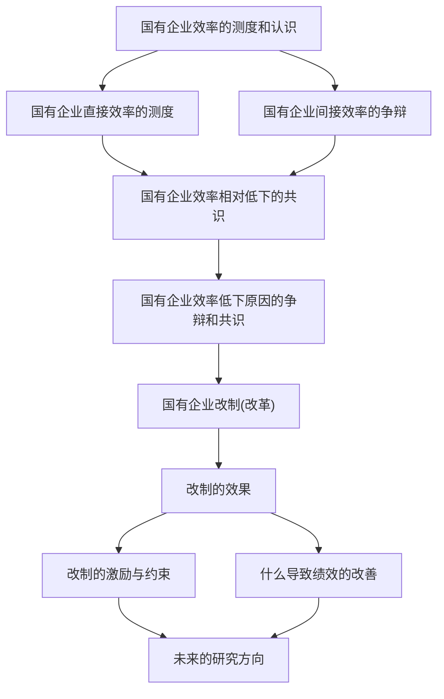

# 中国的国有企业效率:一个文献综述

刘瑞明\*

内容提要 国有企业效率一直是中国国有企业改革中的焦点问题。围绕中国国有企业效率的相关问题,既有文献大体从四个方面进行了探索:第一,利用企业或行业层面的数据测度和比较国有企业的直接效率;第二,从宏观和间接的视角论证国有企业整体对经济增长的影响,强调国有企业的“间接效率”和影响经济增长的内在机制;第三,在认识国有企业效率的基础上,分析国有企业效率相对低下的原因;第四,探索国有企业改制的效果、改制后绩效改善的原因以及改制的激励约束条件。本文从这四个方面对现有研究进行系统梳理。最后,在总结现有文献的基础上,指出这一领域未来可能需要关注的几个问题。

关键词 国有企业效率 国有企业改制绩效 文献综述

## 一 引言

在中国的经济转轨过程中,国有企业改革一直处于经济改革的核心位置。随着经济改革的推进,原本已经基本取得共识的对国有企业改革的评价在近年来波澜再起。自2004年的“郎顾之争”以来,国有企业改革方向变得扑朔迷离,而且进入新世纪后

世界经济 \* 2013年第11期 · 136 ·

一小部分大型国有企业的业绩表现得异常突出。这些现象使得人们对于国有企业改革将何去何从产生了疑问，也引发人们对于国有企业效率和国有企业改革方向的热烈讨论。在这样一个大背景下，对于中国国有企业效率的认识也就显得异常重要。大量经济学者曾经运用现代经济学的基本原理、方法度量了中国国有企业的效率，并在理论上给予解释。随着改革进程的演进，学者对国有企业效率的认识也在不断更新。充分梳理这些文献的认识是一项重要而有意义的工作。

以此为背景,本文尝试对该领域主要的经验研究、理论文献给予归纳与梳理。在既有的文献当中,Megginson 和 Netter(2001)、Djankov 和 Murrel(2002)详细地回顾了世界各国不同所有制下企业绩效的相关文献,所得出的一个基本结论是,国有企业比私有企业效益低下,并且民营化是有效的,民营企业几乎总会变得更有效率。这些国际经验文献的认识固然具有启发意义,但是我们依然要考虑中国的具体情况。中国国有企业的效率表现得究竟怎样?有学者从某一个侧面综述相关文献,如张军等(2003)从全要素生产率(TFP)的角度进行相关综述,Sachs 和 Woo(1997)、Hovey 和 Naughton(2007)的研究也包含了部分国有企业效率的文献。但是这些综述往往只涉及国有企业效率的某一个方面,其重点也不是围绕国企效率展开的。

与这些既有文献不同，
本文着重考察中国国有企业的效率，这一研究从多视角全方位地透视国有企业效率，并试图通过对文献认识的梳理辨识出国有企业改革的方向。总体来看，既有文献的落脚点集中在四个方面：一是从企业理论出发论证国有企业为什么会效率低下，并利用企业或行业层面的数据对国有企业效率给予验证，由于这类文献仅仅涉及国有企业本身的效率损失，我们将其概括为“直接效率”文献；二是从宏观和间接

flowchart

图 1 文献综述框架

的视角论证国有企业整体对经济增长的影响,强调国有企业的间接效率和增长拖累效应;三是在认识国有企业效率的基础上,分析国有企业效率低下的原因;四是探索国有企业改制的后果、改制后绩效改善的原因以及改制的激励约束条件。因此,本文从这四个方面进行梳理,图1说明了我们进行文献梳理的框架结构。

本文剩余部分安排如下:第二节从多个角度梳理对国有企业直接效率损失的认识;第三节综述国有企业间接效率的文献;第四节对国有企业效率低下的原因进行梳理;第五节对国有企业改制的后果、绩效改善的原因和改制的激励约束条件进行梳理;第六节总结全文并给出未来的研究方向。

## 二 国有企业的直接效率:经验文献的认识

有关国有企业的效率,大量文献从多个方面对其进行了研究。尽管存在细节方面的争论,但是这些文献所取得的一个共同认识是,相对于其他所有制类型企业而言,国有企业效率较低,但通过改制可以显著提高企业绩效。

## (一)效率、价值与代理成本

1. 国有企业的技术效率与创新效率。① 大量文献从技术效率、创新效率等角度来检验和比较国有企业的效率。姚洋(1998)利用1995年第三次工业普查的企业资料，在对12个大类行业中的14670个企业的样本数据进行分析后发现，与国有企业相比，集体企业的技术效率高22%，私营企业高57%，国外三资企业高39%，港、澳、台三资企业高33%。这一结论在姚洋和章奇(2001)中也得到了验证。刘小玄(2000)利用1995年全国工业普查的数据研究发现，国有企业在各类所有制企业中效率最低。

刘小玄(2003)还进一步检验了中国转轨经济中产权结构和市场结构对于产业绩效的影响作用,发现国有产权结构变量对于产业绩效具有明显的负效应,对产业集中率和规模变量则具有正效应。胡一帆等(2006a)利用世界银行在1996\~2001年间对中国5城市6部门700多家公司的调查数据,研究了所有制多元化对公司绩效的影响,他们发现,相比于国有股份,私有股份和外资所有股份对公司生产率具有更大的激励作用,在法人股中,只有私有法人股和公司生产率正相关。吴延兵(2012)进一步指出,由于国有企业的公有产权属性,国有企业不仅存在着生产效率损失,还存在着创新效率损失。创新的不确定性和长期性导致国有企业不可能通过改善公司治理结构的方式激励创新,因而国有企业的创新效率损失大于生产效率损失。吴延兵(2012)利用中国1998\~2003年省级工业行业数据验证了这一假说。温军和冯根福(2012)利用2004\~2009年923家上市公司的数据也发现,证券投资基金会对企业创新产生负效应,而且这种负效应在国有企业中表现得更为明显,国有企业中机构投资者持股与企业创新呈显著的负相关关系。

2. 国有股权与企业绩效。另一些文献对企业中国有股权对企业绩效的作用进行了检验。Zhang 等(2001)对中国 26 个行业 1996 \~ 1998 年 1838 个企业的面板数据研究发现,对资本结构、税收和福利负担效应调整后,国有企业依然表现出较差的财务绩效,并且,尽管国有企业的生产效率在这一时期内进步较快,但是利润增长依然落后于其他所有制结构的企业。Sun 和 Tong(2003)研究了 634 家上市国有企业 1994 \~ 1998 年的数据,发现国有股对上市公司绩效的负面效应。Hovey(2005)运用逐年分析法和对 1997 \~ 2001 年的 3835 个观测值的混合回归发现,政府所有权与企业绩效有着负向的相关关系。Wei 和 Varela(2003)、Wei 等(2005)、Xu 和 Wang(1999)也得出类似的研究结论。还有一些文献进一步探索了国有股权对企业绩效的非线性影响。Sun 等(2002)发现国有股持股比例与以权益市净率度量的公司绩效呈倒 U 型关系。但田利辉(2005)却发现,政府持股规模和公司绩效之间呈现左高右低的非对称 U 型关系。

然而，在中国的官方统计报告中，对股本类型所做的国有股与法人股的分类导致了对中国上市公司终极产权所有者的模糊界定，从而导致一些研究股权结构对公司绩效的文献可能存在偏误。针对这一问题，刘芍佳等(2003)应用终极产权论对中国上市公司的控股主体重新进行了分类，结果发现，中国84%的上市公司最终由政府控制，上市公司的股本结构仍然是国家主导型的。在按照新的控股主体分类标准对不同的控股类型进行了绩效筛选比较后，他们发现，在国家最终掌控的上市公司中，相对来讲代理效率损失最低的企业具有以下特点：国家间接控股、同行同专业的公司控股、整

世界经济 \* 2013年第11期

体上市。沿着“终极产权论”的思路，夏立军和方轶强(2005)以2001～2003年的上市公司为样本，对政府控制、治理环境与公司价值的关系进行了经验分析，研究发现，政府控制尤其是县级和市级政府控制对公司价值产生了负面影响，但公司所处治理环境的改善有助于减轻这种负面影响。杨记军等(2010)利用2003～2007年国有企业股权转让数据研究显示，民营化确实提高了企业经营业绩，但终极控制权仍保留在政府内部的“换汤不换药”的控制权转让方式没有显著改善企业业绩。

3. 国有企业的代理成本。考察国有企业效率的另外一个重要视角是代理成本。根据 Zhou 和 Wang(2000) 的认识, 代理成本可以被定义为企业由所有者自己经营时和由代理人经营时导致的利润差额。研究表明, 国有企业的代理成本高昂, 是众多所有制类型企业中最高的。平新乔等(2003) 对中国国有企业代理成本的规模估计后发现, 在现存的国有企业体制下, 代理成本使企业效率只达到了 30% \~ 40%。模拟估算的结果显示, 采取租赁、出售或租售国企的方式, 大约可以使其利润潜力的利用率增加 20 个百分点。李寿喜(2007) 选择政府管制较少、竞争较为充分的电子电器行业作为研究对象, 考察了产权制度与代理成本的关系。研究发现, 在代理成本上, 国有产权企业普遍高于混合产权企业, 混合产权企业高于个人产权企业。具体而言, 中国国有企业绝对的国有资产管理体制导致了其高昂的代理成本(Zhou 和 Wang, 2000)。国有企业的高昂代理成本可以归因于庞杂冗长的委托代理关系(张维迎, 1999)。

## (二)全要素生产率视角①

一些文献关注国有企业全要素生产率(TFP)的增长,试图通过对TFP的测度来考察中国国有企业的效率。但是正如Jefferson等(1996)所指出的那样,由于生产率受到多种因素的影响,很难辨别出生产率变化的真正原因。因此,在如何度量国有企业的TFP以及中国国有企业的TFP到底是多少的问题上,学界一直争论不休。

1. 对国有企业 TFP 的测度。一些早期的测度文献并没有发现中国国有企业的效率增进。例如, 邹至庄(1984)用可比价格作为中国工业企业的投入品和产出品的缩减指数来估算“真实投入”和“真实产出”, 以此“真实数据”计算得到的中国工业企业 TFP 基本上没有增长的趋势, 中国工业产出的增加主要是由于资本资产的增加, 而不是技术的改进。但是随着认知的推进, 人们对于国有企业 TFP 的认识多有争论。根据 Sachs 和 Woo(1997) 的划分, 对国有企业 TFP 的测算结果大体可分为三类:

第一类认为中国的国有企业具有较高的 TFP 增长率。例如, Chen 等(1988)利用

1953 \~ 1985 年的数据,分别用 C-D 生产函数和超越对数生产函数进行了估算,结果发现,这一时期中国国有企业的 TFP 每年增长 1.9% \~ 2.8%;在 1957 \~ 1978 年期间,TFP 增长率为 0.4% \~ 1.4%,而在 1978 \~ 1985 年间,这一增长率达到 4.8% \~ 5.9%。Jefferson 等(1992)利用 1984 和 1987 年两个年份 293 个样本企业的横截面数据研究得出,国有企业的 TFP 在改革后的 1980 \~ 1988 年有显著增长,年均增长率大约为 2.4%。Jefferson 等(1996)又发现 1980 \~ 1992 年国有企业的 TFP 年均增长率为 2.5%。Groves 等(1994)估计 1980 \~ 1989 年食品生产行业的 TFP 年均增长 2.3%,电子行业 TFP 年均增长 7.9%。周黎安等(2007)利用 1998 \~ 2004 年中国制造业企业数据发现,尽管国有企业平均来看较其他所有制企业的生产率低,但在 1988 年之后新成立的国有企业表现出了明显的追赶效应。谢千里等(2008)利用 1998 和 2005 年的全部国有及规模以上非国有工业企业数据研究指出,虽然国有企业的 TFP 依然是各种所有制企业中最低的,但其年增长率是最快的,达到了 15.63%。

第二类认为中国的 TFP 几乎没有变化,甚至出现恶化。Woo 等(1994)使用 1984 \~ 1988 年的 300 家大中型企业的数据发现,国有企业在 1984 \~ 1988 年间 TFP 的增长至多为零。他们认为,谢千里等之所以能够得出 TFP 增长率为正的结论,是因为他们不但完全剔除了中国工业部门的非生产性投入,而且高估了中间产品的价格指数。① Huang 和 Meng(1999)利用随机边界分析方法对 967 个国有企业的调查数据研究发现,1986 \~ 1990 年 TFP 的增长为-2.2%。孔翔等(1999)对 1990 \~ 1994 年的数据研究也发现,部分行业的国有企业出现了 TFP 的负增长或零增长。

第三类介于前两者之间,多半认为1985年后TFP的增长放慢。Wu和Wu(1994)发现,TFP在1979\~1984年间增长,而在1985\~1992年间停滞。Perkins等(1993)指出,在全国范围内,TFP指数1981年为100,1985年为104,1989年下降到81,而且TFP的增长存在着显著的地区差异。大琢启二郎等(2000)的计算结果显示,国有企业在1978\~1995年平均年增长率为2.5%,上世纪90年代以来的改革对国有企业生产效率的影响有限。这一结论与Wu(1995)和Jefferson等(1996)更细致的研究结论大多一致,后者发现,中国国有企业的TFP在20世纪80年代末有下降趋势。李利英(2004)运用对769家国有企业1980\~1999年间的调查数据,用时间参数法对样本企业的生产率长期变动趋势进行测定,发现除个别年份外样本企业的生产率一直保持增长态势,但与80年代相比,90年代生产率增长的速度有所下降。

2. 国有企业 TFP 变化以及文献争议的原因。其实，在改革的进程中，TFP 发生这种先增后降的变化不难理解。在上个世纪 80 年代，由于国有企业自主权的扩大以及随后实行的承包经营责任制（郑玉歆和罗斯基，1993），国有企业的生产率有了较大幅度的增长。这一时期的生产率增长更多地来自制度性变革，而随着制度变革潜力的逐渐释放，生产率的增长越来越依靠技术水平和技术效率的提高，但是在这方面，中国企业表现得并不理想。郑京海等(2002)利用 1980～1994 年的 700 个国有企业样本数据研究表明，与样本企业中的最佳实践企业相比，这些样本企业的技术效率普遍较低。尽管生产率增长引人注目，但这一增长主要是通过技术进步而不是通过提高技术效率增进的。郑京海等(2008)进一步发现，改革的措施往往导致对 TFP 一次性的水平效应。因此，中国需要调整其改革方案以促进生产率的持续增长。①

事实上,对 TFP 估计的差异主要是因为影响因素太多,数据集和生产函数的选择、技术变革假定、估计方法、投入和产出缩减因子的选择、观测值的剔除等都对 TFP 的测度具有重要影响。② 更为重要的是,即使 TFP 确实得到了增长,也不一定产生积极影响。根据 Bai 等(1997)的研究,只有当公司以利润最大化和市场为导向时的 TFP 增加,才可以很好地反映福利的改善。然而,对改革中的国有企业而言,这些条件并不满足,管理者一个重要的非利润目标是过分追求产出。因此,国有企业配置效率和财务状况可能因为 TFP 的改善反而表现不良。

3. 有关国有企业 TFP 测度的共识。在人们对于中国国有企业 TFP 到底是否增进、增进的程度如何这些问题争论不休时，另一部分文献比较了不同所有制结构企业的 TFP 增长率。在这方面，经济学家们取得了一致的认识。一个基本的共识是，国有企业的 TFP 往往是各类所有制企业中最低的。例如, Lo(1999) 运用 1980 \~ 1995 年的数据估算出 C-D 生产函数, 比较了国有企业和乡镇企业的生产率。结果显示, 乡镇企业的生产率增长快于国有企业和大中型国有企业, 但是大中型国有企业的生产率增长要比国有企业总体快。周黎安等(2007) 利用 1998 \~ 2004 年中国制造业企业数据研究发现, 平均来看国有企业较其他所有制企业的生产率低。Brandt 等(2008) 利用 1978 \~ 2004 年的数据研究表明, 尽管国有部门的 TFP 在不断提高, 但是仍然远远低于非国有部门。改革以来非农非国有部门的 TFP 年均增长率是 4.33%, 而国有非农部门的 TFP 年均增长率仅仅为 1.66%。至 2004 年, 非国有非农业部门的 TFP 比国有部门高出 80%。

国有企业生产率的表现是一个有争议的问题,但如果从所有制结构的比较来看,几乎所有相关文献都表明,国有企业TFP和其他所有制结构的企业有明显的差距。

## 三 国有企业的间接效率:对经济增长的影响

## (一)国有企业与经济增长关系的争论与验证

以上文献都是从国有企业的微观效率和直接效率层面来测度的,有没有可能从宏观和间接的角度看国有企业是有效率的?对此,刘元春(2001a、b)认为,在实行后赶超战略的社会主义市场经济中,国有企业可以作为克服“市场失灵”和“政府失灵”的制度安排,成为“技术模仿、技术扩散和技术赶超”的中心,充当转型期“宏观经济的稳定者”、“社会福利和公共品的提供者”,因而在宏观上是有效率的。从理论上讲,这是一种可能。然而,在两篇文章中,刘元春仅仅列举了一些数据图表,其研究结论的稳健性有待进一步考察。面对这种提法,杨天宇(2002)迅速地回应了刘元春的观点,他指出,该文的立论涉及两个问题:第一,国有企业是否可以真正起到上述作用;第二,如果国有企业确实具有上述功能,那么这种功能从宏观来看是得大于失还是得不偿失,如果国有企业的上述功能从全社会来看是得不偿失的,那么显然不能说它有“宏观效率”。通过对中国宏观数据的分析,他的结论和刘元春(2001a)的结论恰恰相反。

事实上,有关国有企业是否具有宏观效率的争论主要集中在国有企业的正外部性和负外部性孰大孰小的问题上。如果国有企业对于其他部门正的外部性大一些,那么国有经济与经济增长之间应该呈现正相关,而如果国有企业对于其他部门负的外部性大一些,那么国有经济与经济增长之间应该呈现负相关。然而,刘元春(2001a、b)和杨天宇(2002)都没有能够提供坚实的证据支撑。许多学者对国有经济与经济增长之

世界经济 \* 2013年第11期

间的关系进行了检验后发现,国有经济与经济增长之间呈现显著的负效应。Lin (2000)用国有部门投资占全社会固定资产投资比重来衡量国有企业部门规模,研究发现,在1983\~1996年间,国有部门规模对经济增长存在显著的负面影响。Chen和Feng(2000)用国有企业产值占地区收入比重衡量国有企业部门规模,对1978\~1989年的数据估计发现,国有企业阻碍了经济增长。Phillips和Shen(2005)利用中国的省级面板数据进行了计量检验,结果显示,国有企业规模和省级经济增长率之间存在稳健的负向关系,工业产出中国有企业比重每下降10%可促使下一年度的GDP增长0.7%\~1.2%,国有企业的就业比重每下降10%可使经济增长率平均上升1.6%\~2.3%。林毅夫和刘明兴(2003)的研究也涉及这一点,用国有工业总产值占工业总产值的比重来衡量国有企业部门规模,对1978\~1999年的省级面板数据研究发现,国有企业部门规模对经济增长产生了显著的负效应。董先安(2004)、刘瑞明和石磊(2010)等也得出了类似的结论。

尽管大部分文献都证实国有经济整体对经济增长的负面效应,但是也有文献提供了国有企业效应不显著的证据。黄险峰和李平(2008)利用1990\~2004年中国各省区的有关数据,采用5个衡量国有企业部门规模的变量分别进行检验,发现不同变量系数显著性存在很大差别。① 黄险峰和李平(2009)依据中国各地区1992\~2003年的数据发现,国有企业部门的低效率和正外部效应都显著,并且这两种影响差不多正好相互抵消。因此,总体上讲,国有企业对中国经济增长的贡献与其他部门相比并不存在显著差异。不过,这一结论和现实观察有很大出入,如果国有企业对经济增长的正负效应互相抵消,那么为什么那些国有比重越高的地区取得了越差的经济绩效?

## (二)国有企业对经济增长的间接作用机制

事实上,仅仅关注国有经济自身的效率损失和其对经济增长的直接作用固然有益,但是这却忽视了另一种效率损失,即由国有企业自身效率损失而引发的拖累效应。基于此,刘瑞明和石磊(2010)扩展了国有企业效率损失的内涵,认为国有企业的效率损失应该包含国有企业本身的效率损失和由这种效率损失进一步带来的其他效率损失两种。国有企业不仅本身存在效率损失,而且由于软预算约束的存在,其拖累了民营企业的发展进度,从而对整个经济体构成“增长拖累”。对中国1985\~2004年省级面板数据的计量结果表明,国有经济比重对民营经济增长和总体经济增长产生了显著的负面效应。而且转型时期金融压抑、所有制歧视、市场分割、上游要素垄断等都构成了对国有企业进行隐性补贴的重要方式,拖累效应也通过这些途径表现出来(刘瑞明,2011a、2012;刘瑞明和石磊,2011)。

此外，有文献还进一步围绕国有经济与生产的不确定性、企业进入壁垒、产业集聚、增长轨迹、经济波动等方面的关系展开了探讨。王志刚等(2006)发现，国有化程度对生产效率有负面影响，国有企业比重越高，生产的不确定性越高。杨天宇和张蕾(2009)利用2004年全国经济普查中153个制造业行业的横截面数据发现，国有经济比重对企业进入有显著的阻碍作用，同时，国有经济比重对企业退出有显著正效应。王珺和杨本建(2010)也发现，国有企业更为偏好自制而非购买，这导致了集聚效应不足，国有比重越高，则地区产业集聚越差。刘瑞明(2011b)发现，初始的国有比重越高，则后续年份的平均增长率越低，国有比重的下降显著地促进了地区经济增长。詹新宇和方福前(2012)探索了国有经济改革与中国经济波动的关系，他们发现，国有企业改革导致国有企业双重经营目标相对权重的变化，是中国经济波动特征发生转折的重要冲击源，因此推进国企改革有利于经济波动的平稳化。①

从如上对国有企业间接效率的文献梳理来看,大量的研究证实,其对经济增长具有负面影响,这种负面影响不仅仅是通过国有企业的低效率直接体现出来,还可能通过软预算约束、抑制金融发展、强化市场分割和经济波动等间接途径影响地区经济增长。

## 四 国有企业的效率损失来源:争论及其共识

尽管文献普遍认为国有企业的相对绩效较差,但是在国有企业为什么会效率低下的问题上理论界却争论不休。对于中国国有企业效率理论界存在几种重要认识。②

## (一)公司治理结构论①

第一种认识被称为“公司治理结构论”。现代企业的一大特征是所有权和经营权的分离(Berle 和 Means,1932)，形成了所有者和经营者的委托-代理关系。正是因为这一特征，如何使经营者按照所有者的权益来行动构成了现代企业的一个核心问题。现代企业中的公司治理结构就是在所有权和经营权分离条件下协调股东和其他利益相关者关系的一种机制。② 依据现代企业理论和产权理论(Jensen 和 Meckling,1976; Williamson,1985; Grossman 和 Hart,1986; 张维迎,1995)的认知，公司治理结构的一个关键问题是如何使企业的剩余索取权和剩余控制权相对应，从而降低代理成本，保证股东利益的最大化，防止经营者与所有者利益的背离。

在中国的转型经济中,国有企业由于其特殊的企业性质,在公司治理结构方面表现出重大缺陷。石磊(1995)、郑红亮和王凤彬(2000)、Clarke(2003)、Lin(2004)、Liu(2006)、Kang等(2008)、Liao(2009)、Li等(2011)发现,除了现代企业普遍存在的各种公司治理问题外,中国的国有企业在公司内部治理结构方面至少存在如下缺陷:第一,国有企业面临“所有者缺位”和“虚委托人”问题,国有企业名义上属于国有,但是在实际运行的过程中国家中的公民又不能够行使委托人的权力,不存在真正的委托人,导致“内部人控制”现象严重。第二,因为国有企业不能够有真正的委托人,从而没有人为选拔经营者所带来的后果负责,有效的经营者选拔机制无法实现。第三,委托代理层次太多导致效率损失,这种庞杂冗长的委托代理关系导致了国有企业的高昂代理成本。第四,公司治理结构不完善,未能建立起董事会、经理层、股东和其他利害相关者的相互制衡机制,或者有名无实,不能够起到真正的激励约束机制。第五,股权结构不合理,国有股一股“独大”使得公司治理形同虚设。所有这些缺陷都严重影响了国有企业的绩效。可以说,既有的文献基本达成了一个共识,国有企业在公司治理结构方面亟待改善,也正因为如此,构建“产权明晰、权责分明、政企分开、管理科学”的现代企业制度成为国有企业改革的重点方向。①

## (二)产权论

第二种认识被称为“产权论”，认为国有企业的低效率根源于国家所有制下引发的一系列委托-代理问题和效率损失，而且要想从根本上解决这些问题，就需要从产权制度入手(张维迎，1999、2010)。与公司治理结构理论相同，产权论的支持者往往也主张引入现代企业的治理结构，但其考虑到国有企业特殊的“所有者缺位”问题，认为引入现代公司治理结构仅有助于解决短期激励问题，而不能解决国有企业内在的一些根本性问题和矛盾。张维迎(1999)指出，企业制度要解决激励机制和经营者选择机制两个问题，虽然中国的国有企业改革在解决经营者的短期激励问题方面是比较成功的，但是这并没有解决经营者的长期激励和选择问题，因为国有企业的经理是由政府官员而非真正承担风险的资产所有者选择。因此，如果要从根本上解决国有企业的激励问题，就要找到真正承担风险的资产所有者，从而必须对国有企业和国有银行进行民营化改革。②

## (三)政策性负担论

第三种认识认为在国家赶超战略实施中国有企业承担了大量政策性负担,从而产生了逆向选择和软预算约束问题,导致效率低下(林毅夫等,1997)。林毅夫等(1997)认为,现代企业制度的核心是公平竞争的市场能够产生关于企业经营绩效的充分信息,从而降低经营者与所有者之间信息不对称、激励不相容和责任不对等问题,使企业所有者得以有效监督经营者的行为,并创造出所有者和经营者激励相容的企业管理制度。由于目前国有企业面临一系列政策性负担,缺乏公平而充分竞争的市场环境,不能产生企业经营绩效的充分信息,因此,经营者侵犯所有者权益的现象难以避免。在他们看来,创造一个公平而充分竞争的市场环境是国有企业改革的核心。有了这种外部市场环境,并改进企业内部的管理体制,国有企业也可以是有效率的。这种理论也往往被冠以“竞争论”的称谓。

可以看到,无论是哪种学说,它们都指向了一个共同的事实,国有企业内部存在大量的资源误配现象,这是工业企业长期低效率和经济增长相对滞后的重要原因。①

## (四)争论中的共识

值得注意的是,在改革的侧重点方面,现有理论之间存在一定的争论,这尤其体现在以张维迎为代表的“产权论”和以林毅夫为代表的“竞争论”之间。他们的主要分歧在于产权论更强调产权改革从根本上解决问题,而竞争论则认为不必要非得进行产权改革才能达到改革目的,只要政府能够营造一个充分竞争的市场环境同样能达到良好的经济绩效。

在经验研究方面,有文献验证了各个理论的有效性。胡一帆等(2005)采用世界银行对中国5大城市7个行业的700多家公司1996\~2001年运营情况的调查数据研究发现:当分别对各单个因素进行考察时,各因素都对样本公司绩效有积极影响。然而,当对这些因素进行综合考察时,产权结构与公司治理作用相对重要,而竞争效应则不显著。聂辉华等(2008)利用2001\~2003年全国规模以上工业企业的平衡面板数据发现,给定市场竞争程度,国有产权明显比其他所有制带来更低的经营绩效,而且在不同竞争程度的市场环境下国有产权的劣势都很明显;在考虑了市场竞争对产权的影响后,国有资本对企业绩效的影响显著为负,而私营资本对企业绩效的影响显著为正。这表明国有企业改革的重点应该是产权改革和继续完善企业内部治理结构。徐明东和田素华(2013)利用1999\~2007年中国全部国有及规模以上工业企业数据研究表明,在政府仍然对国有企业有较强干预和保护的背景下,相比于单纯的市场化改革,产权改革的影响更为明显,能够显著提高其投资的资本成本敏感性。而且,产权改制为非国有控股后,企业投资的资本成本敏感性才得到显著提高。

需要高度注意的是,刻意强调这些理论之间的争论对于国有企业的改革并不是一个明智的选择。就改革方向而言,不同理论在一系列改革问题上,如对基本产权的赋予和保护、鼓励良性竞争、发挥比较优势、市场经济中政府放松对国有企业的控制和干预等问题上有着类似的认识。正如胡一帆等(2005)所指出的那样,在产权与公司治理,以及产权与竞争之间存在着某种程度的替代性,对企业绩效的全面研究需要将多个理论体系结合起来进行综合考察。总体来看,尽管在具体改革措施上存在争议,但是这几种理论是互补的,都为理解国有企业低效提供了重要思路。

## 五 国有企业改制的效果、绩效改善的原因与改制的激励约束条件

## (一) 改制的效果

既然国有企业存在效率损失和国有企业的相对绩效较差,那么国有企业改制是否会带来绩效的提高?大量文献从国有企业改制效果的角度做出了分析,一个基本的结论是,改制可以带来效率和经济效益的改善,而且没有发现大的社会成本。

宋立刚和姚洋(2005)通过对1995\~2001年683家国有企业的调查研究显示,改制对企业的利润率有显著的正影响,但是对单位成本和劳动生产率的影响较弱或不显著。这一研究还发现了明显的时间趋势,改制效果对于那些具有中等长度改制历史的企业以及在1997\~1999年间实施改制的企业最为稳定,私人控股企业比国有控股企业表现得更好一些。刘小玄和李利英(2005)通过对451家样本企业(1994\~1999年)的调查数据分析发现,国家资本股权的变化与企业效率水平显著负相关,而个人资本股权变化与企业效率水平呈现显著的正相关性,法人股权的变化也具有较为显著的正相关性。白重恩等(2006)利用1998\~2003年全部国有企业和规模以上非国有企业的数据研究发现,改制后企业经济效益显著提高,并且主要来自于代理成本的降低,表现为管理费用率的下降;改制带来了一定的社会成本,但和其他国家相比不是很高;国有控股改制社会效益较好,而非国有控股改制经济效益较好;改制效果在一定期间内持续。郝大明(2006)利用2001年山东省第二次基本单位普查工业企业数据资料分析表明,国有企业公司制改革后的效率都有较为明显的提高,但不同经济类型公司的效率差异很大。胡一帆等(2006b)根据世界银行一份对中国5个城市、覆盖6个行业的近300家国有企业1996\~2001年的调查数据发现:绩效较好的国有企业优先被民营化;总体上来说,中国的民营化改革是富有成效的,尤其是提高销售收入,降低了企业的成本,并最终导致企业盈利能力和生产率的大幅提高;而且在获得这些收益的同时并没有带来大规模的失业问题;由民营机构控股、彻底民营化的企业相比那些仍然

世界经济 \* 2013年第11期

是国有控股、部分民营化的企业绩效表现更好。李楠和乔榛(2010)利用1999～2006年中国工业行业数据，采用双重差分模型研究发现，国有企业绩效虽仍有别于其他所有制类型的企业，但经济绩效自2003年前后发生明显好转，国有企业绩效已经与较好的三资企业无差异。李广子和刘力(2010)利用中国剔除资产重组影响后的上市公司民营化样本也发现，民营化后上市公司的绩效得到改善，而且与未发生控制权转让的配对国有上市公司样本以及国有企业间控制权转让样本相比，民营化能够更加有效地改善上市公司绩效。总体来说，中国的经济增长部分来自于低效率的国有部门向高效率的非国有部门的转移(Song等,2011)。

由于改制还涉及对就业的影响，D'Souza等(2003)利用中国208家1990～1997年上市公司的数据研究了企业改制的就业效应，研究发现，短期内，上市后公司的就业没有显著变化，但是长期而言就业显著下降。但该研究没有考虑中国改革进程中的一些特征，其结果有可能是不稳健的(黄玲文和姚洋,2007)。黄玲文和姚洋(2007)试图克服D'Souza等人研究的弊端，从产业结构调整、竞争使国企“减员增效”和改制企业规模扩张增加就业三个角度质疑改制是国有企业员工大规模下岗的诱因这一判断，通过对11个城市386家企业1995～2001年面板数据的研究，评估了企业改制对就业的影响。结果显示，和一般印象相反，改制显著地减缓了就业的下降趋势，而且改制对企业的就业增长有持续和递增的积极作用。同时，胡一帆等(2006b)也发现，中国的民营化并没有带来大规模的失业问题。方明月等(2010)使用1999～2005年中国全部国有及规模以上工业企业数据库估计了不同所有制企业的微观就业弹性，他们发现，在短期内，港澳台和外资企业的就业弹性最高，私营和集体企业居中，国有和其他企业最低。在长期内，港澳台、外资和私营企业仍然高于国有和集体企业。

## (二)什么导致了绩效的改善?

既然改制和改革会对绩效产生影响,那么探寻这种影响的来源就显得异常必要。对此,一些文献开始检验绩效改善的影响因素。例如,Groves等(1994)对中国国有企业抽样调查数据的分析表明,国有企业的效率增长主要来自于奖金的激励、人力素质和教育程度的改善。Liu和Liu(1996)指出,改革对企业技术效率的影响是明显的,奖金制度对效率改善的影响尤其显著。Yao(1997)研究了利润分享和奖金对中国20世纪80年代国有企业绩效的影响,发现超过半数的价值增值可以被奖金激励所解释,劳动力质量是另一个影响企业绩效的重要因素。刘小玄和郑京海(1998)发现,留利、浮动工资比例、企业年龄、厂长工资、教育程度等对企业效率有着积极的正面影响。在中国企业改革过程中,生产率增长的决定因素除了由技术性规定的某些因素(如规模、

世界经济 \* 2013年第11期 · 150 ·

资本装备率等)之外,最主要的因素是产权、人力资本和市场竞争。郑京海等(2002)也发现,工资激励和职工学历对于国有企业生产率的增长有显著的促进作用。周权雄和朱卫平(2010)从国有企业内部的锦标赛竞争激励角度发现,薪酬差距的扩大和国有企业经营者赢得经济锦标赛激励的强化会提高国有企业经营者的努力程度,因而有利于公司绩效的提升。

除了以上各种方式外,上市和公司治理结构的完善也是国有企业改进绩效的一种途径。胡吉祥等(2011)基于1998\~2007年中国制造业企业面板数据发现,公开上市的企业绩效在上市之前就相对良好,在控制了这种差别及其他的影响因素后,上市提高了国有企业的销售利润率、净利润水平、人均销售额和人均利润额,并促进了企业的资本支出和长期投资。有学者进一步研究了上市公司的治理结构对企业绩效的影响。魏明海和柳建华(2007)以2001\~2004年国有上市公司为样本研究指出,公司内部治理结构和外部治理环境的改善会制约国有企业的过度投资行为。罗宏和黄文华(2008)运用2003\~2006年A股上市公司数据研究发现,相对非国有最终控制的公司而言,国有最终控制公司高管人员的在职消费程度与公司业绩负相关,而支付现金股利可以显著降低高管人员在职消费程度。武常岐和钱婷(2011)以2004\~2008年中国国有上市公司为样本研究发现,集团控制会有效减轻国有企业的管理层代理问题,但是由此加剧的股东间代理问题依赖于外部监管程度。国有企业改革的绩效可能还依赖于外在的市场环境。辛清泉和谭伟强(2009)发现,市场化进程增强了国有企业经理薪酬对于企业业绩的敏感性,同时,相对于会计业绩而言,市场业绩在薪酬契约中的作用有逐渐增加的迹象。市场化改革可能降低了国有企业的在职消费水平,但行业保护和政府控制级别影响了市场塑造国有企业经理薪酬契约的能力。

然而,值得注意的是,在实施“抓大放小”的战略和2003年国家成立“国有资产监督与管理委员会”(SASAC,简称国资委)之后,国有企业的绩效呈现出两极化:在数量上只占极小一部分的大型国有企业的利润报表得到了迅速扭转,部分企业高居利润排行榜的前列,而绝大部分处于竞争行业的国有企业依然未能摆脱亏损的命运。对此张曙光(2010)指出,通过国家异常低廉的资源要素价格,要素市场中的国有企业享受了大量要素租金,这也构成了其利润的重要部分。刘瑞明和石磊(2011)进一步分析认为,转型时期大中型国有企业的巨额利润,是由中国特殊的“上游要素市场垄断,下游产品市场竞争”的“非对称竞争”市场结构造成的。大型国有企业在要素市场上维持了垄断地位,可以实施垄断加成定价,这相当于征收一种隐性税收,是一种隐性的财政补贴。① 这提示人们,当国有企业利润提高时,不仅要关注利润本身,而且要关注利润的来源及其对于社会福利的影响。

## (三)政府在国有企业改制中的激励与约束

事实上,国有企业的相对低效率以及改革对于效率和绩效的改善并不意味着改革就能得到推进。由于改革的主要推行者政府与企业的目标函数不同,因此,国有企业的改革面临激励与约束。

王红领等(2001)提出了这样的问题:作为国有资产所有权的代表,政府为什么会放弃国有企业的产权?他们指出经济学文献中存在两类重要解释:一种是“效率论”,认为政府放弃国有企业产权的目的在于提高效率;而另一种是“收入论”,认为政府是出自财政的压力,即停止对亏损国有企业的补贴,或出售国有资产增加财政收入。他们利用国有企业的三次调查数据进行的研究为“收入论”提供了支持。张维迎和栗树(1998)则认为,国有企业民营化的一个重要背景是中央对地方的分权和地区间竞争,80年代初的地方分权政策导致地区间竞争,地区间竞争又反过来引发民营化。

在后来的很多经验研究中,收入论都得到不同程度的证实。朱恒鹏(2004)运用1994\~2002年中国省级财政收入和经济结构数据证明,各省市自治区中非国有经济比重的上升能显著提高地区的财政自给率。由此推断,中国各级政府在上世纪90年代广泛推行国有企业产权重组是出于财政收入扩张动机。古志辉和蔡昉(2005)也认为,提高政府财政收入是国有企业改革和利税改革的主要原因。Liu等(2006)发现,地方政府是否有激励私有化国有企业,依赖于所有权转移是否同时有效促使地方税收增长。此外,杨治等(2007)进一步指出,当集体企业为政府贡献的收益越高、在生产投入和产品销售上越依赖于政府以及对于地方经济越重要时,集体企业越不容易发生改制。韩朝华和戴慕珍(2008)依据145户中国工业企业的调查数据发现,产权重组显著提高了改制企业的纳税水平和创税效率。在公有企业的产权重组中,政府主体追求财政效益最大化的动机往往是一个重要的推动因素。谭劲松等(2009)通过对自1996\~2004年深圳市属上市公司重大重组案例的讨论发现,分权化改革后地方官员主要政绩表现方式的变化,是地方政府积极参与地方企业重组行为的直接原因,而政治气候、政策法规、市场环境以及地方企业资源等制度环境和施政约束条件的变化,则是导致地方政府不同重组行为的根本原因。

郭凯和姚洋(2004)利用1995\~2001年11个城市企业水平的面板数据对5种国有企业改制成因的假说进行了检验。结果发现，改制与企业预算约束的硬化之间有正向的关系，而过高的债务和冗员率阻碍了企业的改制。市场化和地方政府的财政状况对企业的改制也有一定的影响，但企业效率的改进在改制决策中不起作用。郭凯和姚洋(2004)指出，效率假说不成立的另一个原因是，改制是多个主体之间的相互博弈，这会阻碍有效制度变迁的产生。Bai和Xu(2005)也从多任务的角度分析认为，国家之所以要保持一定比例的国有企业，事实上是因为在社会保障体制不完善的情景下，国有企业具有多重功能，为了维持就业和稳定，就不能使大批的国有企业迅速改革。如上论述得到了其他学者的支持，顾建平和朱克朋(2006)分析到，改革是一个利益博弈过程，处理好各利益相关者的利益关系是改革成败的关键，国有企业改革过程中的利益补偿要求和多重政府职能会影响改制的利益空间，从而阻碍国有企业民营化的顺利推进。杨记军等(2010)利用2003\~2007年国有企业的股权转让数据研究发现，近年来政府追求企业经营业绩的经济动机减弱，转让中倾向于保留规模大和有战略意义的企业。尽管民营化带来了国有企业事后的业绩改善，但政府不存在把业绩不好的企业转让出去的明显倾向，这种逻辑不一致性折射出国有企业改革面临的困境。①

事实上,由于背后存在巨大的物质利益,政府对国有资产和相关产业进行了控制和保护,这对资本市场、劳动力市场等要素市场与商品市场的效率造成了损害(平新乔,2004)。正如王红领等(2001)指出的那样,政府对失业和降低控制权收益的担心是国有企业民营化或破产清算的重大障碍,因此,一个简单的含义是:采用一个将政府目标函数考虑在内的次优民营化或破产清算方案是明智的;同时对政府来说,这也许比一个无法实施的最优方案更为可行。

## 六 结语

中国国有企业的效率一直是人们关注的问题,也是国有企业改革的重要依据。对国有企业效率的测度、国有企业效率低下的原因、如何改进国有企业效率等方面都已经有大量的分析,形成了有益的认识。已有文献发现,尽管经过30余年的改革,国有企业效率已经取得了一定的提升,但是相比于其他产权结构,国有企业在技术效率、全要素生产率、企业价值等方面都表现出相对劣势。而且,国有企业不仅会产生自身的直接效率损失,还会通过金融歧视、市场分割、减弱产业集聚效应、强化行政垄断、加剧过度投资和经济波动等多种间接方式引发间接效率损失,对经济发展产生负面影响。虽然在国有企业效率损失来源的具体原因方面存在一定争议,但是既有理论导出的基本政策指向是一致的,都是对国有企业进行改革,提高经济绩效,建立公平公正的市场经济体制。从效果来看,国有企业改制往往能够获得效率和绩效的提升,但是现实中政府的改革动机往往来自于财政压力,因此,国有企业改制的过程中有必要充分考虑政府的目标函数。

通过梳理文献可以发现,文献在认识上依然存在局限,这集中表现在如下几点:

第一,在国有企业直接效率损失认知过程中,既有文献更多的是从公司内部治理结构出发来分析国有企业公司治理结构的不足及其引发的效率损失,而对国有企业的外部治理环境如何影响其绩效的探索相对较少。尤其值得注意的是,国有企业的外部治理环境和内部治理结构在转型时期是相互影响的。因此,探索二者互动的机制及其对国有企业效率提升的作用可能是未来需要关注的一个方向。

第二,现有文献更多关注国有企业对于经济增长“直接效应”的研究,而对“间接效应”和“作用机制”的研究相对较少。对于这种间接效应的探索构成了进一步深入理解国有企业效率的重要方向。而且,现有研究更多注重于经济增长这一主题,而对经济增长质量方面的探索相对较少。

第三,尽管学界对国有企业效率与经济增长之间关系的认识基本一致,但受样本数据、计量方法、指标选择等方面的限制,也存在一些争议。因此,一方面,需要进一步搜集整理更为翔实的大样本数据来克服传统小样本研究中出现的问题;另一方面,需要进一步选择合适的指标和更为科学的方法,在计量检验的过程中严格控制内生性问题。

第四,现有文献要么构建微观模型来分析国有企业代理人的选择,刻画道德风险或是逆向选择带来的效率损失,要么通过宏观模型来分析国有企业对经济增长的效应,而没能提供一个包含微观经济基础的宏观模型对经济发展模式加以刻画。因此,如何发展更为坚实而具有解释力的理论模型构成未来的研究方向之一。

第五,现有文献更多关注国有企业效率和经济增长之间的关系,而不同程度地忽略了国有企业对就业、公平等社会效应方面影响的研究,如何进一步认识国有企业的社会效益可能是未来探索的一个重要方面。

世界经济 \* 2013年第11期 · 154 ·

## 参考文献：

白重恩、路江涌、陶志刚(2006):《国有企业改制效果的实证研究》,《经济研究》第8期。  
大琢启二郎、刘德强、村上直树(2000):《中国的工业改革——过去的成绩和未来的前景》,上海:上海人民出版社、上海三联书店。  
董先安(2004):《浅释中国地区收入差距:1952-2002》,《经济研究》第9期。  
方明月、聂辉华、江艇、谭松涛(2010):《中国工业企业就业弹性估计》,《世界经济》第8期。  
古志辉、蔡昉(2005):《中国1978-2002年的财政压力与经济转轨:理论与实证》,《管理世界》第7期。  
顾建平、朱克朋(2006):《补偿、政府目标与民营化障碍——对我国国有企业民营化改革障碍的思考》,《财经研究》第4期。  
郭凯、姚洋(2004):《国有企业改制的成因:对五个假说的检验》,《世界经济》第12期。  
韩朝华、戴慕珍(2008):《中国民营化的财政动因》,《经济研究》第2期。  
韩朝华、周晓艳(2009):《国有企业利润的主要来源及其社会福利含义》,《中国工业经济》第6期。  
郝大明(2006):《国有企业公司制改革效率的实证分析》,《经济研究》第7期。  
胡吉祥、童英、陈玉宇(2011):《国有企业上市对绩效的影响:一种处理效应方法》,《经济学(季刊)》第10卷第3期。  
胡一帆、宋敏、张俊喜(2005):《竞争、产权、公司治理三大理论的相对重要性及交互关系》,《经济研究》第9期。  
胡一帆、宋敏、郑红亮(2006a):《所有制结构改革对中国企业绩效的影响》,《中国社会科学》第4期。  
胡一帆、宋敏、张俊喜(2006b):《中国国有企业民营化绩效研究》,《经济研究》第7期。  
黄玲文、姚洋(2007):《国有企业改制对就业的影响——来自11个城市的证据》,《经济研究》第3期。  
黄险峰、李平(2008):《国有企业部门规模与经济增长:基于中国各地区的经验研究》,《产业经济评论》第7卷第2辑。  
黄险峰、李平(2009):《国有企业效率、产出效应与经济增长:一个分析框架和基于中国各省区的经验研究》,《产业经济评论》第8卷第1期。  
孔翔、Rorbert E. Marks、万广华(1999):《国有企业全要素生产率变化及其决定因素:1990—1994》,《经济研究》第7期。  
李广子、刘力(2010):《上市公司民营化绩效:基于政治观点的检验》,《世界经济》第11期。  
李利英(2004):《中国国有企业生产率变动趋势的实证分析——基于对769家国有企业跟踪调查样本的判断》,《经济科学》第1期。  
李利英(2007):《市场竞争、利益分配与国有企业的“效率悖论”》,《中州学刊》第2期。  
李楠、乔榛(2010):《国有企业改制政策效果的实证分析——基于双重差分模型的估计》,《数量经济技术经济研究》第2期。  
李寿喜(2007):《产权、代理成本和代理效率》,《经济研究》第1期。  
李维安、邱艾超、牛建波、徐业坤(2010):《公司治理研究的新进展:国际趋势与中国模式》,《南开管理评论》第6期。  
林毅夫、蔡昉、李周(1997):《充分信息与国有企业改革》,上海:上海人民出版社、上海三联书店。  
林毅夫、刘明兴(2003):《中国的经济增长收敛与收入分配》,《世界经济》第8期。

刘德强(2001):《国有企业的经营者:是能力不足还是努力不足——关于钢铁工业的实证研究》,《经济学(季刊)》第1卷第2期。

刘瑞明(2011a):《金融压抑、所有制歧视与经济增长:国有企业效率损失再考察》,《经济学(季刊)》第10卷第2期。

刘瑞明(2011b):《所有制结构、增长差异与地区差距:历史因素影响了增长轨迹吗?》,《经济研究》增2期。

刘瑞明(2012):《国有企业、隐性补贴与市场分割:理论与经验证据》,《管理世界》第4期。

刘瑞明、石磊(2010):《国有企业的双重效率损失与经济增长》,《经济研究》第1期。

刘瑞明、石磊(2011):《上游垄断、非对称竞争与社会福利——兼论国有大中型企业利润的性质》,《经济研究》第12期。

刘芍佳、孙霈、刘乃全(2003):《终极产权论、股权结构与公司绩效》,《经济研究》第4期。

刘小玄(2000):《中国工业企业的所有制结构对效率差异的影响——1995年全国工业企业普查数据的实证分析》,《经济研究》第2期。

刘小玄(2003):《中国转轨经济中的产权结构和市场结构——产业绩效水平的决定因素》,《经济研究》第1期。

刘小玄、李利英(2005):《企业产权变革的效率分析》,《中国社会科学》第2期。

刘小玄、郑京海(1998):《国有企业效率的决定因素:1985-1994》,《经济研究》第1期。

刘元春(2001a):《国有企业宏观效率论——理论及其验证》,《中国社会科学》第5期。

刘元春(2001b):《国有企业的“效率悖论”及其深层次的解释》,《中国工业经济》第7期。

陆铭(2003):《为何改革没有提高国有企业的相对劳动生产率》,《经济学(季刊)》第2卷第4期。

罗党论、应千伟、常亮(2012):《银行授信产权与企业过度投资:中国上市公司的经验证据》,《世界经济》第3期。

罗德明、李晔、史晋川(2012):《要素市场扭曲、资源配置与生产率》,《经济研究》第3期。

罗宏、黄文华(2008):《国企分红、在职消费与公司业绩》,《管理世界》第9期。

聂辉华、贾瑞雪(2011):《中国制造业企业生产率与资源误置》,《世界经济》第7期。

聂辉华、涂晓玲、杨楠(2008):《竞争还是产权——对国有企业激励机制的经验考察》,《教学与研究》第1期。

平新乔(2004):《政府保护的动机与效果——一个实证分析》,《财贸经济》第5期。

平新乔、范瑛、郝朝艳(2003):《中国国有企业代理成本的实证分析》,《经济研究》第11期。

盛明泉、张敏、马黎珺、李昊(2012):《国有产权、预算软约束与资本结构动态调整》,《管理世界》第3期。

石磊(1995):《现代企业制度论:委托代理制度下的竞争与管理》,上海:立信会计出版社。

宋立刚、姚洋(2005):《改制对企业绩效的影响》,《中国社会科学》第2期。

谭劲松、郑国坚、彭松(2009):《地方政府公共治理与国有控股上市公司控制权转移——1996-2004年深圳市属上市公司重组案例研究》,《管理世界》第10期。

天则经济研究所(2011):《国有企业的性质、表现与改革》,天则经济研究所网站 http://www.unirule.org.cn。

田利辉(2005):《国有产权、预算软约束和中国上市公司杠杆治理》,《管理世界》第7期。

王红领、李稻葵、雷鼎鸣(2001):《政府为什么会放弃国有企业的产权》,《经济研究》第8期。

王珺、杨本建(2010):《企业所有权结构与产业集群的形成》,《管理世界》第4期。

王志刚、龚六堂、陈玉宇(2006):《地区间生产效率与全要素生产率增长率分解(1978—2003)》,《中国社会科学》第9期。

魏明海、柳建华(2007):《国企分红、治理因素与过度投资》,《管理世界》第4期。

温军、冯根福(2012):《异质机构、企业性质与自主创新》,《经济研究》第3期。  
吴延兵(2012):《国有企业双重效率损失研究》,《经济研究》第3期。  
武常岐、钱婷(2011):《集团控制与国有企业治理》,《经济研究》第6期。  
夏立军、方轶强(2005):《政府控制、治理环境与公司价值——来自中国证券市场的经验证据》,《经济研究》第5期。  
谢千里、罗斯基、张轶凡(2008):《中国工业生产率的增长与收敛》,《经济学(季刊)》第7卷第3期。  
辛清泉、谭伟强(2009):《市场化改革、企业业绩与国有企业经理薪酬》,《经济研究》第11期。  
徐明东、田素华(2013):《转型经济改革与企业投资资本成本的敏感性》,《管理世界》第2期。  
杨记军、逯东、杨丹(2010):《国有企业的政府控制权转让研究》,《经济研究》第2期。  
杨天宇(2002):《“国有企业宏观效率论”辨析——与刘元春先生商榷》,《中国社会科学》第6期。  
杨天宇、张蕾(2009):《中国制造业企业进入和退出行为的影响因素分析》,《管理世界》第6期。  
杨治、路江涌、陶志刚(2007):《政治庇护与改制:中国集体企业改制研究》,《经济研究》第5期。  
姚洋(1998):《非国有经济成分对我国工业企业技术效率的影响》,《经济研究》第12期。  
姚洋、章奇(2001):《中国工业企业技术效率分析》,《经济研究》第10期。  
于永达、吕冰洋(2010):《中国生产率争论:方法的局限性和结论的不确定性》,《清华大学学报(哲学社会科学版)》第3期。  
余修斌、任若恩(2000):《全要素生产率、技术效率、技术进步之间的关系及其测算》,《北京航空航天大学学报(社会科学版)》第6期。  
詹新宇、方福前(2012):《国有经济改革与中国经济波动的平稳化》,《管理世界》第3期。  
张军(1994):《社会主义的政府与企业:从“退出”角度的分析》,《经济研究》第4期。  
张军、施少华、陈诗一(2003):《中国的工业改革与效率变化——方法、数据、文献和现有的结果》,《经济学(季刊)》第3卷第1期。  
张曙光(2010):《试析国有企业改革中的资源要素租金问题——兼论重建“全民所有制”》,《南方经济》第1期。  
张维迎(1995):《公有制经济中的委托人-代理人关系:理论分析和政策含义》,《经济研究》第4期。  
张维迎(1999):《企业理论与中国企业改革》,北京:北京大学出版社。  
张维迎(2010):《产权、激励与公司治理》,北京:经济科学出版社。  
张维迎、栗树和(1998):《地区间竞争与中国国有企业的民营化》,《经济研究》第12期。  
郑红亮、王凤彬(2000):《中国公司治理结构改革研究:一个理论综述》,《管理世界》第3期。  
郑京海、胡鞍钢、Arne Bigsten(2008):《中国的经济增长能否持续？——一个生产率视角》,《经济学(季刊)》第7卷第3期。  
郑京海、刘小玄、Arne Bigsten(2002):《1980-1994 期间中国国有企业的效率、技术进步和最佳实践》,《经济学(季刊)》第1卷第3期。  
郑玉歆、罗斯基(1993):《体制转换中的中国工业生产率》,北京:社会科学文献出版社。  
周黎安、张维迎、顾全林、汪森军(2007):《企业生产率的代际效应和年龄效应》,《经济学(季刊)》第6卷第4期。  
周权雄、朱卫平(2010):《国企锦标赛激励效应与制约因素研究》,《经济学(季刊)》第9卷第2期。  
朱桓鹏(2004):《地区间竞争、财政自给率和公有制企业民营化》,《经济研究》第10期。  
邹至庄(1984):《中国经济》(中文版),天津:南开大学出版社。  
Bai, C.; Li, D. and Wang, Y. "Enterprise Productivity and Efficiency: When Is Up Really Down?" Journal of Comparative Economics, 1997, 24, pp. 265–280.  
Bai, C. and Xu, L. X. “Incentives for CEOs with Multitasks: Evidence from Chinese State-owned Enterprises.” Journal of Comparative Economics, 2005, 33, pp. 517–539.  
Berle, A. and Means, G. The Modern Corporation and Private Property. New York: MacMillan, 1932.  
Brandt, L.; Hsieh, Chang-Tai and Zhu, X. D. "Growth and Structural Transformation in China", in L. Brandt, and T. G. Rawski eds., China's Great Economic Transformation. HK: Cambridge University Press, 2008, pp. 683–728.  
Brandt, L.; Biesebroeck, J. and Zhang, Y. F. "Creative Accounting or Creative Destruction? Firm-level Productivity Growth in Chinese Manufacturing." NBER Working Paper, No. 15152, 2009.  
Chen, K.; Wang, H.; Zheng, Y.; Jefferson, G. and Rawski, T. "Productivity Change in Chinese Industry: 1953—1985." Journal of Comparative Economics, 1988, 12, pp. 570–591.  
Chen, B. Z. and Feng, Y. “Determinants of Economic Growth in China: Private Enterprise, Education and Opennes.” China Economic Review, 2000, 11(1), pp. 1–15.  
Clarke, D. “Corporate Governance in China: An Overview.” China Economic Review, 2003, 14, pp. 494–507.  
Coelli, T. J.; Rao, D. S. P.; O'Donnell, C. J. and Battese, G. E. An Introduction to Efficiency and Productivity Analysis (Second Edition). Springer, 2005.  
D'Souza, J.; Hassan, K.; Varela, O. and Wei, Z. "The Financial and Operating Performance of China's Newly Privatized Firms." Financial Management, 2003, 2, pp. 107–126.  
Djankov, S. and Murrel, P. "Enterprise Restructuring in Transition: a Quantitative Survey." Journal of Economic Literature, 2002, 40, pp. 739–792.  
Fare, R.; Grosskopf, S. and Lovell, C. A. K. "Productivity Change in Swedish Pharmacies 1980–1989: A Nonparametric Malmquist Approach." Journal of Productivity Analysis, 1992, 3, pp. 85–101.  
Fare, R.; Grosskopf, S. and Lovell, C. A. K. Production Frontiers. Cambridge: Cambridge University Press, 1994.  
Farrell, M.J. "The Measurement of Productive Efficiency." Journal of the Royal Statistical Society, 1957, 120(3), pp. 253–281.  
Felipe, J. "Total Factor Productivity Growth in East Asia: A Critical Survey." The Journal of Development Studies, 1999, 35(4), pp. 1–41.  
Grossman, S. and Hart, O. “The Costs and Benefits of Ownership: A Theory of Vertical and Lateral Integration.” Journal of Political Economy, 1986, 94, pp. 691–719.  
Groves, T.; Hong, Y.; McMillan, J. and Naughton, B. "Autonomy and Incentives in Chinese State Enterprises." Quarterly Journal of Economics, 1994, 109, pp. 183–209.  
Hovey, M. "Corporate Governance in China: An Analysis of Ownership Changes after the 1997 Announce-

世界经济 \* 2013年第11期 · 158 ·

ment." SSRN Working Paper No. 811105, 2005.  
Hovey, M. and Naughton, T. “A Survey of Enterprise Reforms in China: The Way Forward.” Economic Systems, 2007, 31, pp. 138–156.  
Hsieh, Chang-Tai and Klenow, P. J. "Misallocation and Manufacturing TFP in China and India." Quarterly Journal of Economics, 2009, 124, pp. 1403-1448.  
Huang, Y. and Meng, X. "China's Industrial Growth and Efficiency: A Comparison between the State and TVE Sectors." Journal of the Asia Pacific Economy, 1999,2, pp. 101–121.  
Jefferson, G.; Rawski, T. and Zheng, Y. "Chinese Industrial Productivity: Trends, Measurement and Recent Development." Journal of Comparative Economics, 1996, 23, pp. 146–180.  
Jefferson, G.; Rawski, T. and Zheng, Y. “Growth, Efficiency, and Convergence in China’s State and Collective Industry.” Economic Development and Cultural Change, 1992, 40, pp. 239–266.  
Jensen, M. C. and Meckling, W. H. "Theory of the Firm: Managerial Behavior, Agency Costs and Ownership Structure." Journal of Financial Economics, 1976, 3(4), pp. 305-360.  
Kang, Y.; Shi, L. and Brown, E. D. Chinese Corporate Governance: History and Institutional Framework, RAND Corporation, 2008.  
Li, L.; Naughton, T. and Hovey, M. “A Review of Corporate Governance in China.” Asian-Pacific Economic Literature, 2011, 25(1), pp. 15–28.  
Liao, C. The Governance Structures of Chinese Firms: Innovation, Competitiveness and Growth in a Dual Economy. New York : Springer 2009.  
Lin, S. L. “Resource Allocation and Economic Growth in China.” Economic Inquiry, 2000, 38(3), pp. 515-526.  
Lin, T. W. “Corporate Governance in China: Recent Developments, Key Problems, and Suggested Solutions.” Journal of Accounting and Corporate Governance, 2004, 1(1), pp. 1–23.  
Liu, Z. and Liu, G. S. “The Efficiency Impact of the Chinese Industrial Reforms in the 1980’s.” Journal of Comparative Economics, 1996, 23, pp. 237–255.  
Liu, G.; Sun, P. and Woo, W. T. “The Political Economy of Chinese-Style Privatization: Motives and Constraints.” World Development, 2006, 34(12), pp. 2016–2033.  
Liu, Q. “Corporate Governance in China: Current Practices, Economic Effects and Institutional Determinants.” CESifo Economic Studies, 2006, 52(2), pp. 415–453.  
Lo, D. “Reappraising the Performance of China’s State-Owned Industrial Enterprises: 1980–1996.” Cambridge Journal of Economics, 1999, 23, pp. 693–718.  
Megginson, W. and Netter, J. "From State to Market: A Survey of Empirical Studies on Privatization." Journal of Economic Literature, 2001, 39(2), pp. 321–389.  
Netter, J.; Poulsen, A. and Stegemoller, M. "The Rise of Corporate Governance in Corporate Control Research." Journal of Corporate Finance, 2009, 15(1), pp. 1–9.  
Perkins, F.; Zheng, Y. X. and Cao, Y. "The Impact of Economic Reform on Productivity Growth in Chinese

世界经济 \* 2013年第11期

Industry: A Case of Xiamen Special Economic Zone." Asian Economic Journal, 1993,7(2),pp.107-146.  
Phillips, K. L. and Shen, K. R. "What Effect does the Size of the State-owned Sector Have on Regional Growth in China?" Journal of Asian Economics, 2005, 15, pp. 1079–1102.  
Sachs, J. and Woo, W. "Understanding China's Economic Performance." NBER Working Paper 5935, 1997.  
Shleifer, A. and Vishny, R. "A Survey of Corporate Governance." Journal of Finance, 1997, 52, pp. 737–775.  
Siqueira, K.; Sandler, T. and Cauley, J. "Common Agency and State-owned Enterprise Reform." China Economic Review, 2009, 20, pp. 208–217  
Song, Z.; Storesletten, K. and Zilibotti, F. "Growing Like China." American Economic Review, 2011, 101 (1), pp. 202–241.  
Sun, Q. and Tong, W. “China Share Issue Privatization: The Extent of Its Success.” Journal of Financial Economics, 2003, 70, pp. 183–222.  
Sun, Q.; Tong, W. H. S. and Tong, J. "How Does Government Ownership Affect Firm's Performance? Evidence from China's Privatization Experience." Journal of Business Finance & Accounting, 2002, 29(1-2), pp. 1-27.  
Tirole, J. "Corporate Governance," in J. Tirole, eds., The Theory of Corporate Finance. Princeton University Press, 2005.  
Wei, Z.; Xie, F. and Zhang, S. "Ownership Structure and Firm Value in China's Privatized Firms: 1991 - 2001." The Journal of Financial and Quantitative Analysis, 2005, 40(1), pp. 87-108.  
Wei, Z. B. and Varela, O. "State Equity Ownership and Firm Market Performance: Evidence from China's Newly Privatized Firms." Global Finance Journal, 2003, 14(1), 65–82.  
Williamson, O. E. The Economic Institutions of Capitalism. New York: Free Press, 1985.  
Woo, W.; Hai, W.; Jin, Y. and Fan, G. "How Successful Has Chinese Enterprise Reform Been? Pitfalls in Opposite Biases and Focus." Journal of Comparative Economics, 1994, 18, pp. 410–437.  
Wu, Y. R. "Productive Growth, Technological Progress, and Technical Efficiency Change in China: A Three-Sector Analysis." Journal of Comparative Economics, 1995, 21, pp. 207–229.  
Wu, H. X. and Wu, Y. R. “Rural Enterprise Growth and Efficiency,” in Christoper Findlay, Andrew Watson and Hurry X. Wu eds., Rural Enterprises in China. New York: St Martin’s Press, 1994, pp. 69–92.  
Xu, X. N. and Wang, Y. "Ownership Structure, Corporate Governance and Corporate Performance: The Case of Chinese Stock Companies." China Economic Review, 1999, 10, pp. 75–98.  
Yao, S.J. “Profit Sharing, Bonus Payment, and Productivity: A Case Study of Chinese State-owned Enterprises.” Journal of Comparative Economics, 1997, 24, pp. 281–296.  
Zhang, A. M.; Zhang, Y. M. and Zhao, R. “Impact of Ownership and Competition on the Productivity of Chinese Enterprises.” Journal of Comparative Economics, 2001, 29, pp. 327–346.  
Zhou, M. and Wang, X. M. "Agency Cost and The Crisis of China's SOE." China Economic Review, 2000, 11, pp. 297–317.

(截稿:2013年4月 责任编辑:李元玉)