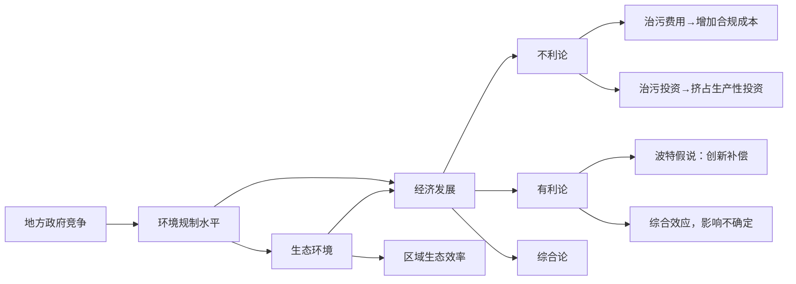

# 地方政府竞争、环境规制与区域生态效率

李胜兰 初善冰 申晨\*

内容提要 本文基于地方政府竞争的视角,以能够同时反映经济发展和生态环境状况的“生态效率”作为衡量指标,运用DEA方法测算了1997\~2010年中国30个省(区市)的区域生态效率,并检验了环境规制对中国区域生态效率的影响。研究表明地方政府在环境规制的制定和实施行为中存在明显的相互“模仿”行为,同时环境规制对区域生态效率具有“制约”作用。2003年后地方政府的环境规制制定、实施和监督行为由相互“模仿”转向“独立”施行,环境规制行为对区域生态效率的作用也由“制约”转变为“促进”,或者“制约”作用减弱。因此,中央政府有必要推行多元化的政绩考核体系,引导建立以公共服务为导向的地方政府行为准则,通过完善环境法制建设,从立法、执法和监督层面促进区域经济与生态环境的协调发展。

关键词 环境规制 区域生态效率 地方政府竞争 空间面板联立方程

## 一 引言

经济发展伴随着环境问题的加重,已被不同国家的历史经验所证实(彭水军和包群,2006),中国作为近年来经济增长最快的国家,同样受到这一问题的困扰。尽管近年来中国各级政府出台了一系列旨在改善环境状况的法律法规,建立和制定了较为完

世界经济 \* 2014年第4期

备的环境制度和政策,但对环境问题的治理仍难以奏效。有研究将环境治理的低效归因于分权治理结构和政绩考核机制导致的地方政府在环境规制制定与实施过程中的“逐底竞争(race-to-the-bottom)”行为。在以经济增长为核心的政绩考核机制的“鞭策”下,拥有一定经济和财政自主权的地方政府,以各种手段保证经济实现增长;地方政府有动机通过弱化环境规制强度来降低当地企业的“合规成本(compliance cost)”,以实现招商引资、追求经济增长的目标,最终可能导致环境状况的普遍恶化(杨海生等,2008;王文普,2011)。

在科学发展观理念的指引下,中国的发展政策导向中开始出现“生态文明”的因素,各地开始将环境质量改善状况纳入政绩考核体系,环境规制的制定和环保政策的执行不仅要为经济发展留有适当空间,更要以生态环境的持续改善为终极目标。在执政理念的转变过程中,地方政府在环境规制的制定、实施和监督过程中是否依然存在“逐底竞争”的策略行为特征?规制竞争下环境规制的治理效果是否会有所改变?在经济发展与环境保护的两难境地中,单纯考虑其中一个方面无助于问题的解决,因此,这些问题的回答需要从经济和环境协调性的角度,予以统筹考虑。

基于此,本文以能够同时反映经济发展和生态环境状况的“生态效率”作为衡量指标,在考虑地方政府竞争导致的各地环境规制的制定、实施和监督状况的条件下,验证环境规制对中国区域生态效率的影响。本文对已有研究的进一步发展表现在:第一,以生态效率为指标验证环境规制的治理效果,将环境规制对经济发展和生态环境状况的影响统筹考虑;第二,将地方政府竞争因素考虑到环境规制状况的实现过程中,反映了地方环境规制的形成机制,控制了影响环境规制形成的重要因素;第三,考虑了环境规制和生态效率相互决定造成的环境规制的内生性,通过设定空间面板联立方程模型,运用广义空间三阶段最小二乘法(generalized spatial three-stage least square, GS3SLS)得到一致、有效估计。

本文结构安排如下:第二部分为相关文献综述;第三部分运用 DEA 方法对中国省级区域生态效率进行测算;第四部分建立空间面板联立方程模型并使用 GS3SLS 方法估计;最后给出结论以及相应的政策建议。

## 二 文献综述与理论分析

## (一)地方政府竞争与环境规制

Breton(1998)给出了关于“地方政府竞争”的一个较全面的定义,它指的是某个区

世界经济 \* 2014年第4期

域内部不同经济体的政府利用包括税收、环境政策、教育、医疗福利等手段，吸引资本、
劳动力和其他流动性要素进入，以增强经济体自身竞争优势的行为。众多学者认为，
在地方政府竞争的背景下，各地环境规制存在相互竞争的特征，其形成原因主要源自
两个因素：一是跨行政区的资本竞争(interjurisdiction capital competition)，一是跨境污
染问题(transboundary pollution problems)。Wheeler(2001)与Konisky(2007)对国家间
环境规制“逐底竞争”的逻辑进行了详细阐述，认为高收入国家环境规制相对严格，企
业特别是高污染企业的环境规制成本较高，低收入国家为了吸引外国投资、促进经济
增长、提高就业水平，倾向于维持较低的环境规制水平；高收入国家较高的环境规制成
本促使跨国企业到低收入国家投资以规避环境规制，而高收入国家为了留住投资则竞
相降低环境规制水平；各国环境规制普遍降低导致生态环境的普遍恶化。Fredriksson
和 Millimet(2002)与 Woods(2006)对美国各州环境规制的研究，也认为州际环境规制
竞争的原因是各州为留住并吸引更多的产业进入本州而采取各种措施降低本地区的
经营成本。同时，他们认为相比于其他政策和规制，环境规制更易引发“逐底竞争”行
为：由于环境污染具有外部性，能够在地区之间传递(跨境污染问题)，即使本地区实
行严格的环境规制也不一定会减少环境污染带来的损失，因此地方政府倾向通过大力
推动产业发展获取经济收益，而与其他地区共同承担环境污染的成本。

在对环境规制竞争行为的验证方面,已有研究大多通过构建“战略互动模型”,使用“反映函数(reaction function)”描述环境规制的战略互动行为,将某行政区的环境规制行为设定为与其有竞争关系的其他行政区的环境规制行为的函数;在此基础上应用空间计量方法,以空间滞后项刻画具有竞争关系的其他行政区的环境规制行为,将当地对环境规制有重要影响的因素设置为控制变量,以对空间滞后项系数的估计结果判断是否存在战略互动行为及行为方向(Fredriksson 和 Millimet,2002; Levinson,2003; Woods,2006; Konisky,2007,2009)。

针对中国分权治理结构下的地方政府竞争行为,杨海生等(2008)与张文彬等(2010)分别对中国省际环境规制竞争行为特征进行了经验检验。杨海生等(2008)的研究显示,中国存在省际环境规制竞争行为,各省在制定和实施环境规制时更易向规制相对宽松的地区看齐。张文彬等(2010)则使用不对称战略互动模型对环境规制战略互动行为特征的关系做了详细描述,将样本分为1998\~2002和2004\~2008两个阶段,发现在前一阶段环境规制的战略互动行为以差异化策略为主,未显示出规制竞争的特征;后一阶段环境规制的战略互动行为发生了显著变化,呈现出“逐顶竞争”的特征,作者认为这与政府的科学发展理念和环境绩效考核作用的发挥密不可分。

世界经济 \* 2014年第4期 · 90 ·

## (二)环境规制与经济发展、环境状况

环境规制对区域生态效率的影响,通过其对经济发展水平和生态环境状况两方面的作用实现,尽管现有文献没有对环境规制的生态效率影响进行系统研究,但分别研究环境规制对经济发展和环境状况影响的研究文献较为丰富。

关于环境规制水平对经济发展的影响,有三种代表性的观点。第一种是“不利论”,其核心是“合规成本说”,Gollop 和 Roberts(1983)、Barbera 和 McConnell(1990)、Jorgenson 和 Wilcoxen(1990)及 Walley 和 Whitehead(1994)等是这一观点的代表人物。他们认为在环境规制的约束下,企业需要为消耗自然资源和排放污染物支付一定的额外费用,从而导致生产成本的增加,这一部分成本称为“合规成本”。在技术和需求条件不变的情况下,合规成本的存在一方面将导致生产率降低和利润率下降;另一方面,为遵循环境规制而进行的污染治理投资,可能挤占企业的其他生产性、盈利性投资,使得企业生产的机会成本提高,也会导致潜在的产出和利润损失。其中,Jorgenson 和 Wilcoxen(1990)的研究发现环境规制导致 GNP 水平下降 2.59%;Barbera 和 McConnell(1990)研究了环境规制对 1960 \~ 1980 年美国化工、钢铁、有色金属、非金属矿物制品以及造纸等产业绩效的影响,发现 10% \~ 30% 的生产率下降可归因于治理污染的投资。

第二种观点称为“有利论”，该观点从动态视角出发，认为合理设置的环境规制能够刺激企业投资于环境技术的改造和环境管理的创新，从而催生产品和生产过程的“创新补偿(innovation offsets)”效应，弥补甚至超过合规成本，使产业达到经济绩效和环境绩效同时改进的“双赢”状态，并在国际市场上获得“先动优势(first-mover advantage)”，提升产业的国际竞争力，这一观点也被称为“波特假说(Porter Hypothesis)”(Porter 和 Van der Linde,1995;Porter,1996)。“波特假说”有两个前提条件：从静态模型走向动态模型，环境规制工具必须是“恰当设计的”。

第三种为“综合观点”，该观点认为环境规制对经济发展的影响受到产业特点、产业发展状况、环境规制质量、环境壁垒等众多因素的影响，因此其综合效应的结果不确定或对不同的市场主体不一致。例如，某些国家通过设定较高的环境规制壁垒，阻碍其他国家企业的进入，较高的进入门槛降低了行业内的竞争程度，对国内企业形成保护作用，使之获得垄断利润。但这种垄断利润是以较高的合规成本和牺牲竞争活力为代价的，有可能造成受保护产业的弱质。随着国际环境管理标准的施行，产品被要求贴上“绿色”的标签，未达到环境规制标准的出口产品在规制严格国家的市场准入和市场销售上举步维艰，对该国的经济发展形成阻碍作用(West 和 Senez,1992)。

世界经济 \* 2014年第4期

在生态环境方面,大部分学者的研究结果显示,正式的环境规制与环境质量呈正相关,然而,也有一些学者的研究得出不同的观点。Magat 和 Viscusi(1990)与 Laplante 和 Rilstone(1996)分别以加拿大魁北克省与美国的纸浆和纸制品行业为研究对象,将生物需氧量和固体悬浮物的排放量作为环境质量的代理变量,运用最小二乘法检验了环境规制对污染物排放的影响,结果表明,前者能促使企业减少约 20% 的排放量,后者能够减少约 28% 的污染排放量。然而,Goldar 和 Banerjee(2004)却发现一系列针对印度集群产业的环境规制行为与其下游水质只呈现了微弱的关系。Blackman 和 Kildegaard(2010)的研究证实墨西哥环境保护机构执行更多的环境监察次数并不能刺激企业采用“净化”技术,因而他们认为正式的环境规制缺乏真正的实施效力。

综合以上文献观点,可以将“地方政府竞争——环境规制水平——区域生态效率”的逻辑关系整理如图1。

flowchart

图 1 “地方政府竞争——环境规制水平——区域生态效率”逻辑关系

国内对这一问题的研究开展较晚，在环境规制协调经济增长和环境保护关系的研究中，一些学者开始使用生态效率或环境效率指标，综合评价经济增长和环境质量之间的协调关系，考察包含环境污染变量的经济效率状况（胡鞍钢等，2008；程丹润和李静，2009；王兵等，2010）。中国环境规制的施行与生态效率之间呈现何种关系？目前已有少许文献对该问题进行探讨，李静和饶梅先(2011)使用方向性环境距离函数模

世界经济 \* 2014年第4期 · 92 ·

型来分析非期望产出问题,选取相应指标对中国各省份在四种环境管制政策下的环境效率状况进行了测算,通过分析发现:中国东部发达地区不仅在经济上优于中西部地区,而且在环境污染治理和保持较少的污染方面也要明显好于中西部落后地区,东部发达地区效率水平优于中西部地区。沈能(2012)进一步对环境效率与规制强度间的关系进行了经验检验,发现工业环境规制与环境效率正相关,在一定程度上验证了“波特假说”的正确性;同时他还基于异质性行业假定检验了中国环境规制与环境效率的非线性关系,并确定了行业最优规制水平。

总体来看,尽管现有国内外研究已经对“环境规制的生态环境影响”有了较为深入的理论研究,并利用中国的环境规制和环境质量数据进行了经验检验,但在以下方面仍有欠缺:第一,对环境规制影响的研究,或者主要探讨其对生态环境质量的影响,或者集中考虑其对经济发展的影响,少有研究从经济与生态环境协调发展的角度研究环境规制的影响。第二,在研究环境规制对生态环境的影响时,并未将地方政府竞争行为及其可能产生的影响纳入分析,导致对环境规制制定、实施过程的片面理解,不能对环境规制的影响作出有效估计。第三,单方向研究环境规制对生态环境的影响,忽略了生态环境状况对政府环境规制制定、实施行为的反作用,也就不能合理解释地方政府的环境规制竞争行为。为了更为全面有效地解释环境规制对生态环境的影响,本文在三个方面对现有研究方法进行改进:一是统筹考虑经济发展与生态环境,以“生态效率”测度区域经济、环境协调状况,作为解释环境规制影响的目标变量(Dyckhoff和Allen,2001;Korhonen和Luptacik,2004)。二是将地方政府竞争纳入环境规制行为框架,在模型中加入环境规制的空间加权项,以有效控制不同地方政府环境规制竞争行为的交互性(Konisky,2007、2009)。三是考虑环境规制与生态效率同时相互决定的特征,构建包括环境规制方程和生态效率方程的联立方程模型,以控制环境规制与生态效率的内生性问题。基于此,本文构建空间面板联立方程模型,以中国省际数据对环境规制的区域生态效率影响进行经验检验。

## 三 中国区域生态效率的测算

## (一)区域生态效率的概念

Schaltegger 和 Sturm(1990) 首次提出了“生态效率”(eco-efficiency)的概念, 即一定时期内增加的经济价值与增加的生态环境负荷的比值(Schmidheiny, 1992)。

区域生态效率是指在某个经济区域内“以较少的资源消耗和环境污染，生产具有

世界经济 \* 2014年第4期

“竞争力的产品和服务以满足人类需要和改善生活”（Hinterberger 等,2000），其核心是少投入、少排放、多产出，是在不对生态环境构成威胁的前提下努力发展区域经济，因而符合可持续发展有关经济、资源和环境协调发展的核心理念，成为测度可持续发展的重要概念和工具（Fet,2003）。

世界可持续发展工商理事会(World Business Council for Sustainable Development, WBCSD)根据生态效率的含义,在1992年里约地球峰会上构建了生态效率的测度指标:生态效率=产品和服务价值/生态环境负荷。由此,可将生态效率描述成单位生态环境负荷所对应的产品和服务价值。在区域范围内,“产品和服务价值”主要为该区域经济活动的产出和服务的市场价值,可使用地区生产总值或地区总产出等指标衡量;“生态环境负荷”包含两个部分:资源消耗与污染排放(Muller和Sturm,2001; UNCTAD,2003),资源消耗可以各种直接原料投入(direct material input,DMI)衡量,污染排放则可以各种污染物的排放量衡量,主要包括废气和废水的排放量等(Seppäläa等,2005;Zhang等,2008)。

## (二)区域生态效率的测算方法

现有测算生态效率的方法主要为数据包络分析(DEA)方法,使用DEA方法可以解决生态效率指标中“生态环境影响”项的多种资源消耗和污染排放的单位不一致问题。应用DEA方法测算生态效率相较于测算其他效率的特殊之处在于需要考虑环境污染这种“非合意产出(undesirable outputs)”的情况。Färe等(1989)最早提出存在“非合意要素的DEA模型”,并将环境污染视为一种非合意产出纳入DEA的分析框架,用来估计环境效率。由于环境污染被视作经济活动的代价,Dyckhoff和Allen(2001)与Korhonen和Luptacik(2004)直接将非合意产出作为DEA模型中的投入项来计算环境效率。根据生态效率指标公式,我们借鉴该方法,将环境污染这一“非合意产出”与资源消耗作为DEA模型的投入项,而将产出和服务价值作为DEA模型的产出项,设定模型如下:

假设存在 $d$ 个同质的决策单元(DMU)，每个决策单元有 $n$ 种资源消耗 $x_{1}, \cdots, x_{n}$ ，得到 $s$ 种合意产出即产品和服务 $y_{1}, \cdots, y_{s}$ 以及 $m - n$ 种非合意产出即环境污染 $x_{n+1}, \cdots, x_{m}$ ，有 $x = (x_{1}, \cdots, x_{n}, x_{n+1}, \cdots, x_{m})$ ， $y = (y_{1}, \cdots, y_{s})$ 。对于每个DMU而言投入和产出都是非负的，即有 $(x, y) \in R_{m+s}^{+}$ ，所有可行的投入产出组合所形成的集合为生产可能性集 $P$ 。

DEA 模型假设,每一个 DMU 都在既定技术水平下通过调整对资源消耗、环境污染和产品服务的松弛变量来最大化自己的效率,即解如式(1)所示的最优化问题:

$$
\max _ {\lambda , s ^ {-}, s ^ {+}} \rho = \frac {1 + \frac {1}{s} \sum_ {r = 1} ^ {s} \frac {s _ {r} ^ {+}}{y _ {r 0}}}{1 - \frac {1}{m} \sum_ {i = 1} ^ {m} \frac {s _ {i} ^ {-}}{x _ {i 0}}} \quad \text {s.t.} \left\{ \begin{array}{l} x _ {0} = X \lambda + s ^ {-} \\ y _ {0} = Y \lambda - s ^ {+} \\ \lambda \geqslant 0, s ^ {-} \geqslant 0, s ^ {+} \geqslant 0 \end{array} \right. \tag {1}
$$

其中， $s_{r}^{+}$ 和 $s_{i}^{-}$ 分别为第 r 种产品服务和第 i 种资源消耗或环境污染物的松弛变量（slacks）， $s^{+}$ 和 $s^{-}$ 为松弛变量向量； $\lambda$ 为待估参数向量；下标 0 表示当前的决策单位 DMU。

根据线性规划原理,可将上述分式规划问题转化为以下等价的线性规划问题:

$$
\min _ {t, \lambda , s ^ {-}, s ^ {+}} \tau = t - \frac {1}{m} \sum_ {i = 1} ^ {m} \frac {t s _ {i} ^ {-}}{x _ {i 0}} \quad \text {s.t.} \left\{ \begin{array}{l} 1 = t + \frac {1}{s} \sum_ {r = 1} ^ {s} \frac {t s _ {r} ^ {+}}{y _ {r 0}} \\ x _ {0} = X \lambda + s ^ {-} \\ y _ {0} = Y \lambda - s ^ {+} \\ \lambda \geqslant 0, s ^ {-} \geqslant 0, s ^ {+} \geqslant 0, t > 0 \end{array} \right. \tag {2}
$$

该最优化问题的解 $\rho^{*}=\tau^{*}$ 即为测算的生态效率值, 其取值范围为 $0\leqslant\rho^{*}\leqslant1$ 。

## (三)中国区域生态效率的测算结果

为了更加全面地反映中国省际区域生态效率及其变动状况,我们选取了1997～2010年除西藏和港澳台地区外的中国30个省、直辖市、自治区(下文简称省市区)的相关资源消耗、环境污染和经济数据,进行区域生态效率测算,①同时主要关注工业领域。对应上一节中的模型,具体的资源消耗变量包括:工业用水总量和折算为标准煤单位的能源消耗量;环境污染变量(即非合意产出)包括工业废水排放量、工业二氧化硫排放量、工业烟尘排放量和工业粉尘排放量;产品服务(即合意产出)变量为工业增加值。数据来源为1998～2011年各省区市统计年鉴、《中国能源统计年鉴》和《中国环境年鉴》。经过测算,我们得到了1997～2010年各省区市的区域生态效率值,部分年份结果见附录。从空间和时间两个维度观察,可以发现中国区域生态效率整体呈现“东高西低,逐渐收敛”的状态。首先,东部地区始终保持区域生态效率最高的状态;其次,中西部地区的区域生态效率在逐步改善,与东部地区的差距逐渐缩小,东中西部的区域生态效率有收敛趋势。

## 四 经验分析

## (一) 模型和方法

在进行模型设定时,必须考虑以下两个制约因素:首先,环境规制与区域生态效率是同时相互决定的:地方政府的环境规制行为必须考虑当地的经济发展水平和生态环境状况,因而受到区域生态效率的制约;同时,环境规制行为状况,又会对当地的经济发展和环境状况,进而对区域生态效率产生“促进”或“制约”作用。因此,需要建立环境规制和区域生态效率同时决定的联立方程模型。其次,在地方政府竞争背景下,当地政府对环境规制水平的设定,是对周围省区市的环境规制行为及其变动所采取的或“模仿”或“差异化”的战略反应(张文彬等,2010)。根据第三部分中国区域生态效率的测算结果,各省区市的区域生态效率也呈现出空间集聚的特征。因此,需要分别考虑环境规制和区域生态效率的空间相关性(spatial correlation),建立空间计量模型。

据此,为了检验环境规制对区域生态效率的影响,本文建立包含环境规制方程和生态效率方程的“空间面板联立方程模型(spatial panel simultaneous-equations model)”进行估计:在环境规制方程中,加入周边省区市环境规制的空间加权项以说明环境规制战略互动状况;在生态效率方程中,加入周边省区市区域生态效率的空间加权项以控制区域生态效率的空间集聚特征。模型设定如下:

$$
E R _ {i t} = \alpha_ {1} + \lambda_ {1} \overline {{E R _ {i t}}} + \gamma E E _ {i t} + X _ {1 i t} \beta_ {1} + u _ {1 i} + v _ {1 t} + \varepsilon_ {1 i t} \tag {3}
$$

$$
\varepsilon_ {1 i t} = \rho_ {1} \sum_ {j = 1} ^ {n} w _ {i j} \varepsilon_ {1 j t} + \mu_ {1 i t} \tag {4}
$$

$$
E E _ {i t} = \alpha_ {2} + \lambda_ {2} \overline {{E E _ {i t}}} + \varphi E R _ {i t} + X _ {2 i t} \beta_ {2} + u _ {2 i} + v _ {2 i} + \varepsilon_ {2 i t} \tag {5}
$$

$$
\varepsilon_ {2 i t} = \rho_ {2} \sum_ {j = 1} ^ {n} w _ {i j} \varepsilon_ {2 j t} + \mu_ {2 i t} \tag {6}
$$

$$
\Phi = \operatorname{Var} \binom {\mu_ {1 i t}} {\mu_ {2 i t}} = \operatorname{E} \left( \begin{array}{c c} \mu_ {1 i t} ^ {2} & \mu_ {1 i t} \mu_ {2 i t} \\ \mu_ {1 i t} \mu_ {2 i t} & \mu_ {2 i t} ^ {2} \end{array} \right) = \left( \begin{array}{c c} \sigma_ {1 1} & \sigma_ {1 2} \\ \sigma_ {2 1} & \sigma_ {2 2} \end{array} \right) \tag {7}
$$

其中， $ER_{it}$ 为环境规制， $EE_{it}$ 为区域生态效率； $\overline{ER}_{it} = \sum_{j=1}^{n} w_{ij} ER_{jt}$ ， $\overline{EE}_{it} = \sum_{j=1}^{n} w_{ij} EE_{jt}$ ， $w_{ij}$ 为 N×N 维空间加权矩阵 $W_{N}$ 第 i 行第 j 列的元素，表示第 i 个空间个体与第 j 个空间个体的空间相关性，N 为空间个体样本总数，因此 $\sum_{j=1}^{n} w_{ij} ER_{jt}$ 和 $\sum_{j=1}^{n} w_{ij} EE_{jt}$

世界经济 \* 2014年第4期

分别为周边省区市的环境规制和区域生态效率的空间加权项；① $X_{1u}$ 和 $X_{2u}$ 分别为环境规制方程和生态效率方程的外生控制变量。 $\alpha$ 为常数项， $\lambda$ 、 $\gamma$ 、 $\varphi$ 、 $\beta$ 、 $\rho$ 分别为对应变量的回归系数；u、v 分别为对应方程中的个体效应、时间效应； $\varepsilon$ 和 $\mu$ 分别为对应方程中的扰动项； $\Phi$ 为扰动项空间加权方程中扰动项的方差矩阵。

空间面板联立方程模型可能产生以下导致非一致或非有效估计的问题：

第一,联立问题。联立方程组一方面可能产生“联立内生性”:由于环境规制变量和区域生态效率变量同时相互决定,导致两个变量与误差项的关系不满足严格外生性假设,OLS估计量丧失一致性。解决该问题需要寻找合适的工具变量(以下称“IV”)以消除内生性的影响,本文以模型内的所有外生控制变量X作为IV。另一方面,相互决定的内生变量可能同时受到其他因素影响,误差项具有跨方程的相关性,形成如(7)式的方差结构,导致估计量非有效。解决该问题需要使用GLS方法估计,以 $\Phi^{-1/2}$ 为权重,左乘原方程各变量消除跨方程相关性。

第二,空间相关性。空间相关性可能以两种形式存在于模型中(Anselin等,2008):一种称为“空间滞后模型(spatial lag model)”,解释变量中包含被解释变量的空间加权项(即空间滞后项),以说明其他个体的空间分布状况对当前个体该变量的影响,本文环境规制和区域生态效率变量均具有该特征。由于空间加权项实际上是被解释变量的线性组合,因此空间加权项与误差项存在相关性,导致“空间内生性”,OLS估计量不一致,解决这一问题同样需要寻找合适的IV。本文以模型内的外生控制变量的空间加权项 $W_{N}X$ 为IV进行估计(Kelejian和Prucha,1998)。另一种称为“空间自回归模型(spatial autoregressive model)”,误差项中存在空间加权项,如(4)和(6)式的设定。这一设定认为可能对被解释变量具有影响的无法观测的其他因素的空间相关性,将进入误差项结构中,导致误差项不再具有球形扰动特征,因而OLS估计量不是有效的。解决这一问题同样可以使用GLS方法:首先利用原方程一致估计得到的残差,使用GMM方法估计误差项空间自回归系数 $\rho_{1}$ 和 $\rho_{2}$ (Kelejian和Prucha,1999),再对原方程进行Cochran-Orcutt变换(左乘权重 $I-\rho W_{N}$ )消除误差项的空间相关性。

综上,可将问题归为两类:一类是内生性问题,需要通过IV方法解决,本文使用的全IV集为 $(X,W_{N}X)$ ;一类是非球形扰动问题,需要通过GLS方法解决。

第三，面板数据异质性。为了使估计包含更多信息并具有动态性，本文使用中国省际面板数据进行估计。因面板数据包含个体和时间异质性,所以有必要调整估计方法做些改动,使用固定效应方法对异质性进行控制,对此本文通过加入个体和时间虚拟变量的方式实现。两个方程的个体效应和时间效应分别以 $u_{1i}$ 、 $u_{2i}$ 和 $v_{1t}$ 、 $v_{2t}$ 表示。

基于以上分析,为克服空间面板联立方程模型估计中的问题,得到一致、有效的估计量,本文根据 Kelejian 和 Prucha(2004) 对空间截面联立方程模型给出的一致且渐近正态分布的广义空间三阶段最小二乘(generalized spatial three-stage least square, GS3SLS)估计方法,使用面板数据固定效应设定对模型进行估计,具体估计步骤如下:

第一步,不考虑误差项的结构,使用2SLS方法分别对环境规制方程和生态效率方程进行估计。先将各个方程的各内生变量(包括联立内生变量和空间内生变量)对IV集回归,得到预测值;再将被解释变量对预测值和外生控制变量回归,得到变量系数 $\lambda$ 、 $\gamma$ 、 $\Phi$ 、 $\beta$ 的一致估计,并计算残差 $\hat{\varepsilon}$ 。

第二步,利用第一步得到的残差 $\hat{\varepsilon}$ , 使用 GMM 方法分别对两个方程的误差项空间自回归系数 $\rho$ 和 $\Phi$ 进行估计, 得到一致估计量 $\hat{\rho}$ 、 $\hat{\Phi}$ ; 利用 $\hat{\rho}$ 对各方程进行 Cochran-Orcutt 变换, 分别得到去除误差项空间自相关的模型方程。

第三步,考虑误差项的跨方程相关,对去除误差项空间自相关的模型方程再次进行2SLS估计,其步骤为:首先将经过Cochran-Orcutt变换的所有解释变量(包括内生变量和外生控制变量)对IV集回归,得到预测值;再将经过Cochran-Orcutt变换的被解释变量对预测值做GLS估计,其权重为一致估计得到的 $\hat{\Phi}^{-1/2}$ ,由此得到变量系数 $\lambda$ 、 $\gamma$ 、 $\Phi$ 、 $\beta$ 的一致、有效估计量。

对于估计结果,我们主要关注两点:一是地方政府在环境规制水平的设定上是否存在“模仿”或者“差异化”的战略互动行为。当周边省区市提高或降低环境水平规制时,本省区市相应提高或降低环境规制水平的战略互动行为即为“模仿”行为,反之则为“差异化”行为。在模型设定中,“模仿”行为意味着(3)式中变量系数 $\lambda_{1}>0$ ,“差异化”行为意味着 $\lambda_{1}<0$ 。二是由规制竞争形成的环境规制水平对区域生态效率的作用是“促进”还是“制约”。环境规制水平与区域生态效率呈正向变动说明环境规制对生态效率具有“促进”作用,反之则为“制约”作用。在模型设定中,“促进”作用意味着(5)式中 $\varphi>0$ ,“制约”作用意味着 $\varphi<0$ 。两者组合可以得到九种作用形态,具体见表1。

在地方政府竞争背景下,各省区市的环境规制水平设置往往“模仿”周边省区市的行为;以GDP为核心的政绩考核体系导致环境规制对区域生态效率表现出“无效”甚至“制约”的作用,因此我们预期各省区市的环境规制行为将呈现“模仿无效”或“模仿制约”特征。Wheeler(2001)认为,如果行政区的环境规制行为呈现相互“模仿”的特征，并导致环境质量下降，则意味着存在环境规制的“逐底竞争”行为。于是，如果“模仿无效”或“模仿制约”特征得到验证，我们将得出中国各省区市环境规制行为存在“逐底竞争”特征的结论。这一局面在将环境保护以具体指标形式纳入政绩考核体系后可能有所改善，因此，我们预期这一特征在考核体系变化后可能向“模仿促进”改变，预示着中国环境规制向“逐顶竞争”转变。

表 1 环境规制对区域生态效率影响的作用形态

<table><tr><td></td><td> $\varphi >0$ </td><td> $\varphi < 0$ </td><td> $\varphi$ 不显著</td></tr><tr><td> $\lambda_1 >0$ </td><td>模仿促进</td><td>模仿制约</td><td>模仿无效</td></tr><tr><td> $\lambda_1 < 0$ </td><td>差异促进</td><td>差异制约</td><td>差异无效</td></tr><tr><td> $\lambda_1$ 不显著</td><td>独立促进</td><td>独立制约</td><td>独立无效</td></tr></table>

## (二) 变量和数据

本文使用 1997 \~ 2010 年中国各省区市的面板数据, 数据来源为 1998 \~ 2011 年各省区市统计年鉴、《中国统计年鉴》、《中国环境年鉴》、《中国

劳动统计年鉴》和《新中国六十年统计资料汇编》，使用现价统计的变量均剔除价格因素，抵减为1991年的不变价。

在待估计的空间面板联立方程模型中,设置的变量包括区域生态效率(EE)和环境规制(ER)以及其他控制变量 $X_{1}$ 和 $X_{2}$ 。区域生态效率的测度使用第三部分测算得到的数据。

对于环境规制强度的衡量,国内外学者使用了多种方法,主要包括:①以环境规制数量衡量环境规制强度,如 Low(1992);②以排污费收入度量环境规制强度,如 Levinson(1996)与王兵等(2010);③以污染治理和控制支出占生产成本或产值的比重衡量环境规制强度,如 Cole 等(2005)与 Lanoie 等(2008)。据此,我们分别设定三个变量来代表环境规制的制定、实施和监督状况,其中:规制制定变量(CELAW)由累计设立的地方环保法规数测度,规制实施变量(PAIAV)由工业污染治理投资完成额与工业增加值的比例测度,规制监督变量(PCIAV)由排污费收入与工业增加值的比例测度。

我们将影响区域生态效率的控制变量分为三类:第一类为收入变量,包括人均地区生产总值(GPRRC)及其二次项(GPRRC²),用来验证“环境库兹涅茨曲线(EKC)”的存在性(Grossman和Krueger,1991;Baek和Koo,2009);第二类为结构变量,分别为对数资本劳动比(LNKL),表示区域要素禀赋结构;工业增加值占地区生产总值的比重(IAVGPR),表示区域产业结构;国有及国有控股企业工业增加值占全部工业增加值的比重(SOIR),表示区域所有制结构(王兵等,2010)。第三类为开放程度变量,包括进出口贸易总额占地区生产总值的比重(TRADE),用来表示贸易开放度;实际利用外商直接投资额占地区生产总值的比重(FDI),用来表示投资开放度。

环境规制不仅受到地区收入和经济结构的影响,还与政府的财政能力、人口状况以及其他政策目标相关。因此在环境规制方程中,设定的控制变量包括人均地区生产总值(GPRRC);对数资本劳动比(LNKL);反映地方政府财政能力的财政赤字变量(FD);表示人口状况的人口密度变量(PD),以年末人口数与区域面积的比值测度;表示就业政策目标的失业率变量(UR)(Konisky,2007;杨海生等,2008)。

空间加权矩阵描述了变量空间相关性的来源和大小,一般的设定方法或者从地理空间角度,或者从经济差别角度,考虑两个空间个体的空间距离,并设定相应空间加权矩阵。本文具有空间相关性的变量为环境规制和生态效率,空间加权矩阵的设定反映出地方政府对竞争对手的选择及其对自身影响程度的判断。因此,地方政府在根据周边省区市的行为设定当地环境规制时,周边省区市的影响强弱不仅与其地理距离有关,即距离越近的省区市其环境规制状况越具有示范意义(使用地理距离加权的有Madariaga和Poncet(2007)与李涛等(2011)),还与其经济距离有关,即经济发展水平越相近的省区市其环境规制状况越具有可比较性(使用经济距离加权的有Fredriksson和Millimet(2002)与Konisky(2007))。基于这样的考虑,空间加权矩阵应当能够同时体现地理距离和经济距离的影响,因此我们使用具有地理距离和经济距离交互性质的空间加权矩阵设定方法。首先分别计算两省区市省会或首府之间的直线距离的倒数 $1/gd_{ij}$ ,作为地理距离的衡量;再分别计算两省区市人均地区生产总值的差别的倒数 $1/ed_{ij}=1/\left|GRPPC_{i}-GRPPC_{j}\right|$ ,作为经济距离的衡量;最后将两者相乘得到 $d_{ij}=1/(ed_{ij}\cdot gd_{ij})$ ,再做行标准化作为空间个体的权重。需要注意的是,由于人均地区生产总值的动态性,本文构建的空间加权矩阵是随时间而变化的。

## (三)检验结果分析

在样本期间,中国正处于工业化和城市化加速发展的阶段,同时也是环境问题集中爆发、越来越引起民众和政府重视的阶段。随着发展理念的转变,中央政府在对各地方政府及其主要官员的政绩考核体系中加入了“科学发展”和“生态文明”的因素,促使地方政府加大环境治理的举措和投入,对环境规制的制定和实施更加严格。基于此,本文首先进行全样本期的估计,进而根据中央政策的变动将样本期分为两个阶段,进行分别估计,试图说明政绩考核体系变动导致的环境规制作用形态的变化。

## 1. 全样本期检验结果分析

表 2 报告了 1997 \~ 2010 年全样本期估计结果, 每一列分别对应规制制定变量 (CELAW)、规制实施变量 (PAIAV) 和规制监督变量 (PCIAV) 的估计结果。对于规制制定变量, 环境规制方程中, 空间自回归系数为 0.067, 显著为正, 表明当地环境规

世界经济 \* 2014年第4期

制的制定具有“模仿”周边省区市的行为特征，这与我们的预期一致；生态效率方程中规制制定变量的系数显著为负，这意味着环境规制对区域生态效率具有“制约”作用，制定环境规制数量较多的地区其生态效率较低，而制定环境规制数量较少的地区其生态效率较高。形成这种制约作用的原因一方面可能是环境规制较为严格的地区，政府和企业生态环境保护的成本较高，一定程度上抑制了产出扩张和经济增长，说明环境规制在保护生态环境的同时付出了较高的经济发展代价；另一方面对于环境规制较为松懈的地区，企业生产经营的外部环境约束较少，企业发展尚处于粗放扩张阶段，经济扩张的速度快于资源消耗和环境污染的恶化速度，反而具有较高的生态效率，这也正是地方政府在环境规制方面进行“逐底竞争”的表现。

规制实施变量的作用形态与规制制定变量类似,也呈现出“模仿制约”的特征,从系数大小来看,规制实施变量的“模仿”特征更加明显,显著性水平更高。当周边省区市工业污染治理投资额占工业增加值的比重加权平均数增加或减少1%时,当地的该比重即增加或减少0.336%;同时环境规制的实施对生态效率的制约作用也非常明显,地方政府倾向于竞相降低环境规制的实施力度,来确保当地的经济发展。与此不同的是,规制监督变量的作用形态则表现出“独立无效”的状况,尽管系数方向与前两者相同,但都未呈现出显著性。综合环境规制制定、实施和监督变量得到的估计结果,中国各省区市的环境规制行为呈现“逐底竞争”的特征。

表 2 1997 \~ 2010 年环境规制与区域生态效率空间面板联立方程估计结果

<table><tr><td>环境规制方程</td><td>CELAW</td><td>PAIAV</td><td>PCIAV</td></tr><tr><td> $\overline{CELAW}$ </td><td>0.067*(1.69)</td><td></td><td></td></tr><tr><td> $\overline{PAIAV}$ </td><td></td><td>0.336 ***(3.88)</td><td></td></tr><tr><td> $\overline{PCIAV}$ </td><td></td><td></td><td>0.044(0.46)</td></tr><tr><td>EE</td><td>-42.040 ***(-4.90)</td><td>-0.359*(-1.68)</td><td>-0.029(-0.59)</td></tr><tr><td>GPRRC</td><td>-3.975(-0.97)</td><td>-0.123(-1.20)</td><td>-0.051 **(-2.19)</td></tr><tr><td>LNKL</td><td>-9.431 ***(-3.13)</td><td>0.104(1.38)</td><td>0.072 ***(4.30)</td></tr><tr><td>FD</td><td>-0.028 ***(-3.61)</td><td>3.540E-05(0.18)</td><td>8.720E-05 **(1.98)</td></tr></table>

世界经济 \* 2014年第4期

(续表2)

<table><tr><td rowspan="2">PD</td><td>-0.016**</td><td>1.410E-06</td><td>4.700E-05</td></tr><tr><td>(-2.02)</td><td>(0.01)</td><td>(1.06)</td></tr><tr><td rowspan="2">UR</td><td>-1.749</td><td>0.045</td><td>0.008</td></tr><tr><td>(-1.42)</td><td>(1.44)</td><td>(1.12)</td></tr><tr><td rowspan="2">常数项</td><td>58.670***</td><td>0.713***</td><td>0.092</td></tr><tr><td>(5.56)</td><td>(2.67)</td><td>(1.53)</td></tr><tr><td>生态效率方程</td><td>EE</td><td>EE</td><td>EE</td></tr><tr><td rowspan="2"> $\overline{EE}$ </td><td>0.121***</td><td>0.107***</td><td>0.086**</td></tr><tr><td>(2.96)</td><td>(2.72)</td><td>(2.12)</td></tr><tr><td rowspan="2">CELAW</td><td>-0.002***</td><td></td><td></td></tr><tr><td>(-3.93)</td><td></td><td></td></tr><tr><td rowspan="2">PAIAV</td><td></td><td>-0.059**</td><td></td></tr><tr><td></td><td>(-2.13)</td><td></td></tr><tr><td rowspan="2">PCIAV</td><td></td><td></td><td>-0.160</td></tr><tr><td></td><td></td><td>(-1.54)</td></tr><tr><td rowspan="2">GPRRC</td><td>0.047</td><td>0.015</td><td>0.012</td></tr><tr><td>(0.56)</td><td>(0.18)</td><td>(0.15)</td></tr><tr><td rowspan="2"> $GPRRC^2$ </td><td>0.007</td><td>0.025</td><td>0.029</td></tr><tr><td>(0.33)</td><td>(1.18)</td><td>(1.38)</td></tr><tr><td rowspan="2">LNKL</td><td>-0.089***</td><td>-0.064**</td><td>-0.060**</td></tr><tr><td>(-3.07)</td><td>(-2.21)</td><td>(-2.06)</td></tr><tr><td rowspan="2">IAVGPR</td><td>0.007***</td><td>0.008***</td><td>0.008***</td></tr><tr><td>(3.91)</td><td>(4.30)</td><td>(4.42)</td></tr><tr><td rowspan="2">SOIR</td><td>-0.024</td><td>-0.028</td><td>-0.048</td></tr><tr><td>(-0.42)</td><td>(-0.47)</td><td>(-0.80)</td></tr><tr><td rowspan="2">TRADE</td><td>-0.001**</td><td>-0.001**</td><td>-0.001**</td></tr><tr><td>(-2.50)</td><td>(-2.55)</td><td>(-2.56)</td></tr><tr><td rowspan="2">FDI</td><td>0.008**</td><td>0.008**</td><td>0.008**</td></tr><tr><td>(2.25)</td><td>(2.23)</td><td>(2.22)</td></tr><tr><td rowspan="2">常数项</td><td>0.775***</td><td>0.782***</td><td>0.760***</td></tr><tr><td>(7.82)</td><td>(7.78)</td><td>(7.51)</td></tr><tr><td>样本数</td><td></td><td>420</td><td></td></tr><tr><td>环境规制方程</td><td>0.9190</td><td>0.4505</td><td>0.5899</td></tr><tr><td>调整后的 $R^2$ 生态效率方程</td><td>0.8908</td><td>0.9018</td><td>0.9029</td></tr><tr><td>方程系统</td><td>0.9174</td><td>0.6161</td><td>0.8726</td></tr></table>

说明:括号内的值为 t 统计量,\*\*\*、\*\* 和 \* 分别表示在 1%、5% 和 10% 水平上统计显著。下表同。

环境规制方程的其他变量中,生态效率对环境规制的制定和实施呈现制约作用,生态效率较低的地区,地方政府倾向于更严格的环境规制,以遏制资源消耗和环境污染的恶化,改善当地生态环境;资本劳动比例对环境规制的作用则有正有负,对于环境规制制定其表现出制约作用,而对环境规制的实施和监督则呈现促进作用,这说明在资本密集、污染严重的企业较为集中的地区,为了保证当地企业顺利生产经营从而实现经济增长目标,当地政府在制定环境规制时趋向于“松绑”,但是这种松绑政策造成的环境问题加重却又促使环境规制的实施和监督不得不趋向于更加严格,反映了地方政府既要保证经济发展又要确保环境友好的矛盾状态。这种矛盾状态同样反映在财政赤字、人口密度和失业率等变量中,财政赤字较高、人口密度较大、失业状况较严重的地区,地方政府在制定环境规制时,都以保证经济增长从而缓解政府财政紧张、人口压力和就业压力为目标,因此环境规制的制定都较为松懈。由此造成的大量资源消耗和严重环境污染反过来又促使政府在执行和实施环境规制时趋于严格,因而出现其对规制制定变量作用为负,对规制实施和监督变量作用为正的状况。

在影响生态效率的其他变量中,周边省区市的生态效率越高,当地的生态效率也越高,这意味着生态效率存在着空间集聚现象。人均地区生产总值及其二次项均不显著,说明 EKC 形态在生态效率中并不明显。资本劳动比与区域生态效率负相关,资本密集型企业集中地区资源消耗和污染排放状况较严重,这种负面作用超过了经济增长的正面作用;工业增加值比重较高的地区生态效率较高,这说明工业发展成熟的地区,产业结构更趋于合理、技术水平更高,因而在节能环保方面具有更优的绩效;国有经济比例对区域生态效率的影响并不显著,但其方向为负,没有足够的证据证明其对生态效率的抑制作用;贸易和投资的开放状况对区域生态效率的影响均显著为负,贸易开放程度越高则生态效率越低,这说明贸易对当地经济发展的促进作用可能是通过生产并出口资源消耗较多、污染排放严重的产品实现的;外资较为密集的地区则呈现较好的生态效率状况,这说明“污染天堂(pollution heaven)”假说可能并不成立,原因在于外资在促进当地经济规模扩张的同时,其技术效应和结构效应会促进当地生产技术和产业结构向绿色环保方向改变,从而促进当地生态效率提升(He,2006)。

## 2. 分时段检验分析结果

中央政策变动及其引发的官员政绩考核体系的变化,使得地方政府竞争的行为特征和作用形态有所改变,环境规制对区域生态效率的作用也有可能向更积极的方向转变。2003年十六届三中全会对“科学发展观”的全面阐述和推动实施,使各地逐渐开始将节能减排标准纳入官员政绩考核体系中,进而促使地方政府调整环境规制的制

世界经济 \* 2014年第4期

定、实施与监督行为，以促进当地经济增长和环境保护的协调发展。基于此，我们将全样本期以2003年年底为界分为两个时段，试图说明政绩考核体系变化前后环境规制作用形态的转变，以提出相应政策建议。

表 3 报告了 1997 \~ 2003 年和 2004 \~ 2010 年两个时段分别估计的结果。① 两个时段相比较，可以发现环境规制的作用形态发生了重要变化。② 一方面，无论是环境规制的制定、实施或监督，均呈现“模仿”周边省区市的行为特征，但后一时段相比于前一时段，模仿行为的反应程度减弱，规制制定的空间自回归系数由 0.118 下降至 0.015，并且由显著变得不再显著；规制实施的系数均显著，但系数由 0.477 下降至 0.244，下降幅度接近 50%；规制监督变量则保持了与全时段相同的不显著状态，但其系数也明显下降，由 0.065 降至 0.026。模仿特征的减弱，表明在重视环境保护并将其纳入政绩考核体系的过程中，地方政府面临的考核标准由单一的 GDP 目标转变为包含经济和环境的多维综合目标，导致其对环境规制的制定行为发生分化，更多地考虑当地自然环境特点和经济结构特征，较为独立地对环境规制进行制定、实施和监督。

另一方面，环境规制对区域生态效率的作用由“制约”转为“促进”，规制制定和规制实施变量的系数由负转正，其中规制实施的“促进”作用还表现出显著性，呈现“逐顶竞争”行为特征；环境监督变量的系数尽管仍然为负，但其系数绝对值由1.312减小到0.492，说明其“制约”作用明显减弱。环境规制作用的改变，体现出政绩考核机制的变化，促使地方政府重视生态环境问题，采取措施协调经济发展和环境保护之间的关系，这些举措正在发挥积极作用，更加严格的环境规制使得区域生态效率得到提高，经济发展与环境保护的协调性正在提升。由于环境规制趋于严格对经济发展往往呈现遏制作用，区域生态效率的提升多源自于当地资源消耗和污染排放的减少，因此环境规制的积极作用主要是通过环境状况的改善实现的。

表 3 分时段环境规制与区域生态效率空间面板联立方程估计结果

<table><tr><td></td><td colspan="3">1997~2003年</td><td colspan="3">2004~2010年</td></tr><tr><td>环境规制</td><td>CELAW</td><td>PAIAV</td><td>PCIAV</td><td>CELAW</td><td>PAIAV</td><td>PCIAV</td></tr><tr><td> $\overline{CELAW}$ </td><td>0.118**(1.98)</td><td></td><td></td><td>0.015(0.83)</td><td></td><td></td></tr><tr><td> $\overline{PAIAV}$ </td><td></td><td>0.477***(2.88)</td><td></td><td></td><td>0.244***(2.63)</td><td></td></tr><tr><td> $\overline{PCIAV}$ </td><td></td><td></td><td>0.065(0.80)</td><td></td><td></td><td>0.026(0.24)</td></tr><tr><td>EE</td><td>-37.470***(-3.90)</td><td>-0.749***(-2.63)</td><td>-0.129***(-4.98)</td><td>4.393(1.05)</td><td>0.499*(1.86)</td><td>-0.191***(-3.64)</td></tr><tr><td>生态效率</td><td>EE</td><td>EE</td><td>EE</td><td>EE</td><td>EE</td><td>EE</td></tr><tr><td> $\overline{EE}$ </td><td>-0.041(-0.60)</td><td>-0.003(-0.05)</td><td>-0.002(-0.03)</td><td>0.042(0.87)</td><td>0.034(0.75)</td><td>0.052(1.14)</td></tr><tr><td>CELAW</td><td>-0.002***(-3.37)</td><td></td><td></td><td>0.001(0.81)</td><td></td><td></td></tr><tr><td>PAIAV</td><td></td><td>-0.067**(-2.49)</td><td></td><td></td><td>0.042*(1.81)</td><td></td></tr><tr><td>PCIAV</td><td></td><td></td><td>-1.312***(-4.76)</td><td></td><td></td><td>-0.492***(-3.48)</td></tr><tr><td>样本数</td><td></td><td></td><td>210</td><td></td><td></td><td></td></tr><tr><td rowspan="3">调后的 $R^2$ </td><td>环境规制</td><td>0.9061</td><td>0.3668</td><td>0.7695</td><td>0.9933</td><td>0.5344</td></tr><tr><td>生态效率</td><td>0.9040</td><td>0.9105</td><td>0.9024</td><td>0.9402</td><td>0.9384</td></tr><tr><td>方程系统</td><td>0.9052</td><td>0.5697</td><td>0.8968</td><td>0.9930</td><td>0.6620</td></tr></table>

总结起来,在地方政府政绩考核体系融入“绿色环保”因素后,环境规制对区域生态效率的作用形态呈现出由“模仿制约”向“模仿促进”的积极转变,地方政府通过更趋独立的环境规制的制定、实施和监督,减少资源消耗和环境污染,增强了区域经济发展和环境保护的协调性,说明地方政府的环境规制竞争行为由“逐底竞争”向“逐顶竞争”方向转变。

## 五 结论和政策建议

本文基于地方政府竞争的视角,分析并检验了中国省际环境规制对区域生态效率的影响。得到的主要结论为:

世界经济 \* 2014年第4期

第一，中国各省区市的环境规制行为在样本期内呈现“逐底竞争”特征。地方政府在环境规制的制定和实施行为中存在明显的相互“模仿”特征，同时环境规制的制定和实施对区域生态效率具有“制约”作用。这意味着，在以经济增长为核心竞争目标的政绩考核机制激励下，地方政府存在饮鸩止渴的动机，以生态环境为代价换取短期经济利益，其竞相降低环境规制水平的行为导致区域经济与环境的协调性较低。

第二，政绩考核机制的调整，促使中国各省区市的环境规制行为由“逐底竞争”向“逐顶竞争”转变。2003年之后相比于之前，地方政府的环境规制制定、实施和监督行为由相互“模仿”向“独立”施行转变，环境规制行为对区域生态效率的作用也由“制约”转变为“促进”，或者“制约”作用减弱。这说明随着“科学发展观”的全面阐述和推动实施，各地逐渐将“绿色环保”标准纳入官员政绩考核体系，促使地方政府较为独立地设定环境规制水平，同时注重环境规制的治理效果。

以上分析结论给我们带来的政策启示主要有：

1. 加快转变地方政府考核体系，促进政绩考核多元化、绿色化。政绩考核体系是推动地方政府发挥职能的重要导向。在“可持续发展”与“生态文明”理念指导下，应当注重地方政府经济绩效与生态绩效的协调统一，逐渐调整对GDP的单一追求。在政绩考核体系中，加入生态开发、环境保护和循环经济发展等方面的考核指标，建立完善的环境保护状况评价体系，形成地方政府、企业单位和社会群体均能有效参与的环境保护考核制度，从而全面、客观、有效地评价地方政府的环境规制行为，以多元化、绿色化的政绩考核体系推动地方政府环境规制行为向“逐顶竞争”转变。  
2. 推进主体功能区建设,根据区域核心功能构建环境规制与政绩考核制度。由于不同区域生态承载力不同,区域生态效率状况具有较大差别。主体功能区的规划与建设考虑了不同区域的生态承载力状况,有助于因地制宜地制定区域发展规划、环境保护政策和人口福利制度。应当针对主体功能区的核心功能和定位,引导地方政府实行不同的绩效评价指标和政绩考核办法;对于优化开发区域、重点开发区域、限制开发区域和禁止开发区域,分别制定适应的发展战略和环境规制,以促进区域间生态效率的收敛与平衡。  
3. 环境规制立法、执法、监督全方位推进，综合发挥环境规制的积极作用。立法、执法和监督是保证环境规制有效实施的三个重要环节，缺一不可。立法是加强环境法制建设的基础，地方政府应依据地方特色、产业特性和产业发展特点，合理确定适当的环境规制水平，充分发挥“波特假说”中的“创新补偿”效应，借助环境规制的“倒逼机

世界经济 \* 2014年第4期

制”加快高污染企业末端治理向清洁生产的转变。执法监督是法律实现的主要途径，“徒法不能以自行”，应当强化各级领导的环境法治意识，切实做到依法行政，努力造就一个执法必严、违法必究的法治局面。在实践中，则应当减少政府审批手续，完善各项制度的管理程序和具体实施办法，同时建立实行“执法责任制”和“评议考核机制”，强调制度间的互动性，推动社会监督的制度化、规范化。

## 参考文献：

程丹润、李静(2009):《环境约束下的中国省区效率差异研究(1990—2006)》,《财贸研究》第1期。  
胡鞍钢、郑京海、高宇宁、张宁、许海萍(2008):《考虑环境因素的省级技术效率排名(1999—2005)》,《经济学(季刊)》第3期。  
李静、饶梅先(2011):《中国工业的环境效率与规制研究》,《生态经济》第2期。  
李涛、黄纯纯、周业安(2011):《税收、税收竞争与中国经济增长》,《世界经济》第4期。  
彭水军、包群(2006):《经济增长与环境污染——环境库兹涅茨曲线假说的中国检验》,《财经问题研究》第8期。  
沈能(2012):《环境效率、行业异质性与最优规制强度——中国工业行业面板数据的非线性检验》,《中国工业经济》第3期。  
王兵、吴延瑞、颜鹏飞(2010):《中国区域环境效率与环境全要素生产率增长》,《经济研究》第5期。  
王文普(2011):《环境规制竞争对经济增长效率的影响:基于省级面板数据分析》,《当代财经》第9期。  
杨海生、陈少凌、周永章(2008):《地方政府竞争与环境政策——来自中国省份数据的证据》,《南方经济》第6期。  
张文彬、张理芃、张可云(2010):《中国环境规制强度省际竞争形态及其演变——基于两区制空间 Durbin 固定效应模型的分析》,《管理世界》第 12 期。  
朱平芳、张征宇、姜国麟(2011):《FDI与环境规制:基于地方分权视角的实证研究》,《经济研究》第6期。  
Anselin, L.; Le Gallo, J. and Jayet, H. "Spatial Panel Econometrics." The Econometrics of Panel Data, 2008, pp. 625–660.  
Baek, J. and Koo, W. W. “A Dynamic Approach to the FDI-environment Nexus: The Case of China and India.” Journal of International Economic Studies, 2009, 13(2), pp. 87–109.  
Barbera, A. and McConnell, V. "The Impact of Environmental Regulations on Industry Productivity: Direct and Indirect Effects." Journal of Environmental Economics and Management, 1990, 18(1), pp. 50–65.  
Blackman, A. and Kildegaard, A. “Clean Technological Change in Developing-country Industrial Clusters: Mexican Leather Tanning.” Environmental Economics and Policy Studies, 2010, 12(3), pp. 115–132.  
Breton, A. “Competitive Governments: An Economic Theory of Politics and Public Finance.” Cambridge University Press, 1998.  
Cole, M.; Elliott, R. and Shimamoto, K. "Why the Grass Is Not Always Greener: The Competing Effects of Environmental Regulations and Factor Intensities on US Specialization." Ecological Economics, 2005, 54(1), pp.  
95-109.  
Dyckhoff, H. and Allen, K. "Measuring Ecological Efficiency with Data Envelopment Analysis (DEA)." European Journal of Operational Research, 2001, 132(2), pp. 312–325.  
Färe, R.; Grosskopf, S.; Lovell, C. and Pasurka, C. “Multilateral Productivity Comparisons when Some Outputs are Undesirable: a Nonparametric Approach.” The Review of Economics and Statistics, 1989, 71(1), pp. 90–98.  
Fet, A. “Eco-efficiency Reporting Exemplified by Case Studies.” Clean Technologies and Environmental Policy, 2003, pp. 232–239.  
Fredriksson, P. and Millimet, D. “Strategic Interaction and the Determination of Environmental Policy across US States.” Journal of Urban Economics, 2002, 51(1), pp. 101–122.  
Goldar, B. and Banerjee, N. "Impact of Informal Regulation of Pollution on Water Quality in Rivers in India." Journal of Environmental Management, 2004, 73(2), pp. 117–130.  
Gollop, F. and Roberts, M. “Environmental Regulations and Productivity Growth: The Case of Fossil-fueled Electric Power Generation.” The Journal of Political Economy, 1983, pp. 654–674.  
Grossman, G. and Krueger, A. “Environmental Impacts of a North American Free Trade Agreement.” National Bureau of Economic Research, 1991.  
He, J. “Pollution Haven Hypothesis and Environmental Impacts of Foreign Direct Investment: The Case of Industrial Emission of Sulfur Dioxide (SO2) in Chinese Provinces.” Ecological Economics, 2006, 60(1), pp. 228–245.  
Hinterberger, F.; Bamberger, C.; Manstein, P.; Schepelmann, F. and Psangerberg, J. "Eco-efficiency of Regions: How to Improve Competitiveness and Create Jobs by Reducing Environmental Pressure, Government of Carinthia, Austrian Ministry of Agriculture." Forestry, Environment and Water, SERI, Vienna, 2000.  
Jorgenson, D. and Wilcoxen, P. “Environmental Regulation and US Economic Growth.” The Rand Journal of Economics, 1990, pp. 314–340.  
Kelejian, H. and Prucha, I. “A Generalized Spatial Two-stage Least Squares Procedure for Estimating a Spatial Autoregressive Model with Autoregressive Disturbances.” The Journal of Real Estate Finance and Economics, 1998, 17(1), pp. 99–121.  
Kelejian, H. and Prucha, I. "A Generalized Moments Estimator for the Autoregressive Parameter in a Spatial Model." International Economic Review, 1999, 40(2), pp. 509–533.  
Kelejian, H. and Prucha, I. “Estimation of Simultaneous Systems of Spatially Interrelated Cross Sectional Equations.” Journal of Econometrics, 2004, 118(1), pp. 27–50.  
Konisky, D. “Regulatory Competition and Environmental Enforcement: Is There a Race to the Bottom?” American Journal of Political Science, 2007, 51(4), pp. 853–872.  
Konisky, D. “Assessing US State Susceptibility to Environmental Regulatory Competition.” State Politics & Policy Quarterly, 2009, 9(4), pp. 404–428.  
Korhonen, P. and Luptacik, M. "Eco-efficiency Analysis of Power Plants: An Extension of Data Envelop-

世界经济 \* 2014年第4期 · 108 ·

ment Analysis." European Journal of Operational Research, 2004, 154(2), pp. 437–446.  
Lanoie, P.; Patry M. and Lajeunesse, R. “Environmental Regulation and Productivity: Testing the Porter Hypothesis.” Journal of Productivity Analysis, 2008, 30(2), pp. 121–128.  
Laplante, B. and Rilstone, P. “Environmental Inspections and Emissions of the Pulp and Paper Industry in Quebec.” Journal of Environmental Economics and Management, 1996, 31(1), pp. 19–36.  
Levinson, A. “Environmental Regulation and Manufactures’ Location Choices: Evidence from the Census of Manufactures.” Journal of Public Economics, 1996, 62(1), pp.5–29.  
Low, P. “International Trade and the Environment.” The International Bank for Reconstruction and Development/The World Bank, Washington D. C., 1992.  
Madariaga, N. and Poncet, S. “FDI in Chinese Cities: Spillovers and Impact on Growth.” The World Economy, 2007, 30(5), pp. 837–862.  
Magat, W. and Viscusi, W. "Effectiveness of the EPA's Regulatory Enforcement: The Case of Industrial Effluent Standards." Journal of Law and Economics, 1990, 33, pp. 331–360.  
Muller, K. and Sturm, A. "Standardized Eco-efficiency Indicators." Basel: Ellipson, 2001.  
Newey, W. and West, K. “A Simple, Positive Semi-definite, Heteroskedasticity and Autocorrelation Consistent Covariance Matrix.” Econometrica, 1987, 55, pp. 703–708.  
Porter, M. and Van der Linde, C. "Toward a New Conception of the Environment-competitiveness Relationship." The Journal of Economic Perspectives, 1995, 9, pp. 97–118.  
Porter, M. “America’s Green Strategy.” Business and the Environment: A Reader, 1996, 33.  
Schaltegger, S. and Sturm, A. "Ökologische Rationalität." Die Unternehmung, 1990, 4, pp. 273–290.  
Schmidheiny, S. "Changing Course: A Global Business Perspective on Development and the Environment". MIT press, 1992.  
Seppäläa, J.; Melanen, M.; Mäenpää, I.; Koskela, S.; Tenhunen, J. and Hiltunen, M. "How Can the Eco-efficiency of a Region be Measured and Monitored?" Journal of Industrial Ecology, 2005, 9(4), pp. 117–130.  
UNCTAD. "A Manual for the Preparers and Users of Eco-efficiency Indicators." 2003.  
Walley, N. and Whitehead, B. "It's Not Easy Being Green." Harvard Business Review, 1994, p. 47.  
West, P. and Senez, P. “Environmental Assessment of the NAFTA: The Mexican Environmental Regulation Position.” Report prepared for the Province of British Columbia, Ministry of Economic Development, Small Business and Trade, 1992.  
Wheeler, D. “Racing to the Bottom? Foreign Investment and Air Pollution in Developing Countries.” The Journal of Environment & Development, 2001, 10, pp. 225–245.  
Woods, N. “Interstate Competition and Environmental Regulation: A Test of the Race-to-the-Bottom Thesis.” Social Science Quarterly, 2006, 87, pp. 174–189.  
Zhang, B.; Bi, J.; Fan, Z.; Yuan, Z. and Ge, J. "Eco-efficiency Analysis of Industrial System in China: A Data Envelopment Analysis Approach." Ecological Economics, 2008, 68(1), pp. 306–316.

附表 1997、2000、2003、2006、2009年各省区市的区域生态效率值

<table><tr><td>区域</td><td>省区市</td><td>1997年</td><td>2000年</td><td>2003年</td><td>2006年</td><td>2009年</td></tr><tr><td rowspan="11">东部</td><td>北京</td><td>0.6585</td><td>1</td><td>1</td><td>1</td><td>1</td></tr><tr><td>天津</td><td>1</td><td>1</td><td>1</td><td>1</td><td>1</td></tr><tr><td>河北</td><td>0.6857</td><td>0.6120</td><td>0.4991</td><td>0.5063</td><td>0.4876</td></tr><tr><td>辽宁</td><td>0.4071</td><td>0.6275</td><td>0.5526</td><td>0.6150</td><td>0.5694</td></tr><tr><td>上海</td><td>1</td><td>1</td><td>1</td><td>1</td><td>1</td></tr><tr><td>江苏</td><td>1</td><td>1</td><td>1</td><td>1</td><td>1</td></tr><tr><td>浙江</td><td>1</td><td>0.9849</td><td>1</td><td>1</td><td>1</td></tr><tr><td>福建</td><td>1</td><td>1</td><td>1</td><td>0.9200</td><td>1</td></tr><tr><td>山东</td><td>1</td><td>1</td><td>1</td><td>1</td><td>1</td></tr><tr><td>广东</td><td>1</td><td>1</td><td>1</td><td>1</td><td>1</td></tr><tr><td>海南</td><td>1</td><td>1</td><td>1</td><td>0.6212</td><td>1</td></tr><tr><td rowspan="8">中部</td><td>山西</td><td>0.4898</td><td>0.3633</td><td>0.4389</td><td>0.4862</td><td>0.4515</td></tr><tr><td>吉林</td><td>0.7436</td><td>0.5042</td><td>0.8851</td><td>0.5536</td><td>1</td></tr><tr><td>黑龙江</td><td>0.8387</td><td>1</td><td>0.7501</td><td>1</td><td>0.7063</td></tr><tr><td>安徽</td><td>0.6261</td><td>0.4095</td><td>0.7007</td><td>0.4925</td><td>0.8169</td></tr><tr><td>江西</td><td>0.6994</td><td>0.5065</td><td>0.7494</td><td>0.5357</td><td>0.8457</td></tr><tr><td>河南</td><td>0.6727</td><td>0.5347</td><td>0.5957</td><td>0.6777</td><td>0.7949</td></tr><tr><td>湖北</td><td>0.4395</td><td>0.4573</td><td>0.5335</td><td>0.5565</td><td>0.5757</td></tr><tr><td>湖南</td><td>0.4980</td><td>0.6379</td><td>0.6363</td><td>0.8131</td><td>0.5255</td></tr><tr><td rowspan="11">西部</td><td>内蒙古</td><td>0.6709</td><td>0.4019</td><td>0.7413</td><td>0.4248</td><td>0.6755</td></tr><tr><td>广西</td><td>0.5502</td><td>0.5485</td><td>0.5516</td><td>0.4456</td><td>0.6112</td></tr><tr><td>重庆</td><td>0.4345</td><td>0.6586</td><td>0.4470</td><td>0.3795</td><td>0.5655</td></tr><tr><td>四川</td><td>0.4701</td><td>0.4944</td><td>0.5124</td><td>0.5858</td><td>0.6384</td></tr><tr><td>贵州</td><td>0.2828</td><td>0.3711</td><td>0.3931</td><td>0.4123</td><td>0.4022</td></tr><tr><td>云南</td><td>0.6894</td><td>0.6615</td><td>0.5160</td><td>0.5784</td><td>0.4672</td></tr><tr><td>陕西</td><td>0.5226</td><td>0.5156</td><td>0.5932</td><td>0.8381</td><td>0.6817</td></tr><tr><td>甘肃</td><td>0.2743</td><td>0.3376</td><td>0.3677</td><td>0.5271</td><td>0.4603</td></tr><tr><td>青海</td><td>0.3813</td><td>1</td><td>0.5204</td><td>0.5722</td><td>0.5671</td></tr><tr><td>宁夏</td><td>0.2752</td><td>0.2158</td><td>0.2204</td><td>0.2046</td><td>0.2198</td></tr><tr><td>新疆</td><td>0.5301</td><td>0.6627</td><td>0.6354</td><td>0.7236</td><td>0.4210</td></tr></table>

(截稿:2013年12月 责任编辑:宋志刚)