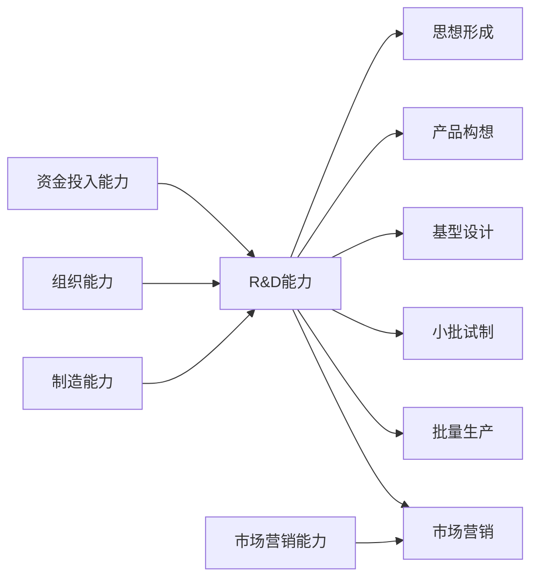
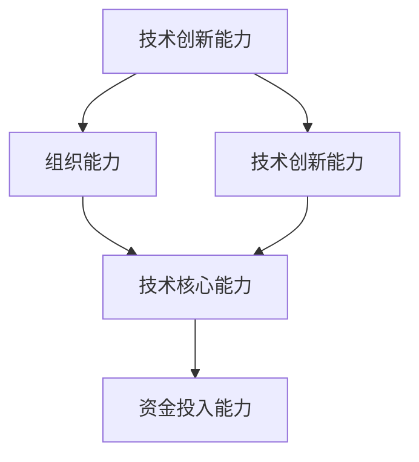
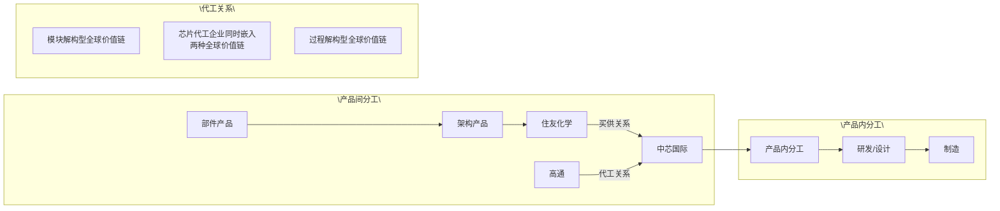

# 方式8：概念辨析型

## 索引

| 编号 | 论文 | 内部关系主标签 |
|------|------|--------------|
| 例1 | 魏江（科研管理，1998） | `[对比整合]` |
| 例2 | 俞荣建、徐玉蓉、姚力、项丽瑶（管理世界，2025） | `[对比辨析]` |

---
**例1. 魏江（科研管理，1998）**

摘要：本文首先对企业技术创新能力的概念和结构作了界定，提出了技术创新能力构成的五要素，分析了不同要素对企业创新活动的影响与作用，提出只有在各要素组合提高的前提下，才能实现不断的技术创新。 其次，本文初步分析了企业核心能力的内涵，分析了企业技术创新能力与核心能力的关联。

关键词：技术创新；企业技术创新能力；企业核心能力

## 1 前言

企业转变经济增长方式，以提高企业的创新能力为基础。企业的创新能力是一个广义的概念，它应该是企业的管理创新、制度创新、技术创新、组织创新等同一主体内部不同要素创新能力的总和，而狭义的创新能力，一般指企业的技术创新能力。 尽管管理理论界和实践界经常谈论到企业创新能力，但至尽仍没有对企业创新能力、技术创新能力、技术能力、技术核心能力、核心能力、企业竞争力等作科学的规范。本人曾试图对企业技术能力和技术创新能力作过界定（ 见文献10，11等） 。但随着理论界研究工作的不断深入，尤其是企业核心能力和核心竞争力等理论的提出与发展（ 核心竞争力最早是由普拉哈拉德（ C.K.Prahalad） 和哈默尔（ Gary Hamel）于 提出的，直到 年前后在我国理论界引起注意 ，对这些概念作进一步的界定非常有必要。简要地，可以认为企业竞争力是其他能力提高的出发点，技术能力是内在基础，核心能力是关键，通过核心能力的提高，提高企业的技术创新能力，获取持续竞争优势。 当然，要对以上不同概念作真正统一的规范，还必须有一个成熟过程。本文首先对企业的技术创新能力作了界定，深入分析并揭示出企业技术创新能力的基本内涵、构成要素及各要素之间的关系、各要素对企业技术创新活动的影响；其次，分析了企业技术创新能力与企业核心能力之间的关系。

## 2 企业技术创新能力的界定

## 2.1企业技术创新能力的含义界定

对企业技术创新能力的概念，国外已有不少的论述。 这里引用几个代表型的观点作分析，进而以对该概念的含义和要素作界定。 柏格曼（ Burgelman） 和曼迪奇（ M.A.Maidigue） 认为企业技术创新能力是便于组织支持企业技术创新战略的企业一系列综合特征。 它包括可利用资源及分配、对行业发展的理解能力、对技术发展的理解能力、结构和文化条件、战略管理能力（1988） 。该定义侧重于战略管理的角度对企业技术创新能力的构成作了分解，具有一定的借鉴意义。 但作为一个定义，则过于抽象笼统，而且，对支持企业技术创新战略实现的要素看，除了技 术创新能力外，还应包括制度创新能力、产权创新能力等多个方面。 另外，巴顿（ D.L.Barton） 认为企业技术创新能力的核心是掌握专业知识的人、技术系统、管理系统的能力及企业的价值观（1992） ，这一定义揭示了技术创新能力的核心内容，但作为定义却缺乏整合观点。如果从技术创新的内容来分析，由于技术创新“一般包括产品创新、工艺创新、设备创新、材料创新、生产组织与管理创新，由于一个行业的材料可以看作是另一个行业的产品”，“生产组织与管理也可以看作是‘绝妙’的工艺”（ 许庆瑞，1986） ，所以技术创新主要是指产品创新、工艺创新。 由此，可以从产品创新能力和工艺创新能力两个方面来探讨企业技术创新能力的概念。 企业技术创新能力是支持企业创新战略实现的产品创新能力和工艺创新能力的耦合及由此决定的系统的整体功能。 企业技术创新能力的强弱反映在企业研究开出发来产品的技术水平、产品满足顾客需要的程度、对创新产品投入生产的能力、以及产品市场化的能力，从进一步的调查和研究来看，企业技术创新能力的概念，应包括如下几点，一是企业技术创新能力是产品创新能力和工艺创新能力的整体功能；二是企业技术创新能力是一个系统的能力；三是与企业的技术创新战略密切相联系的，对应企业技术能力［技术能力的具体含义，可见文献11，12］，企业技术创新能力是通过技术创新表现出来的、显性化的能力。

## . 企业技术创新能力的结构界定

企业技术创新能力的结构是指构成企业技术创新能力的基本要素及其组合联结方式。 企业技术创新能力是一种整体功能，从不同的角度来分析企业技术创新能力的结构，其构成要素也各不相同。 从国内外研究来看，代表性的观点有：技术创新能力是组织能力、适应能力、创新能力和技术与信息的获得能力的综合（ Larry E.Westphal，1981） ；创新能力是产品开发能力、改进生产技术能力、储备能力、组织能力的综合（ Seven Muller） ；创新能力由可利用的资源、对行业竞争对手的理解、对环境的了解能力、公司的组织文化和结构、开拓性战略等组成（Burgelman，1988） ’另外，关士续（1990） 、顾国强、李文旭（1993） 对技术创新能力的结构也有论述。从他们的观点看，由于分解技术创新能力的角度不同，对其结构的看法也不一致。我们以为，对于企业技术创新能力的结构，可从企业技术创新的过程来探讨，企业技术创新的过程可以分解为六个阶段，既确认机会、形成思想、求解问题、得解、开发、运用并扩散（ 许庆瑞，1986） 。从这一过程来看，前五个阶段就是研究开发过程，第六阶段为生产和市场营销过程。 其中从思想形成到基型设计反映了企业的研究开发能力；小批试制和批量生产反映了生产制造能力；而产品推向市场反映了企业的市场营销能力。 这样就体现了三个方面的能力，即 ＆ 能力、制造能力、市场营销能力。 为保证上述过程的实现，企业应以较强的组织能力和资金投入能力作前提，这两者是企业实现成功的产品创新的必要条件。 基于过程分析，可以得出：只有以较强的企业技术创新能力作保证，企业产品创新才能成功。 但在企业技术创新能力的五要素中，支撑产品创新实现的最关键要素是 ＆ 能力、制造能力、市场营销能力。 企业产品创新过程与对应的企业技术创新能力构成要素的关系可由下图 所示。

flowchart

## 3 各能力要素对企业技术创新活动的影响

从组合创新的观点看，企业技术创新能力的提高，应通过组合创新能力的提高得以实现，对应地，企业要实现有效的技术创新组合，必须以不断提高技术创新能力为前提。 由于企业技术创新能力是支持企业创新战略实现的产品创新能力和工艺创新能力的耦合及由此决定的系统的整体功能，因而，有效的创新组合模式，要求企业在产品创新和工艺创新之间有一个合理的组合关系，企业不能一概强调产品创新，忽略工艺创新，因为没有先进的工艺作支撑，即使设计出了最先进的产品，也不可能生产出来；反之，工艺创新必须和产品创新结合起来，才有助于企业降低成本、提高产品质量，否则工艺创新就成为“无本之木”，失去其存在的必要。在技术创新能力构成的分析中已经说明，产品创新通过 ＆ 、基型设计、小批试制、市场化等过程实现，在这一过程中，企业的 ＆ 能力、制造能力、市场营销能力是核心；工艺创新能力主要是通过生产工艺的改进，生产制造手段的创新得以实现，这也要以技术创新能力的提高作为前提。

技术创新能力五要素对创新活动的影响，可从组合创新能力提高的角度作分析。 ＆ 能力、制造能力、市场营销能力、资金投入能力、组织能力对提高企业组合创新能力过程中的作用是各有侧重的。 显然地，影响企业产品创新能力提高的最关键要素是 ＆ 能力，它是企业实现产品创新的最主要保证，而 ＆ 能力提高的核心是人员能力的提高。 制造能力对研究开发产品实现工程化具有重要意义，而市场营销能力在产品开发过程中，其作用并不十分直接。 就工艺创新能力角度看，企业要实现工艺创新，关键是采用先进的生产工艺、先进的生产设备、进行的工艺装备 如刀具，夹具等 、先进的检测手段、有效的工艺质量控制系统等。 由此看来，企业工艺创新的提高，关键是提高企业的控制能力，其次是 ＆ 能力，而市场营销能力基本上不影响企业的工艺创新能力。 资金投入能力和组织能力是实现高水平工艺创新的必要保证。

综合上述分析，可把技术创新能力各要素对创新活动的作用总结如下表。 表中（ ＋）

表 创新组合模式和企业技术创新能力之间的匹配

<table><tr><td></td><td>R&amp;D能力</td><td>制造能力</td><td>市场营销能力</td><td>资金投入能力</td><td>组织能力</td></tr><tr><td>产品创新</td><td>9.0(+++ )</td><td>8.0(++)</td><td>8.0(++)</td><td>6.0(+)</td><td>6.0(+)</td></tr><tr><td>工艺创新</td><td>8.0(++)</td><td>9.0(+++ )</td><td>--- - -</td><td>6.0(+)</td><td>6.0(+)</td></tr></table>

表示各要素的重要程度，表内数据是企业要实现有效组合的技术创新能力各要素评价指数的最低标准值，它们反映了企业要实现产品创新和工艺创新的有效组合，必须具备的各要素的水平。 各要素评价指数最低标准值的确定是基于以下假设：（1） 产品创新和工艺创新的有效组合，是以产品创新水平和工艺创新水平两者的匹配为标准，一般要求两者之间的差距不超过1－2年；（2） 实现有效的产品创新和工艺创新组合，以开发出具有国内较强市场竞争力的产品为最终要求；（3） 各要素相对评价指数的确定，是以最高值10为基准的；（4） 企业技术创新能力评价和度量过程中，是以国内同行业中最佳绩效的企业为参照系，通过相互之间的比较得到各要素指标的评定值（ 指标评定值的具体确定方式，可参见文献12） 。

在企业技术创新过程中，随着构成创新组合模式的产品创新和工艺创新频率的动态变化，技术创新能力各要素的重要程度也要人相应的变动。在U／A（ Utterback ＆Abernathy） 组合模式中，开始表现为产品创新的频率的较快提高，以产品创新为主导；随着技术创新的深入，企业必须加强对工艺的创新，以实现成功的技术创新，于是工艺创新的频率超过产品创新的频率，以工艺创新为主导。在产品创新和工艺创新频率的变化过程中，技术创新能力各要素对创新活动的重要性呈动态变化的趋势如

  
图 支持创新活动实现的技术创新能力各要素重要度动态变化趋势

## 4 企业技术创新能力与企业核心能力的关联

企业的技术创新能力是企业提高市场竞争力的直接保证。 由于企业的技术创新能力由＆ 能力、制造能力、市场营销能力、组织能力和资金投入能力五要素所构成，因而，企业为提高其竞争力，应从这五个要素入手。 在五要素中，前三者是关键。 我们把这三者构成的企业能力定义为企业的核心能力。 企业技术创新能力要建立在企业核心能力提高的基础上。

对企业核心能力的定义，在 年代之前，不同的研究者之间有不同的看法。有的研究者从技术的角度作探讨；有的从市场营销的角度作探讨；有的从资源 尤其是知识资源 的角度作分析，如不同作者把核心能力称为专有能力、具企业特性的知识（ firm－specific knowledge） 、组织能力、资源配置（ resource deployment） 、无形资产等（ Snow ，Hrebiniak，1980；Hitt Ireland，1985；Prahalad，Hamel，1990；Hayes，Wheelw right，Clark，1988；Pavitt，1991；Hofer，，1978； ＆ ，1987） 。 尽管由于分析角度的不同而导致对企业核心能力内涵认识上的不一致，但都强调了核心能力对企业获取持续竞争优势的重要作用，如 Gary-Hamel 认为核心能力是企业发现新的机会的一个契机（ Stonham，1993） 。 由于企业的持续发展是与核心能力紧密联系的（ Prahalad and Hamel，1990；Quinn，Doorley，Paquette，1990） ，企业要实现持续稳定发展，提高自主技术创新能力，必须提高企业的核心能力。

到了九十年代中期开始，对企业核心能力是认识开始有一致趋向性迹象。现主要有两种代表性观点，一种观点认为企业核心能力是指企业的研究开发能力（ R＆D capability） 、生产制造能 力 （ M anufacturing capability ） 和 市 场 营 销 能 力 （ M arketing capability ） 、 （ M .H.M eyer，. . ，1994；许庆瑞等，1996） 。企业核心能力的强弱直接影响企业的绩效。 .和 . 认为核心能力在更大的程度上就是在产品簇创新的基础上，把产品推向市场的能力。 具体说，核心能力是反映企业研究开发出来产品的技术水平、产品满足顾客需要的程度、对创新产品投入生产的能力和产品市场化的能力，它包括以下四要素：产品技术、企业对顾客的了解程度、市场营销能力和制造能力， 。 实际上， . . 和. . 提出的核心能力是企业技术创新能力的核心，它反映的是企业支持技术创新的实现，在研究开发、生产、市场营销等方面能力的强弱。另一种观点从知识能否为外部获得或模仿的角度来定义企业核心能力，认为企业核心能力是指具企业特性的、不易外泄的企业专有知识和信息。 如 Dorothy Leonard－Barton 把企业的能力归结为三类：核心能力、辅助能力（ supplemental capability） 、操作能力（ enabling capability） ，其中辅助能力是附加于核心能力之上的、可为他人模仿的能力，如分销渠道、产品包装技术等；操作能力是指用于显示一个企业独特的能力，附加在核心能力和辅助能力上的一种标志。 在这三种能力中，核心能力构成了企业的竞争优势，它随时间积累而不易为其他企业所模仿。 如技术型企业的制造能力，只能存在于企业自身的知识体系中，而不可能成为一种公共财富；而辅助能力和操作能力两方面的能力都不足以产生持续竞争优势 。 因此，企业为实现持续自主创新，必须以核心能力的持续积累为条件。 从上述观点看，企业核心能力是从企业技术创新能力的角度来论述的，它揭示的是企业从研究开发到产品市场化为止整个过程的核心能力。 而构成企业技术创新能力的另外两要素组织能力和资金投入能力是保证核心能力转化为现实竞争力的保证。 企业核心能力和技术创新能力的关系简要地可由图 表示。

flowchart

图 表明，企业核心能力是企业技术创新能力的核心内容，企业技术创新能力的提高，关键要实现企业核心能力的提高与积累。 但核心能力的积累和提高，并不能立即地、自觉地转化为企业的竞争优势，还应该分析以下两个问题：一是研究组织能力、资金能力和核心能力之间的有效组合，核心能力的本质是企业特有的知识资源，其载体是企业内部的个体与组织，组织能否最大程度地激

活自身的资源，取决于组织的权变能力、学习能力、自组织能力，在知识经济时代，学习型组织的建立，合理的组织结构的完善，将是保证核心能力转化为竞争力的制度性保证。 资金作为创新活动实现的“血液”，解决其筹集和运用等资金决策问题。是核心能力转化为现实竞争力的物质保证。 只有实现这三者的有机结合，才能最大程度地激活和利用核心能力，而不能简单地把组织内部除技术过程之外的其他过程皆视为一个“黑箱”，忽视对其的研究。二是研究社会和文化等制度性因素对创新活动的影响。企业的运作是在制度规范下的进行的，制度性因素包括社会准则、价值观、公众和政府压力等，创新活动应充分考虑这些因素的制约，把技术过程中核心能力的提高与其他非技术过程结合起来，系统考察。

## 参 考 文 献

1 D.L .Barton，Core Capability ＆core Rigidities： A Paradox in M anaging N ew Product Development，Strategic M anagement，Jan.13，1992.  
2 C.K ，Prahalad ＆Gary Hamel，T he Core Competence of the Corporation，Harvard Business Review ，N o.90311，march－April，1992.  
3 R.Dore T echnological Self －Reliance（ eds.M .Fransman ＆K .King ） ，T echnological Capability in the T hird World，M acmillan，London，1984.  
4 L arry E.Westphal，Yung W.Rhee and Garry Pursell，Sources of T echnological Capability in South A rea，T echnolog-i cal Capability in the T hirdWorld，Edited by M .Fransman and K .King，1984：（163－279） .  
5 M .H.M eyer，J.M .U tterback，T he Product Family and the Dynamics of Core Capability，sloan M anagement Review ， spring，1993：29－47.  
6. Dorothy L eonard－Barton，Wellsprings of Know ledge： Building and Sustaining the Sources of Innovation，Harvard Bus-i ness SchoolPress，Boston，Masachusetts，l995.  
7 G.Dosi，T echnological Paradigm and T echnological T rajectories，Research Policy，11（3） ，1982：147－162.  
8 王伟强 .组合创新研究 .浙江大学管理科学研究所博士论文 .1994－6  
许庆瑞 .研究与发展管理 .北京：高等教育出版社，  
10 魏江 .许庆瑞 .企业技术能力和技术创新能力的关系研究 .科研管理 .1996 .17（1） ，22－26  
魏江 .许庆瑞 .企业技术能力的概念、结构与评价 .科学学与科

---

  

  

---
> Burgelman(1988)：战略管理角度→可利用资源/行业理解/技术理解/结构文化/战略管理→过于抽象笼统
> Barton(1992)：核心要素(人/技术系统/管理系统/价值观)→揭示了核心内容→缺乏整合观点
>   [内部关系：对比整合。两个定义被并置于优劣对比中，先分别批评再提出融合方案]
> 本文整合：许庆瑞(1986)→技术创新=产品创新+工艺创新→两者耦合=企业技术创新能力
>   [内部关系：在批评前两个定义的基础上提出自己的整合框架]
> 收束：技术创新能力是产品创新能力和工艺创新能力的耦合及由此决定的系统整体功能

对企业技术创新能力的概念，国外已有不少的论述。这里引用几个代表型的观点作分析，进而以对该概念的含义和要素作界定。柏格曼（Burgelman）和曼迪奇（M.A.Maidigue）认为企业技术创新能力是便于组织支持企业技术创新战略的企业一系列综合特征。它包括可利用资源及分配、对行业发展的理解能力、对技术发展的理解能力、结构和文化条件、战略管理能力（1988）。该定义侧重于战略管理的角度对企业技术创新能力的构成作了分解，具有一定的借鉴意义。但作为一个定义，则过于抽象笼统，而且，对支持企业技术创新战略实现的要素看，除了技术创新能力外，还应包括制度创新能力、产权创新能力等多个方面。另外，巴顿（D.L.Barton）认为企业技术创新能力的核心是掌握专业知识的人、技术系统、管理系统的能力及企业的价值观（1992），这一定义揭示了技术创新能力的核心内容，但作为定义却缺乏整合观点。如果从技术创新的内容来分析，由于技术创新"一般包括产品创新、工艺创新、设备创新、材料创新、生产组织与管理创新，由于一个行业的材料可以看作是另一个行业的产品"，"生产组织与管理也可以看作是'绝妙'的工艺"（许庆瑞，1986），所以技术创新主要是指产品创新、工艺创新。由此，可以从产品创新能力和工艺创新能力两个方面来探讨企业技术创新能力的概念。企业技术创新能力是支持企业创新战略实现的产品创新能力和工艺创新能力的耦合及由此决定的系统的整体功能。

**例2. 俞荣建、徐玉蓉、姚力、项丽瑶（管理世界，2025）**

摘要：跨国公司对本土企业的创新溢出，是全球价值链演进的前沿问题。既往研究多关注跨国公司对本土企业的“技术转移”，鲜见迥异于技术转移的“创新溢出”效应研究，且未考虑全球价值链的异质性、产品内分工和产品间分工两个视角的全球价值链研究是分立的。代工关系（基于产品内分工的过程解构型）和买供关系（基于产品间分工的模块解构型）两种异质性全球价值链，具有何种不同的创新溢出效应、组织间关系特征对两种链条的创新溢出效应有何影响？采用同时嵌入代工关系和买供关系这两种迥异类型全球价值链的个先进制造行业代工企业、 对代工 买供关系的 条交易样本，基于 年代工企业和交易伙伴之间的年度交易额，结合专利引用和后续创新数据构成的非平衡面板数据，检验两种异质性全球价值链的创新溢出效应及其机理。研究发现，代工关系的创新溢出效应显著强于买供关系，且两种关系的创新溢出存在显著的正向交互效应。组织间关系的多维特征，对两种类型全球价值链创新溢出效应及其差异具有显著影响。研究将全球价值链技术转移研究推进到创新溢出研究，弥合了产品间分工和产品内分工两种异质性全球价值链研究相互分立的鸿沟，对全球价值链研究具有重要的探索意义。本文研究对于中国企业在全球价值链嵌入和创新决策方面具有启示意义。

关键词：全球价值链 创新溢出效应 代工关系 买供关系 组织间关系特征

DOI:10.19744/j.cnki.11-1235/f.2025.0018

## 一、引言

嵌入全球价值链，基于跨国公司的技术转移乃至创新溢出效应构建技术能力与创新能力，对本土企业创新发展具有战略意义。全球价值链理论认为，发展中国家制造企业嵌入全球价值链，通过嵌入学习可以获取跨国公司对发展中国家企业的技术转移，建构自身的技术能力（菲格雷多等， ；段等， ；安佐林等，），实现在全球价值链中“产品、工艺、功能和跨链”等 种方式的升级。跨国公司对发展中国家制造企业的技术转移方式多种多样，包括专利许可、技术转让、基于技术文本的学习、专家培训以及探索性技术学习等。影响技术转移效应的因素主要包括价值链依赖（邓等， ；苏安通姆等， ）、关系持续时间（伊萨克森等， ；伊藤等， ）、区域差异（帕斯夸利， ；伊藤等， ）、制度距离（宋华、杨雨东， ；王等，）、技术距离（帕利特等， ）以及企业自身特征等（段等， ）。然而，近年来针对中国代工企业的实证研究表明，技术能力提升并不一定能够带来所谓的“升级”。在特定情境下，技术能力的专用性反而可能加剧对外依赖，削弱议价能力，导致企业在租金分配中处于更不利地位，陷入“伪升级”困境（范书琴等， ；周等，2024）。事实上，代工企业的能力提升可能仅仅是在为跨国公司做“嫁衣裳”（俞荣建、文凯，2011；胡大立等，）。“伪升级”现象的存在表明，单纯依赖技术转移可能无法实现真正的创新能力提升，因此本文将研究焦

## 深入学习贯彻党的二十届三中全会精神

点从技术转移转向创新溢出，旨在探索如何在全球价值链中实现真正的创新能力提升。

在寻求创新驱动发展的战略背景下，全球价值链中的创新溢出成为研究的新焦点。莱玛等（2015）对巴西和印度两个发展中国家电子信息类产业的案例研究发现，跨国公司不仅向巴西和印度企业转移技术知识，同时也会向东道国企业大规模转移创新知识，具有显著的创新溢出效应。跨国公司对发展中国家制造企业的创新溢出，是全球价值链演进的前沿现象。技术知识是对工艺流程和产品开发等技术的应用知识。区别于技术知识，创新知识更关注新技术的研发创新能力，包括对工艺流程和新产品开发等技术的研发能力和持续创新能力。中国制造企业正在从技术能力向创新能力轨道转换的过程中，如何基于跨国公司对中国制造企业的创新溢出构建创新能力，是中国企业从全球范围内获取创新资源的重要议题。围绕创新溢出，现有研究探讨了全球价值链创新溢出的必要条件、形式（伊萨克森等， ；帕利特等， ）以及影响因素（楚等， ；许等，）等。但总体上，现有研究多关注全球价值链中的技术转移，全球价值链中跨国公司对本土企业的创新溢出机制，即何种主要因素、如何影响全球价值链创新溢出效应，鲜有研究涉猎。

全球价值链创新溢出效应取决于全球价值链本身的特征、国际制度差异、创新活动特征，以及企业创新能力和学习能力等多重因素。其中，具有异质性的全球价值链本身作为创新溢出的载体，毫无疑问是影响创新溢出效应的重要因素。不同类型的全球价值链具有何种迥异的创新溢出效应？全球价值链具有行业、国别、企业等多重的异质性，但理论上更具分量的异质性是全球价值链的基本类型。第一种全球价值链，是基于“研发设计—生产制造—品牌营销”等价值创造过程的产品内分工和组织解构（卢锋， ），所形成的过程解构型全球价值链，也是“微笑曲线”所表达的全球价值链类型。例如，芯片产业中“芯片设计企业（如高通）—晶圆代工企业（如中芯国际）”构成的跨国代工关系，就属于典型的过程解构型全球价值链。第二种是基于“零部件—模块/工艺设备—整件”等产品间专业化分工和组织解构（格罗斯曼、罗西-汉斯贝格，2008），所形成的模块解构型全球价值链。例如，芯片产业中“零部件供应商（如供应晶圆材料的日本企业住友化学）—晶圆代工企业（如中芯国际）”构成的跨国买供关系，就属于典型的模块解构型全球价值链。围绕全球价值链这两种分工类型，产品内分工的研究多关注嵌入、低端锁定与升级等议题（李等， ；杨桂菊等，2017；甄珍、王凤彬，2020），“跨国代工”是产品内分工视角下全球价值链研究的典型情境；产品间分工的研究多关注供应商选择与买供间治理等（亨纳特， ；夏尔马等， ），“跨国供应”是产品间分工视角下全球价值链研究的典型情境。可以看出，产品内分工和产品间分工这两种迥异类型的全球价值链研究是相互分立的。全球价值链研究需要将两种迥异类型的全球价值链研究纳入同一个框架。本文以创新溢出效应研究为切入点，尝试弥合产品内分工和产品间分工两个视角，探索全球价值链研究的新范式，对全球价值链理论发展具有重要意义。

跨国公司和发展中国家制造企业之间形成的组织间二元关系构成创新溢出的通道。组织间关系特征对不同类型全球价值链的创新溢出效应具有何种影响？借鉴（跨国）组织间关系文献，组织间关系特征的理论维度，主要包括组织间依赖结构（苏安通姆等， ；邓等， ）、关系持续时间（戴尔、延冈， ；波特、保罗拉吉， ）以及交易伙伴国别（张晓冬等， ；王华， ）等。基于资源依赖观，组织间依赖结构是两个组织之间相互依赖，所形成的均衡或不均衡的特定结构（普费弗、萨兰西克， ；吕文晶等， ）。全球价值链情境下，跨国公司和本土企业之间的组织间依赖结构，如何影响跨国公司对本土企业的创新溢出？跨国公司与本土企业之间的关系持续时间，如何影响创新溢出？此外，不同国家的跨国公司集成地承载着母国政治、制度和文化等因素，对跨国公司的创新溢出效应具有重要影响。中国制造企业嵌入全球价值链，来自不同国家或地区的交易伙伴对本土企业会产生何种差异化的创新溢出效应？

产品内分工和产品间分工研究一直割裂的一个重要原因，就是大多数发展中国家制造企业，都只嵌入于其中一种全球价值链，要么作为跨国公司的供应商或者客户嵌入于跨国公司的买供关系中，要么作为跨国公司特定价值创造过程的合作伙伴嵌入于跨国公司全球价值创造过程的某个环节中。方法论上弥合产品内分工和产品间分工研究的一个突破口，就是代工企业样本。芯片、智能手机、家用汽车等代工模式最为成熟，其中芯片产业尤甚。以芯片产业为例：台积电和中芯国际等晶圆代工企业，一方面承担高通等芯片设计企业的代工业务，与芯片设计企业构成基于产品内分工的代工关系、形成过程解构型的全球价值链。另一方面，台积电或中芯国际也从全球范围内采购晶圆等原材料或零部件，如日本的住友化学等材料巨头和台积电等代工企业之间，构成基于产品间分工的买供关系、形成模块解构型的全球价值链。由此，基于这些代工企业和代工客户之间的代工关系数据，以及这些代工企业和供应商之间的买供关系数据，在方法论层面可以实现将产品内分工与产品间分工纳入统一分析框架，分析全球价值链创新溢出效应，检验两种类型全球价值链及其组织间关系特征，对全球价值链创新溢出效应的影响机制。因此，严格筛选了中国先进制造行业以代工为主要业务的 家代工企业，基于彭博供应链数据库（ 年）构建了 种全球价值链样本；包括代工企业历年与代工客户构成的 对代工关系，形成了基于产品内分工的 条过程解构型全球价值链样本数据；与供应商构成的 对买供关系，形成了基于产品间分工的 条模块解构型全球价值链样本数据；以及与兼具代工客户和供应商角色的 个交易伙伴构成的 条双重交易关系数据（涉及 对双重交易关系），用于探究不同类型全球价值链创新溢出效应的交互作用。采用代工企业与代工客户和供应商的年度交易数据，来测度组织间关系特征。同时，用发明专利引用以及后续创新来衡量跨国公司对代工企业的创新溢出效应。基于这一方法论突破，检验异质性全球价值链创新溢出机制。

文章的理论贡献如下：第一，将全球价值链领域的研究由“技术转移”推进到“创新溢出”范畴。第二，弥合了基于产品间分工和产品内分工两种迥异类型的全球价值链研究相互分立的鸿沟，探讨了不同类型全球价值链创新溢出效应的显著差异，对全球价值链研究具有范式探索意义。第三，从组织间关系视角，解释了不同类型的全球价值链创新溢出效应的差异机制。研究结论对中国企业的全球价值链嵌入决策与创新决策具有借鉴意义。

余文结构安排如下：第二部分为理论与研究假说；第三部分为实证研究设计；第四部分为实证结果分析；第五部分做了进一步分析；第六部分进行结果讨论；最后是结论与政策启示。

## 二、理论分析与研究假说

## （一）全球价值链中的知识流动：由技术转移到创新溢出

全球价值链中的跨国公司向发展中国家制造企业转移技术，帮助供应商提升技术能力以构建更具竞争优势的全球供应链，一直以来这都是跨国公司提升全球价值链竞争力的重要策略。全球价值链中的技术转移，也是全球价值链研究的重点议题。近年来的现实观察表明，全球价值链中的跨国公司对发展中国家企业具有越来越强的创新溢出效应，即跨国公司无直接意图的创新知识溢出，发展中国家制造企业基于探索性学习获取创新知识以提升创新能力，正成为全球价值链新现象。全球价值链创新溢出与技术转移是截然不同的两个范畴，在两个维度上具有显著差异：一是知识形态的差异，创新知识迥异于技术知识。技术知识是指将知识、技能、工具和资源应用于解决实际问题或实现特定目标的方法或过程。创新知识是在现有知识、技术和资源等基础上，通过学习新思想或新方法，创造出新的技术或模式。技术知识和创新知识相互关联又截然不同，创新知识是技术知识的源泉。全球价值链中，跨国公司在技术知识和创新知识两个维度都具有显著优势，而代工企业则具备相当的技术知识水平，但代工业务模式的本质属性和跨国公司对代工企业创新的战略遏制，限定了代工企业核心技术和品牌服务等创新知识积累。

二是知识流动方式的差异，无主观意图的溢出迥异于有主观意图的转移。技术转移指的是一个主体（如企业、组织或国家）通过专利许可和转让、分享技术文本和专家培训等方式，有意识地向另一个主体转移技术知识，被转让对象围绕所转移技术开展利用性学习。创新溢出则指的是一个主体没有主观意图的创新知识溢出（段等， ；许等， ），另一个主体基于专利引用、标杆、逆向工程等方式，围绕创新知识开展探索性学习。段等（2021）研究企业创新质量时，将知识溢出分为有意识的转移和无意识的溢出。早期全球价值链知识溢出的研究，多关注技术转移，研究从发达国家向发展中国家的单向技术转移（彼得罗贝利、拉贝洛蒂， ），

## 深入学习贯彻党的二十届三中全会精神

后续研究探讨技术在跨国公司、供应链伙伴和跨国地区之间的双向或多向转移（阿尔卡塞尔、奥克斯利， ；李等， ）。还有研究关注技术转移过程中的动态因素，包括知识管理、知识共享和组织学习等（波达尔等，2021；克莱顿等，2022；比特纳等，2022；王等，2023）。针对中国代工企业的实证研究表明，技术能力提升并不一定能带来所谓的“升级”，在特定情境下会因为技术能力的专用性产生更强依赖而丧失讨价还价权力（俞荣建、文凯， ；胡大立等， ）。中国企业实践证明，科技自立自强取决于自主创新，须在继续向跨国公司学习技术的基础上，更加注重基于全球价值链创新溢出效应，在全球范围内探索学习创新知识，继而内化、整合、创造具有自主性的技术。全球价值链创新溢出效应及其内在机理，鲜见有力的理论框架和实证研究。因此，探索全球价值链创新溢出效应及其机理，对中国企业学习创新具有战略意义，也是推进全球价值链理论发展的重要方向。

## （二）异质性全球价值链：代工关系与买供关系

跨国公司同时寻求比较优势和竞争优势，推动价值创造活动在全球范围内专业化解构与网络化重构（格里芬等， ），从而形成全球价值链。因此，全球价值链的本质是分工，形态是基于分工的组织重构。分工水平，根本动力来源于市场厚度，市场厚度决定分工水平。在特定市场厚度情境下，价值创造活动基于技术层面的可分解性、比较优势和竞争优势的均衡以及供应能力等维度，进行专业化解构与网络化重构。如图 所示，分工按照两种路径展开，一是产品间分工，即更具优势的生产主体承担相应细分价值模块的生产，如 电脑作为复杂架构产品，其芯片、显示和零部件等价值模块实现了充分的模块化解构和分工，形成基于产品间分工的模块解构型全球价值链。二是产品内分工，即更具优势的生产主体承担相应细分价值创造环节，如芯片设计、芯片制造、芯片封测，就是按照价值创造过程实现了充分的过程解构和分工，形成基于产品内分工的过程解构型全球价值链。

## 1.代工关系：基于产品内分工的过程解构型全球价值链

过程解构型全球价值链中，不同价值创造过程的企业之间相互分工，形成基于产品内分工的全球价值链。芯片全球价值链中，“研发/设计—制造—封测”3个价值创造过程充分分工，形成了“芯片研发/设计—芯片制造”“芯片制造—芯片封测”“芯片研发 设计—芯片封测”之间的多重关系。其中，“芯片研发 设计—芯片制造”即为代工关系。在文章中，代工关系特指先进制造业（如芯片产业）中的代工模式，是一种具有高交易复杂度、深度技术协作和较高专业水平的企业间交易关系。这类关系涉及精密的专业技术与复杂完备的生产流程，代工企业依据客户的技术规格提供专业设计或制造服务，并通过持续工艺创新和严格制程管理来保障产品质量。例如，在芯片产业，芯片制造代工企业按照客户芯片研发 设计的技术规格，为客户提供芯片代工业务。由于代工关系中，芯片研发/设计创新性强、复杂度高，芯片制造同样具有极强的创新性，两个环节在技术上都具有高度复杂性、专业性和差异性，两个创新环节之间存在十分丰富的竞合博弈关系，是芯片全球价值链中各国竞合博弈的角力重点。因此，代工关系充分体现过程解构型全球价值链的丰富内涵，也是理论研究特别是中国等发展中国家代工企业全球价值链升级研究的焦点，自然也成为全球价值链创新溢出效应研究首先考虑的样本选择。代工关系中，芯片研发 设计企业（如高通公司）对本土芯片代工企业（如中芯国际）具有何种创新溢出效应？芯片研发 设计企业和芯片代工企业之间构成的组织间关系，其特征对创新溢出效应具有何种影响？

## 2.买供关系：基于产品间分工的模块解构型全球价值链

模块解构型全球价值链中，模块与架构产品之间、技术设备与产品之间，形成纵向的买供关系、横向同一

环节不同模块之间的耦合关系、横向同一模块之间的竞争关系。其中，纵向的买供关系是模块解构型全球价值链的主线。买供关系是指企业间基于产品间分工形成的交易关系，其核心特征是通

flowchart

图 芯片代工企业同时嵌入两种异质性全球价值链

过模块化的产品接口或标准化的技术规格实现低复杂度的交易协作。这种关系通常以市场型或模块型全球价值链模式为主导（格里芬等，2005），强调交易的规范化与灵活性，企业间互动以满足产品规格和价格要求为主，技术或知识的深度交流较少。如智能手机产业链中的“锂电池（模块产品）—智能手机（架构产品）”、芯片全球价值链中的“光刻机（技术设备）—芯片（产品）”等典型买供关系。芯片全球价值链中，光刻机等核心芯片制造技术设备，具备同样甚至超越芯片研发/设计的创新性，代表着人类制造的极致水平。光刻机领域跨国公司（如荷兰 ）对本土芯片制造企业（如中芯国际），具有何种创新溢出效应？芯片制造关键设备企业和芯片代工企业之间构成的组织间关系，其特征对创新溢出效应具有何种影响？

## 3.代工关系与买供关系：从分立到弥合

由于 个主要原因，基于产品内分工和产品间分工的两种异质性全球价值链研究，长久以来相互分立、未能纳入统一的分析框架中：一是基于产品内分工的全球价值链形成于20世纪90年代之后，时代上显著滞后于产品间分工的悠久历史；二是大多数发展中国家企业都是通过跨国买供关系和跨国公司建立联系，只有少数产业如芯片等，技术复杂、模块化生产方式发达的先进制造业存在广泛的代工业态，研究样本客观上限制了两种全球价值链研究的弥合；三是 世纪 年代初，具有巨大社会影响、关注“研发—制造—品牌”价值地位的“微笑曲线”概念，极大地将学界和实践界关于全球价值链的认知约束在基于产品内分工的全球价值链类型当中；四是不同领域（如国际贸易等经济学领域与国际商务等管理学领域）的研究范式存在显著差异，且跨领域之间的对话与交流相对不足。由于这些原因，我国大多数全球价值链研究关注的是基于产品内分工的过程解构型全球价值链，聚焦于全球价值链治理与发展中国家企业或产业升级两个主要议题（刘志彪、张杰， ，2009；刘志彪，2005；俞荣建、文凯，2011；项丽瑶等，2014；吕越等，2018，2020；胡大立等，2021；罗伟、吕越，2022）。基于产品间分工的全球价值链研究，则多为国际商务领域围绕供应链关系管理与跨国买供间关系治理等的研究，包括供应商选择、合同管理、信任建设、风险管理以及知识共享等方面（戴尔、哈奇， ；阿尔卡塞尔、奥克斯利，2014；伊萨克森等，2016；严、吴，2020）。

全球价值链理论发展，要将不同类型的全球价值链纳入同一个分析框架。这既是实践层面全球价值链嵌入战略决策的需要，如我国代工企业对代工关系和买供关系两种全球价值链类型的价值比较、治理模式、升级战略，以及产业层面嵌入或构建何种全球价值链类型等。同时也是全球价值链理论本身发展的需要，突破概念范畴局限于产品内分工类型的缺陷，构建更加系统的全球价值链。本文尝试以创新溢出效应研究为切入口，一方面揭示全球价值链创新溢出效应及其机理，推进全球价值链知识治理的研究，回答“两种不同类型的全球价值链创新溢出效应有何差异，组织间关系特征如何影响全球价值链创新溢出效应及其差异？”这一悬疑的理论问题。另一方面，探索产品内分工和产品间分工两个视角相互弥合的全球价值链研究范式，旨在为全球价值链理论的进一步发展贡献新的视角和理解。这种整合性的研究不仅能够丰富现有的全球价值链理论，也有助于企业、政策制定者以及研究者更好地理解和应对全球经济中的复杂互动和挑战。

---

---
> 知识形态差异：技术知识(应用性，解决已知问题) ≠ 创新知识(创造性，创造新技术/模式)
>   两者关系：创新知识是技术知识的源泉
> 流动方式差异：技术转移(有主观意图，专利许可/技术文本/专家培训→利用性学习) ≠ 创新溢出(无主观意图，专利引用/标杆/逆向工程→探索性学习)
>   [内部关系：对比辨析。两个维度上的对立——不是程度差别而是范畴差别]
>   └ 段(2021)/许(2022) 等为创新溢出提供了初步证据
> 收束：技术转移与创新溢出是两个独立范畴，既有研究多关注前者

全球价值链创新溢出与技术转移是截然不同的两个范畴，在两个维度上具有显著差异：`[->并列辨析]` 一是知识形态的差异，创新知识迥异于技术知识。技术知识是指将知识、技能、工具和资源应用于解决实际问题或实现特定目标的方法或过程。创新知识是在现有知识、技术和资源等基础上，通过学习新思想或新方法，创造出新的技术或模式。技术知识和创新知识相互关联又截然不同，创新知识是技术知识的源泉。全球价值链中，跨国公司在技术知识和创新知识两个维度都具有显著优势，而代工企业则具备相当的技术知识水平，但代工业务模式的本质属性和跨国公司对代工企业创新的战略遏制，限定了代工企业核心技术和品牌服务等创新知识积累。`[->并列辨析]` 二是知识流动方式的差异，无主观意图的溢出迥异于有主观意图的转移。技术转移指的是一个主体（如企业、组织或国家）通过专利许可和转让、分享技术文本和专家培训等方式，有意识地向另一个主体转移技术知识，被转让对象围绕所转移技术开展利用性学习。创新溢出则指的是一个主体没有主观意图的创新知识溢出（段等，2021；许等，2022），另一个主体基于专利引用、标杆、逆向工程等方式，围绕创新知识开展探索性学习。
