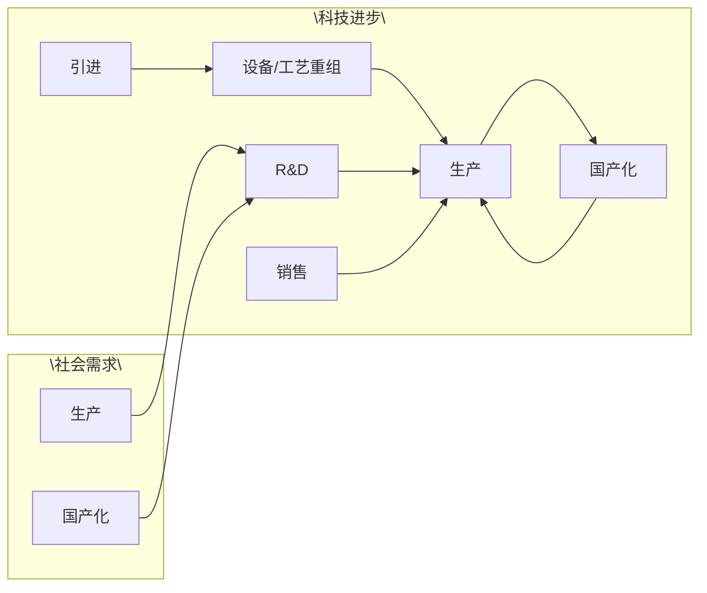
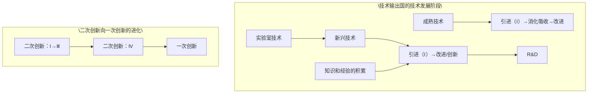

# 方式7：时间演进型

## 索引

| 编号 | 论文 | 内部关系主标签 |
|------|------|--------------|
| 例1 | 柳卸林、胡志坚（科学学研究，2002） | `[时间演进]` |
| 例2 | 吴晓波（科研管理，1995） | `[递进阶段]` |

---
**例1. 柳卸林、胡志坚（科学学研究，2002）**

摘 要：本文分析了中国区域创新能力研究的意义和演化历程‚建立了一套综合的创新能力指标体系‚对中国的区域创新能力作了一个基本判断 并就区域创新能力的成因作了自己的分析 最后 文章探讨了中国区域创新能力所揭示的政策意义和启示。

关键词 区域创新能力 区域经济发展 区域政策

中图分类号

文献标识码

自 年弗里曼提出国家创新体系概念之后国家创新体系现已成为研究国家创新能力 国家竞争力的重要框架。Freeman［1］ 和 Nelson［2］ 的工作显示 日本 美国和其他国家在创新的组织体制和文化上的根本不同‚造成了不同国家创新绩效的不同‚而且这种不同性是与国家的特点密切相关的 此后欧盟和 也都采用了国家创新体系这一概念 并将它作为分析国家竞争力的重要分析框架 随后 区域创新体系的研究从 年代中期起也在国际上不断升温 尤其是在欧洲国家［3］

从 年开始 在当时的国家科委工业司的支持下 柳卸林等人在进行国家创新体系的研究的同时 就开始了区域创新体系的研究 这一工作是与澳大利亚学者托宾（Turpin）等学者联合完成的。他们对中国福建的泉州 宁夏和广西的柳州三个地方与澳大利亚的三个地区进行了对比的分析 其目的是探讨区域经济发展与科学技术发展的联系 现这一研究报告已由英国 Edward Elgar 出版。

区域创新体系研究也有很重要的政策意义 学者们对技术创新经济学的研究的一个重要政策结果是 研究开发具有不确定性 不可分性和他人模仿的风险 造成了研究开发的市场失灵 导致企业对研究开发投资不足 尤其是基础研究方面 政府对基础研究的支持并不自动导致企业对应用研究和开发的投入 知识的创造和扩散 只有在政府研究机构和企业等部门以一种建设性的 互动和互补的方式进行交互式作用时才是最有效率的 因此 用政策干预的方式来系统推动一个地区的创新活动可以推进本地区的经济发展［4］

近年来‚已有一些学者开始关注中国区域创新能力的研究 如中国科技发展战略小组在 年进行的地区科技竞争力的研究［5］ 尚勇 朱传柏等对区域创新系统理论的介绍［6］。这些研究得到了一些有益的结论 如中国区域发展中的科技经济强强或一个强一个弱的分类 陈光 唐福国也建立了一个指标体系‚对我国各地的技术创新能力进行了分析‚但他们的指标比较简单［7］。总体而言‚这些研究还缺乏对中国区域创新能力进行更加全面 综合 动态的评价 为此 柳卸林 胡志坚等中国科技发展战略小组的成员从 年开始了对中国区域创新能力的研究 其目的是从创新的角度 发现中国区域经济增长多样性以及经济快速增长的地区与创新能力的关系［8］。本文是在这一研究的基础上‚对中国区域创新能力作一个判断‚并对中国区域经济发展与创新能力的关系提出自己的看法 通过评价中国区域创新能力 有利于确定比较每个地区的创新能力的强弱项 有利于国家判断区域创新能力的走向和成因帮助地方政府了解自己的创新能力并找到今后的工作出发点 找到中国区域创新的集聚点 动态地发现区域创新能力趋同或多样化的趋势

## 1 中国区域创新能力的演化

中国是一个大国‚因地理、历史、文化和政治经济的原因‚各个地区的创新能力分布很不均匀。

改革开放前‚中国生产和科技的布局是：建国初期 为了国防建设的需要 中央政府通过行政计划的手段‚将多种资源集中到东北和内地工业基础较好的地区 科技和经济发展的重点是东北地区 其次是华东和华北地区。以后的“三线建设”‚实现了工业和科技发展的战略转移 使西部 三线 地区的科技能力迅速提高 但 三线 建设的一个后果是 国防的科技能力与当地的经济发展没有直接联系‚出现了国防科技与地方经济发展 两张皮 的现象 另外 由于我国长期实施的发展重工业的战略 使重工业主要在东北部 此外 一些资源密集型地区成为国家的重要工业基地 如大庆 山西等 华东地区由于有较好的工业基地 也成为国家投资建设的重心上海是其中的典型代表 而在沿海地区 由于靠近台湾‚国家在东部的投资非常少‚造成了福建、浙江、广东等地的国有大企业少 工业基础设施薄弱和科技落后的局面。而一些大城市‚如北京、上海、西安等则成为科技的中心。可以说‚在改革开放前‚地区创新能力的分布是 南方沿海地区普遍落后于北方

改革后的沿海地区开始了经济起飞的历程 邓小平的让一部分人和一部分地区先富起来的战略使区域发展进入了一个非均衡发展的时期 南方沿海地区的经济追赶和超越 得益于以下六个原因 其一 通过建立经济特区和开放沿海港口城市等政策沿海地区成为吸引外资的重要窗口 成为国际技术转移最为活跃的地区 其二 沿海地区重工业基础差 包袱小 成为轻工业发展的重要基地 其三 沿海地区历史上的贸易文化 为后来沿海地区创业奠定了坚实的基础 其四 沿海地区国有大企业少 为后来的乡镇企业 私有企业的发展提供了机遇 它们的发展也为地方经济注入了新的活力 其五 广泛的海外联系使南方成为生产在国内 销售在全球的发展模式 其六 南方远离政治中心有利于市场经济观念的发展 因此 改革开放后中国区域发展的大致走势是 南方的经济起飞与北方的下沉同时发展 经济发展的区域极化在发展

当然 由于每个地区在接收新的知识上速度的差异 地理位置的不同 经济资源条件的不同 南方的经济发展呈现出多样性的特点。加拿大学者 De-bresson 研究指出‚中国正出现以广州、深圳为主的珠江三角洲 上海 江苏 浙江为主的长江三角洲和以北京、天津为主京津地区的三大创新极。它们的核心能力不同 区域经济发展的模式也不同 如珠江三角洲创新极的推动力是电力、机械设备、电子和信息设备等。长江三角洲的特点是创新得到了产业部门专业化的推动 而以天津和北京为主的创新极则表现出了科技密集的特点 新的创新极也在发展它们是四川 重庆和湖北 他还指出 与创新极对应的是周边地区的创新空洞化 因为极所在的地点从周边吸纳了资金人才和其他资源

## 2 中国区域创新能力的评价框架和原则

## 2．1 指标的构成

我们将区域技术创新能力定义为一个地区将知识转化为新产品 新工艺 新服务的能力 区域技术创新能力不是科技能力 也不是科技竞争力 一个地区的科技竞争力强不等于技术创新能力强。我们认为 区域技术创新能力主要有以下要素构成 知识创造能力 即不断提出新知识的能力 知识流动能力 即不断地利用全球一切可用知识的能力 知识在各创新单位之间流动的能力 企业的技术创新能力创新的环境 创新的经济绩效 即创新的产出能力每组指标所指的范围见下表1‚具体的指标构成见

表1 中国区域创新能力指标涵义

<table><tr><td>指标</td><td>内涵</td></tr><tr><td>知识创造</td><td>科技投入、大学与研究所作用</td></tr><tr><td>知识的流动</td><td>知识和技术的有效转移</td></tr><tr><td>企业的创新能力</td><td>知识转化为商品的能力</td></tr><tr><td>创新的基础设施</td><td>创新的平台</td></tr><tr><td>创新的产出</td><td>创新的绩效</td></tr></table>

## 2．2 对已有工作的借鉴

如何评价中国区域技术创新的能力是一个较难的课题 因为角度不同 选择的指标体系不同 会得出不同的结论 我们为此借鉴了许多研究报告

美国的 创新指标 是由哈佛大学波特尔教授和斯特恩教授联合主持的项目 其目的是评价美国不断推出创新的能力［10］。他们认为‚国家创新能力不是竞争力‚因为竞争力可通过短期的降低成本等手段获得 而国家创新能力是国家工业长期竞争力的关键 他们认为 国家创新能力取决于共有创新基础设施的强度‚支持创新集群的环境条件‚以及两者互动联系的强度 其中创新基础设施包括在研究开发中的人力资源 投资于研究开发的资金资源对国际投资的开放度‚知识产权的保护水平‚教育投资水平和人均国民生产总值。支持创新集群相关的环境条件有产业研究开发投资的强度 基础设施和产业集群两者联系的质量可用大学研究开发的水平来衡量 我们借鉴了创新能力不是经济和科技竞争力的思想‚认为创新能力决定了一个地区长期的经

济发展能力。

瑞士洛桑国际管理开发学院（IMD）发表的《国际竞争力报告 简称 洛桑报告 为各国之间进行横向国际竞争力比较提供了一个可供参考的框架。同时 由于该报告是连续的年度报告 从而为每一参评国自身进行纵向比较提供了一个重要途径‚因而《洛桑报告》一直倍受各界关注。《洛桑报告》对我们的影响较大‚我们借鉴了其中用数据来表达思想的方式 用能力资产负债表的概念来看待地区创新能力的强弱项 以及一个能力评价报告所应有的分析框架。但我们强调了在数据基础上的分析和政策意义的提炼 这是与 洛桑报告 的最大不同之处

```mermaid
graph TD
  Root["中国区域技术创新能力"]
  
  sub1["知识创造"]
  sub2["知识流动"]
  sub3["企业技术创新能力"]
  sub4["技术创新环境"]
  sub5["技术创新的经济效益"]
  
  sub1 --> A1["研究开发投入"]
  sub1 --> A2["研究开发机构"]
  sub1 --> A3["专利"]
  sub1 --> A4["科研论文"]
  
  sub2 --> B1["技术合作"]
  sub2 --> B2["技术转移"]
  sub2 --> B3["外国直接投资"]
  
  sub3 --> C1["大中型企业研究开发投入"]
  sub3 --> C2["设计能力"]
  sub3 --> C3["制造和生产能力"]
  sub3 --> C4["创新产出：新产品产值"]
  
  sub4 --> D1["创新服务"]
  sub4 --> D2["创新基础设施"]
  sub4 --> D3["市场需求"]
  sub4 --> D4["劳动者素质"]
  sub4 --> D5["创新基金"]
  sub4 --> D6["金融环境"]
  sub4 --> D7["创业水平"]
  
  sub5 --> E1["宏观经济"]
  sub5 --> E2["产业结构"]
  sub5 --> E3["产业国际竞争力"]
  sub5 --> E4["居民收入水平"]
  sub5 --> E5["就业"]
```

flowchart

图 中国区域创新能力指标构成

此外 我们还借鉴了世界经济论坛的 全球竞争力报告 在这一报告中 它将竞争力分为两个部份 现有的竞争力和增长竞争力［11］ 我们借鉴了这一思想 注重在评价创新现有能力的同时 强调了创新能力增长潜力的评价 这是我们为什么在创新指标体系中运用了增长率的指标的原因 因为这一指标衡量了一个地区的增长潜力

## 2．3 评价的原则

评价原则之一是创新体系的原则 区域创新体系建设的核心是创新要素的互动程度 即强调大学和研究开发机构 企业 中介机构和政府等创新要素的网络化或者说知识在几个要素间流动的程度作为区域技术创新系统化的关键。一个地区的技术创新能力关键是创新的系统化 而不是某一个方面的能力。

评价原则之二是强调创新链条的形成 这是因为在大多数情况下 技术创新常来自于一个创新的思想和发明或科技突破 其中大学 科研院所的知识创造活动是重要的创新来源 其次 有了很强的知识创造活动‚不等于该地区就有较高的创新能力‚因为许多事实表明 科技实力强不等于技术创新能力强 许多地区没有较强的科技基础 但仍然有很高的技术创新能力 问题的关键是一个地区能否有效地利用各种世界上所有的各种知识为本地区的创新服务 因此 必须考虑知识流动或技术转移的能力

第三‚企业是创新的主体。

评价原则之三是强调创新环境的重要性。在市场经济体系下 衡量地方政府工作的重要内容不是传统的计划和干预的多少 而是如何创造一个有利于企业创新的环境。因为政府远离市场‚不是企业家 政府不能直接指导企业的技术创新流动 政府职能调整的关键是从依赖计划转向创造创新环境来来推动企业的技术创新

评价原则之四是在指标构成中将指标的存量、相对和增长率三者兼顾 我们认为 评价框架必须兼顾一个地区发展的存量 相对水平和增长率三个维度 在 洛桑报告 中 比较强调存量 相对水平但不强调增长率 本报告的一个特色是对增长率的强调‚因为我们认为‚增长率反映了一个地区的经济发展潜力。

由于许多统计限制‚我们2001年报告评价的时间段是 年 参考评价的年代是 年 因为在 年上半年 年的许多数据还是不可得的。

## 3 中国区域创新能力的分布

## 3．1 中国区域创新能力排名

根据统计数据并按一定的指标 对我国区域创新能力进行评估［8］ 得中国区域创新能力构成总表表 和中国区域创新能力评价 图 可以看出

最具创新能力的地区是上海 其次是北京广东 江苏 山东和辽宁 创新能力低下的是西部地区省份 其中青海最低 西藏次之 再次是贵州 宁夏 内蒙古自治区 江西的创新能力较低 与其资源的地位并不相称 中国区域创新能力评价总表  
北京是知识创造能力创新最强的地区 青海是知识创造能力最低的地区  
上海是知识流动最快的地区 西藏是知识流动最慢的地区  
（4）广东是企业技术创新能力最强的地区‚西藏是企业创新能力最低的地区  
北京是创新环境最好的地区 西藏最低  
（6）创新的经济绩效最好的是上海‚最差的是山西。

## 3．2 中国区域创新能力总的结论

总体上看 中国区域创新能力从东部沿海地区向西部内陆地区由高到低呈梯次分布 制度创新是技术创新的基础。

上海、北京表现突出‚它们的得分远超出过其他地区 排在第一和第二的位置上 之所以如此 一个重要原因是沿海地区改革开放领先于全国 为技术创新提高了良好的体制框架和市场经济体系。而像天津等城市 它的工业基础好 科技有实力 又是沿海港口城市 但创新能力不强 是因为与南方地区相比‚制度创新不活跃‚由此可见‚体制创新是决定技术创新能力的关键

如果我们把各地区按创新能力的强弱分为四个集团的话 那么 上海 北京 广东显然属于第一集团。上海强在企业的技术创新能力、知识流动和创新的经济绩效上‚而北京强在知识创造和创新环境上 尽管北京在知识创造能力上表现得非常突出但由于其他创新环节的相对弱势 使最终的技术创新综合能力不如上海。广东强在企业的技术创新能力上。

第二集团有江苏 山东 辽宁 浙江 天津和福建 它们都是沿海地区

第三集团有吉林 陕西 四川 湖北 河北 湖南重庆 安徽 黑龙江 河南 它们主要是中部地区 少数是西部地区 它们属于中西部地区创新较好的地区。

第四个集团‚也是最后一个集团‚主要以西部省份为主 加上一些中部欠发达的地区 它们中有海南 山西 新疆 甘肃 广西 云南 江西 内蒙古 宁夏 贵州 西藏和青海 除山西 江西 海南外 都是西部地区

由于我们认为创新能力决定了一个地区的经济长期竞争力 因此 上述地区的创新能力分布也预示着今后几年各地的经济发展趋势。

创新能力各要素在不同地区的分布不均衡

北京 强在知识创造 其他相对较差 广东弱在知识创造 但其他能力较强 因此 北京要加强企业技术创新能力的培育 而广东要注重知识创造能力的提高 上海 江苏 浙江 天津和辽宁的能力相对均衡。

在本报告的知识创造 知识流动 企业技术创新环境和创新的经济效益这五大板块中 各集团的能力如下：

在第一集团 北京强在知识创造能力 第一位和创新环境 第一位 上 而上海强在知识流动 第一位 企业技术创新能力 第二位 和创新的经济效益（第一位）上。两个大城市各有千秋。

广东的创新能力表现非常强劲。其中突出的是 广东的企业技术创新能力按照我们的指标统计已经超过了上海成为全国第一位 这得益于广东这几年的改革开放政策和深圳的崛起。在企业技术创新能力这一板块里 广东在企业研究开发投入 设计能力上居全国第一的位置 在制造和生产能力上居全国第三‚在新产品产出上‚居全国第二的位置。

在第二集团中‚江苏、山东、辽宁、浙江、天津和福建这六个省份中‚表现最为突出的是他们具有较强的企业技术创新能力 在企业技术创新能力的全国排名中‚他们加上北京上海共占据了九席。这说明 企业技术创新能力在地区创新能力中所具有的重要位置。

在第三集团 表现突出的是吉林 陕西和四川吉林作为第三集团的领头羊‚其特点是在创新能力的各个方面都有较均衡的能力 而陕西的特点是强在创新的环境中 在知识创造方面并没有显出优势而在知识流动方面则表现较差 四川则强在企业的技术创新能力上 而弱在知识创造和知识流动环节上。

第四集团以西部地区省份为主 总的说来 他们在知识创造、知识流动、企业技术创新能力和创新环境上都较差 落后于全国其他地区较多 尤其是与东部发达地区相比 山西之所以落入这一集团 主要原因是 年经济效益不佳造成的 山西的创新经济效益的全国排名是倒数第一 山西的劳动生产率全国倒数第一 年的人均 水平的增长也是倒数第一 山西的居民收入水平也是全国倒数第一 江西落入这一集团是因为他们在五个板块中都较落后 有许多指标甚至落后于西部省份。

从这个分析上说 山西 江西和海南是东中部地区的 西部 国家在强调开发西部的过程中 注意一下这几个富饶地带包围的落后地区的发展问题非常重要 他们不应当被忽视 像山西 曾对我国的能源发展作出过巨大贡献 它的经济如何发展 值得关注 江西是一个资源富饶的地区 但在创新能力排名中仅排在第 位 不如新疆 甘肃和广西 江西的落后可能问题可能出在发展观念 战略和体制上。

而有些西部省份如西藏的人均 增长率在1998－1999年排在全国首位‚青海也排在全国第十 正是西部地区省份在经济增长率 产业集中度高和资源产业的比较优势等特点使西部省份在创新的经济效益上表现不俗 但他们在创新的各个环节是都是全国最差的 因此 西部在提高创新能力上任重而道远。

bar

| Rank | Category | Value |
| --- | --- | --- |
| 1 | 上海 | 58.33 |
| 2 | 北京 | 58.27 |
| 3 | 广东 | 49.68 |
| 4 | 江苏 | 43.2 |
| 5 | 山东 | 37.82 |
| 6 | 辽宁 | 35.92 |
| 7 | 湖北 | 34.74 |
| 8 | 天津 | 34.2 |
| 9 | 福建 | 33.8 |
| 10 | 吉林 | 28.95 |
| 11 | 陕西 | 26.83 |
| 12 | 四川 | 26.73 |
| 13 | 湖北 | 25.53 |
| 14 | 河北 | 25.51 |
| 15 | 湖南 | 23.99 |
| 16 | 重庆 | 23.7 |
| 17 | 安徽 | 23.64 |
| 18 | 黑龙江 | 23.36 |
| 19 | 河南 | 23.09 |
| 20 | 海南 | 20.79 |
| 21 | 山西 | 19.75 |
| 22 | 新疆 | 19.38 |
| 23 | 甘肃 | 19.24 |
| 24

---

  
  
  
  
  
  

  
  
  
  
  
  

---
> 改革前：重工业布局东北+三线建设西移→国防科技与地方经济"两张皮"→南方沿海落后于北方
> 改革后：特区+轻工业+乡镇企业+海外联系+远离政治中心+贸易文化→南方起飞/北方下沉
>   [内部关系：时间演进。不涉及文献间互引，按历史阶段组织]
> 收束：改革开放前后的区域创新格局发生了根本性反转

改革开放前，中国生产和科技的布局是：建国初期，为了国防建设的需要，中央政府通过行政计划的手段，将多种资源集中到东北和内地工业基础较好的地区，科技和经济发展的重点是东北地区，其次是华东和华北地区。以后的"三线建设"，实现了工业和科技发展的战略转移，使西部"三线"地区的科技能力迅速提高，但"三线"建设的一个后果是，国防的科技能力与当地经济发展没有直接联系，出现了国防科技与地方经济发展"两张皮"的现象。另外，由于我国长期实施的发展重工业的战略，使重工业主要在东北部。此外，一些资源密集型地区成为国家的重要工业基地，如大庆、山西等。华东地区由于有较好的工业基地，也成为国家投资建设的重心。上海是其中的典型代表。而在沿海地区，由于靠近台湾，国家在东部的投资非常少，造成了福建、浙江、广东等地的国有大企业少，工业基础设施薄弱和科技落后的局面。而一些大城市，如北京、上海、西安等则成为科技的中心。可以说，在改革开放前，地区创新能力的分布是：南方沿海地区普遍落后于北方。改革后的沿海地区开始了经济起飞的历程。邓小平的让一部分人和一部分地区先富起来的战略，使区域发展进入了一个非均衡发展的时期。南方沿海地区的经济追赶和超越，得益于以下六个原因：其一，通过建立经济特区和开放沿海港口城市等政策，沿海地区成为吸引外资的重要窗口，成为国际技术转移最为活跃的地区。其二，沿海地区重工业基础差、包袱小，成为轻工业发展的重要基地。其三，沿海地区历史上的贸易文化，为后来沿海地区创业奠定了坚实的基础。其四，沿海地区国有大企业少，为后来的乡镇企业、私有企业的发展提供了机遇，它们的发展也为地方经济注入了新的活力。其五，广泛的海外联系使南方成为生产在国内、销售在全球的发展模式。其六，南方远离政治中心有利于市场经济观念的发展。因此，改革开放后中国区域发展的大致走势是：南方的经济起飞与北方的下沉同时发展，经济发展的区域极化在发展。当然，由于每个地区在接收新的知识上速度的差异、地理位置的不同、经济资源条件的不同，南方的经济发展呈现出多样性的特点。

**例2. 吴晓波（科研管理，1995）**

# 二次创新的进化过程\*

吴晓波

(浙江大学工商管理学院)

本文从我国的实际出发，用进化观点探讨并分析了发展中国家的主导创新——在技术引进基础上进行的二次创新的过程与性质。指出，在开放经济条件下，二次创新的进化过程具有典型的非线性动态特征。因此，必须突破传统的封闭、静态的技术引进→消化吸收→创新观点和西方技术创新理论的囿制，切实认识引进与创新的内在关系，根据现实环境与条件的变化进行动态的创新管理。

## 关键词：技术创新 二次创新 进化过程 技术引进

在研究发展中国家的技术进步问题时，60年代和70年代的西方学者们往往把注意的焦点集中于诸如是选用劳动密集型技术还是选用资本密集型技术这一类新古典经济学派的传统问题。这是一种看不到技术发展的前景和复杂过程的静态观点[1]。近年来，人们开始认识到仅仅强调技术选择是远远不够的。要研究发展中国家利用引进技术缩小与发达国家的差距的问题，就必须研究发展中国家在引进基础上，在动态变化的环境中，实现技术创新的复杂过程。

## 一、二次创新的定义

西方学者多年来所进行的研究，使人们对技术创新的一般过程模式有了较为明晰的认识。典型地，我们可用

  
图 1 一次创新过程

作为一个发展中国家，从总体来看，我国在技术、经济、文化、教育等诸方面相对发达国家有比较大的差距。从技术发展规律的总体特征来看，就是以从发达国家引进技术为技术发展的最主要的源头之一（包括有形的和无形的引进，或称硬件（Hardware）、软件（Software）、脑件（Brainware）、支撑件（Supportware）  的引进）。据不完全统计，在1980年后的十年中，我国用中央外汇即引进了7000个项目，用汇157.9亿元  。引进总费用估计达到了1000亿美元  。然而，技术引进并不能自动地使差距缩小。在众多的发展中国家，普遍存在着“引进→技术差距暂时缩小→技术水平停滞在原引进水平上→差距再次拉大→再次引进”的现象。而且由于不能形成再生和发展的能力，加之资金、人才的匮乏，甚至就连这样的循环也难以为续，以至产生“马太效应”。要想通过技术引进培育本国的技术能力，进而赶上世界发达水平，必须满足的前提就是，利用引进技术的后发优势实现比技术输出国更快的技术发展速度。为此，必须实现对引进技术的再次创新，使引进技术在适应本国条件的情况下，实现更快的商业化，进而形成和发展具有本国特色的自主技术能力。

在给“一次创新”和“二次创新”下定义以前，不能不提到英国学者吉奥瓦尼·多西(Giovanni Dosi)于1982年所提出的“技术范式”(Technological Paradigm)和“技术轨迹”(Technological Trajectories)的概念  。他基于内在的技术发展规律及其与经济结合的内在规律相互联系的深刻认识，批评了需求拉动论和技术推动论这两种对立的理论。他认为，前者只是从需求的变化来被动地解释技术创新，后者则仅从技术的供给方来理解技术创新的动因。前者没有注意并且不能说明技术创新的复杂性、相对独立性、继承性和不确定性；后者则无法解释在技术创新的过程中，经济因素是如何起到重要作用的。正确的认识应该是充分注意到经济环境与技术变化的方向之间所存在的结构复杂的相互作用关系。他深刻地看到技术创新、经济增长间虽然不存在唯一性的均衡的发展轨迹，但确实是有规律可循的。技术周期、经济周期、经济长波的存在就是最好的例证。

（1）技术范式 是一组处理问题的、为设计师、工程师、企业家和管理人员所接受与遵循的原理、规则、方法、标准、习惯的总体。它既是一组看问题的观念体系，又是一组解决问题的方法体系。具体地说，“技术范式”就是基于某些特定自然科学原理和特定原材料的解决某些特定技术问题的模式。每一“技术范式”都定义了自身技术进步的方向和内涵。  
(2) 技术轨迹 就是为技术范式所规定的解决问题的具体模式或发展的方向。“人们

可以把技术轨迹想象为一个柱体，而这个柱体存在于由技术变量和经济变量所规定的多维空间中（因此，技术轨迹是一组可能的技术方向，而它的外部世界是由技术范式本身的性质所规定的）”[10]。技术范式与技术轨迹的概念十分有助于我们认识和理解技术创新活动的性质和内在规律。运用这二个概念，本文对“一次创新”和“二次创新”作如下的明确定义：①一次创新 指主导了技术范式和技术轨迹的形成、发展和变革的技术创新；②二次创新 指在技术引进基础上进行的，受囿于已有技术范式，并沿既定技术轨迹而发展的技术创新。虽然，发达国家同样进行着大量的“二次创新”，发展中国家亦并非没有“一次创新”。在这里，本文从我国的基本国情（企业技术创新）的总体特征把握，探讨发展中国家的“二次创新”。

## 二、二次创新过程模型

技术创新是一个多方参与的复杂过程。人们研究的出发点不同，采用的方法和理论体系亦不同，所提出的模型和类型各异  。因此，在提出二次创新过程模型之前，我们应首先明确下述基本问题：

（1）模型的目的与用途 本模型用于描述二次创新过程的一般规律与特点，旨在揭示二次创新与一次创新间的不同性质与区别，反映发展中国家与发达国家在经济、科技、社会、文化等诸方面的差异对技术创新过程所产生的深刻影响。  
（2）模型的类型 鉴于上述目的，本模型以企业为技术创新的主体，但是并非是用于具体的（如辅助决策）的决策模型或部门模型，而是用于揭示基本规律、认识总体特征的“活动”过程模型。模型仍采用“阶段”这一简化

复杂系统的“智力工具”[12]，是一个概念模型。

## (3) 建模的方法论体系与基本理论依据

本文认为,二次创新的主体是一个开放系统,二次创新的过程是一个积累的进化过程。因此,从反映创新主体的技术体系发展规律出发,

flowchart

图 2 二次创新过程

它应是一个技术源模型,能历史地反映二次创新的进化过程。

基于上述立场，在调查研究的基础上，本文提出如图 2 所示的二次创新过程模型。

## 三、二次创新的进化

在图 2 中,二次创新过程被表示为在社会需求(包括市场需求)和科技进步的大环境中,以各类典型“活动”为阶段标志的过程。按技术体系发展的进化过程,它又可分成如下三个子过程。

## (1) 过程 I —— 模仿创新

  
图 3 二次创新过程 I

这一过程始于系统的生产技术的引进(我们称其为第Ⅰ类技术引进,用引进Ⅰ来表示),它包括产品设计、制造工艺、测试方法、材料配方、技术标准等,也常常包括一些关键设备和样机。该阶段的主要工作是:可行性研究、洽谈、成交、将有关图纸资料和设备乃至专业技术人员引入接受技术的企业。随之而进行的便是根据技术要求进行引进设备与原有设备按工艺进行重组。对企业来说,这意味着新工艺的采纳,具有创新的意义。它以模仿引进技术为原则。经试运行后即进入生产阶段。这时的生产是完全按照引进技术的标准而进行的,以生产出与国外同样水平的产品为目标。经营战略以利用国外技术在国内已有市场中建立优势为主。

综观这一过程，它以简单模仿国外产品和工艺为基本特点，但是对企业(甚至国家)来说毕竟是新技术的应用，尽管企业在这一阶段往往不掌握该技术的原理和诀窍(Know-how)，对技术母国有很大的依赖性。这是一种“准”创新—模仿创新。但是，它毕竟使企业的技术水平上了一个台阶，使企业踏上了一条新的技术发展轨迹，使企业的技术体系纳入了一种新的技术范式。其技术能力的提高主要以“干中学”(Learning by doing)  方式进行。即通过生产过程中，工人熟练程度的提高，而提高产品质量，降低生产成本，并向设计和研究开发部门、生产技术管理部门反馈信息、提供知识积累。

## (2) 过程Ⅰ——创造性模仿

  
图 4 二次创新过程Ⅰ

为了实现更好的经济效益,减少对技术母国的依赖,国产化是消化、吸收引进技术的主要内容和目标。在开放经济条件下,虽然通过国际分工能获得比较利益,但是事实上,由于技术、经济发展水平上的差异,这种国际分工往往对发展中国家不利,并可能诱使其跌入恶性循环,更加剧其对发达国家的依赖。因此一定程度上的国产化是十分必要的。

在国产化过程中，已有技术结构与引进技术结构的相互适应和融合是关键。Sahal 在研究扩散过程时，用了(Scaling)这个概念  。国产化过程事实上也就是一个“结构性理解”  的过程，即是新、旧技术结构的相互适应，并成具有新质的技术结构过程。这一过程以工艺创新为主，以尽可能多地在不失产品性能的前提下采用国内已有的原材料、部件等。同时，在技术进步中“用中学”(Learning by Using)  起着十分重要的作用。即，产品在用户的使用过程中，亦通过学习而改进操作条件，降低了运行成本，提高了效率，同时亦产生着种种适应性问题，这些信息反馈到企业的研究与开发、设计、生产诸部门，往往成为改进产品和工艺的重要依据。如美国学者 Von Hippel 曾指出的，使用者亦是主要的创新者  。更为重要的是，通过国产化，使企业的产品和工艺的设计能力有了很大的提高。这一过程虽然仍以维持引进产品的性能进行工艺创新为主，但是国产化使引进技术的质发生了很大的变化，我们称之为创造性模仿。

需指出的是,由于发展中国家技术体系发展的不平衡,完全的国产化是非常困难的。并且,一味追求国产化往往导致引进技术在应用中质的下降,反而得不偿失。这方面的教训亦是很多的。

## (3) 过程Ⅲ——改进型创新

  
图 5 二次创新过程Ⅰ

通过前两个过程的进行,技术引进的主体(企业)具备了一定的生产能力,掌握了基本的技术原理和专有技术,达到了消化吸收的目的。在这一过程Ⅰ中,国产化以掌握设计技术为目标向纵深发展。同时在技术积累的基础上逐步形成自我的R&D能力。进而根据市场(主要是国内市场)的需要,通过自主的研究和开发,进行改进型创新。即,对引进技术进行“功能性理解”[17],扩大引进技术的应用域,并充分利用其“技术机会”进行引进产品新功能的开发。这种改进型创新的涌现乃是二次创新真正意义之所在。它标志了对引进技术消化吸收的成功,表明引进主体已摆脱了对技术母国的依赖,具备了自我发展的能力,实现了质的飞跃。

值得指出的是,设计原理的掌握和 R&D 能力的形成是这一过程的核心,而这一关键环节的达成,往往是通过“反求工程”(Reverse Engineering)而得以实现的。即,在引进技术的应用中,反向推演出该技术的原理和诀窍(尤其是设计原理。如,CAD 软件源程序的破译)。这种原理和诀窍,技术母国往往是不愿向引进方转让的。

通过用历史观点对上述三个子过程的分析,我们可以看到,二次创新是一个渐进积累的进化过程,是一个量变与质变并存的多维过程,是一个从原有技术体系向新技术体系“学习”到新、旧技术体系相互竞争和“理解”的非线性过程,亦是一个打破原有技术平衡态到形成新的技术平衡态的非均衡过程。并非如传统所理解的那种封闭的、埋头苦干式的从引进、消化吸收到创新的线性过程。

## 四、二次创新的动态性

当我们注意到技术输出国的高速技术发展时,就会发现,即便引进主体已具备了进行第Ⅰ类二次创新的能力,要赶超国际先进水平仍是十分困难的。应当看到,二次创新虽促使引进主体增强了自我发展的能力,但是这种发展仍是受囿于引进技术的原有技术范式,沿着既定的技术轨道进行的。并且随着二次创新的进一步进行,该范式所提供的技术机会(应用机会)将逐渐减少。因此,试图通过一轮二次创新就赶上发达国家水平,“毕全功于一役”的想法是不切实际的。

问题的关键不在于简单地避免再次引进，而在于避免被动地在再次落后之后，再去引进那些已不那么先进的、市场已趋萎缩的技术；在于如何更好地促进二次创新的进化，提高自身的技术能力的技术水平，力争主动地实现技术范式的突破和技术轨道的跳跃，以获得更广阔的发展空间。

在这里,我们又可以看到第N类二次创新的存在,如

  
图 6 二次创新过程 IV

表 1 二次创新进化过程的基本特征

<table><tr><td rowspan="2">特征\阶段</td><td colspan="5">引进→设备、工艺重组→生产→国产化→掌握设计技术→改进→生产......→一次创新</td></tr><tr><td>引进</td><td>模仿</td><td>消化、吸收</td><td>改进型创新</td><td>全新型创新</td></tr><tr><td>目标</td><td>获系统的生产技术</td><td>掌握运行技术</td><td>国产化、掌握设计技术</td><td>扩展市场</td><td>开拓新市场、参与国际竞争</td></tr><tr><td>主要活动</td><td>可行性论证、洽谈</td><td>安装、调试、工人培训</td><td>与原技术体系的协调</td><td>新技术体系的形成</td><td>实现重大创新</td></tr><tr><td>关键事件</td><td>成交</td><td>投产</td><td>国产化</td><td>开发出改进型产品/工艺</td><td>技术出口、新品进入国际市场</td></tr><tr><td>关键人物</td><td>官员、企业家、总工程师</td><td>工程师、熟练工人</td><td>工程师、R&amp;D人员</td><td>R&amp;D人员</td><td>R&amp;D人员、企业家</td></tr><tr><td>工作的焦点</td><td>对潜在机会的识别、评估</td><td>使引进技术见效</td><td>形成稳定的生产体系</td><td>扩张应用域</td><td>R&amp;D、开拓新市场</td></tr><tr><td>技术转移媒体</td><td>人、图纸资料、设备</td><td>运行规则、关键设备</td><td>成套设备与工艺</td><td>改进型产品/工艺</td><td>新技术</td></tr><tr><td>技术积累</td><td>掌握有关信息</td><td>“干中学”</td><td>“用中学”,结构性“理解”</td><td>功能性“理解”</td><td>发展新技术</td></tr><tr><td>R&amp;D能力</td><td>几乎无</td><td>几乎无</td><td>初具(以开发为主)</td><td>较高水平</td><td>国际水平</td></tr><tr><td>创新活动</td><td>基本无</td><td>模仿创新</td><td>工艺创新、组织创新</td><td>渐进型创新</td><td>重大创新</td></tr><tr><td>主要障碍</td><td>信息不足</td><td>不熟悉原理</td><td>与原技术体系的矛盾</td><td>技术体系不平衡、配套难</td><td>技术不平衡、信息不灵</td></tr><tr><td>政府影响</td><td>较大</td><td>弱</td><td>大</td><td>中</td><td>弱</td></tr><tr><td>投资</td><td>中</td><td>大</td><td>中</td><td>小</td><td>大</td></tr></table>

此时，创新活动始于对国际上的新兴技术甚至是实验室技术的引进(我们称之为第Ⅱ类技术引进，用引进(Ⅱ)来表示)。它通过自主R&D的早期参与实现以我为主的对标准的一次创新过程(参见

关键。但以具备高水平的 R&D 能力和先进的生产能力为前提，这一点往往为发展中国家所难以达到。显然，这类创新已不是原来意义上的二次创新了，我们可以称之为“后二次创新”或“准一次创新”。

分析表明,二次创新向一次创新的进化,以缩短消化吸收周期,进行动态的技术引进为前提。这种进化过程与引进技术的动态性之间的关联,可用

flowchart

图 7 技术引进的动态性与二次创新的进化过程

地进行动态的技术引进，并加强与自主 R&D 的结合，对提高二次创新的有效性，并促使其向一次创新的进化，具有重要的意义。

## 五、案例

杭州某厂是机电部大型骨干企业，是我国某行业最大的制造和研究中心。当我们历史地考察它的发展过程时，可以看到，自1956年该厂全套引进前苏联技术以来，它经历了一个典型的、动态的二次创新进化过程。

表 2 杭州某厂的技术发展历程

<table><tr><td>阶段I(1956-1960年)</td><td>阶段II(1961-1968年)</td><td>阶段III(1969-1979年)</td><td>阶段IV(1980-1985年)</td><td>阶段V(1986年- )</td></tr><tr><td>仿前苏联技术二次创新( ! I )</td><td>自我摸索二次创新(III)</td><td>仿日、德技术二次创新(II)</td><td>仿德技术、国产化二次创新(III)</td><td>引进新兴技术二次创新(IV)</td></tr><tr><td>单向开放</td><td>封闭发展</td><td>半封闭发展</td><td>逐步开放</td><td>全方位开放</td></tr><tr><td>40年代中后期水平</td><td>50年代初期水平</td><td>50年代末期水平</td><td>70年代初中期水平</td><td>80年代中期水平</td></tr></table>

根据其五代主要产品的技术水平,我们可以分五个阶段来看它的二次创新情况。如表2所示。根据其技术水平与国际先进水平的动态比较,我们又可以得到

line

| 年份 | 技术水平 |
| --- | --- |
| 1956 | ~53 |
| 1961 | 50 |
| 1969 | ~58 |
| 1979 | ~71 |
| 1986 | ~85 |

图 8 杭州某厂主导产品技术水平的进化  
  
图 9 杭州某厂的二次创新进化过程

## 六、结论

在一个发展中的技术后进国家,二次创新的过程和性质与发达国家的一次创新有着极大的区别。初步地,我们可以看到以下基本区别:

(1)一次创新始于有组织的研究与开发活动,以存在发达的科学技术能力及良好的技术、经济环境为背景;二次创新则大多始于有目的的技术引进(成熟技术),引进主体的技术能力和研究开发能力是在消化吸收的过程中逐渐形成的。其技术、经济环境相对较弱,尤其缺乏人才、资金。只有少数高层次的二次创新有自主R&D的早期参与(虽然这是理想的二次创新)。  
(2)一次创新具有较大的风险性和不确定性,在技术和市场的两方面都具有开拓意义。二次创新则因为有技术输出国的示范,在技术上和市场上的风险都大为下降。但是却面临着技术机会少,甚至被替代的危险。  
(3)一次创新以发展为基本特征,而二次创新则以“学习”和“理解”为基本特点。

---

  

  

  

  

  

  

  

  

  

  

  

  

---
> 过程I(模仿创新)：技术引进→设备重组→"干中学"→简单模仿
> 过程II(创造性模仿)：国产化→"用中学"→工艺创新为主+设计能力提升
> 过程III(改进型创新)：掌握原理+专有技术→自主研发→"功能性理解"→应用域扩展
>   [内部关系：递进阶段。同一理论框架内的三个连续阶段，后一阶段以前一阶段为基础]
> 收束：二次创新的进化是非线性动态过程，不是"引进→消化→创新"的简单线性

二次创新的进化过程可分成三个子过程。过程I：模仿创新。这一过程始于系统的生产技术的引进（称为第I类技术引进），包括产品设计、制造工艺、测试方法、材料配方、技术标准等，也常常包括一些关键设备和样机。该阶段的主要工作是：可行性研究、洽谈、成交、将有关图纸资料和设备乃至专业技术人员引入接受技术的企业。随之而进行的便是根据技术要求进行引进设备与原有设备按工艺进行重组。它以简单模仿国外产品和工艺为基本特点，其技术能力的提高主要以"干中学"（Learning by Doing）方式进行。过程II：创造性模仿。为了实现更好的经济效益，减少对技术母国的依赖，国产化是消化、吸收引进技术的主要内容和目标。在技术进步中"用中学"（Learning by Using）起着十分重要的作用。通过国产化，使企业的产品和工艺的设计能力有了很大的提高。这一过程虽然仍以维持引进产品的性能进行工艺创新为主，但是国产化使引进技术的质发生了很大的变化，称之为创造性模仿。过程III：改进型创新。通过前两个过程的进行，企业具备了一定的生产能力，掌握了基本的技术原理和专有技术，达到了消化吸收的目的。在这一过程中，国产化以掌握设计技术为目标向纵深发展。同时在技术积累的基础上逐步形成自我的R&D能力。进而根据市场（主要是国内市场）的需要，通过自主的研究和开发，进行改进型创新。即对引进技术进行"功能性理解"，扩大引进技术的应用域，并充分利用其"技术机会"进行引进产品新功能的开发。这种改进型创新的涌现乃是二次创新真正意义之所在。

---
