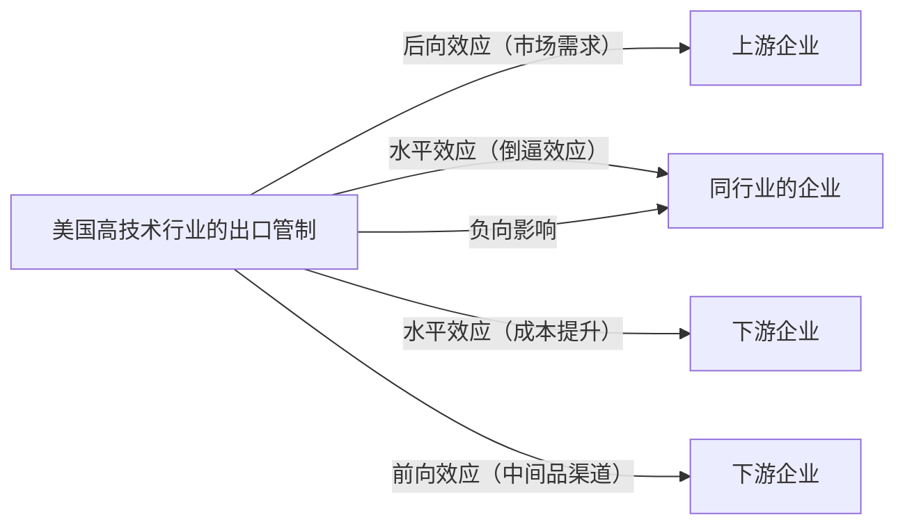
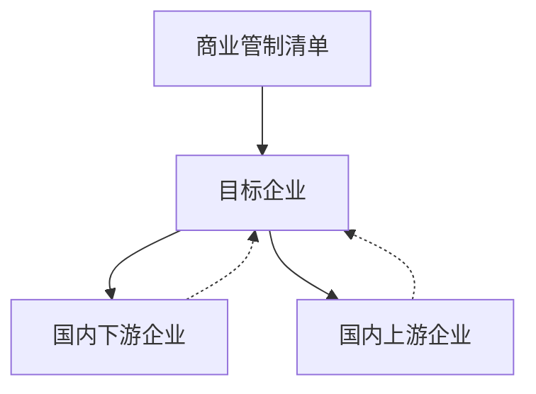

# 方式1：主题线分组

## 索引

| 编号 | 论文 | 内部关系主标签 |
|------|------|--------------|
| 例1 | 严兵、吴琦琦、冼国明（管理世界，2025） | `[并列列举]` |
| 例2 | 李宁静、李春顶（中国工业经济，2024） | `[并列列举]` |
| 例3 | 罗长远、吴梦如（世界经济，2022） | `[转折对立]` |
| 例4 | 余振、尚玉、李雪（世界经济，2024） | `[转折对立]` |

---
**例1. 严兵、吴琦琦、冼国明（管理世界，2025）**

摘 要：本文利用 年上市公司相关数据和美国商务部公布的出口管制实体清单名录 深入探讨了美国出口管制措施对中国企业供应链调整的影响 研究发现 为应对出口管制 众多企业采取了供应链多元化策略 虽然这种策略在短期内造成了外部供应链创新水平的下降 但同期国内供应链创新度的提升对此进行了有效弥补 面对外部创新产品供给的短缺 加强自主研发成为企业寻求突破的有效途径 网络搜寻效率较高 获得较高补贴以及高新技术企业更可能采取多元化策略 但对于专业化程度高 供应商网络中心度大的企业 高昂的转换成本可能成为其多元化策略的绊脚石 出口管制的影响存在 传导效应 会促使受管制企业的同行业竞争者 技术同群企业以及下游企业实施多元化策略 相较于未直接受影响的企业 受管制企业在经营绩效上普遍受到负面影响 提升供应链效率成为缓解这一不利影响的可行途径

关键词：实体清单 供应链调整 多元化 创新

JEL 分类号：F13， F14， O24 文献标识码：A 文章编号：1002 － 7246（2025）10 － 0115 － 18

## 一、引 言

近年来 中国高科技领域发展迅速 特别是在 人工智能 量子计算等前沿技术领域取得显著进展 在全球价值链中的位置逐渐攀升 年中国研发支出占 的比重达 2.68％，与美国的差距不断缩小。 基于将技术竞争纳入国家安全战略的政策导向，

收稿日期：

作者简介：严 兵 经济学博士 教授 南开大学跨国公司研究中心 经济行为与政策模拟实验室

yanbing＠ nankai. edu. cn.

吴琦琦（通讯作者），博士研究生，南开大学经济学院，E⁃mail： wuqiqi629＠ 163. com.

冼国明，经济学博士，教授，南开大学跨国公司研究中心，E⁃mail： gmxian＠ nankai. edu. cn.

本文感谢国家社会科学基金重大项目 的资助 感谢匿名审稿人的宝贵意见 文责自负。

美国持续强化对华出口管制体系。 自2018 年以来，被纳入美国出口管制实体清单的中国企业数量持续增加。 此外，美国还利用其在全球创新网络中的核心地位，采取长臂管辖措施，推动其他国家协同对中国实施出口管制。 例如，2022 年 8 月签署的《芯片与科学法案》，其核心目标在于推动高端芯片的本土生产，促使芯片产业回流美国。 该法案还特别要求接受财政补贴的厂商不得在中国新建 扩展先进制程工艺 此外 近年来国内着重发展的一些关键领域 包括信息技术与智能制造 数控机床和机器人 航空航天及航空装备等，也成为美国技术遏制的主要目标。

美国对中国企业的出口管制引发了一系列关键问题 出口管制究竟对中国企业供应链产生了何种程度的冲击 供应链在应对中经历了怎样的调整与重组 其调整后的架构呈现出哪些特征 这种变革如何影响关联企业的供应链策略 又如何塑造企业的生存环境与未来发展轨迹 这些问题构成了本文的研究焦点

美国出口管制使部分中国企业的供应链面临受阻甚至中断的风险 在全球化背景下 稳固供应链体系 弥补短板并提升其效能 已成为中国企业生存与发展的关键战略中国企业正积极探索重构路径，核心策略可概括为以下三方面：一是“稳链”，通过供应商来源多元化，尤其转向已签署贸易协定或制度相近的国家，以分散断供风险；二是“补链 加强国内供应商布局 推动本土化替代以填补关键环节缺口 三是 强链 提升自主研发能力与国内供应链创新水平 增强企业长期竞争韧性 为降低对单一市场依赖所带来的风险，全球供应链正呈现多元化发展趋势。 同时，地理距离对供应链的影响也不容忽视（Bernard et al. ， 2019）。 越来越多企业倾向于选择国内或地理邻近的供应商，以降低中断风险并保障生产连续性 自主研发能力的显著提升有助于企业在激烈市场竞争中稳固并拓展自身的竞争优势 彭水军和李之旭 指出 不同价值链地位的企业对供应链的需求各异。 一般而言，价值链地位较高的企业更倾向于“扩链强链”，而地位较低的企业则更倾向于 稳链保供 本文正是从稳链 补链和强链 即供应链多元化 本土化和创新化的角度出发 深入探讨那些受到美国实体清单制裁企业的应对策略及其供应链重塑的特征 这一研究不仅有助于我们更好地理解企业在面临外部压力时的生存策略 更对增强企业供应链的韧性具有深远的意义

与本文密切相关的文献主要有两类 一是与出口管制相关的文献 王孝松和刘元春（2017）研究发现，出口管制会导致中国进口的减少，可能是美国对华贸易逆差的原因之一 罗长远和吴梦如 发现 美国出口管制对中国企业的创新产生了负向的水平效应和正向的后向效应 前向效应的影响取决于企业技术水平 刘斌和李秋静 发现美国对华出口管制会抑制企业的创新产出 但会促进企业的创新投入 尽管这些文献探讨了美国出口管制对中国自美国进口和创新的影响 但对企业整体供应链策略的影响缺乏深入探究 二是影响企业供应链调整的文献 部分研究发现地区间市场分割程度 钱先航和邱善运，2025）、 企业的易地搬迁 （ 包群等，2023 ）、 特 定 关 系 投 资 （ Aral et al. ，2018）、供应链风险（Ersahin et al. ，2024）、特朗普关税（ 丁浩员等，2024） 等都会引起企业供应链的变化。 刘洪愧（2022）发现，多元化的供应链有助于企业在供应链中断后迅速通过供应链调整来适应新的市场环境，但美国出口管制对中国企业供应链断裂性冲击下企业应对策略的研究方面仍存在空白。

本文的边际贡献主要在于，第一，从供应链视角丰富了出口管制应对策略的研究。 本文检验了受到美国出口管制影响的中国企业的供应关系变化 量化分析了不同特征企业供应关系调整的差异。 第二，揭示了供应链调整对企业经营绩效的复杂影响及其缓解机制 本文发现 虽然供应链调整在短期内可能导致企业经营绩效下滑 但通过提高供应链效率 企业能够有效缓解这一不利影响 同时 从长期来看 多元化策略和本地化策略有助于自身经营绩效的恢复。 这为企业平衡短期损失与长期利益提供了启示。 第三，刻画了冲击在技术同群中的横向不对称性与价值链中传播的纵向不对称特征，为理解政策外溢和系统性风险提供了新视角

## 二、政策背景、典型事实与机理分析

## 一 政策背景与典型事实

## 美国实体清单相关背景

实体清单是美国重要的出口管制措施 年 美国首次颁布了实体清单 主要为了限制与大规模杀伤性武器有关的实体 后逐渐扩大到危害美国国家安全和外交利益的实体 实体类型主要包括企业 研究机构 政府单位和个人 按照美国 出口管理条例规定 只要是其产品使用了美国的技术或元器件达到一定比例的企业 如果其要向受制裁企业出售产品必须要获得美国 BIS 的许可。 这一规定不仅约束美国企业，也对其他国家的供应商产生域外管辖效力。 自1997 年6 月30 日至2022 年12 月31 日，美国政府共把560 个中国实体纳入到实体清单，其中包括 111 家高校与科研院所／中心、51 名个人、19个政府单位和 家企业 在 年之后 中国遭受出口管制的实体数量有一定程度的跃升，且实体清单上的中国实体占全部实体的比例也呈现上升趋势1。

## 中美关键技术领域贸易情况

美国日益加强的出口管制措施对中国关键技术领域产品的进口造成阻碍 以半导体制造设备的进口为例 本文参照宋国友和张纪腾 的做法 按照海关编码 整理了2015 －2022 年中国自美国进口半导体制造设备的贸易数据2。 在

  

数据来源：中华人民共和国海关总署海关统计数据，参见 http： ／ ／ stats. customs. gov. cn.

## 3. 行业供应链重塑

在细致分析本文所提供的样本数据后 本文整理了 年新建立的供应商来源地分布态势，并按行业统计了两个核心指标：（1）受管制前后供应商数量的变化；（2）受管制前后特定国家某行业供应商占该行业供应商总数的百分比的变化。 特别针对受到出口管制影响显著的两个典型行业———C39（计算机、通信和其他电子设备制造业）和 I65软件和信息技术服务业 数据呈现出以下趋势 国内供应商的占比大幅度上升 美国供应商的占比大幅下滑 同时供应商数量大幅增加且来源地更趋多元化 这一变化不仅仅是数字上的增减，它更在一定程度上间接印证了中国企业在面对美国出口管制时的积极应对与策略调整 通过实施多元化策略 中国企业正在逐步摆脱对美国技术的过度依赖积极开拓新的供应渠道，以增强自身的抗风险能力和市场竞争力1。

## （二）机理分析

面对美国出口管制等地缘政治经济冲击 企业运营不确定性剧增 供应链脆弱性凸显。 此时，供应链韧性成为保障企业持续经营的关键机制（Martin and Sunley， 2015）。 实证表明，过度依赖单一供应商会放大经营风险（Kolay et al. ， 2016），而多元化则提升发展韧性 魏龙等 供应商多元化的核心价值在于避免 将所有鸡蛋放在一个篮子里（Tang et al. ， 2014），通过分散供应来源，显著降低全面断供风险。 资源依赖理论指出，企业依赖外部关键资源生存。 出口管制加深对特定供应商的依赖风险，迫使企业通过多元化策略确保产品技术稳定供应 降低不确定性 交易成本理论表明 出口管制推高了获取特定技术产品的搜寻、谈判、履约等成本，转向国内供应商可显著降低这些附加交易成本。此外，虽然集中采购可能带来规模经济，但在冲击下，过度依赖单一供应商易导致“规模不经济 无法稳定获取必需品造成的损失远超规模效益 因此 多元化虽可能短期增加成本，却是确保供应链长期稳定的必要投入（Freund et al. ， 2022；Jain et al. ， 2017）。 此外，出口管制引起的进口成本上升，可能会直接刺激国内中间品需求，促使国内供给者扩产填补缺口，同时改善国内需求者福利（何祚宇等，2022），为国产替代提供经济动力。 因此，本文提出以下假说：

假说：被列入实体清单的企业可能采取多元化策略和国产替代应对供应链风险。

## 三、模型设定与数据说明

## （一）模型设定

由于各个企业被纳入美国实体清单的时间不同 因此本文采用多期 模型 来观察企业受到出口管制前后供应链发生的变化 具体模型设定如下


本文的被解释变量为  ，代表供应链的调整，其包含两个变量，其一为  ，表示上市公司i 在t 年的总供应商数量 另一个为  表示上市公司i 在t 年的中国供应商数量。  为企业 i 在 t 年是否受到出口管制影响的虚拟变量，如果企业 i 在 t 年被纳入到美国实体清单中，那么该企业在 t 年及之后的年份都设置为  是本文重点关注的系数 表示企业遭受到出口管制对企业供应链调整的影响  代表控制变量集合 具体包括反映企业规模的员工人数的对数（ lnSIZE）、企业年龄（ lnAGE）、资产负债率（ LEV）、管理费用率（MER）、前十大股东持股比例（Top10），为了控制新冠疫情的影响，本文在模型中加入了供应商疫情暴露度 SPEI 本地疫情增长率 CGR 这两个变量 此外 在模型中还加入了企业固定效应 年份固定效应和行业 年份固定效应 以消除不可观测的因素对结果造成的偏误，标准误在行业—年份层面上聚类。

## （二）数据说明

本文所用到的数据主要来源于 FactSet Revere 数据库、CSMAR 上市公司数据库、新冠肺炎全球病例数据库以及美国实体清单 该数据源于美国 官方网站 1

新冠疫情对供应链的调整产生重大影响 因此 控制疫情因素对于有效识别出口管制对供应链调整的影响至关重要。 本文参考 Ding et al. （2021）的做法，采用供应商的疫情暴露度指标作为控制变量 该指标等于该公司供应商所在国家新冠肺炎累计确诊病例增长率的加权平均数，其权重是该公司疫情前来自一个国家的供应商比例。 大部分的供应商由于采购合同制约，在没有产生重大变故的情况下，供应关系具有一定的黏性。 因此，本文采用 年的供应链结构作为权重

新冠肺炎数据来源于新冠肺炎全球病例数据库 该数据库由约翰 霍普金斯大学系统科学与工程中心的 Dong et al. （2020）管理。 省级层面的新冠肺炎数据来源于 CSMAR。供应商的疫情暴露度指标计算公式如下


其中， SPEI 表示供应商的疫情暴露度，  表示 d 国新冠肺炎累计确诊病例增长率， 表示企业拥有的 d 国的供应商数量， TQS 表示总供应商数量。 由合并数据库可以发现，遭受到出口管制的上市公司主要集中在以下八个行业，分别是计算机、通信和其他电子设备制造业 软件和信息技术服务业 电气机械及器材制造业 互联网和相关服务 土木工程建筑业、铁路、船舶、航空航天和其他运输设备制造业、纺织业和汽车制造业。 为了使控制组与处理组的样本尽可能相近，本文保留了与处理组样本相同的行业，行业分类标准参照证监会行业分类 年版 最终得到纳入研究的中国 股上市公司总数为 家本文的样本期为2015—2022 年，起始年2015 年正值美国对华技术竞争态势发生重要转变 中国加速推进产业升级的关键节点 终止年 年为数据收集时可获取的最新完整年份 该时间窗口覆盖了美国对华技术遏制显著升级的关键阶段

## 四、实证分析

## （一）基准回归结果

由于本文的被解释变量为离散的计数变量 因此采用泊松伪最大似然回归 基准回归结果如表 所示 第 列的被解释变量为总供应商数量 第 列的被解释变量为中国供应商数量 由第 列可知 无论是否加入控制变量 核心解释变量TSC 的系数都显著为正，说明当企业遭受到出口管制时，会促使企业采取多元化策略；由第（3）、（4）列可知，核心解释变量 TSC 的系数显著为正，说明企业遭受出口管制导致企业增加了对国内供应商的需求。 这验证了本文的假说。

表 基础回归结果

<table><tr><td rowspan="2">变量</td><td>(1)</td><td>(2)</td><td>(3)</td><td>(4)</td></tr><tr><td colspan="2">numCN</td><td colspan="2">num</td></tr><tr><td>TSC</td><td>0.3463 ***(5.3587)</td><td>0.2681 ***(3.6124)</td><td>0.4424 ***(4.6454)</td><td>0.3730 ***(3.5557)</td></tr><tr><td>控制变量</td><td>No</td><td>Yes</td><td>No</td><td>Yes</td></tr><tr><td>企业固定效应</td><td>Yes</td><td>Yes</td><td>Yes</td><td>Yes</td></tr><tr><td>年份固定效应</td><td>Yes</td><td>Yes</td><td>Yes</td><td>Yes</td></tr><tr><td>行业一年份固定效应</td><td>Yes</td><td>Yes</td><td>Yes</td><td>Yes</td></tr><tr><td>样本量</td><td>4998</td><td>4998</td><td>4672</td><td>4672</td></tr></table>

注：∗∗∗、∗∗和∗ 分别代表在 1％ 、5％ 和 10％ 的水平上显著，括号内为 z 值。 无特殊说明，下表同。

## （二）平行趋势假设评估1

多时点 必须满足事前控制组和处理组并不存在显著差异的条件 如果事前就存在显著差异，那么事后观察到的差异可能并不是由冲击所带来的。 因此本部分进行平行趋势假设评估来进一步验证。 当被解释变量为总供应商数量时，事前三期的核心解释变量并不显著 即在出口管制发生之前 两类企业在供应商数量变化上不存在显著差异 在出口管制发生以后 交互项系数开始显著为正 因此满足平行趋势假定 当被解释变量为中国供应商数量时，同样事前三期的系数不显著，事后一期开始显著为正。 数据分析结果与平行趋势假设一致。

## 三 供应链调整特征

## 新建供应商的区位选择偏好

出口管制导致部分供应链断裂 企业为确保其业务的持续运营和生产 必须寻找替代供应商以应对供应风险 韩剑 发现 深度区域贸易协定有助于提高企业供应链存续的稳定性 遭受美国出口管制后 企业更需要稳定且有益的贸易环境 因此 更有可能倾向于选择与本国签订贸易协定的国家的供应商 与此同时 制度相近的国家在政治 法律和知识产权保护等方面存在更高的协调性，因此当遭受美国出口管制的企业选择替代供应商时 他们可能会考虑选择与本国制度距离相近的国家的供应商 从而可以减轻合规和法律方面的压力。 从地缘政治的视角来看，与本国关系更密切的国家的供应商可能享有更好的政治稳定性和合作关系 这种关系可以为企业提供更大的保障 减少后续出口管制的风险 并具备更灵活的合作机会 以弥补受管制的供应和技术

本文利用供应商的来源地来识别企业遭受出口管制后新建供应商的区位选择偏好主要从供应商来源地是否与中国签订贸易协定 与中国之间的制度距离 政治理想点距离和地理距离几个视角来观察 贸易协定和地理距离的数据来源于 数据库 同时利用欧氏距离测算中国与其他国家之间的制度距离 政治理想点距离的数据来源于联合国大会投票数据库 以两国理想点差异的绝对值衡量双边政治关系 值越小表明关系越密切 所有指标在企业 年份层面取供应商平均值 回归结果见表 第 列显示 出口管制后企业更倾向选择与中国签有贸易协定的国家的供应商 第 列表明企业偏好制度距离更近的供应商。 第（3）、（4）列不显著，说明政治与地理距离并非企业核心考量，因全球化与技术进步已大幅降低跨国成本，削弱了地理与政治因素的影响。 相比之下，贸易与制度因素直接关系企业成本和市场准入，因而更为关键1。

表2 新建供应商的区位选择偏好回归结果

<table><tr><td>变量</td><td>(1)贸易协定</td><td>(2)制度距离</td><td>(3)政治理想点距离</td><td>(4)地理距离</td></tr><tr><td>TSC</td><td>0.3137*(1.9330)</td><td>-0.2145***(-3.5564)</td><td>-0.1051(-1.4203)</td><td>-0.0997(-1.3139)</td></tr><tr><td>控制变量</td><td>Yes</td><td>Yes</td><td>Yes</td><td>Yes</td></tr><tr><td>企业固定效应</td><td>Yes</td><td>Yes</td><td>Yes</td><td>Yes</td></tr><tr><td>年份固定效应</td><td>Yes</td><td>Yes</td><td>Yes</td><td>Yes</td></tr><tr><td>行业一年份固定效应</td><td>Yes</td><td>Yes</td><td>Yes</td><td>Yes</td></tr><tr><td>样本量</td><td>1459</td><td>1969</td><td>1751</td><td>1916</td></tr><tr><td>  </td><td>—</td><td>0.7250</td><td>0.8433</td><td>0.7885</td></tr></table>

注：第（2） ～ （4）列括号内为 t 值。

## 2. 出口管制对供应链创新水平的影响

为深入探究美国出口管制对中国企业供应链创新度的影响 以及企业是否会转向国内研发实力更强的供应商，本研究采用多维度指标进行衡量。 其中，各国创新水平采用世界知识产权组织 康奈尔大学与英国商学院联合编制的全球创新指数 GII 数据来源于年全球创新指数报告 与 新建供应商的区位选择偏好 部分指标构建相同 整体供应链创新水平用企业所有供应商所在国 GII 指数的平均值来衡量 国内供应链创新水平则以企业新建国内供应商的平均发明专利数量和平均研发投入水平作为测度依据 表3 第（1）列的被解释变量为所有供应商所在国创新指数的平均值，TSC 系数显著为负，说明在遭受到出口管制后 企业整体供应链的创新水平呈现出下降趋势 这也是企业应加强自主研发力度，减少供应链依赖的关键证据。

---


  


  


### AI上下文分析

**段落判断**：出口管制如何影响供应链调整——两类独立文献各自充足但从未交汇，本文填补这一空白。

**句层功能标注**：
```
[背景] 美国持续强化对华出口管制体系…也成为美国技术遏制的主要目标。
[设问] 出口管制究竟对中国企业供应链产生了何种程度的冲击…构成了本文的研究焦点。
[框架] 美国出口管制使部分中国企业的供应链面临受阻甚至中断的风险…更对增强企业供应链的韧性具有深远的意义。
[文献] 与本文密切相关的文献主要有两类。
  ├─ 群1：出口管制文献
  │   [证据] 王孝松(2017)：出口管制→中国进口减少
  │   [证据] 罗长远(2022)：出口管制→负向水平效应+正向后向效应
  │   [证据] 刘斌(2023)：出口管制→抑制创新产出+促进创新投入
  │   [收束] 但对企业整体供应链策略的影响缺乏深入探究
  ├─ 群2：供应链调整文献
  │   [证据] 钱先航(2025)：地区市场分割 / 包群(2023)：企业搬迁 / Aral(2018)：特定关系投资 / Ersahin(2024)：供应链风险 / 丁浩员(2024)：特朗普关税 → 各自引起供应链变化
  │   [证据] 刘洪愧(2022)：多元化供应链→适应新市场环境
  │   [收束] 但出口管制→供应链断裂性冲击的研究仍存在空白
  └─ 总收束：两类文献各有积累但从未交汇
[贡献] 本文的边际贡献主要在于…为理解政策外溢和系统性风险提供了新视角。
```

**引用群落关系图**：
```
群1 [出口管制]                  群2 [供应链调整]
王孝松(2017) —— 罗长远(2022)    钱先航(2025) —— 包群(2023)
     ｜              ｜               ｜              ｜
     └── 并列列举 ──┘               Aral(2018) — Ersahin(2024)
                                      ｜              ｜
     研究出口管制的不同维度           丁浩员(2024) — 刘洪愧(2022)
     (进口、创新方向、投入产出)           ｜              ｜
                                        └── 并列列举 ──┘
            ↓                         研究不同驱动因素
     收束：不问供应链调整            收束：不问出口管制情境
            ↓                              ↓
            ╰──────── 从未交汇 ─────────╯
                        ↓
              本文填补空白
```

**引言-文献综述关节**：
```
[引言末句] "...深入探讨那些受到美国实体清单制裁企业的应对策略
           及其供应链重塑的特征...对增强企业供应链的韧性具有深远的意义。"
     ↓ 由"策略/意义"引出"已有文献做了什么、没做什么"
[文献首句] "与本文密切相关的文献主要有两类。"
```

---
> 第一类：出口管制→进口减少/创新影响，但缺供应链策略研究
>   └ 王孝松(2017)：出口管制→中国进口减少→贸易逆差
>   └ 罗长远(2022)：出口管制→负向水平效应+正向后向效应
>   └ 刘斌(2023)：出口管制→抑制创新产出+促进创新投入
>   [内部关系：并列列举。三篇各自独立，研究出口管制的不同维度（进口、创新方向、投入产出），彼此不互引]
> 第二类：市场分割/搬迁/关税→供应链调整，但缺出口管制情境
>   └ 钱先航(2025) 地区市场分割 / 包群(2023) 企业搬迁 / Aral(2018) 特定关系投资 / Ersahin(2024) 供应链风险 / 丁浩员(2024) 特朗普关税 / 刘洪愧(2022) 多元化供应链
>   [内部关系：并列列举。来自多个独立研究脉络，各自研究不同驱动因素对供应链调整的影响]
> 收束：两类文献各有积累但从未交汇。出口管制文献不问供应链调整，供应链文献不问出口管制情境

与本文密切相关的文献主要有两类。一是与出口管制相关的文献。王孝松和刘元春（2017）研究发现，出口管制会导致中国进口的减少，可能是美国对华贸易逆差的原因之一。罗长远和吴梦如（2022）发现，美国出口管制对中国企业的创新产生了负向的水平效应和正向的后向效应，前向效应的影响取决于企业技术水平。刘斌和李秋静（2023）发现美国对华出口管制会抑制企业的创新产出，但会促进企业的创新投入。尽管这些文献探讨了美国出口管制对中国自美国进口和创新的影响，但对企业整体供应链策略的影响缺乏深入探究。`[->并列群]` 二是影响企业供应链调整的文献。部分研究发现地区间市场分割程度（钱先航和邱善运，2025）、企业的易地搬迁（包群等，2023）、特定关系投资（Aral et al.，2018）、供应链风险（Ersahin et al.，2024）、特朗普关税（丁浩员等，2024）等都会引起企业供应链的变化。刘洪愧（2022）发现，多元化的供应链有助于企业在供应链中断后迅速通过供应链调整来适应新的市场环境。但美国出口管制对中国企业供应链断裂性冲击下企业应对策略的研究方面仍存在空白。

**例2. 李宁静、李春顶（中国工业经济，2024）**

摘要］ 开拓多元化市场对于中国实行高水平对外开放具有重要意义。本文通过构建理论框架，借助偏移份额分析方法，整合2016—2022年多维度数据库，评估了美国技术断供对中国信息通信技术（ICT）产品开拓多元化市场的双重影响，即负面的成本效应和积极的市场效应。本文发现，技术断供形成正向市场效应，促进了中国ICT产品出口市场的多元化，其核心机制主要是通过提升地区需求、研发激励和自主生产共同驱动。同时，国内贸易网络能够显著放大市场效应的积极作用。此外，市场效应对多元化市场开拓具有长期影响，且对 产品全球价值链攀升亦有积极效果。在集成电路、基础软件、量子计算等关键核心技术领域被“卡脖子”，以及产业链本土化、局部区域化趋势增强的情形下，本文研究有助于理解如何开拓中国 多元化市场以及降低产业不安全、不稳定风险，研究结论为发展中经济体形成独立自主路径提供了经验支持，也为促进高水平对外开放提供了实践参考。

［关键词］　技术断供；　贸易网络；　多元化市场

［中图分类号］ F424 ［文献标识码］A ［文章编号］1006-480X（2024）10-0100-18

DOI:10.19581/j.cnki.ciejournal.2024.10.006

## 一、引言

当前，国际格局与全球治理正加速重构，外部环境的复杂性与不确定性持续上升，防范外贸风险成为国家面临的严峻挑战，而开拓多元化市场、增加贸易伙伴数量对于应对外部冲击与风险具有重要作用。 年《政府工作报告》明确指出，要支持开拓多元化市场，拓展中间品贸易的新增长点。这是因为，中国需要实行高水平对外开放，特别是在中美贸易摩擦及技术断供的背景下，中国需要开拓更大范围、更宽领域、更深层次的外贸发展空间。技术断供是指美国自 年开始通过一系列实体清单对中国先进计算机和半导体制造物项等开展的严格出口管制（寇宗来和孙瑞，2023）。一方面，信息通信技术（Information and Communications Technology， ICT）产品①中间投入的进口成本急剧增加，成本攀升使得企业难以再为新产品的生产分配额外的资源（Nocke and Yeaple，2014）；另一方面，美国上游制造商对华出口的中断，反而为中国ICT本土产品的发展创造了新的契机，特别是关键中间品进口成本激增，使得下游企业被迫寻找更多国内替代性厂商或开启自主研发和生产，这为中国企业提供了一定机遇以强化国际竞争力，进而可能推动 ICT 产品开拓多元化市场进程，迈入全新发展阶段。在此背景下， 贸易网络的拓扑结构正经历深刻变革，由原先以美国核心制造商为主导的星型网络模式，逐步向更为复杂、互联互通的网状网络结构演进。

市场多元化，除了在不同环节拓展不同产品（Mayer et al.，2014）外，更为重要的是拓宽更多合作伙伴（Bernard et al.，2019；Antras and Gortari，2020），将更多的国家和地区作为新出口市场，即实现出口销地多元化发展。这种开拓新出口市场、增加出口市场数量的行为，有助于应对外部干扰和抵御风险冲击（Braguinsky et al.，2021）。鉴于此，本文旨在探讨技术断供如何影响中国 ICT 产品开拓多元化市场及其实现路径。具体而言，在美国关键厂商出口中断的情况下，中国国内同类产品是否具备转型潜力，并顺势成为下游市场可行的替代选择？进一步地，当中国ICT产业遭遇挑战时，哪些潜在的阻力与推力影响其抗压能力和发展动力？特别地，从贸易网络视角探讨技术断供对开拓多元化市场的影响机理尤为重要，这是因为，技术断供不仅直接对被制裁企业形成影响，更会沿着国内 贸易网络中差异化的贸易关系持续扩散，对相关主体产生强大的网络效应。由于国外制造商中断关键中间品供应，国内 产品（特别是同类和上游中间品）可能有机会填补市场空白并完成市场的转型和替代，因此，本文的重点在于区分技术断供带来的成本及市场效应，其中，成本效应即上游供应链断裂而带来的直接负面影响，市场效应即正向的地区需求、研发激励与自主生产激励引致的积极效应。

本文发现，中国ICT产品能够在一定程度上抓住机遇，通过市场效应促进出口销地的多元化发展，具体而言，市场效应主要由三方面因素共同驱动：一是市场需求的扩大，二是研发激励的提升，三是自主生产的增强。此外，本文发现，市场分割的存在明显抑制了产品向外扩张市场的激励。更进一步，为深入探究中国国内贸易网络发挥的影响，本文利用深度学习领域的卷积神经网络（Visual Geometry Group）模型，识别中国ICT企业层面贸易网络数据体系。VGG是一种深度卷积神经网络，被广泛用于图像识别和分类任务。通过利用VGG模型，本文得以构建覆盖全国ICT企业层面的贸易网络体系。研究发现，国内贸易网络放大了市场效应的作用，同时，上游中间产品更容易受市场效应影响而扩张出口目的地范围，这一发现也与本文理论逻辑一致。此外，市场效应发挥了多维度的作用效果，不仅对中长期的出口市场范围依然保持强劲的拉动作用，也能够显著提升产品出口额，更为重要的是，对ICT产业全球价值链攀升也存在一定程度的正面作用。

本文可能的贡献在于： 就研究视角而言，相较于评估技术断供的负面影响，本文更关注中国ICT 产品在逆境中的韧性表现与发展潜力。在实证方面，重点考察了 2016—2022 年中国 ICT 产品如何抓住市场机遇实现出口市场多元化发展。在理论方面，根据技术断供的现实特点，通过构建理论模型，探索了中国 产品出口市场多元化拓展的具体实现机制。在集成电路、基础软件、量子计算等关键核心技术领域被“卡脖子”，以及产业链本土化、局部区域化趋势增强的情形下，通过实证分析和理论提炼，本文对于开拓中国 ICT 多元化市场和降低产业不安全、不稳定风险具有一定政策启示。 就研究内容而言，对应于研究主题，通过充分总结技术断供的现实特征，本文从理论和实证上厘清和区分了市场效应和成本效应的特点及影响效果，进一步地，利用机器学习领域中的模型，本文对研究数据进行了预测和补齐，为技术断供相关研究提供了数据支持。 就研究机制而言，通过综合考察网络结构和技术断供强度，本文识别了中国 产品开拓出口市场所面临的瓶颈和现实约束，研究发现，市场需求扩大、研发激励和自主生产激励是中国 产品突破现实约束的核心，而国内市场分割及国外进口渠道匮乏则是推动成本效应形成的关键因素。结合国内贸易网络及节点特征，本文为如何推动中国 产品出口市场多元化发展提供了有益参考。

## 二、文献综述

与本文相关的第一类文献是关于技术断供与市场多元化的相关研究。目前日益丰富的文献开始关注贸易冲突带来的经济影响。例如，Bekkers and Schroeter（2020）利用世界贸易组织（WTO）全球贸易模型估计，发现直接关税的增加导致全球 下降 ，并指出贸易冲突的最大影响来自贸易政策周围的不确定性增加。Chen et al（. 2023）则发现，贸易冲突显著影响了美国股票价格和国债收益率。当前，美国相继在芯片、高端材料和设备、系统和专用软件等核心领域对多家中国企业实施技术断供，这一举动无疑给中国 产业的正常运营和发展带来了严峻挑战。那么，技术断供如何影响 ICT 产品出口市场的多元化发展呢？技术断供（Technology Blockade）是指技术领先的上游国外制造商不能向下游企业提供中间品，导致下游企业只能从本地制造商采购中间品的现象（寇宗来和孙瑞， ； ， ）。具体而言，技术断供对 产品出口市场多元化的影响涵盖两个维度：一方面，技术断供导致企业无法获取关键技术或原材料（Benguria et al.，2022），生产成本攀升的压力迫使企业通过收缩产品市场以应对外部风险（Eckel and Neary，2010）；另一方面，技术断供为中间品市场带来了机遇：中间品市场边际收益得到提升，对于本地上游制造商而言，这成为一个能够提升自主创新的重要激励（ ， ）。以上研究对本文研究奠定了理论 基 础 ，但 仍 存 在 拓 展 空 间 ：现 有 文 献 重 点 识 别 了 贸 易 冲 突 的 负 面 影 响（Benguria et al.，2022；Chen et al.，2023；Huang et al.，2023），但对于技术断供带来的潜在机遇，特别是同类和上游产品如何依托贸易网络寻求发展及其效果的探究仍相对不足。

与本文相关的第二类文献是关于贸易网络结构及其经济影响的相关研究。伴随着生产关系的日趋复杂，学者越来越重视贸易网络在经济运行中扮演的重要角色。关于贸易网络（Network）的研究可以追溯到 20 世纪 90 年代经济地理学网络范式的兴起（Yeung，1994），伴随着经济全球化产品分工的迅猛发展，贸易网络研究逐渐成为国际贸易和产业组织领域的热点。总结现有文献，相关研究主要包括两个方面：一是围绕贸易网络结构及其演化展开。主要是采用社会网络（Social Network）分析方法来理解世界贸易网络结构和性质（McEvily and Zaheer，1999；Brown andKonrad，2001），随着数据可得性的提升，学者逐渐将研究视角转移至特定的子贸易网络，如农业、能源矿产或制造业等产品层面网络（ ， ；马述忠等， ）或“一带一路”等区域性贸易网络（张辉等， ）。二是主要探讨贸易网络的形成机理和冲击传导。贸易网络的形成机理主要涵盖如下两方面因素：从需求侧而言，消费者偏好异质性是一个关键因素，例如，对土地要素（， ）、地区便利化特征（ ， ）、异质性产品（ ， ）等特定偏好的设定都会影响贸易网络在地理空间中的分布和聚集程度；供给侧因素同样发挥着关键作用（ ， ）。随着贸易网络的逐渐复杂化，学者们也证实了贸易网络在经济运行中的重要性（ ， ； ， ），并发现贸易网络在很大程度上影响着外部冲击的传导轨迹。例如，Barrot and Sauvagnat（2016）发现，美国自然灾害带来的负面冲击通过贸易网络进一步蔓延。Dhyne等（2021）发现，贸易网络的存在扩大了需求冲击对企业收益的影响效应。此外，有学者发现，国内贸易网络决定着企业供应商选择行为（包群等，2023），而诸如区域贸易网络（张辉等，）、基础设施建设网络（刘冲等， ）等均会对企业微观决策产生差异化影响。

以上文献对本文具有重要的参考意义。总结现有文献，针对中国ICT贸易网络的研究存在空白，之所以要单独分析 ICT贸易网络，是因为不同产业贸易网络具有其独有的特征和影响因素（Barigozzi et al.，2011），ICT贸易网络具有鲜明的技术外部性（刘维林和程倩，2023），更可能面临技术壁垒、知识产权保护等外部挑战。因此，有必要针对中国 贸易网络展开深入分析，特别是在技术断供这一重大国际贸易冲击发生的背景下，厘清 贸易网络的结构特征和经济效应，有助于理解中国 产业如何应对外部风险，以及发展中国家如何实现独立自主发展路径。

## 三、特征事实和理论框架

## 1. 特征事实

年以来，美国商务部多次以国家安全为由将中国多家公司及其附属企业列入实体清单（Entity List）①，实体清单是一份记录从事让美国政府有理由认为已经、正在或者极有可能涉及“违反美国国家安全、外交政策利益活动”的外国实体名单。美国对华企业实施这一系列技术断供措施，特别是在芯片、发动机、专用软件等核心领域，旨在限制对中国的高技术产品外部供给，被列入实体清单的企业被禁止使用美国相关产品，其供应链受到严重影响，特别是上游的涉美货物、原材料面临断供风险。在此过程中，发生了几个非常典型的现象②：一是中国 企业研发投入激增。2018年，ICT企业研发费用对数较上年上涨5.71%，此后保持上升趋势。这意味着，企业加大了研发投资力度，加速自主创新的步伐（ ， ）。自主研发和创新不仅有助于企业应对外部技术封锁带来的不确定性，还能进一步有效实现产品质量升级（洪银兴和王坤沂，2024）。二是中国 企业自主生产规模扩大。 年，中国 企业新增生产固定资产率对数③较上年上涨，此后呈逐年上升趋势。这说明，技术断供不仅显著增强了企业研发活动，同时激发了企业向自主生产转型的动力。三是中国 企业产品销售效率提升。 年，中国 企业存货周转次数显著提升，较上年上升 ，此后均保持较高水平。存货周转对数是指企业销售成本与平均存货余额比率的对数值，周转速度快，说明企业能够更快地将存货销售给客户（周文婷和冯晨，），这种较高的存货周转效率反映了更为旺盛的市场需求。鉴于以上现实特征，在探讨技术断供如何影响出口市场多元化的过程中，需尤其注意从市场需求、企业自主研发和生产激励的角度切入讨论。

## 2. 理论分析

技术断供对中国 产品开拓市场多元化会产生双重影响：一是负向的成本效应；二是积极的市场效应。就成本效应而言，在技术断供背景下，关键中间品供应的中断直接导致中国企业外部中间品采购价格急剧攀升，进而引发生产成本的显著上涨，企业面临巨大的生存和发展压力（陈勇兵等， ），在此背景下，企业（特别是依赖国外中间品的下游企业）将选择缩减出口市场范围，以减轻财务负担。极端情况下，企业还可能面临生产停滞（ ， ）乃至破产的严峻风险（ ， ）。因此，本文所指的成本效应是，技术断供通过直接推高生产成本这一途径对 产品出口市场多元化发展构成的显著抑制作用。就市场效应而言，在技术断供背景下，关键中间品供应的中断同时为本土产品（特别是同类和上游产品）的生产和销售带来了一定机遇，具体而言： 市场效应伴随着地区需求的扩张。当外部供应被切断时，本土产品有机会填补市场空白，提供替代服务，并赚取更高的行业利润租金（Rey and Tirole，2007）。②市场效应带来了自主生产激励。理论上，外部环境的变动是企业调整生产要素投入配置的重要驱动力（Autor et al.，2020），特别是，在关键中间品外部供应受到严重限制的情况下，中间品采购价格急剧攀升，直接后果便是提高了自主生产的相对吸引力（Antras et al.，2024），向自主生产模式的转换不仅提升了企业的内部运营效率，还为其在出口市场的多元化扩张提供了有力支撑。③市场效应引发了研发激励。在外部中间品供应被切断的同时，研发的预期回报率提高（范红忠，2007），这将激励企业调配更多资源专注于提升产品质量水平。产品研发激励不仅能够提升企业技术实力（Javorcik，2004），还能提供更强的市场竞争力（李杰等， ），从而获得更多销售渠道并向外建立更多合作关系。

综上所述，在技术断供背景下，市场效应通过正向的需求扩张、自主生产和研发激励这三方面渠道，为 产品出口市场多元化发展注入动力。然而，在此过程中，国内市场分割可能成为一个关键的掣肘因素。市场分割一直被认为是阻滞市场整合的重要原因（Fan and Wei，2006）。在一个高度分割的市场中，企业至少面临着投入要素获取的重要阻碍，这直接降低了市场预期利润，并推高资金和人才等要素获取成本，从而掣肘产品销地多样性的扩张。接下来，本文将提供一个对应的理论模型，用以阐述技术断供影响产品出口市场多元化的运行机制。

## 3. 理论模型

本文结合技术断供的现实特点，并设定企业可以向其他地区采购中间品并向多地区销售，在Antras et al（. 2024）基础上，构建理论框架①。理论框架为：技术断供引致中间品采购价格提高，通过贸易网络的传导，促使相关产品调整出口市场范围。具体模型设定如下：

（ ）需求。假设地区l信息技术产品i效用函数满足 形式，地区l对产品i的需求函数为：


其中，  表示地区l生产产品i的总收入水平，  表示地区l生产产品i的单价，  为市场l中的产品i质量水平，σ为产品替代弹性，有  ，且  。

（ ）生产  与 （ ）设定一致，企业进入市场并获取生产率参数  ，企业生产产品k的生 函数为柯布—道格拉斯生  函数形式，生产成本包括雇佣当地劳动力的成本以及一系列中间品投入成本。企业可以向其他地区采购中间品，与 Antras et al（. 2024）设定一致，中间品替代弹性为 ，中间品采购成本为  p kj ，其中  和  分别是生产产品k的供应商j的生产率和中 1-ρ间品价格，可推出企业生产1单位产品k的边际成本为： 。

企业在进行产品k的生产决策时，需要确定具体的产量和质量水平，以实现利润最大化。具体而言，与 Kugler and Verhoogen（2012）、王永进和施炳展（2014）的设定类似，企业可以选择投入成本 以提升产品质量，其中，  为研发激励所付出的先进技术相对投入成本。企业利润最大化

问题如下所示：


求解利润最大化问题，将利润函数重写为：


其中，  z j的销售收入等于其固定成本时，企业确定需要扩张的市场范围  。具体而言，将式（ ）在地区维度加总，可得零利润条件：


取对数差分，并重新调整可得：


（3）技术断供冲击。鉴于国外制造商对本土市场的供应能力受限，技术断供的核心特点是中间品j供应缩减引致的采购价格上升，即  ，用于生产产品k的中间品j采购价格将上升或保持不变。接下来，考虑技术断供如何影响企业产品市场范围。

从供给侧看： 技术断供带来了直接的成本效应。中间品采购价格攀升将直接反映在企业生   升将降低企业对其的采购吸引力  。②中间品采购价格的显著攀升，将增强本地制造商投身于自主创新的动力。这是因为，随着中间品采购成本的急剧增加，与之相对的是，自主创新的成本门槛显得更为低廉。基于此，可以合理设定  。③中间品采购价格攀升激励了企业选择自主生产的动力，因为与高昂的中间品采购价格相比，本地要素价格显得更为便宜。然而，鉴于市场分割的存在，即本地区对外部要素的流入和流出可能存在限制（银温泉和才婉茹， ），市场分割伴随着更高的要素市场价格粘性，这缩小了本地自主生产转型的成本节约幅度。因此，设定  ，其中，  表示自主生产的激励参数，  表示市场分割程度。从需求侧看，技术断供提高了产品稀缺性，在生产条件不变的情况，这种稀缺性直接导致了对产品偏好的增强，进而推动产品及与之相关的下游价格联动上涨（Amiti et al.，2019），因此，设定 。将以上设定同时代入式（5），可得：


其中，  ，正如 Eckel and Neary（2010）指出的那样，产品生产销售决策的内在动力主要依赖于市场因素和成本因素，与之对应，由式（ ）可知，产品k的出口市场范围受两方面驱动：第一项刻画了技术断供引发的市场效应，即排除成本因素外的影响效应；第二项则刻画了技术断供直接造成的成本效应。通过观察系数可知，第一项系数为正，而第二项系数为负。由此

得到：

假说 1：技术断供对中国 ICT 产品出口市场多元化带来了双重影响：一方面，技术断供直接增加了企业的生产成本，进而压缩了原本可能拓展的出口市场空间，形成负向的成本效应；另一方面，当外部供应被切断时，本土产品有机会填补市场空白，实现产品市场的有效扩张，形成积极的市场效应。

观察第一项系数可知：①价格需求传导参数  决定了需求扩张效应大小；②研发激励参数  决定了产品研发激励效应大小； 自主生产激励参数  决定了产品自主生产效应大小； 市场分割程度  加深会削弱企业选择自主生产的动力。由此得到：

假说2：市场效应通过需求扩张、研发激励及自主生产激励三个渠道发挥积极作用，而市场分割则在一定程度上制约了市场效应的有效发挥。

## 四、实证结果分析

## 1. 构建技术断供冲击指标

首先，需要合理度量技术断供的冲击指标。为全面刻画技术断供对产业链不同环节产品出口市场多元化的影响，结合式（ ），识别市场效应和成本效应度量指标。具体地，借鉴 （ ）的构建思路，按照式（ ）展开计算：


其中，m  为行业s的产品i在第t期的市场效应。  表示企业l在期初对产品i的进口额。 和  为虚拟变量，若企业l在制裁清单中，  取1，否则取0；若时间为制裁年份及之后，则  取 。该指标的经济含义在于：  品与企业l的联系强度，  刻画了被制裁企业受技术断供冲击的程度，因此，两者乘积衡量了技术断供如何通过被制裁企业对中国同类或上游产品产生影响，同时这一处理方式契合了理论部分市场效应的逻辑内涵，即技术断供能够通过影响市场特征，促使被制裁企业关联产品（特别是上游和替代产品）出口销地多样性的选择。

此外，同样需要刻画理论部分成本效应的度量指标  。

---


### AI上下文分析

**段落判断**：技术断供对ICT产品出口市场多元化有双重效应，现有两类文献分别关注贸易冲突效应和贸易网络结构，但均未专门分析ICT贸易网络。

**句层功能标注**：
```
[背景] 日益丰富的文献开始关注贸易冲突带来的经济影响。
[证据] Bekkers(2020)：直接关税→全球GDP下降 / Chen(2023)：贸易冲突→股价+国债
[概念] 技术断供(Technology Blockade)指技术领先的上游国外制造商不能向下游企业提供中间品…涵盖两个维度。
[证据] Benguria(2022)：断供→成本压力 / Han(2024)：断供→上游机遇
[收束] 现有文献重点识别了贸易冲突的负面影响，但对技术断供带来的潜在机遇探究不足。
[过渡] 第二类文献是关于贸易网络结构及其经济影响。
[证据群] McEvily(1999)/Brown(2001)：网络结构 / Ji(2014)/马述忠(2016)/张辉(2023)：子网络 / Barrot(2016)/Dhyne(2021)：冲击传导 / 包群(2023)：供应商选择
[收束] ICT贸易网络兼具技术外部性+贸易壁垒风险，现有两类文献均未专门分析。
```

**引用群落关系图**：
```
群1 [贸易冲突效应]               群2 [贸易网络结构]
Bekkers(2020) Chen(2023)         McEvily(1999) Brown(2001)
    ｜          ｜                    ｜            ｜
Benguria(2022) Han(2024)          Ji(2014) 马述忠(2016) 张辉(2023)
    ｜          ｜                    ｜            ｜
    └─ 并列列举 ─┘                  Barrot(2016) Dhyne(2021)
         ↓                              ｜            ｜
   收束：缺机遇探究                   包群(2023)
                                       ｜
                                 收束：缺ICT网络专门分析
         ↓                              ↓
         ╰──── 均未分析ICT贸易网络 ────╯
```

**引言-文献综述关节**：
```
[引言末句] "以上研究对本文研究奠定了理论基础，但仍存在拓展空间…"
     ↓ 直接点出"拓展空间"
[文献首句] "与本文相关的第一类文献是关于技术断供与市场多元化的相关研究。"
```

---
> 第一类：技术断供与市场多元化，正负效应并存
>   └ Bekkers(2020) 关税→GDP下降 / Chen(2023) 贸易冲突→股价+国债 / Benguria(2022) 断供→成本压力 / Han(2024) 断供→上游机遇
>   [内部关系：并列列举。来自不同国际期刊，各自独立检验贸易冲突的不同经济后果]
> 第二类：贸易网络结构演化+形成机理，缺ICT网络专门分析
>   └ McEvily(1999)/Brown(2001) 网络结构 / Ji(2014)/马述忠(2016)/张辉(2023) 子网络 / Barrot(2016)/Dhyne(2021) 冲击传导 / 包群(2023) 供应商选择
>   [内部关系：并列列举。覆盖结构/演化/传导/行为四个子方向，各有独立引文脉络]
> 收束：ICT贸易网络兼具技术外部性+贸易壁垒风险，现有两类文献均未专门分析

与本文相关的第一类文献是关于技术断供与市场多元化的相关研究。目前日益丰富的文献开始关注贸易冲突带来的经济影响。例如，Bekkers and Schroeter（2020）利用世界贸易组织（WTO）全球贸易模型估计，发现直接关税的增加导致全球GDP下降0.1%，并指出贸易冲突的最大影响来自贸易政策周围的不确定性增加。Chen et al.（2023）则发现，贸易冲突显著影响了美国股票价格和国债收益率。当前，美国相继在芯片、高端材料和设备、系统和专用软件等核心领域对多家中国企业实施技术断供，这一举动无疑给中国ICT产业的正常运营和发展带来了严峻挑战。那么，技术断供如何影响ICT产品出口市场的多元化发展呢？技术断供（Technology Blockade）是指技术领先的上游国外制造商不能向下游企业提供中间品，导致下游企业只能从本地制造商采购中间品的现象（寇宗来和孙瑞，2023；Han et al.，2024）。具体而言，技术断供对ICT产品出口市场多元化的影响涵盖两个维度：一方面，技术断供导致企业无法获取关键技术或原材料（Benguria et al.，2022），生产成本攀升的压力迫使企业通过收缩产品市场以应对外部风险（Eckel and Neary，2010）；另一方面，技术断供为中间品市场带来了机遇：中间品市场边际收益得到提升，对于本地上游制造商而言，这成为一个能够提升自主创新的重要激励（Han et al.，2024）。以上研究对本文研究奠定了理论基础，但仍存在拓展空间：现有文献重点识别了贸易冲突的负面影响（Benguria et al.，2022；Chen et al.，2023；Huang et al.，2023），但对于技术断供带来的潜在机遇，特别是同类和上游产品如何依托贸易网络寻求发展及其效果的探究仍相对不足。`[->并列群]` 与本文相关的第二类文献是关于贸易网络结构及其经济影响的相关研究。伴随着生产关系的日趋复杂，学者越来越重视贸易网络在经济运行中扮演的重要角色。关于贸易网络（Trade Network）的研究可以追溯到20世纪90年代经济地理学网络范式的兴起（Yeung，1994），伴随着经济全球化产品分工的迅猛发展，贸易网络研究逐渐成为国际贸易和产业组织领域的热点。总结现有文献，相关研究主要包括两个方面：一是围绕贸易网络结构及其演化展开。主要是采用社会网络（Social Network）分析方法来理解世界贸易网络结构和性质（McEvily and Zaheer，1999；Brown and Konrad，2001），随着数据可得性的提升，学者逐渐将研究视角转移至特定的子贸易网络，如农业、能源矿产或制造业等产品层面网络（Ji et al.，2014；马述忠等，2016）或"一带一路"等区域性贸易网络（张辉等，2023）。二是主要探讨贸易网络的形成机理和冲击传导。贸易网络的形成机理主要涵盖如下两方面因素：从需求侧而言，消费者偏好异质性是一个关键因素，例如，对土地要素（Monte et al.，2018）、地区便利化特征（Ahlfeldt et al.，2015）、异质性产品（Bernard et al.，2010）等特定偏好的设定都会影响贸易网络在地理空间中的分布和聚集程度；供给侧因素同样发挥着关键作用（Krugman，1991）。随着贸易网络的逐渐复杂化，学者们也证实了贸易网络在经济运行中的重要性（Bernard et al.，2019；Cai et al.，2022），并发现贸易网络在很大程度上影响着外部冲击的传导轨迹。例如，Barrot and Sauvagnat（2016）发现，美国自然灾害带来的负面冲击通过贸易网络进一步蔓延。Dhyne et al.（2021）发现，贸易网络的存在扩大了需求冲击对企业收益的影响效应。此外，有学者发现，国内贸易网络决定着企业供应商选择行为（包群等，2023），而诸如区域贸易网络（张辉等，2023）、基础设施建设网络（刘冲等，2020）等均会对企业微观决策产生差异化影响。以上文献对本文具有重要的参考意义。总结现有文献，针对中国ICT贸易网络的研究存在空白，之所以要单独分析ICT贸易网络，是因为不同产业贸易网络具有其独有的特征和影响因素（Barigozzi et al.，2011），ICT贸易网络具有鲜明的技术外部性（刘维林和程倩，2023），更可能面临技术壁垒、知识产权保护等外部挑战。因此，有必要针对中国ICT贸易网络展开深入分析，特别是在技术断供这一重大国际贸易冲击发生的背景下，厘清ICT贸易网络的结构特征和经济效应，有助于理解中国ICT产业如何应对外部风险，以及发展中国家如何实现独立自主发展路径。

**例3. 罗长远、吴梦如（世界经济，2022）**

# 美国出口管制、技术距离与企业自主创新：基于 2010 ～ 2018 年中国上市公司数据的研究

罗长远1 吴梦如2

内容提要 文章基于2010 ～2018 年中国上市公司数据，从理论建模和实证检验两个层面考察了美国高技术行业的出口管制对中国企业自主创新的影响。 基准估计和稳健性检验的结果表明，美国出口管制对同一行业中国企业的创新行为造成了伤害，但对上游行业中国企业的创新产生了刺激作用。 距离技术前沿越近的企业，越有能力克服出口管制在同一行业的负向影响，而在上游行业的正向刺激更可能体现在远离技术前沿的企业身上。 此外，美国出口管制对下游行业企业的影响表现出异质性，在倒逼高技术企业创新的同时，却抑制了中低技术企业的创新。 研究还发现，美国企业申请向中国出口许可的比例下降是影响中国企业创新的主要因素。

关 键 词 出口管制 自主创新 中美贸易 技术距离

作者单位 1 复旦大学世界经济研究所；2 复旦大学经济学院

DOI:10.13516/j.cnki.wes.2022.10.009

## 一、引 言

近年来 美国逐渐将中国视为主要竞争对手 并通过更加严格的出口管制以遏制中国的发展 借以巩固其在科技领域的竞争优势 2010 ～2018 年 美国对于向中国出口高技术产品的许可证驳回率保持在高位且逐年上升，形成对比的是，美国向印度出口的许可证驳回率从最初的高位逐年回落（见图 1），对于日本、加拿大、巴西、墨西哥等国的平均驳回率也都小于1‰。 此外，美国对于向中国出口的许可证审批时间更长，目审批时间的差距出现扩大的趋势（见

研究和评估美国出口管制所产生的影响具有重要意义 特别是对于技术创新的效应亟待厘清 出口管制是一种非关税贸易壁垒 使得管制对象国的贸易自由化程度下降 在现有文献中 学者大多以中国加入 为背景 考察进口贸易自由化对企业创新的影响 田巍和余淼杰 2014 和 2016 何欢浪等 2021 受数据可得性的限制 目前研究的样本期间多为2001 ～2008 年金融危机爆发前后 然而 近年来国际贸易环境发生了很大的变化 面对美国的出口管制 中国企业的创新行为是否受到影响这样影响是正向的还是负向的？ 目前关于出口管制与技术创新的研究还非常有限，而探究这些问题对于中国如何在自由贸易受阻的背景下更有效地实施创新驱动发展战略具有重要的意义

本文聚焦美国出口管制对中国企业自主创新的影响 从水平层面 上游行业和下游行业分析了美国出口管制的影响机制 理论建模显示美国出口管制对同一行业的中国企业创新会产生伤害 但通过产业关联会对上游行业的中国企业创新产生刺激作用。 通过构建美国出口管制强度指标，并根据美国商务部工业与安全局的出口许可证数据和中国的投入产出表，借助2010 ～2018 年中国上市企业样本进行实证研究，结果验证了理论预测。 本文还分析了这一影响是否因企业距离技术前沿的差异而有所不同，发现企业距离技术前沿越近 越能消解出口管制在同一行业的负向影响 而出口管制对上游行业创新的正向刺激则更多地体现在远离技术前沿的企业身上


<details>
<summary>line</summary>

| 年份 | 中国 (%) | 印度 (%) |
| --- | --- | --- |
| 2010 | 1.0 | 4.2 |
| 2011 | 1.6 | 2.0 |
| 2012 | 1.3 | 1.8 |
| 2013 | 1.8 | 2.0 |
| 2014 | 1.3 | 1.1 |
| 2015 | 1.8 | 1.4 |
| 2016 | 2.1 | 1.2 |
| 2017 | 2.1 | 1.2 |
| 2018 | 2.5 | 0.5 |
</details>


资料来源：美国商务部工业和安全局。


<details>
<summary>line</summary>

| 年份 | 中国 | 世界平均水平 |
| --- | --- | --- |
| 2012 | ~34 | ~26 |
| 2013 | ~33 | ~25 |
| 2014 | ~33 | ~23 |
| 2015 | ~32 | ~22 |
| 2016 | ~31 | ~23 |
| 2017 | ~30 | ~18 |
| 2018 | ~34 | ~19 |
| 2019 | ~34 | ~23 |
| 2020 | ~39 | ~23 |
</details>


资料来源：美国商务部工业和安全局。

## 二、文献综述

与本文相关的一支文献是开放条件下外部冲击对中国企业自主创新的影响，它们主要关注了贸易自由化和外资进入的影响 等 2017 毛其淋 2019 诸竹君等 2020 就美国出口管制而言 站在中国角度就是进口受限 最为相关的是从进口贸易自由化视角的考察 不少文献以中国加入 和关税不断下降为背景 探讨了贸易自由化对企业自主创新的影响 有研究认为 贸易政策不确定性下降会通过进口渠道对企业创新产生促进作用 毛其淋 2020 中间品关税的下降会通过 干中学 成本降低等渠道促进企业的研发创新 田巍和余淼杰 2014 何欢浪等 2021 但也有研究发现 中间品进口可能使企业对国外产品产生依赖，从而抑制其自主创新（张杰，2015；Liu 和 Qiu，2016）。 近年来，全球关税的总体水平逐渐降低 但是非关税壁垒和其他形式的贸易保护却日趋严重 对此 不少研究讨论了中美贸易摩擦产生的贸易效应、价格效应和福利效应等（樊海潮和张丽娜，2018；倪红福等，2018；李春顶等，2018 还发现中美之间的关税冲击会对中国高技术行业产生一定的负面影响 王霞 2019 张国峰等2021）。 此外，有研究认为近年的对华反倾销抑制了中国企业的创新活动（沈昊旻等，2021）。 总体来看 针对 逆全球化 背景下微观企业创新行为的研究还不充分 鉴于美国对中国高技术行业不断加强限制 亟需对这一话题进行研究

目前 国内外对出口管制的研究还非常有限 一些文献考察了出口管制与贸易之间的关系 研究认为，出口管制作为政治冲突的一种体现方式，可能导致中国进口的减少（Li 等，2021），并且加剧中美之间的贸易失衡 黄晓凤和廖雄飞 2011 也有一些文献探寻了出口管制与研发创新之间的关系 于阳等 2006 从理论上分析了在均衡状态下出口管制会同时降低技术领先国的创新速度和技术落后国的模仿速度。 此外，有研究模拟评估了日本对韩国出口管制所产生的福利效应以及对生产的影响（Hosoe，2021；Shin 和 Balistreri，2022）。

与关税和反倾销调查等贸易壁垒相比 出口管制强度难以直接获取和准确测算 从文献来看 目前对于美国出口管制强度的定量评估主要是利用贸易数据计算高技术产品贸易差额或者高技术产品出口占总出口的比值 此外是在一般均衡模型中用其他替代变量模拟等价的政策效果 例如征收出口税 提高进口价格等 这些方法都是对于出口管制的粗略或间接评估 无法测算出口管制的具体强度 也无法剔除其他因素的影响 比如 中国是美国高技术产品出口的主要目的地之一 如果贸易数据不能剔除市场需求、消费者偏好、产业结构等因素的影响，就可能导致低估出口管制的强度。

此外，本文在研究中还特别关注了全球化背景下与技术前沿的差距对于企业创新的影响。 相关文献认为，技术落后国家在初期更多采用模仿和学习实现技术进步和创新，当经济体越接近技术前沿，就越需要从技术模仿转向自主创新，从而避免陷入增长的低水平均衡（Acemoglu 等，2006）。 关于中国企业创新的研究发现，外资的进入对接近技术前沿的企业有显著的创新促进作用（邱立成等，2017；诸竹君等 2020 中间品关税下降会减少高技术企业的创新活动 但对于低技术企业没有显著影响 和Qiu，2016）；国外技术引进对创新的影响取决于技术差距，国外技术引进对差距处在中等水平的企业创新产生促进作用（张杰等，2020），而对于吸收能力较低的企业产生负向影响（肖利平和谢丹阳，2016）。由此可见，与技术前沿的距离是影响国家战略和企业行为的重要变量，外部环境变化对于企业创新的影响需要结合与技术前沿的距离来考察。

站在本研究的角度，现有文献有三点不足：（1）在关于贸易壁垒的研究中，较少从出口管制的视角进行分析 2 虽然有研究注意到美国对中国出口管制有不断加强的趋势 但是缺少有关其对中国企业创新影响的研究 3 在进口贸易自由化与企业创新相关的研究中 没有及时呼应近年来贸易保护主义抬头的国际经济环境。 与现有文献相比，本文的边际贡献体现在以下五个方面：（1）基于出口管制的贸易保护形式和企业创新的视角，从理论和实证两方面丰富了贸易壁垒的相关文献；（2）利用美国出口许可证数据对出口管制强度进行直接测算，弥补了以往文献只能通过贸易额进行间接评估的局限；（3）实证研究了美国出口管制对中国企业创新的影响 并分析了在同一行业 上游行业和下游行业的影响（4）选取美国对具有参照性的国家的出口管制强度、美国商务部工业和安全局对中国相关的出口管制执法情况作为工具变量 缓解了内生性问题 5 分析了不同技术水平企业的创新行为对于出口管制的反应，丰富了技术距离与企业创新的文献。

## 三、美国出口管制政策及其影响的理论思考

## 1． 美国出口管制法律体系

美国出口管制法律体系由两个部分构成 一是关于军用物品和国防服务管制 二是关于民用以及军民“两用”产品的技术管制。 对于民用及“两用”品的出口管制，其法律依据是1979 年的《出口管制法》（Export Administration Act，简称 EAA）及其实施细则《出口管理条例》（Export Administration Regulations，简称 2018 年 美国颁布 2018 年出口管制改革法案 2018 简称ECRA），废止了 EAA 并使得 EAR 拥有永久性的法律效力。

EAR 由美国商务部工业和安全局（Bureau of Industry and Security，BIS）负责管理。 对于“两用”物项的出口管制，BIS 制定了商业管制清单（Commerce Control List，简称 CCL），规定涉及国家安全、外交政策等 两用 物项的出口需要从 获得许可证 该清单分为十大类 见表1 本文将根据 清单中不同类别出口许可证的批准情况构建出口管制强度指标

## 2． 理论思考与研究假说

结合文献 我们认为美国出口管制可能从正反两个方面影响企业的创新行为 既包括在同一行业的影响 也包括通过产业关联在行业间的影响 其中 出口管制对同行业企业的创新产生的影响称为水平效应（horizontal effect），对下游企业的影响称为前向效应（forward effect），对上游企业的影响称为后向效应（backwardeffect），详见

对于同一行业的中国企业 美国出口管制可能伤害也可能刺激企业的创新行为

负向影响主要表现为增加了企业创新的成本 首先 美国出口管制作为一种贸易壁垒 在短期内直接提高了企业技术引进的难度和花费 降低了中国企业进口高技术产品的可能性 相关文献认为 进口通过“干中学”等渠道促进了企业的创新活动（Goldberg 等，2010；Damijan 和 Kostevc，2015），而进口受限则对企业的技术模仿和学习产生不利影响，会阻碍企业的创新活动。 其次，美国加强出口管制增加了贸易政策的不确定性。 根据相关研究，中国加入 WTO 后的贸易政策不确定性下降促进了企业的创新（Liu和 Ma，2020），由此可以推测，美国出口管制带来的不确定性可能使得企业推迟或减少在创新方面的投资。 这是由于政策的不确定性提升了企业的经营风险和融资约束，而研发项目具有高不可逆性，从而导致企业减少对于这类项目的投资（Gulen 和 Ion，2016；张峰等，2019）。

表 1 商业管制清单（CCL）的类别

<table><tr><td>序号</td><td>类别</td></tr><tr><td>0</td><td>与核有关的物项(Nuclear &amp; Miscellaneous)</td></tr><tr><td>1</td><td>材料、化学制品、微生物、毒素(Materials, Chemicals, Microorganisms and Toxins)</td></tr><tr><td>2</td><td>材料加工(Materials Processing)</td></tr><tr><td>3</td><td>电子(Electronics)</td></tr><tr><td>4</td><td>计算机(Computers)</td></tr><tr><td>5</td><td>通信与信息安全(Telecommunications and Information Security)</td></tr><tr><td>6</td><td>传感器与激光器(Sensors and Lasers)</td></tr><tr><td>7</td><td>导航与航空设备(Navigation and Avionics)</td></tr><tr><td>8</td><td>海洋相关(Marine)</td></tr><tr><td>9</td><td>航空航天推进(Aerospace and Propulsion)</td></tr></table>

资料来源 美国商务部工业和安全局


<details>
<summary>flowchart</summary>


</details>


正向影响可能表现为对企业创新行为的倒逼效应 这是因为尽管美国出口管制提高了企业生产成本和风险 但也给相关行业的国内企业提供了新的竞争机会或者盈利空间 可能会激发行业内的 逃离竞争效应 等 2005 一些企业会因此产生创新动力 增强自身在行业内的竞争力 这种激励企业自我革新的机制类似于“波特假说”（Porter 和 Van der Linde，1995）。 事实上，美国曾将商业卫星及其部件列入 军品管制清单 结果激发了欧洲国家自主研发不含美国部件的卫星 何奇松 2014 此外 企业是否采取积极主动的创新策略可能还取决于企业的技术水平 当企业距离技术前沿越近 通过学习和模仿实现技术进步的空间越小 创新对企业的价值就越高 等 2003 因此 在出口管制导致技术引进成本抬升的背景下，高技术水平企业可能更有动力进行创新。

上述创新效应也可能体现在受管制行业的下游企业上 这是由于出口管制政策对产品技术含量 经营风险等方面的影响会通过中间品渠道传导至下游 负向影响方面 首先 出口管制可能降低下游企业获得的中间品的技术含量 从而阻碍下游企业的创新活动 其次 贸易政策不确定性增加的负向影响可能传导至下游企业 最后 出口管制限制了下游企业与受管制行业的技术合作等协同创新行为 正向影响方面 出口管制政策经由中间品渠道导致下游企业的生产成本和经营风险上升 这可能倒逼它们进行自主创新 因此 出口管制的前向效应可能为正也可能为负

对于受管制行业的上游企业 出口管制可能经由市场需求产生正向的创新效应 具体而言 当美国某一行业的出口管制加强时 同一行业的中国企业从美国购买相关技术产品的成本随之增加 除了倒逼企业自身的创新之外，它们还可能调整购买渠道，这对于其上游行业的中国企业是新的市场需求和机会 并激发后者的创新行为 一是市场规模的扩大 产品需求的增加促使上游企业提高技术水平和生产率水平 二是需求结构的变化 上游企业需要提升自身产品质量或者提供新产品以适应新的市场需求因此 出口管制的后向效应可能为正

在上述分析的基础上，为进一步探讨美国出口管制对中国企业创新的影响，我们参考 Liu 和 Qiu2016 的基本思路 构建企业面对出口管制冲击的理论模型 与他们的不同之处主要在于两方面 首先 在企业最优化问题中考虑出口管制通过水平 前向和后向联系产生的影响 其次 对创新成本的设定做了拓展，捕捉了创新的“干中学”效应，即自主创新成本会随着技术引进的增加而降低。 设在位企业的产出方程为  ，它由两部分构成：一是生产函数  ，d 为国内中间品投入数量  为列昂惕夫函数形式且其他生产要素的价格水平较低，企业总可以选择其他要素投入水平为 d 的相应比例，因此有  二是技术水平函数  为技术引进水平，指企业购买技术资料、设备仪器等高技术产品的数量，r 为企业的自主创新产出水平，技术引进与自主创新都可以提高技术水平 θ，但同时也会提升相应的成本  ，即  。 定义  和  分别为在位企业经由水平、前向和后向联系受到的美国出口管制冲击，  。 给定出口管制冲击水平以及国内中间品价格  ，企业利润可以表示为式（1）：


式（1）中，水平效应体现在  越大，企业技术引进成本和自主创新成本均越高。 前向效应体现在  ，出口管制抬高了在位企业购入中间品的价格。 后向效应体现在需求函数  ，出口管制通过后向联系提升了在位企业的产品需求，因此  ，此外有  我们假定 ∂β习 从而降低企业自主创新的成本 除此之外 假设  以及 C 不包括  的二阶偏导数均为 0。

在企业利润最大化的一阶条件下，可得式（2） ～ （4）：


分别将式（2） ～ （4）对  和  进行微分，经整理可得式  ，依次为出口管制的水平效应、后向效应和前向效应：


分析可知，当  ε d 且  较小时②，我们得到式（8）：


由此可以预期 出口管制可能产生显著的水平效应和后向效应 且效应取决于自主创新与技术引进的成本收益比。 作为发展中国家，中国的技术水平和经济发展情况往往更符合  ，即存在“后发优势 相比自主研发 通过技术引进实现技术进步的成本更低 因此由式 8 1 可知 美国出口管制在整体上更可能对中国企业产生负向的水平效应以及正向的后向效应，并且对于远离技术前沿的企业，技术引进的收益更高，上述效应更容易发生。 但近年来，中国也有一部分企业的技术水平正逐步向世界前沿靠近，当企业距离技术前沿越近时，通过吸收学习实现技术进步的空间就越小，即  在此条件下，由式（8．2）可知，美国出口管制可能会激发同行业企业的创新  ，这也和前文分析的倒逼效应相（ ∂εH一致。 此外，  的正负情况未知，即出口管制的前向效应无法确定。∂εup

基于上述分析 本文提出如下假说 美国出口管制会伤害同一行业中国企业的创新行为 但距离技术前沿近的企业更有能力消解这一负向影响 此外 出口管制也会通过产业关联刺激上游行业的创新且该效应更可能发生在远离技术前沿的企业身上。

## 四、数据、指标测度与模型

## 1． 数据来源及变量设置

## （1）美国出口管制指标构建

当美国针对中国采取更严格的审查和限制时 出口管制程度的增强主要体现在以下方面 降低向中国出口的许可证的批准率；加长向中国出口的许可证的审批时间；将更多中国企业列入实体清单，导致向这些中国企业申请出口许可的难度和风险上升。 为了全面、直接地衡量美国出口管制的强度和变化情况 本文选用 出口许可的审批数据

根据 信息自由法 的要求 受申请披露了2010 ～2018 年按技术类别和目的地国的详细出口许可数据，本文据此构建行业层面的出口管制强度指标  ，定义为在 t 年 j行业美国批准的许可证总数与美国批准向中国出口的许可证总数的比值，如式（9）所示：


9 式中 下标 j 表示被管制的行业 上标表示出口目的地 World 为所有出口目的地 China 表示中国，Approved 表示批准的许可证数量。 等式右边可以通过恒等变换得到，Approved＿ratio 为许可证批准率，Apply＿ratio 为美国企业向中国出口的许可证申请数占总申请数的比例。

---


---
> 贸易自由化→创新
>   └ 促进派：毛其淋(2020) 贸易政策不确定性↓→创新↑ / 田巍(2014) 中间品关税↓→干中学→创新↑
>   └ 抑制派：张杰(2015)/Liu&Qiu(2016) 中间品进口→对外依赖→创新↓
>   [内部关系：转折对立。同一个自变量（进口自由化），导向完全相反的结论]
> 关税摩擦：樊海潮(2018)/倪红福(2018)/李春顶(2018) 宏观效应 / 王霞(2019)/张国峰(2021) 高技术行业负面
>   [内部关系：并列列举]
> 出口管制：于阳(2006) 理论均衡 / Hosoe(2021)/Shin(2022) 日韩案例 / Li(2021) 政治冲突视角
>   [内部关系：并列列举。文献数量少、分散在不同方法/情境中]
> 技术距离调节：邱立成(2017)/诸竹君(2020)/张杰(2020)/肖利平(2016)
>   [内部关系：并列列举。各自发现不同维度的距离效应]
> 收束：三点不足——缺出口管制视角、缺企业创新影响、未呼应贸易保护抬头

与本文相关的一支文献是开放条件下外部冲击对中国企业自主创新的影响，它们主要关注了贸易自由化和外资进入的影响（Lu等，2017；毛其淋，2019；诸竹君等，2020）。就美国出口管制而言，站在中国角度就是进口受限，最为相关的是从进口贸易自由化视角的考察。不少文献以中国加入WTO和关税不断下降为背景，探讨了贸易自由化对企业自主创新的影响。有研究认为，贸易政策不确定性下降会通过进口渠道对企业创新产生促进作用（毛其淋，2020），中间品关税的下降会通过"干中学"、成本降低等渠道促进企业的研发创新（田巍和余淼杰，2014；何欢浪等，2021）；`[->转折对立]` 但也有研究发现，中间品进口可能使企业对国外产品产生依赖，从而抑制其自主创新（张杰，2015；Liu和Qiu，2016）。近年来，全球关税的总体水平逐渐降低，但是非关税壁垒和其他形式的贸易保护却日趋严重。对此，不少研究讨论了中美贸易摩擦产生的贸易效应、价格效应和福利效应等（樊海潮和张丽娜，2018；倪红福等，2018；李春顶等，2018），还发现中美之间的关税冲击会对中国高技术行业产生一定的负面影响（王霞，2019；张国峰等，2021）。此外，有研究认为近年的对华反倾销抑制了中国企业的创新活动（沈昊旻等，2021）。总体来看，针对"逆全球化"背景下微观企业创新行为的研究还不充分，鉴于美国对中国高技术行业不断加强限制，亟需对这一话题进行研究。目前，国内外对出口管制的研究还非常有限。一些文献考察了出口管制与贸易之间的关系，研究认为，出口管制作为政治冲突的一种体现方式，可能导致中国进口的减少（Li等，2021），并且加剧中美之间的贸易失衡（黄晓凤和廖雄飞，2011）。也有一些文献探寻了出口管制与研发创新之间的关系，于阳等（2006）从理论上分析了在均衡状态下出口管制会同时降低技术领先国的创新速度和技术落后国的模仿速度。此外，有研究模拟评估了日本对韩国出口管制所产生的福利效应以及对生产的影响（Hosoe，2021；Shin和Balistreri，2022）。与关税和反倾销调查等贸易壁垒相比，出口管制强度难以直接获取和准确测算。从文献来看，目前对于美国出口管制强度的定量评估主要是利用贸易数据计算高技术产品贸易差额或者高技术产品出口占总出口的比值，此外是在一般均衡模型中用其他替代变量模拟等价的政策效果，例如征收出口税、提高进口价格等。这些方法都是对于出口管制的粗略或间接评估，无法测算出口管制的具体强度，也无法剔除其他因素的影响。比如，中国是美国高技术产品出口的主要目的地之一，如果贸易数据不能剔除市场需求、消费者偏好、产业结构等因素的影响，就可能导致低估出口管制的强度。此外，本文在研究中还特别关注了全球化背景下与技术前沿的差距对于企业创新的影响。相关文献认为，技术落后国家在初期更多采用模仿和学习实现技术进步和创新，当经济体越接近技术前沿，就越需要从技术模仿转向自主创新，从而避免陷入增长的低水平均衡（Acemoglu等，2006）。关于中国企业创新的研究发现，外资的进入对接近技术前沿的企业有显著的创新促进作用（邱立成等，2017；诸竹君等，2020）；中间品关税下降会减少高技术企业的创新活动，但对于低技术企业没有显著影响（Liu和Qiu，2016）；国外技术引进对创新的影响取决于技术差距，国外技术引进对差距处在中等水平的企业创新产生促进作用（张杰等，2020），而对于吸收能力较低的企业产生负向影响（肖利平和谢丹阳，2016）。由此可见，与技术前沿的距离是影响国家战略和企业行为的重要变量，外部环境变化对于企业创新的影响需要结合与技术前沿的距离来考察。站在本研究的角度，现有文献有三点不足：（1）在关于贸易壁垒的研究中，较少从出口管制的视角进行分析；（2）虽然有研究注意到美国对中国出口管制有不断加强的趋势，但是缺少有关其对中国企业创新影响的研究；（3）在进口贸易自由化与企业创新相关的研究中，没有及时呼应近年来贸易保护主义抬头的国际经济环境。

**例4. 余振、尚玉、李雪（世界经济，2024）**

摘要 美国商业管制清单不仅影响中国直接受制裁企业创新活动，而且会通过供应链机制对上下游企业创新产生溢出效应。 文章使用2013 ～2021 年美国商业管制清单和中国 A 股上市企业创新数据，考察目标企业受到商业管制清单影响后对上下游企业创新产生的溢出效应。 研究发现，目标企业的商业管制清单指数显著抑制上游企业创新，但对下游企业创新影响不明显。 影响机制方面，美国商业管制清单主要通过产品规模渠道和商业信贷渠道影响中国上下游企业创新。 异质性分析发现，美国商业管制清单对上下游企业创新的影响会因创新性质、企业性质、企业所在行业特征、企业间距离远近的不同而有所差异。 文章为理解美国商业管制清单和供应链管理提供了新的视角，中国企业应做好供应链上游风险监测，提高供应链管理水平。

关 键 词 商业管制清单 企业创新 供应链

作者单位 武汉大学美国加拿大经济研究所

DOI:10.13516/j.cnki.wes.2024.05.005

## 一、引 言

当前 世界正处于百年未有之大变局 中国经济步入新发展阶段 科技供给助推经济高质量发展的作用愈发明显。 党的二十大报告指出，强化企业科技创新主体地位，发挥科技型骨干企业引领支撑作用 推动创新链 产业链 资金链 人才链深度融合 企业的本质特征之一是从事创新活动 只有创造新的产品和服务 企业才具有竞争力 2008 而美国将中国视为主要竞争对手 并通过严格的政策手段遏制中国发展 借以巩固其在科技领域的竞争优势 具体表现为美国通过 商业管制清单 实体清单 等清单对中国实施科技制裁 在此背景下 中国企业创新活动受到来自国际和国内的双重挑战 一方面 大国竞争博弈日益加剧 科技制裁手段愈发灵活且更具针对性 这对中国企业创新活动产生了不利影响 另一方面 新发展阶段急需高质量技术创新 但目前却面临企业自主创新不佳 模仿创新受阻的境况。

伴随着分工模式加快演变 全球供应链体系正发生深刻变化 经济联系紧密 企业间供应关系多样化 大量企业通过产品流动和资金流动建立供应关系 形成商业共生的关系 并循环往复构成了庞大且复杂的供应链网络 蒋殿春和鲁大宇 2022 企业作为供应网络中的主体 供应网络复杂化对企业而言既是机遇也是挑战 一方面 企业通过供应链的联系从外界获取资源提高自身竞争力 就创新活动而言 企业仅靠内部的创新活动不足以在变化的市场中竞争 因此供应网络以及供应链中的上下游企业便是企业获取创新资源的重要途径之一 等 2015 另一方面 供应网络中存在风险传导效应 外部环境不确定性等风险会通过供应链进行转移 极端情况下可能造成供应链中关键节点的中断 这将给供应链上的企业带来巨大损失 等 2016 由于企业与其直接相关联企业的交易往来更加密切频繁，因此与供应网络其他部分相比，直接关联企业将受到更强、更直接的影响（Wilhelm 等，2016）。

既有研究大多关注了经贸摩擦的直接影响，忽视了风险在供应链上的溢出效应。 早期关于经贸摩擦的研究主要聚焦于关税、反倾销反补贴、“实体清单”等政策的影响（杨连星，2021；李长英等，2022；Benguria 等，2022），经贸摩擦不仅从宏观层面对国家福利和贸易结构产生重要影响，也从微观方面对企业发展产生影响（Amiti 等，2020；JIAO 等，2022）。 但是随着经贸摩擦的不断升级，当前政策工具主要以新型非关税政策为主，这类政策往往针对性更强且更加隐蔽。 此外，大量文献以供应链为机制探讨企业内部经营活动如何影响其他相关联企业经营活动（Cohen 和 LI，2020；蒋殿春和鲁大宇，2022），也有研究认为企业外部自然灾害会通过供应链机制影响企业经营活动（ Barrot 和 Sauvagnat，2016；Boehm 等，2019），并证实了企业内部经营活动和外部自然灾害会通过供应链机制产生溢出效应。 然而现有研究忽视了企业外部非自然灾害是否会通过供应链机制对上下游经营活动产生影响 尤其对新型非关税政策溢出效应的探讨较为不足 因此 在中美科技竞争加剧的背景下 本文考察目标企业受到美国商业管制清单影响后如何影响中国上下游企业的创新 这将有助于厘清新型非关税政策的溢出作用 具有重要的实践意义与社会价值。

本文选取2013 ～2021 年中国 A 股上市企业创新相关数据，利用中国经济金融研究数据库（CS⁃披露的上市公司供应商和客户数据构建企业供应关系 并将新型非关税政策中商业管制清单的影响分解至企业层面 检验美国商业管制清单如何影响中国上下游企业创新活动 此外 本文还检验了商业管制清单影响上下游企业研发创新背后的机制 并探讨了不同专利性质 企业特征和供应链特征的异质性表现 研究发现 商业管制清单抑制了上游企业创新 但对下游企业创新作用不明显 该结论通过了一系列稳健性检验 通过理论分析和实证检验 本文认为商业管制清单主要通过产品规模效应和商业信贷效应对上下游企业创新产生影响 异质性检验结果表明 商业管制清单显著抑制了上下游企业的发明型专利 对非发明型专利影响不显著 商业管制清单显著抑制了上游国有企业和下游高新技术企业的创新活动 当企业间地理距离较近时 商业管制清单对上游企业创新产生抑制作用 而当企业间地理距离较远时 商业管制清单对上下游企业创新的作用不明显

本文的边际贡献主要体现在以下几个方面 第一 拓展了关于经贸摩擦和企业创新研究的边界现有文献大多探讨经贸摩擦对直接受影响企业创新活动的影响 而较少探讨经贸摩擦对直接受影响企业的上下游企业创新的影响 本文从供应链视角捕捉经贸摩擦对上下游企业创新活动的影响 并从多个角度对相关机制进行检验 较为充分地说明了本文影响渠道的可信性 第二 在数据上 本文将美国新型非关税贸易工具的影响分解到企业层面 从而更为准确地识别了风险可能对企业的影响程度 以往对于商业管制清单影响程度的识别多集中于行业层面 本文通过对商业管制清单内容和海关编码进行匹配 尝试在企业层面识别出受商业管制清单影响的微观企业样本 为后续的研究提供了识别方案 第三 本研究具有丰富的政策涵义 本文发现商业管制清单对不同特征企业 不同供应链关系企业创新的影响不同 这为企业如何选择上下游企业 建立供应关系以应对外部环境不确定性提供了可参考的建议

## 二、文献综述与理论分析

## 1． 文献综述

1 关于经贸摩擦对企业行为影响的相关文献 现有研究关注了经贸摩擦对贸易结构 等2022 国家福利 等 2020 全球价值链 2021 政治选举 等 2020 企业绩效等方面的影响（HUANG 等，2019）。 与本文较为相关的文献主要集中于经贸摩擦对技术创新的影响。现有文献对于经贸摩擦对直接受影响企业创新的影响主要有两种观点 一种观点认为经贸摩擦会抑制企业创新 主要表现为对企业贸易产生抑制效应 缩减企业的业务范围和数量 降低企业预期利润 从而抑制企业对于高风险长周期研发活动的投资意愿，导致企业创新表现下降（王孝松等，2014；王义中和宋敏，2014；沈昊旻等，2021）；另一种观点认为经贸摩擦提高企业环境不确定性会反向倒逼企业创新，企业为了缓解成本压力，通过研发创新提高产品的技术复杂度进而影响企业的出口数量和利润（李小平等，2015；魏明海和刘秀梅，2021）。 现有研究主要关注了经贸摩擦中使用的政策方式，如反倾销（杨连星，2021）、美国加征关税（李长英等，2022；Benguria 等，2022）、实体清单（余典范等，2022） 等政策对企业经营活动的影响，但较少文章关注出口管制体系中商业管制清单的作用，商业管制清单作为一种新型非关税贸易政策是美国科技制裁中的重要组成部分 对于企业创新活动影响深远 现有研究中 罗长远和吴梦如 2022 使用美国商务部的产业和安全局 披露的出口许可数据构建行业层面的出口管制强度指标来衡量中国企业受到商业管制清单影响的程度 并通过中国投入产出表捕捉出口管制在上下游行业中产生的影响，结果表明美国出口管制促进了中国的上游行业企业和下游高技术企业的创新，但抑制了下游中低技术企业的创新

2 关于供应链作用机制的相关文献 随着市场分工的细化 供应链上企业间合作往来更加密切企业间的合作关系发生转变 李青原等 2023 企业从供应链中获得资源的同时可能伴随着风险的溢出 严重时可能导致供应网络中断 等 2023 认为供应链的三个核心内容分别为影响供应链的组成部分、识别冲击对供应链的影响以及企业和政府采取的行动。 关于供应链作用机制的内容，现有文献主要以探讨企业内部经营活动和外部自然灾害的溢出效应为主 就企业内部经营活动的溢出效应而言 现有文献探讨了信息披露对上游企业股价波动的影响 和 2020 客户年报负面语调对上游企业决策的影响（底璐璐等，2020）、供应链关系变动对企业创新的影响等（蒋殿春和鲁大宇，2022），以及企业经营风险的传染效应（Costello，2020；周文婷和冯晨，2022），这类文章从静态或者动态视角证明了企业内部经营活动会通过供应链关系进行溢出并对上下游企业产生影响 现有文献同样探讨了外部自然灾害的溢出效应，Barrot 和 Sauvagnat（2016）使用美国县级受灾数据和大型上市公司客户数据探讨自然灾害对企业的影响 结果发现灾害对企业的冲击会对下游企业造成巨大的产出损失 等2019 通过描述日本跨国公司的美国子公司在2011 年日本地震后产出下降的现象 验证了冲击在供应链中的传播。 Carvalho 等（2021）发现2011 年日本东京大地震造成的负面影响在供应链的上游和下游蔓延 并影响了受灾企业的直接和间接供应商和客户

综上所述 现有文献存在以下不足 首先 现有研究视角中较关注经贸摩擦对直接受影响企业创新的影响 但随着各企业通过供应关系联系愈发紧密 风险可能会通过供应链在企业间传递 而现有文章较少探讨经贸摩擦对直接受影响企业的上下游企业创新活动的影响 其次 在关注经贸摩擦的文章中现有研究关注以关税为主的传统贸易政策的影响 较少关注以商业管制清单为主的新型非关税贸易政策对企业经营活动的影响 抑或是从行业层面构造变量探讨商业管制清单的影响 在当前中美科技竞争的背景下 商业管制清单是美国出口管制体系中重要的一环 同时是美国遏制中国科技发展的重要手段之一 对企业尤其是高新技术企业的技术发展产生重要影响 仅从行业层面探讨其影响尚有改进的空间 因此 现有研究有必要从更细致的角度即微观企业层面探讨商业管制清单对企业的影响 最后 现有文献主要关注企业经营活动和外部自然灾害的影响如何在供应链中传递 较少探讨外部非自然灾害如何影响并通过何种渠道影响上下游企业经营活动 因此 本文基于供应链机制 研究商业管制清单对上游企业创新的影响

## 2． 理论分析

企业供应链管理分为企业内部管理和企业外部管理 企业外部供应链可以简化为由上游企业 目标企业 下游企业组成的生产交易链条 如图 1 供应链中不同位置的企业通过产品流和资金流产生联系。 以上游企业和目标企业为例，上游企业向目标企业提供商品，目标企业向上游企业提供资金。


<details>
<summary>flowchart</summary>


</details>


为了探讨美国商业管制清单对中国上下游企业创新的影响 逻辑应始于商业管制清单对目标企业经营活动的影响。 对于目标企业而言，商业管制清单的作用类似于进口受限，将导致企业无法自美国进口高科技产品 企业生产不确定性增加 经营活动陷入被动境地 罗长远和吴梦如 2022 同时 尽管中国经济发展迅速 但美

国许多高新技术产品是中国当下大量需要且无法生产的产品 中国企业需通过进口模仿的方式提高高新技术产品创新能力（张杰，2021）。 综上所述，当企业受到商业管制清单影响后，从美国进口相关高新技术产品将会受到限制，企业经营活动受限，研发创新环境恶化。

## （1）商业管制清单对上游企业创新的影响路径

一方面 当目标企业受到商业管制清单影响后 企业可能会通过调整供应商以建立新的供应渠道来获取受影响的产品 而受影响产品一般为技术含量较高的产品 这意味着市场的需求可能会倒逼上游企业进行研发创新。 在供应网络中，上游企业的供给规模受下游企业需求规模的影响，上游企业需要维持比下游企业需求更高的库存水平或者生产计划（吕越等，2020）。 因此，当受到商业管制清单影响时，目标企业从美国购买高技术产品的难度和成本上升，目标企业可能通过调整供应商来维持高技术产品的供应，即将原有从美国进口高技术产品调整为从其他国家或者中国本土采购高技术产品，在这个过程中 上游企业面对的市场规模将会增加 这也要求上游企业为目标企业提供技术含量更高的产品 上游企业可能通过提高创新能力以满足市场需求 另一方面 受商业管制清单影响的目标企业可能由于难以负担建立新供应渠道的成本而放弃获取受商业管制清单影响的产品 目标企业建立新的供应关系需要时间和成本 而商业管制清单带来的经济不确定性上升将导致目标企业难以形成稳定预期 加大经营风险，降低投资支出（彭旋和王雄元，2018）。 在这种背景下，目标企业并不倾向于新建立成本较高的供应关系 这将导致上游企业的市场规模不变 同时 由于企业经营状况恶化 目标企业原有从上游企业采购的规模紧缩 而上游企业作为生产厂商无法及时调整生产计划 这将导致上游企业产生库存积压企业的经营成本 仓储成本随之提高 这意味着上游企业的大量内部流动性资金被占据 企业资金周转困难程度增大 如果产品还具有一定的特性 如季节性 时间性 也可能会使上游企业承担商品减值损失的风险 不利于上游企业研发创新 因此 目标企业受到商业管制清单影响后 上游企业的产品规模变化不确定，这对上游企业研发创新的影响也不确定。

企业资金流的充足程度是影响企业研发创新决策的重要因素 对于企业来说 研发创新活动具有高风险 长周期等特点 在这个过程中 企业需要不断地更新设备 吸引人才以及学习新技术 因此企业应具备在创新活动中给予稳定和持久研发资金的能力（盛斌和王浩，2022），但往往企业内部资金难以满足创新活动的需求 导致企业在进行研发创新时需要外部资金进行补充 在当前融资环境下 从正规金融渠道获取外部资金的条件苛刻 因此企业尤其是民营企业逐渐通过非正规金融渠道获取外部资金非正规金融渠道在一定程度上可以缓解企业的融资约束，调节企业的资金流动程度，而商业信贷是非正规金融渠道的代表之一 随着企业间业务往来愈发密切 供应网络中的其他关联企业逐渐成为企业获取商业信贷的来源之一 上下游企业通过商业信贷缓解融资约束从而稳定供应关系 以此保障企业获得持续收入 周文婷和冯晨 2022 同时 企业通过商业信贷的方式增强上下游企业对自身的依赖程度并巩固自身地位，从而提升自身的经营业绩（Garcia 等，2013）。 由此可见，商业信贷不仅影响了上下游企业的资金状况 同时导致企业的经营风险和收益在供应网络上传导 当目标企业受到商业管制清单影响时，目标企业经营环境恶化，进而将通过商业信贷的形式缓解冲击带来的负面影响，具体表现为改变应付账款和收款周期等方式（Amberg 等，2021）。 因此，负面影响通过商业信贷关系对上游企业产生溢出效应，上游企业的应收账款将增加，从而恶化了上游企业的资金状况，不利于上游企业的研发创新。

基于上述分析，本文提出以下假说：

假说1a：由于产品规模增加，商业管制清单有利于上游企业创新。

假说 1b：由于产品规模减少，商业管制清单不利于上游企业创新。

假说 2：由于企业资金状况恶化，商业管制清单不利于上游企业创新。

## （2）商业管制清单对下游企业创新的影响路径

当目标企业受到商业管制清单影响后，目标企业自美获取高技术产品的能力被削弱，企业产品技术含量降低 向下游企业提供高技术含量产品的能力下降 而产品流动带来的知识溢出是提高企业创新能力的重要方式和载体之一，企业通过借鉴、学习、模仿产品进而提高自身创新能力。 因此，目标企业受到商业管制清单影响后，不仅影响自身获取高技术产品的能力，而且通过产品流减少下游企业获得来自目标企业的高技术产品，下游企业获得创新资源的可能性下降，导致下游企业无法从模仿中提高自身创新能力，不利于下游企业提高研发创新。

当目标企业受到商业管制清单影响时 企业经营环境恶化 对现金持有的需求提高 将通过商业信贷行为调节企业自身资金流动性 如减少应收账款快速回笼企业资金等 此时 下游企业作为商业信贷行为的接受方，目标企业将无法为下游企业提供信贷融资，下游企业的经营活动将依赖于自身的经营状况和资金充裕度 与此同时 目标企业受商业管制清单影响后 会减少向下游企业提供技术含量较高产品 下游企业用于向上游购买产品的支出降低 资金约束得到一定缓解 因此 当目标企业受到商业管制清单影响后 下游企业用于购买产品的支出下降 导致下游企业资金约束得到缓解 下游企业用于研发创新的资金充足 有利于下游企业研发创新

基于上述分析，本文提出以下假说：

假说 3：由于产品规模缩小，商业管制清单不利于下游企业创新。

假说4：由于资金约束缓解，商业管制清单有利于下游企业创新。

## 三、实证设计

## 1． 模型设定

为了检验美国商业管制清单对中国上下游企业创新活动的影响 本文借鉴 等 2019 和陶锋等2023 的研究方法构建了如下的计量模型


其中 被解释变量  为企业 i 在 t ＋2 年研发创新的代理变量 解释变量 Exposure 为企业 i 在 t年可能受到来自上 下游商业管制清单影响的程度 本文使用商业管制清单指数来代表 X 表示一系列控制变量，具体包括企业规模（Size）、资本结构（Lev）、资产回报率（ROA）、账面市值比（BM）、企业价值托宾 值 TobinQ 企业营业增长率 Growth 董事会总人数 Board 独立董事占比 Indep 两职合一Dual 流动比例  和  分别表示企业和年份固定效应  为随机扰动项

## 2． 变量定义与测度

## （1）被解释变量

专利是用来衡量不同企业创新能力的重要指标 等 2014 本文使用企业独立获得专利成果的数量衡量企业研发创新能力 即为企业独立获得的发明专利数量 实用新型专利数量 外观设计专利数量三者总和。 由于创新研发需要一定的周期，专利成果具有滞后特征，因此本文使用企业滞后两期独立获得的专利数量来衡量企业研发创新能力 并对该数据进行加1 取对数的计算以解决0 值在取对数时无法定义的问题。

## （2）核心解释变量

商业管制清单（CCL）是美国出口管制体系中极具代表性的清单之一。 为了维护本国综合利益，包括对经济、政治、军事和外交利益的综合考虑，美国通过商业管制清单对可能提高他国综合实力的高新技术产品和战略性技术出口采取保护措施 美国出口管制法律体系由关于军用物品和国防服务管制以及关于民用和军民“两用”产品的技术管制两个部分构成。 对于“两用”物项的出口管制，美国商务部的产业和安全局（BIS）制定了商业管制清单，商业管制清单对每项内容赋予一个特定的编号，即出口管制分类号码（ECCN），并进行了详细的说明。 CCL 覆盖面广且影响重大，是美国对外科技制裁中的重要手段之一。

由于 与当前国际贸易统计中的任何方法无法直接匹配 因此无法得知被 管控的各类产品具体对华出口金额。 本文搜集美国商务部公布的不同年份的商业管制清单，将清单中产品描述与海关编码中关于产品的描述进行匹配从而获得 中各类产品的海关编码 同时人工进行全面检查 最终得到受商业管制清单影响产品的 编码 为了计算企业受到商业管制清单影响的程度 本文参考Benguria 等（2022）的方法构造商业管制清单指数（Exposure），具体计算方法如下：本文从中国海关数据库 简称海关数据库 筛选出中国上市企业自美国进口具体产品明细 并将产品明细与商业管制清单影响产品的 编码进行匹配 获得中国自美国进口中受到商业管制清单影响的产品额 并计算企业受影响产品进口额占企业自美国进口总额的比值，该比值为商业管制清单指数（Exposure）即为某企业受《美国商业管制清单》的影响程度。 为了避免商业管制清单指数的变动是由于不同年份企业进口额的变动引起的，本文选择2012 年作为基期年份。

---


---
> 直接影响：杨连星(2021) 反倾销 / 李长英(2022)/Benguria(2022) 关税 / Amiti(2020)/JIAO(2022) 宏观+微观
>   [内部关系：并列列举。覆盖不同政策工具，彼此独立]
> 供应链溢出：Cohen&Li(2020)/蒋殿春(2022) 企业经营活动 / Barrot(2016)/Boehm(2019) 自然灾害
>   [内部关系：并列列举。企业经营活动传导和自然灾害传导分属两个脉络]
> 抑制论(王孝松2014/王义中2014/沈昊旻2021) vs 倒逼论(李小平2015/魏明海2021)
>   [内部关系：转折对立。同一个冲击→方向相反的结论]
> 商业管制清单：罗长远(2022) 行业层面构造→微观企业层面待推进
>   [内部关系：单篇奠基，缺乏跟进]
> 收束：缺微观企业层面对商业管制清单供应链溢出效应的检验

既有研究大多关注了经贸摩擦的直接影响，忽视了风险在供应链上的溢出效应。早期关于经贸摩擦的研究主要聚焦于关税、反倾销反补贴、"实体清单"等政策的影响（杨连星，2021；李长英等，2022；Benguria等，2022），经贸摩擦不仅从宏观层面对国家福利和贸易结构产生重要影响，也从微观方面对企业发展产生影响（Amiti等，2020；JIAO等，2022）。但是随着经贸摩擦的不断升级，当前政策工具主要以新型非关税政策为主，这类政策往往针对性更强且更加隐蔽。此外，大量文献以供应链为机制探讨企业内部经营活动如何影响其他相关联企业经营活动（Cohen和LI，2020；蒋殿春和鲁大宇，2022），也有研究认为企业外部自然灾害会通过供应链机制影响企业经营活动（Barrot和Sauvagnat，2016；Boehm等，2019），并证实了企业内部经营活动和外部自然灾害会通过供应链机制产生溢出效应。然而现有研究忽视了企业外部非自然灾害是否会通过供应链机制对上下游经营活动产生影响，尤其对新型非关税政策溢出效应的探讨较为不足。因此，在中美科技竞争加剧的背景下，本文考察目标企业受到美国商业管制清单影响后如何影响中国上下游企业的创新，这将有助于厘清新型非关税政策的溢出作用，具有重要的实践意义与社会价值。现有文献对于经贸摩擦对直接受影响企业创新的影响主要有两种观点：一种观点认为经贸摩擦会抑制企业创新，主要表现为对企业贸易产生抑制效应，缩减企业的业务范围和数量，降低企业预期利润，从而抑制企业对于高风险长周期研发活动的投资意愿，导致企业创新表现下降（王孝松等，2014；王义中和宋敏，2014；沈昊旻等，2021）；`[->转折对立]` 另一种观点认为经贸摩擦提高企业环境不确定性会反向倒逼企业创新，企业为了缓解成本压力，通过研发创新提高产品的技术复杂度进而影响企业的出口数量和利润（李小平等，2015；魏明海和刘秀梅，2021）。现有研究主要关注了经贸摩擦中使用的政策方式，如反倾销（杨连星，2021）、美国加征关税（李长英等，2022；Benguria等，2022）、实体清单（余典范等，2022）等政策对企业经营活动的影响，但较少文章关注出口管制体系中商业管制清单的作用。商业管制清单作为一种新型非关税贸易政策是美国科技制裁中的重要组成部分，对于企业创新活动影响深远。现有研究中，罗长远和吴梦如（2022）使用美国商务部的产业和安全局（BIS）披露的出口许可数据构建行业层面的出口管制强度指标来衡量中国企业受到商业管制清单影响的程度，并通过中国投入产出表捕捉出口管制在上下游行业中产生的影响，结果表明美国出口管制促进了中国的上游行业企业和下游高技术企业的创新，但抑制了下游中低技术企业的创新。综上所述，现有文献存在以下不足：首先，现有研究视角中较关注经贸摩擦对直接受影响企业创新的影响，但随着各企业通过供应关系联系愈发紧密，风险可能会通过供应链在企业间传递，而现有文章较少探讨经贸摩擦对直接受影响企业的上下游企业创新活动的影响。其次，在关注经贸摩擦的文章中，现有研究关注以关税为主的传统贸易政策的影响，较少关注以商业管制清单为主的新型非关税贸易政策对企业经营活动的影响，抑或是从行业层面构造变量探讨商业管制清单的影响。在当前中美科技竞争的背景下，商业管制清单是美国出口管制体系中重要的一环，同时是美国遏制中国科技发展的重要手段之一，对企业尤其是高新技术企业的技术发展产生重要影响，仅从行业层面探讨其影响尚有改进的空间。因此，现有研究有必要从更细致的角度即微观企业层面探讨商业管制清单对企业的影响。最后，现有文献主要关注企业经营活动和外部自然灾害的影响如何在供应链中传递，较少探讨外部非自然灾害如何影响并通过何种渠道影响上下游企业经营活动。

---
