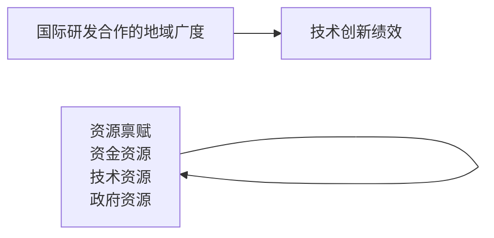

# 方式2：概念论证块

## 索引

| 编号 | 论文 | 内部关系主标签 |
|------|------|--------------|
| 例1 | 李雪松、党琳、赵宸宇（中国工业经济，2022） | `[递进]` |
| 例2 | 吴剑峰、杨震宁、邱永辉（管理学报，2015） | `[递进转折]` |
| 例3 | 李桂华、赵珊、王亚（软科学，2020） | `[并列概念论证]` |
| 例4 | 吕铁、贺俊（管理世界，2019） | `[转折对立]` |

---
**例1. 李雪松、党琳、赵宸宇（中国工业经济，2022）**

摘要］ 大力发展数字经济、推动数字化转型是加快建设制造强国的重大战略任务。更加主动地融入全球创新网络，推动全球科技创新协作，是提升中国科技创新能力的重大举措。本文构建了数字化转型促使企业融入全球创新网络进而提升创新绩效的理论分析框架，基于 — 年中国制造业上市公司数据，运用 两阶段模型，研究了数字化转型背景下，企业融入全球创新网络这一开放式创新行为对其创新绩效的影响。结果表明：企业的数字化转型促使其融入全球创新网络，企业的创新绩效也因此显著提升；拓宽海外子公司的分布广度有助于进一步释放企业融入全球创新网络对其创新绩效的提升效应；在创新资源相对薄弱的城市，融入全球创新网络对创新绩效的提升作用大于创新资源相对丰富的城市；分析师关注度正向调节融入全球创新网络对创新绩效的提升效应，供应链集中度、环境不确定性负向调节该提升效应。本文的研究为大力推进产业数字化转型、积极参与全球范围开放式创新活动、打造具有较强韧性及较高安全性的国际创新协作网络进而提升企业技术创新能力提供了经验证据。

［关键词］ 数字化转型； 开放式创新； 全球创新网络； 创新绩效

［中图分类号］F120 ［文献标识码］A ［文章编号］1006-480X（2022）10-0043-19

DOI:10.19581/j.cnki.ciejournal.2022.10.003

## 一、引言

党的二十大报告指出“扩大国际科技交流合作，加强国际化科研环境建设，形成具有全球竞争力的开放创新生态”。①在数字经济大发展的背景下，企业的头部化趋势明显加剧，实施更加开放包容、互惠共享的国际科技合作战略，更加主动融入全球创新网络，持续激发企业创新活力并不断提升创新绩效，也是加快发展现代产业体系、巩固壮大实体经济根基的重大任务。 年，世界知识产权组织WIPO发布的报告显示，进入 世纪以来，用于衡量全球创新网络的典型指标——国际共同发明已大幅扩展到中国、印度等新兴经济体。而来自 （科学引文索引扩展）的数据也表明，基于国际科学协作发表的科学论文从 年的 增长至 年的 。可见，无论是以发明专利衡量的技术产出，还是以科学论文出版衡量的科学产出，在过去 年间已表现出越来越明显的国际合作趋势。当前中国与发达国家之间的技术距离逐步缩小，加之经济全球化遭遇强势逆流，科技强国的建设要取得实质性进展，需要提升自身的原始性、突破性、颠覆性创新能力。然而，新一轮科技革命和产业变革突飞猛进的发展令科学研究的范式正在发生深刻变革，如今，科技创新的广度显著加大、速度显著加快、精度显著提高，自我封闭、自我隔绝式的创新模式必然是不可取的。尽管增强自主创新能力、实现高水平科技自立自强是坚持创新驱动发展战略的核心要义，但是进一步探索面向全球的开放式创新模式，形成自主创新与开放式创新有机互动格局，也是未来成功跻身创新型国家前列的重要前提。

本文基于 — 年制造业上市公司的年报信息、发明专利申请数据与海外投资数据，分别测算了 版中国证券监督管理委员会（简称证监会）行业分类标准统计的 个制造业行业样本期内数字化转型与创新绩效的行业平均水平，以及截至 年行业内融入全球创新网络企业的占比情况。图 展示了融入全球创新网络与创新绩效间的关系。可以发现，计算机、通信和其他电子设备制造业C39、电气机械及器材制造业C39、专用设备制造业C39、通用设备制造业（C35）、汽车制造业（C36）等技术密集型行业融入全球创新网络的企业占比均高于 ，创新绩效也处在相对领先的位置。基于上述测算结果形成的直观认识是，越是积极融入全球创新网络、主动参与国际科技协作的行业，其创新能力便越强。那么，是否可以说明，融入全球创新网络对制造业企业的创新绩效存在显著增益？

通过图 关于数字化转型与融入全球创新网络的描述可以发现，计算机、通信和其他电子设备制造业C39等数字化转型程度较高的行业，融入全球创新网络的占比也相对较高，二者大致呈正相关关系。数字经济的持续增长、数字化转型的广泛实施是当今科技创新活动所处的时代场景。一方面，数字化转型战略向纵深推进为企业破解融入全球创新网络的障碍性因素提供了契机。如何快速融入东道国的地方创新系统、如何提升海外研发创新网络的技术架构与其组织管理架构间的协同度决定了参与国际科技协作所能取得的创新成效。长期以来，一系列障碍性因素的掣肘令企业对外投资所能获取的创新收益不尽如人意，而数字经济所蕴含的开放式创新逻辑却在很大程度上改变了这一局面。另一方面，经济社会的数字化转型提供了开放式创新的新方式并倒逼企业加速融入全球创新网络。数字经济的高创新性、强渗透性、广覆盖性不仅构成了改造提升传统产业的支点，同时也促进了全球开放产业体系与全球创新网络的发展。数字技术的开源特性与产业开放彼此衔接、相互支撑，构建全产业链合作模式与无边界产业生态圈，日益成为数字时代全球分工体系的主流模式，而数字平台的模块化治理与分层模式则不断推动着全球范围内的开源创新。换言之，在数字经济迅猛发展的背景下，科技突破对全球创新网络的依赖显著增强。基于上述观察与理论探讨，在制造业企业层面，数字化转型的实施是否有助于企业加快融入全球创新网络的步伐也是本文较为关注的议题。

line

| Category | 创新绩效均值 (%) | 融入全球创新网络企业占比 (%) |
| :--- | :--- | :--- |
| C13 | ~1.6 | ~35 |
| C14 | ~1.6 | ~33 |
| C15 | ~1.0 | ~18 |
| C17 | ~1.3 | ~30 |
| C18 | ~1.0 | ~31 |
| C19 | ~0.9 | ~50 |
| C20 | ~1.4 | ~28 |
| C21 | ~1.8 | ~52 |
| C22 | ~1.5 | ~35 |
| C23 | ~1.7 | ~18 |
| C24 | ~1.4 | ~32 |
| C25 | ~1.4 | ~8 |
| C26 | ~1.9 | ~28 |
| C27 | ~1.9 | ~38 |
| C28 | ~1.6 | ~18 |
| C29 | ~2.0 | ~35 |
| C30 | ~1.3 | ~28 |
| C31 | ~2.6 | ~18 |
| C32 | ~1.9 | ~35 |
| C33 | ~2.1 | ~36 |
| C34 | ~2.3 | ~40 |
| C35 | ~2.5 | ~43 |
| C36 | ~2.5 | ~42 |
| C37 | ~2.5 | ~30 |
| C38 | ~2.5 | ~40 |
| C39 | ~2.7 | ~45 |
| C40 | ~2.4 | ~38 |
| C41 | ~1.5 | ~28 |
| C42 | ~2.7 | ~40 |

line

| Category | 数字化转型均值 (左轴) | 融入全球创新网络企业占比 (右轴) (%) |
| --- | --- | --- |
| C13 | ~0.26 | ~35 |
| C14 | ~0.26 | ~32 |
| C15 | ~0.25 | ~17 |
| C17 | ~0.24 | ~31 |
| C18 | ~0.37 | ~32 |
| C19 | ~0.32 | ~51 |
| C20 | ~0.24 | ~26 |
| C21 | ~0.52 | ~35 |
| C22 | ~0.24 | ~16 |
| C23 | ~0.35 | ~33 |
| C24 | ~0.39 | ~9 |
| C25 | ~0.19 | ~29 |
| C26 | ~0.21 | ~36 |
| C27 | ~0.21 | ~16 |
| C28 | ~0.20 | ~35 |
| C29 | ~0.25 | ~29 |
| C30 | ~0.21 | ~19 |
| C31 | ~0.22 | ~36 |
| C32 | ~0.18 | ~37 |
| C33 | ~0.28 | ~40 |
| C34 | ~0.31 | ~45 |
| C35 | ~0.36 | ~45 |
| C36 | ~0.28 | ~33 |
| C37 | ~0.28 | ~40 |
| C38 | ~0.36 | ~46 |
| C39 | ~0.38 | ~38 |
| C40 | ~0.48 | ~26 |
| C41 | ~0.25 | ~43 |
| C42 | ~0.26 | — |

本文的边际贡献和主要发现包括：①创新性地将数字化转型、融入全球创新网络及创新绩效纳入统一的逻辑体系。在理论维度，将企业是否融入全球创新网络视作基于成本收益分析的结果，探讨了数字化转型在成本、收益两个层面对该决策产生的影响。在方法维度，将上述核心变量置于Heckman两阶段模型框架内进行回归，有效地缓解了融入全球创新网络这一自选择行为带来的内生性问题，相应的回归结果具有较强的稳健性。②发现拓宽融入全球创新网络的广度可进一步释放企业融入全球创新网络对其创新绩效的提升效应，该结论再次凸显了逆全球化趋势抬头的背景下，要确保产业链供应链创新链安全，必须坚持实施更大规模、更宽领域、更深层次的对外开放。基于企业外部环境的异质性检验表明，在创新资源相对弱势地区，融入全球创新网络对企业创新绩效的提升效应明显更大，这一发现为分析国内创新网络与国际创新网络之间的互动机制打开了新的空间。④立足于科技、产业、金融良性循环以及经济环境波动和数字经济重塑产业链供应链等视角，发现分析师关注度正向调节企业融入全球创新网络对其创新绩效的提升效应，环境不确定性、供应链集中度负向调节该提升效应。相关结论为加倍释放参与全球科技协作、融入全球创新网络的创新驱动效应提供了理论依据和现实抓手。

## 二、文献综述与理论分析

## 1.开放式创新与融入全球创新网络

Chesbrough（2003）最早提出了开放式创新的概念，在这一概念框架内，外部知识、外部市场路径与内部知识、内部市场路径同等重要。单一的组织很难独立完成创新活动，取而代之的是与多样化的主体展开合作，通过不断拓展知识与能力的组合进而创造新的价值（ ， ）。在此情境下，创新不再是简单的原子式过程，而是协同合作的过程，是基于企业间持续合作所形成创新网络的过程（钱锡红等， ）。信息技术的飞速发展令企业面临日趋复杂的市场环境与技术环境，而外部环境不断加剧的不确定性令企业创新活动的持续性遭受巨大考验。技术升级加速、系统复杂性提升、新技术新产品研发费用不断攀升，同时，产品更新迭代速度越来越快，产品生命周期越来越短，各方面因素叠加导致研发活动的生产率呈下降趋势。换言之，企业独立开发新技术的难度正日益增加且难以持续（江小涓和孟丽君， ）。加之技术成果与核心人才外流、创业投资与风险投资兴起等创新市场“腐蚀”因素层出不穷，经典研发资源配置模型日渐式微，“封闭式创新”正在向“开放式创新”转变。开放式创新并非只是企业的无奈之举，同时也因打破了组织的内外边界而增强了创新水平、控制了研发风险（ ， ），带来了创新绩效的增长。Lichtenthaler（2011）将开放式创新划分为内向型和外向型两种模式。其中，在内向型模式下，企业从外部获取知识进而实现内部创新，通过弥补创新资源、提高研发进程、降低研发成本等途径有效促进了新产品绩效；外向型模式则是将内部知识输出至外部，并由外部组织进行应用与商业化的过程（ ， ）。

参与国际科技协作、融入全球创新网络是数字经济背景下，企业践行开放式创新理念的重要途径，也是典型的开放式创新行为。在国家和产业层面，它主要通过参与国际贸易和全球价值链的方式嵌入世界创新网络，而作为创新主体的企业，“走出去”是其参与国际科技创新协作的重要途径。大多数研究以企业的技术寻求型 OFDI 为切入点，探索了全球视野下不同维度的开放式创新行为对企业创新能力的影响（徐慧琳等， ；张文菲等， ；郑玮， ）。但是开放式创新已成为全球数字经济产业生态的重要组成，在全球范围匹配资源并寻求最佳解决方案是实现爆发式创新增长的重要途径。开放式创新是各种创新要素互动、整合、协同的动态过程，这要求企业与所有的利益相关者之间建立紧密联系，以实现创新要素在不同企业、个体之间的共享。从这个意义看，尽管资源寻求型、市场寻求型 的直接目的并非实现技术升级，但是从广泛链接全球要素资源的角度着眼，两者均存在不同程度的开放式创新属性。同时，基于全球价值链下的国际分工趋势看，数字技术的迭代式演进加速推进了复杂技术产品、服务业以及创新活动的全球分工，多国多企业需要合作协同，集成全球最高水平完成产品的研发与制造（江小涓和孟丽君，2021）。可以说，在全球创新网络的尺度与格局下，企业的投资、出口、采购、销售等活动遍及世界各地，并通过与海外主体的创新合作搭建起全球性的创新网络（杨震宁等，2021）。

## 2.融入全球创新网络与创新绩效提升

较之国内创新网络，全球创新网络的弱关系属性，更有助于企业获取异质性、多样化的新知识和新资源，保持知识的新鲜度与广度，增强创新的灵活性。对外投资不仅可以帮助企业获取国外先进的科技资源、提升创新效率，同时也是其拓展潜在市场、响应海外客户需求、提升产品国际竞争力的重要途径，并为其构建合作关系、整合各方资源，进而实现开放式创新奠定基础。

资源基础观、社会网络理论、组织学习理论有助于解释融入全球创新网络对于企业创新绩效的影响机理。 基于资源基础观的视角，企业可从两个方面获取知识。通过知识管理吸收、整合并扩散来自内部的知识从而创造出企业专有的知识。通过构建关系资产、知识分享路径以及有效的关系治理机制获取外部知识（王展硕和谢伟， ）。国际化战略为企业获取东道国差异化、多元化的新知识创造了条件，并使其接触到更为广泛的市场及用户需求信息，明确创新方向，帮助其提升在开放式创新网络中的吸引力与议价能力（郑玮， ）。 社会嵌入理论认为，海外子公司以外部嵌入的形式融入东道国的社会网络，并由此获取大量的异质性资源（ ， ），对这些资源的整合与配置进一步提高了企业的创新能力，并促进了价值创造、提升了跨国公司整体的竞争优势。同时，跨境经营也使企业接触到不同的创新环境和竞争对手，熟悉了不同创新环境下的企业成长之路，从而便于跨国企业掌握海外地区的创新路径，为其自身创新系统的形成与完善创造便利（黄远浙等， ）。 在组织学习理论的视域下，一方面，国际化经验提升了企业对于外部机会的敏感度以及对潜在合伙伙伴与创新方向的洞察力，并因此降低了合作创新中的搜索成本、试错成本（郑玮，），有效地控制了创新风险；另一方面，实施国际化战略的企业需要面对海外复杂的制度环境、市场环境，必须不断提升自身的创新成果转化能力从而确保其创新收益不受损失（Wu et al.，2016）。

从实践层面看，发达经济体与新兴经济体企业的研发国际化战略存在显著差异，优势利用论、优势寻求论是两者各自在对外投资活动中实现技术进步的理论依据。发达国家的跨国企业占据技术层面的优势地位，从东道国市场条件出发配置资源，以自身现有技术为基础开发新知识是其研发国际化的重要目标。而来自新兴经济体的跨国企业则处于技术劣势，充分发挥“技术逆向溢出效应”，拓宽新知识获取渠道进而实现赶超是其国际化战略的实施动机（Luo and Tung，2007）。

在上述理论分析基础上，一些实证研究多以企业的技术寻求型 为突破口，通过构建研发国际化、国际化程度、跨国并购等指标，探讨了国际化视野下的开放式创新行为对企业创新能力的影响。郑玮（2020）以中国的制造业上市公司为分析对象，证实了国际化程度对企业合作创新能力的提升作用。张文菲等（2016）基于中国上市公司面板数据，考察了跨国并购、市场化进程与企业创新之间的关系，发现跨国并购显著促进了企业创新能力的提升。徐慧琳等（2019）构建了“外部资源 内部能力”分析框架，发现跨国并购这一开放式创新行为不仅提高了企业的创新投入和产出水平，同时也促进了企业创新质量的提升。

## 3.融入全球创新网络的成本效应

日益激烈的市场竞争与日益缩短的产品更新周期促使跨国公司不断淡化以其母国为研发创新服务基地的概念，更加主动地融入全球创新网络是在开放合作中提升自身科技创新能力的重要选择。对后发企业而言尤为如此，通过融入全球研发网络进而获取分散在全球各地的异质性研发创新要素是实现创新追赶的有效途径。但是，研发国际化并非是一个“免费”的过程（王晓燕等，），企业在享受国际创新协作红利的同时，也面临着多重挑战。

高效融入东道国的地方创新系统是充分发挥国际创新协作潜在效能的前提，但这一过程存在较多障碍。来自语言交流、市场熟悉度等方面的困难限制了有效知识的寻求、整合及转移（Castellani et al.，2013），更高的研发国际化强度也加剧了跨国公司所面临的外来者劣势，使其创新过程暴露于显著的环境不确定性及风险当中（Hsu et al.，2015）。研发国际化广度的持续增加还会令企业研发活动的规模经济和范围经济效应有所减弱，对于新兴经济体企业的技术寻求型研发行为更是如此。同时，日益动荡的全球市场环境又进一步提高了国际化企业对环境变化的预测及控制难度，从而对其市场适应性提出了更高的要求。

海外研发创新网络的技术架构与其组织管理架构间的协同度欠佳，阻碍了知识的整合及逆向转移，进而不利于异质性创新要素价值的充分释放。随着研发国际化广度的增加，不同东道国之间的地理文化制度差异增加了海外研发单元间的知识转移互动难度，加大了人才、商品、信息等维度的资源调配困难，加之母公司为统筹海外研发机构所产生的协调、沟通、监督成本，重复的研发投入与资源浪费在所难免，因此，组织的无效率活动将对企业创新造成不利影响。而且，置身于全球创新网络的企业还存在对外部知识“过度搜索”的可能性，即便企业具有有效识别并获取差异化创新资源的能力，整合差异化专业知识的过程也将带来较高的复杂性及创新结果的不确定性（Katila and Ahuja，2002）。

## 4.数字化转型、融入全球创新网络与创新绩效提升

企业家作为理性经济人，往往在成本收益分析的基础上，预测不同备选方案的实施效果，并根据某种价值标准在所有备选方案中做出最优选择。是否融入全球创新网络作为一项事关企业长远发展的重要战略选择，同样也是基于成本收益分析所产生的结果。基于收益的角度，资源基础观、社会网络理论、组织学习理论解释了企业融入全球创新网络这项决策对创新绩效的提升效应。但是，主动融入全球创新网络的企业在享受创新绩效提升效应的同时，也面临着一系列不容忽视的成本因素。这些因素的存在，令融入全球创新网络这一开放式创新行为并非必然带来企业创新绩效的增长，不少实证研究也证实了这一点。而已有文献往往忽视了融入全球创新网络决策的内生性和选择偏差问题，一旦预期成本高于收益，企业则很可能放弃“走出去”的尝试。

本文认为，促使上述现象发生改变的一个重要因素在于数字化转型浪潮的到来。数字化环境的无边界性、互联性与不确定性凸显了开放式创新的巨大价值。企业在融入全球创新网络的过程中所面临的一系列障碍性因素在数字经济迅猛发展、数字化转型持续深化的进程中得以有效化解。同时，在数字化转型加速赋能制造业发展的过程中，融入全球创新网络对创新绩效的提升效应也将加倍释放。可以说，在数字化转型、融入全球创新网络及创新绩效所构成的逻辑体系内，后两者间的互动关系因为数字化转型变量的引入，将发生深刻的变化。

数字化转型缓解了企业融入全球创新网络的成本效应。一是数字技术的广泛应用提升了跨国公司全球研发创新网络在东道国地方创新系统间的协同度，缓解了外来者劣势。企业国际化知识的欠缺是其海外子公司难以接近甚至占据网络核心的重要原因，而国际化经验可以通过不断向合作伙伴及竞争对手学习、加速自我更新与迭代进行弥补，数字化转型战略的实施则有助于提升组织学习的效率。随着企业对东道国创新体系熟悉程度的不断加深，其嵌入性也在持续提升，在此过程中，海外研发活动所产生的收益可能会覆盖外来者劣势所产生的成本（王展硕和谢伟，2018）。二是数字技术在一定程度上弥补了跨国公司全球研发网络投资空间组织跨国界的产业技术架构与其组织管理架构的协同性缺失。

---

---
> 1.概念：Chesbrough(2003)→Dahlander&Gann(2010)→Lichtenthaler(2008,2011)→钱锡红(2010)→杨震宁(2021)
>   [内部关系：递进。概念从提出→分类→操作化→中国情境，层层细化]
> 2.收益：三个理论视角
>   └ 资源基础观：王展硕(2018)/郑玮(2020)
>   └ 社会嵌入：Andersson(2005)/黄远浙(2021)
>   └ 组织学习：郑玮(2020)/Wu(2016)
>   [内部关系：并列概念论证。三个理论各自独立为收益机制提供解释]
> 3.成本：外来者劣势(Castellani2013/Hsu2015) + 过度搜索(Katila&Ahuja2002) + 王晓燕(2017)
>   [内部关系：并列列举。多个维度的成本独立存在]
> 4.数字化转型：缓解成本+强化必要性
>   [内部关系：递进。前段建立了收益/成本矛盾，本段引入数字转型作为化解方案]
> 收束：两个假说——数字化转型促使融入全球网络、提升创新绩效

1.开放式创新与融入全球创新网络。Chesbrough（2003）最早提出了开放式创新的概念，在这一概念框架内，外部知识、外部市场路径与内部知识、内部市场路径同等重要。单一的组织很难独立完成创新活动，取而代之的是与多样化的主体展开合作，通过不断拓展知识与能力的组合进而创造新的价值（Dahlander and Gann，2010）。在此情境下，创新不再是简单的原子式过程，而是协同合作的过程，是基于企业间持续合作所形成创新网络的过程（钱锡红等，2010）。信息技术的飞速发展令企业面临日趋复杂的市场环境与技术环境，而外部环境不断加剧的不确定性令企业创新活动的持续性遭受巨大考验。技术升级加速、系统复杂性提升、新技术新产品研发费用不断攀升，同时，产品更新迭代速度越来越快，产品生命周期越来越短，各方面因素叠加导致研发活动的生产率呈下降趋势。换言之，企业独立开发新技术的难度正日益增加且难以持续（江小涓和孟丽君，2021）。加之技术成果与核心人才外流、创业投资与风险投资兴起等创新市场"腐蚀"因素层出不穷，经典研发资源配置模型日渐式微，"封闭式创新"正在向"开放式创新"转变。开放式创新并非只是企业的无奈之举，同时也因打破了组织的内外边界而增强了创新水平、控制了研发风险（Lichtenthaler，2008），带来了创新绩效的增长。Lichtenthaler（2011）将开放式创新划分为内向型和外向型两种模式。其中，在内向型模式下，企业从外部获取知识进而实现内部创新，通过弥补创新资源、提高研发进程、降低研发成本等途径有效促进了新产品绩效；外向型模式则是将内部知识输出至外部，并由外部组织进行应用与商业化的过程（Dahlander and Gann，2010）。参与国际科技协作、融入全球创新网络是数字经济背景下，企业践行开放式创新理念的重要途径，也是典型的开放式创新行为。在国家和产业层面，它主要通过参与国际贸易和全球价值链的方式嵌入世界创新网络，而作为创新主体的企业，"走出去"是其参与国际科技创新协作的重要途径。大多数研究以企业的技术寻求型OFDI为切入点，探索了全球视野下不同维度的开放式创新行为对企业创新能力的影响（徐慧琳等，2019；张文菲等，2020；郑玮，2020）。但是开放式创新已成为全球数字经济产业生态的重要组成，在全球范围匹配资源并寻求最佳解决方案是实现爆发式创新增长的重要途径。开放式创新是各种创新要素互动、整合、协同的动态过程，这要求企业与所有的利益相关者之间建立紧密联系，以实现创新要素在不同企业、个体之间的共享。从这个意义看，尽管资源寻求型、市场寻求型OFDI的直接目的并非实现技术升级，但是从广泛链接全球要素资源的角度着眼，两者均存在不同程度的开放式创新属性。同时，基于全球价值链下的国际分工趋势看，数字技术的迭代式演进加速推进了复杂技术产品、服务业以及创新活动的全球分工，多国多企业需要合作协同，集成全球最高水平完成产品的研发与制造（江小涓和孟丽君，2021）。可以说，在全球创新网络的尺度与格局下，企业的投资、出口、采购、销售等活动遍及世界各地，并通过与海外主体的创新合作搭建起全球性的创新网络（杨震宁等，2021）。

2.`[->递进]` 融入全球创新网络与创新绩效提升。较之国内创新网络，全球创新网络的弱关系属性，更有助于企业获取异质性、多样化的新知识和新资源，保持知识的新鲜度与广度，增强创新的灵活性。对外投资不仅可以帮助企业获取国外先进的科技资源、提升创新效率，同时也是其拓展潜在市场、响应海外客户需求、提升产品国际竞争力的重要途径，并为其构建合作关系、整合各方资源，进而实现开放式创新奠定基础。资源基础观、社会网络理论、组织学习理论有助于解释融入全球创新网络对于企业创新绩效的影响机理。①基于资源基础观的视角，企业可从两个方面获取知识。通过知识管理吸收、整合并扩散来自内部的知识从而创造出企业专有的知识。通过构建关系资产、知识分享路径以及有效的关系治理机制获取外部知识（王展硕和谢伟，2018）。国际化战略为企业获取东道国差异化、多元化的新知识创造了条件，并使其接触到更为广泛的市场及用户需求信息，明确创新方向，帮助其提升在开放式创新网络中的吸引力与议价能力（郑玮，2020）。②社会嵌入理论认为，海外子公司以外部嵌入的形式融入东道国的社会网络，并由此获取大量的异质性资源（Andersson et al.，2005），对这些资源的整合与配置进一步提高了企业的创新能力，并促进了价值创造、提升了跨国公司整体的竞争优势。同时，跨境经营也使企业接触到不同的创新环境和竞争对手，熟悉了不同创新环境下的企业成长之路，从而便于跨国企业掌握海外地区的创新路径，为其自身创新系统的形成与完善创造便利（黄远浙等，2021）。③在组织学习理论的视域下，一方面，国际化经验提升了企业对于外部机会的敏感度以及对潜在合伙伙伴与创新方向的洞察力，并因此降低了合作创新中的搜索成本、试错成本（郑玮，2020），有效地控制了创新风险；另一方面，实施国际化战略的企业需要面对海外复杂的制度环境、市场环境，必须不断提升自身的创新成果转化能力从而确保其创新收益不受损失（Wu et al.，2016）。从实践层面看，发达经济体与新兴经济体企业的研发国际化战略存在显著差异，优势利用论、优势寻求论是两者各自在对外投资活动中实现技术进步的理论依据。发达国家的跨国企业占据技术层面的优势地位，从东道国市场条件出发配置资源，以自身现有技术为基础开发新知识是其研发国际化的重要目标。而来自新兴经济体的跨国企业则处于技术劣势，充分发挥"技术逆向溢出效应"，拓宽新知识获取渠道进而实现赶超是其国际化战略的实施动机（Luo and Tung，2007）。

3.`[->递进]` 融入全球创新网络的成本效应。日益激烈的市场竞争与日益缩短的产品更新周期促使跨国公司不断淡化以其母国为研发创新服务基地的概念，更加主动地融入全球创新网络是在开放合作中提升自身科技创新能力的重要选择。对后发企业而言尤为如此，通过融入全球研发网络进而获取分散在全球各地的异质性研发创新要素是实现创新追赶的有效途径。但是，研发国际化并非是一个"免费"的过程（王晓燕等，2017），企业在享受国际创新协作红利的同时，也面临着多重挑战。高效融入东道国的地方创新系统是充分发挥国际创新协作潜在效能的前提，但这一过程存在较多障碍。来自语言交流、市场熟悉度等方面的困难限制了有效知识的寻求、整合及转移（Castellani et al.，2013），更高的研发国际化强度也加剧了跨国公司所面临的外来者劣势，使其创新过程暴露于显著的环境不确定性及风险当中（Hsu et al.，2015）。研发国际化广度的持续增加还会令企业研发活动的规模经济和范围经济效应有所减弱，对于新兴经济体企业的技术寻求型研发行为更是如此。同时，日益动荡的全球市场环境又进一步提高了国际化企业对环境变化的预测及控制难度，从而对其市场适应性提出了更高的要求。海外研发创新网络的技术架构与其组织管理架构间的协同度欠佳，阻碍了知识的整合及逆向转移，进而不利于异质性创新要素价值的充分释放。随着研发国际化广度的增加，不同东道国之间的地理文化制度差异增加了海外研发单元间的知识转移互动难度，加大了人才、商品、信息等维度的资源调配困难，加之母公司为统筹海外研发机构所产生的协调、沟通、监督成本，重复的研发投入与资源浪费在所难免，因此，组织的无效率活动将对企业创新造成不利影响。而且，置身于全球创新网络的企业还存在对外部知识"过度搜索"的可能性，即便企业具有有效识别并获取差异化创新资源的能力，整合差异化专业知识的过程也将带来较高的复杂性及创新结果的不确定性（Katila and Ahuja，2002）。

4.`[->递进]` 数字化转型、融入全球创新网络与创新绩效提升。企业家作为理性经济人，往往在成本收益分析的基础上，预测不同备选方案的实施效果，并根据某种价值标准在所有备选方案中做出最优选择。是否融入全球创新网络作为一项事关企业长远发展的重要战略选择，同样也是基于成本收益分析所产生的结果。基于收益的角度，资源基础观、社会网络理论、组织学习理论解释了企业融入全球创新网络这项决策对创新绩效的提升效应。但是，主动融入全球创新网络的企业在享受创新绩效提升效应的同时，也面临着一系列不容忽视的成本因素。这些因素的存在，令融入全球创新网络这一开放式创新行为并非必然带来企业创新绩效的增长，不少实证研究也证实了这一点。而已有文献往往忽视了融入全球创新网络决策的内生性和选择偏差问题，一旦预期成本高于收益，企业则很可能放弃"走出去"的尝试。本文认为，促使上述现象发生改变的一个重要因素在于数字化转型浪潮的到来。数字化环境的无边界性、互联性与不确定性凸显了开放式创新的巨大价值。企业在融入全球创新网络的过程中所面临的一系列障碍性因素在数字经济迅猛发展、数字化转型持续深化的进程中得以有效化解。同时，在数字化转型加速赋能制造业发展的过程中，融入全球创新网络对创新绩效的提升效应也将加倍释放。可以说，在数字化转型、融入全球创新网络及创新绩效所构成的逻辑体系内，后两者间的互动关系因为数字化转型变量的引入，将发生深刻的变化。数字化转型缓解了企业融入全球创新网络的成本效应。一是数字技术的广泛应用提升了跨国公司全球研发创新网络在东道国地方创新系统间的协同度，缓解了外来者劣势。企业国际化知识的欠缺是其海外子公司难以接近甚至占据网络核心的重要原因，而国际化经验可以通过不断向合作伙伴及竞争对手学习、加速自我更新与迭代进行弥补，数字化转型战略的实施则有助于提升组织学习的效率。随着企业对东道国创新体系熟悉程度的不断加深，其嵌入性也在持续提升，在此过程中，海外研发活动所产生的收益可能会覆盖外来者劣势所产生的成本（王展硕和谢伟，2018）。二是数字技术在一定程度上弥补了跨国公司全球研发网络投资空间组织跨国界的产业技术架构与其组织管理架构的协同性缺失。基于信息技术所建立的正式和非正式沟通机制使海外研发机构与母公司、各海外研发机构之间的沟通效率得以提升（Rabbiosi and Santangelo，2013）。数字技术通过克服空间、资源限制，强化了创新参与者之间的连通性，提高了创新资源的使用效率，令传统理论框架下的重复投入与资源浪费问题趋于缓解。同时，在数字技术重构全球产业链的过程中，数字化模块使复杂技术相对标准化，降低了复杂产品进行全球分工的难度及成本，而且，数字化模块的出现还便于企业分解设计、生产、装配、销售等任务，并借助高效的数字网络有效连接、同步迭代各个分散的部分（江小涓和孟丽君，2021）。数字化转型强化了企业融入全球创新网络的必要性。立足于数字经济时代，融入全球创新网络对创新绩效的提升效应不再局限于"技术逆向溢出效应"。"走出去"促使企业接触到不同市场的消费者，洞悉多样化的需求信息（黄远浙等，2021）。在数字技术持续赋能生产运营环节的当下，生产、分配、流通、消费各个环节实现了高效贯通，并且沉淀了海量的数据要素，而这些来自海外的消费需求偏好等信息则恰恰构成了企业研发创新活动的异质性资源，对其建立敏捷甚至柔性的供应链创造了必要前提，是提升企业创新能力的重要源泉。同时，数字经济的发展、数字化转型战略的实施也提供了开放式创新的新方式并倒逼企业加速融入全球创新网络。ICT的迅速发展令来自不同地区的专家突破空间限制、实时共享研发进程成为可能（江小涓和孟丽君，2021），创新能力开始大规模地跨国界转移。加之数字平台渐成全球价值链重构的核心驱动力，数字平台的模块化治理和分层模式呼唤全球范围内的开源创新。而数字化情境则强化了企业在创新网络中的弱连接状态，为获取多样化、异质性的创新资源，企业必须与不同主体深化创新合作，构建高效的创新网络平台，从而抵御外部竞争压力并持续巩固自身的竞争优势。因此，基于对中国问题的认识与理论文献的梳理，本文提出H1：数字化转型战略的实施促使企业融入全球创新网络。H2：数字化转型背景下，企业融入全球创新网络有助于提升其创新绩效。

**例2. 吴剑峰、杨震宁、邱永辉（管理学报，2015）**

摘要 ： 基于开放式创新理论 将组织边界跨越与地域边界跨越相结合 探讨企业国际研发合作的地域广度 资源禀赋与技术创新绩效三者之间的关系 以中国电子设备制造企业为研究对象进行实证分析 研究发现 企业国际研发合作的地域广度与技术创新绩效之间存在倒U型关系；企业的资金资源和技术资源会正向调节国际研发合作的地域广度与技术创新绩效之间的关系。

关键词 ： 国际研发合作； 地域广度； 资源禀赋； 技术创新绩效

中图法分类号 ： C93 文献标志码 ： A 文章编号 ： 1672－884X（2015）10－1487－09

# AStudyontheRelationshipbetweenGeographicScopeofInternationalR＆DCooperation， ResourceEndowments， andTechnologicalInnovationPerformance

WUJianfeng1 YANGZhenning1 QIUYonghui2

（1．UniversityofInternationalBusiness＆ Economics， Beijing， China；

2．ChineseAcademyofSocialScience， Beijing， China）

Abstract： Relyingonopeninnovationasthetheoreticalfoundation， thisstudyintegratesorgani－ zationalboundary－spanningandgeographicboundary－spanning， andexplorestherelationshipamong geographicscopeofinternationalR＆Dcooperation， resourceendowments， andtechnologicalinnova－ tionperformance．ThesamplewascollectedfromChineseelectronicsequipmentmanufactures．Em－ piricalresultsshowthat（1）thereisaninverted－Ushaperelationshipbetweengeographicscopeofin－ ternationalR＆Dcooperationandtechnologicalinnovationperformance； and （2） financialresources andtechnologicalstockpositivelymoderatetherelationshipbetweengeographicscopeandinnovation performance

Keywords：internationalR＆Dcooperation； geographicscope； resourceendowment； technologi－calinnovationperformance

在过去的20年中 国际研发合作呈现显著上升趋势 一方面 新产品开发和技术创新的复杂性日益增加 很多情况下单个企业的资源和能力有限 难以独自承担技术研发的风险和成本 另一方面 全球化竞争日益加剧 企业需要通过国际研发合作来更好地适应海外市场需求 提升全球竞争力

来自新兴市场国家的跨国企业更加重视国际研发合作 ，以期能够在不久的未来赶超世界领先的竞争对手［1］ 从本质上讲 国际研发合作属于一种开放式创新 即利用外部的机构和信息来源以帮助企业进行创新［2～4］

开放式创新要求企业打破传统约束 跨越既有边界 从外部吸收信息和资源 已有研究探讨了合作伙伴的地理分布对创新绩效的影响［5］ 但是现有研究尚未回答两个问题 ①国际研发合作的地域广度与创新绩效之间的关系如何？②这一关系在多大程度上受到企业资源禀赋的影响？本研究拟针对上述两个问题 ， 以开放式创新和资源基础理论为依据 以中国电子设备制造企业为研究对象 ， 来分析国际研发合作的地域广度 企业资源禀赋 企业技术创新绩效三者之间的互动关系

## 1 文献回顾与研究假设

## 1．1 国际研发合作的地域广度与技术创新绩效

CHESBROUGH［2］ 提出开放式创新模型认为随着技术变革的速度加快 ， 全球竞争的激烈程度加剧 企业如果单纯地依赖内部研发部门反而不利于产品和技术创新 ，其研究表明 ，企业内部研发支出的收益正呈现下降趋势 ；相反 ，越来越多的企业开始和外部的供应商 竞争对手 客户 大学 独立研发机构进行合作 通过跨越组织边界的知识搜寻和整合以更有效地进行技术和产品创新

AHUJA等［6］ 指出 不同的地域之间会存在很大的差异 这既包括企业层面的差异（如用户的需求 制造流程 原材料的可获得性等） ，也包括宏观层面 的 文 化、行政体系和制度方面的差异。 这就需要企业针对各地的具体情况展开相应的研究 ，以推出适应当地用户需求的产品和服务 换言之 不同地域的企业会形成其特定的知识体系和产品特点 SIDHU等［7］ 认为通过跨越地域边界的技术探索 企业可以整合多个地区的知识网络，从而提高自己的创新绩效

国际研发合作属于一种典型的开放式创新 它要求企业同时跨越组织边界和地域边界现有研究表明 国际研发合作有助于提升企业的创新绩效和股东价值 ： ①研发伙伴的地域分布越广 ，其接触到的合作伙伴的知识异质性程度就越高 ，因为每一个国家的制度环境 生活习惯 行为准则都会有所差异 从知识基础论的角度来看 ，异质性知识越多 ， 进行知识整合 实现突破性创新的概率越大。 AMARA等［8］将制造企业研发的信息来源分为四大类 内部信息市场信息 科研信息和通用信息 他们发现 ，当制造企业的信息来源的种类越多 尤其是研发领域的信息来源种类越多时 企业的技术创新能力越强 ②国际研发合作的地域分布越广企业越有可能学习各个地区最先进的知识和技术 分享世界各地的创新经验和教训 从而提升自己的创新效率 ③企业国际研发合作在很大程度上是为了适应东道国顾客的需求和偏好 ，因此国际研发伙伴的地域分布越广 企业面对的顾客需求的多样化程度越高 就越有可能推出新技术和新产品

实证研究表明 国际研发合作确实能够帮助企业提升自身价值。 ANNAND等［9］ 发现 ，一般的企业合作并不能显著地创造股东价值 ， 但是研发合作却能产生正向的价值创造 MER－CHANT等［10］ 将研发合作的探讨拓展至国际合资企业 ，认为成立以研发合作为主要目标的国际合资企业能够为股东价值带来正向效应

国际研发合作带来的股东价值提升主要是通过提高企业的创新绩效来实现的 现有研究分别从竞争对手、客户、供应商等不同合作对象出发 ，来探讨国际研发合作与技术创新绩效之间的关系［11］ 。 AHUJA［12］运用社会网络理论和方法研究了全球化学行业竞争对手之间的研发合作 研究发现企业与同行之间的合作越多 其创新绩效越显著 这一现象背后存在3个基本原因 ： ①每个企业都拥有自身独特的知识库 合作伙伴之间可以实现知识共享 ； ②每个企业都拥有自身的研发技能 通过互相交流和互相学习 可以实现技能互补 ③技术合作能够提升研发的规模效益 ， 因为大型的研发项目通常能够创造更多 的 新 知 识。 LAVIE等［13］ 从 顾 客 的 角度出发 指出与海外的客户进行研发合作能够促进新产品创新 因为企业需要不断地根据海外顾客的需求来改进产品 ； 而与国外的供应商进行研发合作同样有助于提升企业的创新绩效 因为企业可以从供应商那里获取新技术和新资源 国内学者的实证研究也在很大程度上支持开放式创新有助于提升创新绩效这一观点闫春等［14］ 通过问卷调查发现 企业的创新开放度会影响到企业的创新导向 继而会影响企业的创新绩效 陈钰芬等［15］ 将开放度分为开发的广度和深度，研究发现我国企业总体的技术开发程度比较低 但是如果企业技术创新过程向外部组织开放的话，将有助于企业提高创新绩效

本研究认为 国际研发合作是一项非常复杂的跨国界 跨文化 跨组织的活动 由此 当企业的国际研发伙伴的地域分布过于广泛时其面临的风险和负面作用也会相应地凸显出来 ①空间距离会导致企业研发部门之间存在人际交流和隐形知识转移的障碍 研究表明随着空间距离的增加 两个研发部门之间的沟通会显著减少 现代信息技术的进步和普及在一定程度上缓解了沟通问题 但是空间距离带来的研发负面效应仍然存在 ②研发合作的地域分布太广容易导致企业管理层的注意力分散 注意力基础理论认为 管理者的注意力是一种珍贵的资源 管理者能否有效地将注意力集中在有限的重要领域 并能够合理地分配自己的注 意 力 资 源 ， 将直接关系到企业的成败。如果一个企业同时和多个国家的企业或机构进行研发合作 ，其资源和精力可能过于分散 ，反而不利于知识的整合和创新绩效的提升 ③制度距离障碍会导致研发的协调和管理成本上升每个国家都有其特定的文化 价值观和研发制度 企业如果在多个国家从事研发合作 就必须去适应不同的制度环境 其面临的研发风险也会相应提升

现有研究表明 ，企业在从事技术创新时 ，如果技术边界的跨度过大 ， 或者组织边界的跨度过大 反而会对企业的创新绩效产生负面影响KATILA等［16］ 指 出 ， 企业在进行新产品开发时 如果跨越的技术领域过于宽泛 会导致企业的可靠性下降 ， 因为这时候企业自身的经验和能力不足以应对新技术领域的挑战 LAURS－EN等［17］ 识别出16种可能的组织外部信息和知识的来源 ，并将这16种来源分为四大类 ： 市场类、机构类、专业类和其他类。 在此基础上 ，他们对英国的制造企业进行了数据收集和统计分析 研究发现跨越组织边界的搜索广度与企业的创新绩效之间确实存在倒 U 型关系 本研究认为上述逻辑同样适用于地域边界 ，由此 ，提出如下假设 ：

假设1 国际研发合作的地域广度与企业技术创新绩效之间存在倒 U型关系

## 1．2 资源禀赋的调节作用

假设1主要从知识基础理论和开放式创新的角度出发 来探讨国际研发合作的地域广度与企业技术创新绩效之间的关系，但是每个企业所拥有的资源禀赋是不同的 资源基础理论认为，企业相互之间的差异主要体现在内部资源的异质性上 而且有些资源具有相对粘性 是不可模仿的或者是不可替代的 由此 企业资源禀赋的不同会影响到其国际研发合作的成功

研发投资通常被视为一项高投入 高风险的活动 离不开企业资金的支持 管理学者为此提出了组织冗余这一构念 将其定义为组织所拥有的资源与组织维持运作所必需资源之间的差值［18］ 组织冗余包括3个基本维度 已吸收冗余资源 未吸收冗余资源和潜在冗余资源其中后两者都在一定程度上反映了企业资金资源的富裕程度 现有研究认为 ， 企业的资金资源越富裕 其技术创新的投入强度和产出绩效越高［19］ ①当资金充裕时 公司管理层更愿意将资源向风险较高的研发项目倾斜 提高企业的研发强度 ②在资金充裕的情况下 公司管理层对不确定性研发项目的绩效管控会相对放松 ，这样研发部门可以进行更多的探索性搜寻 ， 从而带来更多的突破性创新 ； ③资金充裕可以形成缓冲效应 ，即当高风险的研发项目未取得预期成果时 ，资金冗余能够在短期内保证企业的正常运作和预期绩效 不会影响到公司管理层的绩效和薪酬 这有助于提高公司管理层对风险的容忍程度

当企业跨越地域边界开始进行国际研发合作时 ，企业管理层将面临更多的技术风险 政治风险和文化风险 在这种情况下 ， 资金资源对技术创新的支持作用将更加明显 当企业的资金资源非常有限时 ， 跨地域的研发合作会进一步分散有限的资金 ； 地域广度越大 资金越分散 将导致单个研发项目得不到充分的资金支持 国际研发合作的沟通 协调 管理成本必然会显著增加 ，这会进一步挑战企业有限的资金更糟糕的情况是 一旦某个国际研发合作项目失败 ，企业有限的资金无法提供缓冲效应 ，结果就可能导致连锁反应 ， 影响整个企业的创新绩效和经营业 绩。 相 反 ， 上述风险在资金资源富裕的情况下都可以得到很好的缓解 基于此提出如下假设 ：

假设2 企业的资金资源会对国际研发合作的地域广度与企业技术创新绩效之间的关系起到正向的调节作用

知识基础理论认为 企业之间的差异性体现在各自知识库的不同上 知识库的规模 广度 深度和独特性直接影响到企业能否获得可持续的竞争优势［20］ 依据这一理论，企业技术资源与其创新绩效之间应该存在着正相关关系 企业的技术资源越多，说明其知识库中的知识元素的数量越多 那么其进行整合创新的概率越大

当企业跨越地域边界开始进行国际研发合作时 已有技术资源对技术创新的支持作用将更加明显 ： ①当企业自身的技术资源非常有限时 企业的知识消化和吸收能力一般都比较弱这时候如果国际研发合作的地域广度过大 ， 接触的信息和知识量太多 企业会处于知识体系紊乱状态 ， 丧失技术创新的战略方向［3］ ②从注意力理论来看 ，在国际研发合作中 ，自身技术资源有限的企业的注意力一般放在外部知识的吸收上 ，而技术资源比较充裕的企业会将注意力放在外部知识的整合创新上 由此 当技术资源比较有限时 过多的跨地域研发合作虽然会有助于企业学习新知识和新技术 但是对于技术创新来说反而会产生负面作用 ③技术资源有限的企业在寻求国际战略伙伴时会存在一定的缺陷 ，很难和技术领先的企业形成战略联盟 ：一方面 技术领先的企业会考虑到合法性问题 ，不会优先选择技术相对落后的企业作为战略伙伴 ；另一方面 如果合作伙伴的技术差距过大 ，双方难以获得共赢 ，只能形成单向的知识输出 反而不利于合作创新 相反 当企业的自身技术资源非常 充 裕 时 ， 上述问题都可以得到很好的解决 基于此 ，提出如下假设 ：

假设3 企业的技术资源会对国际研发合作的地域广度与企业技术创新绩效之间的关系起到正向的调节作用

政府支持是一项重要的制度资源［21］ 。 它反映了企业在经营过程中获得的各种行政资源包括税收优惠 政府补贴 土地出让等 这种政府支持对新兴市场经济体内的企业尤为重要 ，因为在这种环境下 政府仍然掌握着大量的行政资源 ，在资源配置方面扮演着重要角色。 当企业进行跨国界的研发合作时 ， 这种政府资源就会发挥非常重要的作用 ： ①对于新兴市场企业来说 政府资源代表着合法性 政府的支持意味着资源的倾斜和政策的偏好 这就保证了国际研发合作中所需要的资金 人才 技术 税收等需求 ②国际研发合作涉及多国的相关利益者 ，因利益分配导致的冲突问题难以避免 ；如果企业背后有强大的政府支持 ， 这将在一定程度上有助于问题的解决 ③政府的支持会帮助企业寻找到更多技术领先的国际合作伙伴 从而提升企业的技术创新绩效

虽然大多数研究认为政府支持会对企业创新起到积极的作用 但是也有学者认为政府支持会导致企业过多地依赖政府资源 反而忽视了内部资源的分配和核心竞争力的培育 不利于其提高技术创新绩效［22］ 本研究认为 在国际研发合作中 政府支持的积极作用应该大于其消极作用 ，由此 ，提出如下假设 ：

假设4 企业的政府资源会对国际研发合作的地域广度与企业技术创新绩效之间的关系起到正向的调节作用

本研究的理论模型见

flowchart

## 2 研究设计

## 2．1 样本与数据

本研究的问卷样本来 自 国家统 计 局于2009年10月～2011年8月间在全国40个城市针对制造业企业进行的跟踪调查数据库 在发放正式的大规模调查问卷之前 ， 首先进行了预测试 ，选取了10家制造业企业进行了实地调研和高管的深度访谈 并在此基础上修订了问卷 参与调查的企业共计1409家 ， 分布于30个细分的制造行业 由于本研究主要探讨企业的国际研发合作与技术创新绩效之间的关系 ，所以主要选择了电子设备制造业 （包括通信设备 计算机及其他电子设备制造业）作为分析的目标行业 现有研究表明 该行业的国际研发合作程度和技术创新绩效在制造业中名列前茅［23］ 在1409家调查对象中总共有180家企业隶属于电子设备制造业 ， 占比12．8％ 由于数据收集是通过调查问卷来完成 结果存在着很多缺失值 ，最终用于统计分析的电子设备制造企业一共是101家 ， 数据时间跨度为2005～2007年

## 2．2 测量工具

本研究的因变量是企业的技术创新绩效采用企业在过去3年中申请的发明专利与实用新型专利的总和进行测量［24］ 采用专利总量来衡量企业技术创新绩效是国际上比较通用的一种方法 虽然企业的技术创新成果不一定都通过专利体现出来 但是在通信设备这些设备制造行业 ，技术专利对知识的传承和产权的保护至关重要 由此 ， 可以认为专利数量基本上能够体现一家企业的创新绩效 为了进一步验证模型的稳健性 ， 本研究还单独以发明专利数量作为因变量进行了回归统计

本研究的核心解释变量是国际研发合作的地域广度 在调查问卷中 将企业研发合作的伙伴分为六大类 ①集团公司内其他分公司 ②设备 原材料或软件的供应商 ③客户或消费者 ④市场竞争者或同行其他企业 ⑤咨询公司或私立研发机构 ； ⑥高等学校或公共科研机构同时将合作伙伴的地域分布分为五大类 ： ①中国大陆 ； ②中国香港 台湾 新加坡或韩国 ； ③欧洲 美国或日本 ； ④其他国家 ； ⑤没有合作 国际研发合作的地域广度体现在企业合作伙伴的地域分布范围上 如果一个企业在上述4个地域都存在研发合作伙伴 则地域广度取值为4；如果只在一个地域存在研发合作伙伴 则地域广度取值为1；如果一个研发合作伙伴都没有 ，则地域广度取值为0。

本研究的调节变量主要是反映企业资源禀赋的3个 变 量 ： 资 金 资 源、 技 术 资 源 和 政 府 资源 资金资源主要衡量企业在从事研发活动时所拥有的资金的富裕程度［25］ 根据 NELSON等［26］ 的量表进行了调整 ，从3个指标对其进行测量（见 表1） 。 由 于 NELSON 等［26］ 的 量 表 主要体现技术创新中资金获取的困难程度 本研究相应地进行了反向编码 通过探索性因子分析可以发现 ，这3个指标的Cronbach’s 值为0．819， 体现了较好的信度 ， 所以取其均值来衡量资金资源

表1 核心变量及其测量指标（ ＝101）

<table><tr><td>变量名</td><td>测量指标</td></tr><tr><td>技术创新绩效(专利总量)</td><td>企业在过去3年(2005~2007年)中申请的发明专利与实用新型专利的总和</td></tr><tr><td>发明专利总量</td><td>在过去的3年内企业在国内申请的发明专利数量</td></tr><tr><td>实用新型专利总量</td><td>在过去的3年内企业在国内申请的实用新型专利数量</td></tr><tr><td>国际研发合作的地域广度</td><td>在过去3年中,贵公司的研发伙伴分布在多少个地区

---

---
> Chesbrough(开放创新)→Ahuja(地域差异)→Sidhu(跨越地域→收益)
>   [内部关系：递进。概念→差异→收益，作者层层引证构建前半段论证]
> 风险：空间距离/注意力分散/制度距离
>   └ Katila(技术边界过宽→可靠性↓) / Laursen(搜索广度↔创新绩效 倒U型)
>   [内部关系：并列列举。Katila和Laursen各自独立发现不同维度的过度效应]
> 收束：前半段(收益)+后半段(风险) [递进转折——先顺后逆]，合并→地域广度的倒U型假说

Chesbrough提出开放式创新模型，认为随着技术变革的速度加快，全球竞争的激烈程度加剧，企业如果单纯地依赖内部研发部门反而不利于产品和技术创新，其研究表明，企业内部研发支出的收益正呈现下降趋势；相反，越来越多的企业开始和外部的供应商、竞争对手、客户、大学、独立研发机构进行合作，通过跨越组织边界的知识搜寻和整合以更有效地进行技术和产品创新。Ahuja等指出，不同的地域之间会存在很大的差异，这既包括企业层面的差异（如用户的需求、制造流程、原材料的可获得性等），也包括宏观层面的文化、行政体系和制度方面的差异。这就需要企业针对各地的具体情况展开相应的研究，以推出适应当地用户需求的产品和服务。换言之，不同地域的企业会形成其特定的知识体系和产品特点。Sidhu等认为，通过跨越地域边界的技术探索，企业可以整合多个地区的知识网络，从而提高自己的创新绩效。国际研发合作属于一种典型的开放式创新，它要求企业同时跨越组织边界和地域边界。现有研究表明，国际研发合作有助于提升企业的创新绩效和股东价值：①研发伙伴的地域分布越广，其接触到的合作伙伴的知识异质性程度就越高；②国际研发合作的地域分布越广，企业越有可能学习各个地区最先进的知识和技术；③企业国际研发合作在很大程度上是为了适应东道国顾客的需求和偏好，因此国际研发伙伴的地域分布越广，企业面对的顾客需求的多样化程度越高，就越有可能推出新技术和新产品。本研究认为，国际研发合作是一项非常复杂的跨国界、跨文化、跨组织的活动。由此，当企业的国际研发伙伴的地域分布过于广泛时，其面临的风险和负面作用也会相应地凸显出来：①空间距离会导致企业研发部门之间存在人际交流和隐形知识转移的障碍；②研发合作的地域分布太广容易导致企业管理层的注意力分散；③制度距离障碍会导致研发的协调和管理成本上升。现有研究表明，企业在从事技术创新时，如果技术边界的跨度过大，或者组织边界的跨度过大，反而会对企业的创新绩效产生负面影响。Katila等指出，企业在进行新产品开发时，如果跨越的技术领域过于宽泛，会导致企业的可靠性下降。Laursen等识别出16种可能的组织外部信息和知识的来源，研究发现跨越组织边界的搜索广度与企业的创新绩效之间确实存在倒U型关系。本研究认为上述逻辑同样适用于地域边界，由此提出假设1：国际研发合作的地域广度与企业技术创新绩效之间存在倒U型关系。

**例3. 李桂华、赵珊、王亚（软科学，2020）**

摘要:基于社会网络视角，利用网络中心性和结构洞考察了企业的供应网络位置对其创新绩效的影响机理，以2013年至 2017 年中国沪深股市 A 股电子工业制造业 200 家上市公司的数据为研究样本，运用社会网络分析法和负二项回归模型验证假设。 研究结果表明: 供应网络优势位置与企业创新绩效显著正相关; 企业的吸收能力完全中介了供应网络位置与创新绩效之间的关系，通过将企业的创新绩效划分为实质性创新和策略性创新，进一步提出供应网络优势位置有助于提升企业的实质性创新。 最后从宏观网络嵌入和微观吸收能力角度提出供应商管理的相关建议。

关键词:供应网络; 中心性; 结构洞; 吸收能力; 创新绩效

DOI: 10． 13956 /j． ss． 1001 － 8409． 2020． 12． 01

中图分类号: F273． 1

文献标识码:A

文章编号: 1001 － 8409( 2020) 12 － 0001 － 07

# Supply Network Position，Absorption Capacity and Firms＇ Innovation Performance

LI Gui-hua 1，2 ，ZHAO Shan1 ，WANG Ya 1

( 1． Business School，Nankai University，Tianjin 300071; 2． Nankai University Binhai College，Tianjin 300270)

Abstract: Based on the social network perspective，this paper investigates the influence mechanism of supply network position on firms＇ innovation performance with network centrality and structure holes． It takes the data of A － share listed companies in the electronic manufacturing industry in Shanghai and Shenzhen stock markets from 2013 to 2017 to verify the hypothesis by social network analysis method and negative binomial regression model． The results show that there is a significant positive correlation between the superior position of supply network and firms＇ innovation performance． Firms absorption capacity completely mediates the relationship between the supply network position and firms＇ innovation performance． Finally，it puts forward suggestions on supplier management from the perspective of macroscopic network embeddedness and microscopic absorption capacity．

Key words: supply network; centrality; structural holes; absorption capacity; innovation performance

全球最大的家用电器制造商之一海尔集团上线了“海达源”模块商资源平台，实现了集一流供应商、设计、物流、服务等资源的智慧整合，旨在打造一流的供应链生态圈，实现全产业链创新。 如今，在价值链日益模块化的趋势下，企业越来越依赖供应网络中专业供应商的知识资产来生产和创新产品，尤其是在知识密集型产业中，价值创造活动分散在供应网络中专门从事某一特定技术或活动的企业之间，这些企业充当了 “知识集成者”，为利益相关者创造更大的价值［1］。 这种在多个行业中知识专业化和分散化的趋势确保了企业可以专注于他们最擅长的事情，同时利用供应商的独特能力来满足他们的创新需求［2］

供应链管理的相关文献分别提供了两种不同的观点来解释企业与供应商关系的经济行为。 一种观点探讨了权利背景下关系的动态性; 另一种观点则关注嵌入性原则下交易伙伴关系所产生的社会资本。 但不论基于何种视角，已有的研究大多将供应链关系概念化为交易伙伴间的二元线性关系，而忽略了供应链关系应该被视为一个多层次的直接和间接联系的网络。 学者们基于社会网络分析法对真实网络的研究大多局限于企业间联盟的横向网络，鲜有学者开展基于供应商与制造企业间的纵向网络研究。同时，由于数据的难以获取性，现有的关于供应网络的实证研究较少。

基于此，本研究利用社会网络分析法来探究供应网络位置并尝试解决两个相互关联的研究问题: 一是供应网络位置与企业创新绩效之间存在着怎样的关系? 二是企业的吸收能力在供应网络位置与创新绩效之间发挥了怎样的作用? 为了对假设关系进行实证检验，本研究从 CS-MAR 数据库选取了 2013 ～2017 年间中国 A 股电子工业制造业上市公司的相关数据，利用该行业上市公司前五名供应商和客户企业相关信息，构建了 2013 ～ 2017 年各个年度的供应网络，并使用社会网络分析法和负二项回归模型，实证检验供应网络位置对企业创新绩效的影响。

## 1 文献回顾及假设设定

## 1.1 供应网络位置与企业创新

自 Granovetter( 1985) 开创性地提出了嵌入性理论以来，经济行为嵌入社会网络这一观点引发了理论界与实践界积极讨论。 社会网络理论认为组织间的二元关系并非孤立存在，而是被嵌入到各个实体间更广泛的社会网络中，并将关系型嵌入和结构型嵌入作为网络产生信息和控制效益的两种主要机制。 其中，关系型嵌入关注具体的、紧密的社会关系所带来的好处，并强调了组织间发展相互依赖和相互承诺的必要性; 而结构型嵌入侧重网络结构的特征，它主要关注经济活动如何受到信息交换关系质量和网络结构的影响。

随着供应链关系的复杂性以及相互依赖等特点日益突出，传统意义上的二元结构已经无法解释供应链间的经济活动与行为结果 因此，众多学者呼吁通过社会网络视角推进供应链管理的研究，如: Choi 等( 2007) 最早将社会网络分析指标与供应网络构建联系起来，通过利用社会网络分析法来剖析供应网络的结构特征; Bernardes( 2010) 利用204 家美国制造企业的问卷数据，实证检验了供应网络中关系型嵌入对企业绩效的影响机制; Kim 等( 2015) 通过将供应网络中断和弹性概念化，论述了供应网络评估对于企业理解风险和危机管理的重要性。 王超胜等( 2018) 通过构建服务供应网络均衡模型，分析了公平关切行为和服务质量标准下限对交易量、质量和效用以及整个网络均衡决策的影响; 史金艳等［3］研究发现，处于供应网络中心 占据丰富结构洞的企业承担的经营风险反而更大，并对企业绩效产生负向影响

参考众多学者的研究［3，4］，本文利用中心性和结构洞来描述供应网络位置，并重点考察了中心性和结构洞是如何通过供应网络中提供的优质信息和声誉利益来影响企业的创新绩效

## 1.1.1 供应网络中心性与企业创新

中心性是衡量个体行动者在网络中重要程度的变量，可用来考察企业充当网络中心枢纽的程度和对资源获取与控制的程度［5］ 本研究将供应网络中心性定义为企业与供应网络中有影响力的合作伙伴建立联系并在网络中获取资源的能力。 高水平的中心性说明该企业处于供应网络的中心位置，而低水平的中心性则表明该企业处在供应网络的边缘 供应网络中心性是影响企业创新绩效的重要因素之一。 首先，处于供应网络中心位置的企业不仅具有丰富的信息数量，还具有独特的信息质量。 因此，在识别和重组外部信息和知识方面，位于中心位置的企业相比于其他企业处于更有利的位置; 其次，处于供应网络中心位置的企业协调并控制着网络合作伙伴之间的创新流，更快地提取和传输信息并将信息失真的风险降到最低［6］;再次，在供应网络中，与其他成员频繁和紧密的交互有助于增强相互间的信任和互惠，而这种信任和互惠能够激励网络成员将更多的精力投入到隐性知识交换过程中［7］。因此，本文提出假设。

H1a: 高水平的供应网络中心性与企业创新绩效显著正相关。

## 1.1.2 供应网络结构洞与企业创新

结构洞理论认为，如果自我与许多彼此不相连的个体有联结，那么这种结构对自我将非常有利; 如果自我作为两个互不关联簇群间的桥梁，则这种结构带来的收益将被进一步放大［8］。 本研究将供应网络结构洞定义为企业与合作伙伴间共享联系而存在的信息流缺口。 占据供应网络结构洞位置对企业创新非常有利: 首先，占据丰富结构洞的企业可以接近彼此之间不相连的合作伙伴，更容易获得多样化的知识和技术，并具有控制信息的优势［9］，为其创新活动提供了有力保障; 其次，结构洞的本质是信息的非冗余性，占据结构洞位置的企业拥有非冗余的异质性联系，可以及时触及差异化的信息领域并实现筛选与整合［10］，并通过消除重复的信息流，企业可以有效地利用管理上的注意力开展创新实践。 因此，本文提出假设。

H1b: 占据丰富的供应网络结构洞与企业创新绩效显著正相关。

## 1.2 吸收能力的中介作用

自 Cohen 和 Levinthal 最 早 明 确 提 出 吸 收 能 力 开始［11］，其他学者们主要基于两种不同的视角对这一概念开展了深入研究: 从能力视角，Cohen 和 Levinthal［11］认为，吸收能力是从外部环境中识别、吸收和利用新知识进而促进企业创新的能力，并进一步指出吸收能力是内部研发的一个衍生品; 从过程视角，Zahra 和 George 基于动态能力理论继承和发展了这一定义，他们认为吸收能力是企业获取 消化 转换以及利用外部知识的一系列组织惯例和过程，其中知识获取、吸收属于潜在吸收能力，而知识转换、利用属于现实吸收能力［12］ 。 参考 Zahra 和 George 的定义［12］，本文将吸收能力定义为一种通过知识获取、吸收、转换和利用进而获得和维持持续竞争优势的动态过程。尽管已有的研究从外部环境 组织结构以及知识特性等方面对吸收能力的影响因素进行了深入探讨，但鲜有学者从社会网络角度探究二者的关系

作为企业重要的社会资本，供应网络为企业提供了获取一系列新想法和外部资源的途径，并增强了企业的知识吸收能力［13］。 供应网络对企业的吸收能力具有重要意义: 从知识的获取和吸收角度，供应网络中心性促进了企业获取和吸收有价值的外部知识要素，这使企业能够在内部评估、整合和重组这些知识要素。 企业共享供应网络提供的优质资源，扩充先验知识和知识存量，增强了企业获取和吸收新思想的能力［14］; 从知识转换和利用角度，丰富的结构洞可以使企业接近许多异质性的信息流、获取多样化的资源，而当企业能够从外部网络获得异质性资源时，它更有可能因为这些资源所创造的价值和增长机会，进一步地实现知识转换和利用［15］ 同时，在与网络成员的协同创新过程中，企业通过知识分享与协同学习提升了企业的知识宽度与知识深度，进而增强了企业的吸收能力

虽然供应网络优势位置有助于企业从外部网络成员处获取更多有价值的信息，但只有通过吸收能力内化这些可用信息和知识的企业才能获得与其创新绩效相关的额外利益。 因此，高效的吸收能力是提升企业创新能力的基础 。 Zahra 和 George ［12］在回顾以往关于吸收能力的研究发现，吸收能力与创新之间存在显著的正相关关系，这些认为，吸收能力可以使协同创新网络将外部知识转移到新产品、服务或过程中来，进而支持组织创新。 孙骞和欧光军［17］实证检验了双重网络嵌入通过吸收能力这一中介机制来影响企业的创新绩效。

综上所述，由于吸收能力是供应网络位置的结果变量，同时它又是创新绩效的前因变量。 因此，本文认为供应网络位置通过提高企业的吸收能力，进而提升了企业的创新绩效。 基于此，本文提出假设。

H2a: 吸收能力在供应网络中心性与企业创新绩效之间具有中介作用;

H2b:吸收能力在供应网络结构洞与企业创新绩效之间具有中介作用。

基于以上分析和假设，本研究理论模型如

flowchart

## 2 研究设计

## 2.1 研究样本

本研究选取了计算机、通信和其他电子设备制造业上市企业作为样本，选择该行业的原因在于: 一方面，该行业具有较高的市场不可预测性、产品生命周期短以及全球化等特点［18］，因此，在知识和技术的集成方面，该行业更加依赖外部供应商。 另一方面，2019 年 6 月 6 日，中国工业和信息产业部向中国电信、中国移动、中国联通和中国广播电视总局颁发了5G 商业牌照，标志着中国正式进入5G商用元年。 中国的电子信息行业技术迭代升级速度较快，这种环境也迫使企业纵向利用合作伙伴的知识与技术不断地进行产品创新以及为客户价值增值的流程创新。 因此，本文以电子工业行业作为研究背景并通过以下步骤收集数据和构建供应网络: 首先，本文利用CSMAR 数据库的财务数据 巨潮资讯网中披露的公告文件等诸多渠道，整理了该行业中所有上市企业的前 5 名供应商和客户企业数据，根据财务数据的可获得性，最终确定了99 家供应商企业。 其次，将这 99 家供应商企业作为初始数据提取其2013 年到2017 年间所有客户关系数据，剔除非 A 股上市企业 ST 企业后，得到 350 家上市客户企业数据，由于回归分析的需要进一步剔除了因缺乏财务数据的企业，最终获得200 家客户企业样本。 最后，利用供应商与主要客户的网络关系，每年构造出一个二进制邻接矩阵测度企业当年供应网络位置情况并对假设进行检验

本研究所用数据主要来自 CSMAR 数据库和巨潮资讯网，主要变量通过手工整理所得，实证研究使用 Stata 15 完成。 为消除极端值的影响，对连续变量的 1%和99% 百分位进行Winsorize 处理，以下数据报告均基于处理后的结果。

## 2. 2 变量测量

## 2. 2. 1 被解释变量: 专利授权数量

在创新管理文献中，学者们采用了多种方法来捕捉企业的创新绩效，如研发投入、专利数量、专利引用、新产品开发数量等。 专利作为衡量创新产出的一个重要指标，它反映了现有技术的进步。 此外，专利授权数量已被证明与新产品引进和技术能力呈正相关，并被视为有效和稳健的知识创造指标。 因此，本文选取专利授权数量作为企业创新产出的代理变量

## 2. 2. 2 解释变量: 供应网络位置

## ( 1) 中心性

测量网络中心性的常用指标主要包括程度中心性、Bonacich 中心性和特征向量中心性等 与 Polidoro( 2011)等人一致，本文采用特征向量中心性对供应网络中心性进行测度，因为该指标描述了当企业与有影响力的合作伙伴建立联系时，以及当合作伙伴本身与扩展网络紧密联系时，企业收集和传播信息的能力。 特征向量中心性越高，代表越接近网络的中心位置。 此外，基于特征向量中心性同时考虑了企业直接和间接的联系，反映了创新绩效所需的信息量。

## ( 2) 结构洞

参考刘军( 2009) 和 Newman( 2005) 的研究，本文通过中介中心度来测度供应网络结构洞。 中介中心性关注节点作为中介的角色: 即一个给定节点连接的节点越多，这个节点就越集中，而其他节点就越依赖这个节点与网络的其他节点进行连接。 同时，具有高中介中心性的节点具有促进或约束其他节点之间交互的强大能力 中介中心性越大，代表占据的结构洞数量越多。

## 2.2.3 中介变量: 吸收能力

企业的吸收能力是影响其创新产出水平的一个关键因素 Fredrich 等［19］指出，研发强度更准确地反映了企业用于知识创造和开发资源的相对数量。 因此，本文选取研发强度这一变量用于表征企业的吸收能力并将其计算为研发支出与营业收入的占比。

## 2. 2. 4 控制变量

结合数据的可获得性和已有研究成果，本文选取如下控制变量: ① 企业年龄( Firm age) 计算为 ln( Firm age) 。②资产回报率( ROA) ，资产回报率 = 净利润/平均总资产。 ③资产负债率( LEV) ，资产负债率 = 负债/平均总资产。 ④Tobin Q，Tobin Q = 公司市值/总资产。 ⑤固定资产比率( Fixed\_ass) ，固定资产比率 = 固定资产/总资产。⑥董事会规模( Board size) 计算为 ln( 董事会人数) 。

## 2.3 研究模型

作为本研究因变量的专利授权数量这一类的计数变量，常用的计量经济学模型有泊松分布和负二项回归两种由于专利数据存在过度分散等特点，泊松回归的均值和方差相等的假设不成立; 而负二项模型可以用于解释过度分散并有助于避免由于系数的标准误差被低估而造成的虚假的高水平显著性。 通过似然比检验发现，负二项模型比泊松模型更适合本研究的数据(  ，因此，选取负二项回归模型进行实证分析。 回归模型的具体形式如下:

式( 1) 中，patent 代表企业专利授权数量; positioncentrality  代表供应网络中心性;  s代表供应网络结构洞;  代表控制变量。

## 3 实证分析

## 3. 1 变量描述性统计分析

表1 展示了主要变量的均值、方差与相关系数。 经过计算方差膨胀因子 VIF 均小于 2. 00，属于合理范围，因此不存在多重共现问题。

表1 变量的均值 方差与相关系数

<table><tr><td>变量</td><td>均值</td><td>方差</td><td>1</td><td>2</td><td>3</td><td>4</td><td>5</td><td>6</td><td>7</td><td>8</td><td>9</td></tr><tr><td>1 专利授权量</td><td>309.16</td><td>714.13</td><td>1.00</td><td></td><td></td><td></td><td></td><td></td><td></td><td></td><td></td></tr><tr><td>2 特征向量中心性</td><td>0.05</td><td>0.09</td><td>-0.00</td><td>1.00</td><td></td><td></td><t

---

---
> Granovetter(嵌入性)→中心性(信息质量+信任互惠)→结构洞(非冗余异质性联系)
>   [内部关系：递进。嵌入→位置(中心性)→位置另一面(结构洞)，概念层层深化]
> Cohen&Levinthal(1990,能力视角)→Zahra&George(2002,过程视角)
>   [内部关系：递进。同一概念的两次推进——能力视角→过程视角]
> 中心性+结构洞 ↔ 吸收能力 ↔ 创新收益
>   [内部关系：并列概念论证。三个概念各有独立文献传统，在收束处交汇]
> 收束：供应网络优势位置提供信息，但只有通过吸收能力内化后才能转化为创新收益

自Granovetter开创性地提出了嵌入性理论以来，经济行为嵌入社会网络这一观点引发了理论界与实践界积极讨论。社会网络理论认为组织间的二元关系并非孤立存在，而是被嵌入到各个实体间更广泛的社会网络中，并将关系型嵌入和结构型嵌入作为网络产生信息和控制效益的两种主要机制。随着供应链关系的复杂性以及相互依赖等特点日益突出，传统意义上的二元结构已经无法解释供应链间的经济活动与行为结果。因此，众多学者呼吁通过社会网络视角推进供应链管理的研究。参考众多学者的研究，本文利用中心性和结构洞来描述供应网络位置，并重点考察了中心性和结构洞是如何通过供应网络中提供的优质信息和声誉利益来影响企业的创新绩效。中心性是衡量个体行动者在网络中重要程度的变量，可用来考察企业充当网络中心枢纽的程度和对资源获取与控制的程度。供应网络中心性是影响企业创新绩效的重要因素之一。首先，处于供应网络中心位置的企业不仅具有丰富的信息数量，还具有独特的信息质量；其次，处于供应网络中心位置的企业协调并控制着网络合作伙伴之间的创新流，更快地提取和传输信息并将信息失真的风险降到最低；再次，在供应网络中，与其他成员频繁和紧密的交互有助于增强相互间的信任和互惠，而这种信任和互惠能够激励网络成员将更多的精力投入到隐性知识交换过程中。结构洞理论认为，如果自我与许多彼此不相连的个体有联结，那么这种结构对自我将非常有利；如果自我作为两个互不关联簇群间的桥梁，则这种结构带来的收益将被进一步放大。占据供应网络结构洞位置对企业创新非常有利：首先，占据丰富结构洞的企业可以接近彼此之间不相连的合作伙伴，更容易获得多样化的知识和技术，并具有控制信息的优势；其次，结构洞的本质是信息的非冗余性，占据结构洞位置的企业拥有非冗余的异质性联系，可以及时触及差异化的信息领域并实现筛选与整合，并通过消除重复的信息流，企业可以有效地利用管理上的注意力开展创新实践。自Cohen和Levinthal最早明确提出吸收能力开始，其他学者们主要基于两种不同的视角对这一概念开展了深入研究：从能力视角，Cohen和Levinthal认为，吸收能力是从外部环境中识别、吸收和利用新知识进而促进企业创新的能力，并进一步指出吸收能力是内部研发的一个衍生品；从过程视角，Zahra和George基于动态能力理论继承和发展了这一定义，他们认为吸收能力是企业获取、消化、转换以及利用外部知识的一系列组织惯例和过程。作为企业重要的社会资本，供应网络为企业提供了获取一系列新想法和外部资源的途径，并增强了企业的知识吸收能力。从知识的获取和吸收角度，供应网络中心性促进了企业获取和吸收有价值的外部知识要素；从知识转换和利用角度，丰富的结构洞可以使企业接近许多异质性的信息流、获取多样化的资源。虽然供应网络优势位置有助于企业从外部网络成员处获取更多有价值的信息，但只有通过吸收能力内化这些可用信息和知识的企业才能获得与其创新绩效相关的额外利益。因此，高效的吸收能力是提升企业创新能力的基础。

**例4. 吕铁、贺俊（管理世界，2019）**

摘要：本文基于对中国高铁主要创新主体和重要当事人的调查研究和深度访谈，揭示和提炼政府行政干预和集中组织促成中国高铁技术赶超的边界条件和行为特征。政府干预之所以能够推动高铁这一复杂产品的技术成功，是因为政府在机会条件、创新导向和微观主体互动方式等方面引致了高强度、高效率和大范围的技术学习：首先，大规模高铁建设是中国高铁实现技术赶超重要但非充分的条件，丰富的技术机会，特别是政府构建的技术机会才是中国高铁高强度技术学习的直接驱动力；其次，由于政府同时也是装备用户和系统集成者，因而中国高铁的自主创新呈现鲜明的商业化应用导向，并大大提高了中国高铁技术赶超的效率；最后，高铁是中国极少数打破总成企业与零部件企业的“合作悖论”、从整车到核心零部件（系统）形成全产业链技术能力的产业，这种独特的技术能力位置是在铁路装备高度专业化的产业组织条件下由行业管理部门主要出于安全保障、服务响应等理性考虑推动实现的。中国高铁的技术赶超是在非常特殊的制度、经济和文化背景下发生的多因素交互作用的复杂过程，政府干预的有效性具有很强的特定性和本地性。总体上看，影响中国高铁技术赶超的制度性因素（边界条件）对其他产业的借鉴意义较小，而政府及各类微观主体的行为特征则更具一般性。中国高铁经验显示，政府干预的有效性不仅取决于政府是否具有引导产业创新发展的恰当激励，而且取决于政府是否具备制定有效的战略和政策并高效实施的能力，对政府干预效果的完整理解需要同时纳入激励和能力两个维度。

关键词：技术赶超 高铁 技术机会 自主创新 政府干预 能力位置

DOI:10.19744/j.cnki.11-1235/f.2019.0124

虽然中国高铁的技术成就有目共睹，然而，对中国高铁技术赶超中政府干预有效性和高铁发展模式一般性的认识，却呈现两极化甚至对立的态势。批评者认为，中国高铁的技术成功是政绩工程的副产品，高铁模式不具有任何复制意义（吴敬琏，2013）；支持者则认为，高铁充分体现了集中力量办大事的制度优越性，高铁模式具有一般性（路风， ；高柏等，2016）。既有的有关中国高铁技术赶超的研究，或者基于二手资料，或者基于对少数机构的调研和访谈，不能全面、客观地反映政府、企业和科研机构等行为主体在中国高铁技术赶超过程中的真实活动，因而或者简单否定政府干预的作用，或者不加限制条件地肯定政府干预的有效性。本文基于对中国高铁主要创新主体和重要当事人的系统调查研究和深度访谈，力图客观描述中国高铁技术赶超过程中政府干预的真实情景和行为特征，并准确提炼政府有效驱动高铁技术发展的边界条件。

## 一、研究目的与调研方法

## （一）调查研究的基本问题

中国高铁技术赶超的经济学特征可以简单概括为“复杂产品领域的高效技术赶超”。高铁是一个包含了高速动车组、通信信号、线路设施等多个子系统在内的复杂巨系统，仅其中的高速动车组就是一个高技术复杂度的产品系统。工程学判断工业产品技术复杂度的3个维度：一是该产品所包含的零部件，特别是非重复零部件的数量多少；二是该产品控制系统中控制软件的逻辑计算的复杂性，以及控制系统解决声、光、电、磁等系统的兼容性问题的技术难度等；三是开发该产品所需要的材料、零部件和装备与既有工业体系供应能力的不匹配程度，针对该产品的性能和功能要求需要对材料、零部件和装备进行专用性开发的强度越大，则该产品的技术复杂度越高。我们从为中国高速动车组和轿车企业都提供三维仿真软件的某跨国公司高级工程师处了解到，高速动车组的零部件和非重复零部件数量分别高达 万和 万多个，几乎是轿车的两倍；控制系统的技术复杂度高于轿车；一列新型动车组对材料和核心零部件进行专用性开发的要求也至少不低于轿车。此外，由于高铁是涉及国防和人身安全的公共交通设施，其对系统和零部件的稳定性、可靠性和安全性都有极高的要求。因此可以确定，高速动车组和高铁系统是比轿车技术复杂度更高的复杂产品。

然而，技术复杂性和面临的技术赶超壁垒更高的中国高铁，其技术发展绩效却远超轿车工业。高铁已经成为中国极少数能够比肩国际技术前沿，甚至在部分领域引领全球技术发展的高技术复杂度产业。速度是反映铁路综合技术水平最主要的指标（沈志云， ）。在衡量高铁速度水平的 个指标中，除了时速 公里的最高线路试验速度由法国阿尔斯通开发的 试验列车保持外，其余 项记录均由中国创造，分别为四方开发的CIT500创造的时速605公里的最高试验室试验速度，四方开发的CRH380AL运营列车创造的时速486.1公里的最高线路试验速度，以及中国京津城际等线路保持的时速 公里的最高实际运营速度。此外，在集成德国、日本、法国等高铁强国先进成熟技术的基础上，由于中国建立了更加完善的创新体系和最为完备的试验体系，因而新车型开发周期也处于全球领先水平。例如，时速 公里中国标准动车组仅用 年时间便完成了项目立项到实际上线运营，而西门子时速 公里高速动车组 从技术招标到批量采购耗时近 年。根据调研了解到的情况，目前中国主要高铁整车企业和核心零部件①企业都已经形成了“制造一代、研发一代、储备一代”的技术能力。进一步地，中国高铁不仅实现了技术赶超的结果，且其技术赶超进程之快、效率之高在中国乃至世界工业史上也属罕见。如果以 年后“庐山号”、“春城号”等准高速动车组的早期探索为始点，粗略以2016年具有完全自主知识产权的中国标准动车组投入运营为终点，则中国仅用不到20年的时间就实现了在德国、法国和日本等工业强国进行了六七十年持续技术积累的高技术复杂度领域的技术赶超。

有趣的是，直觉上判断，中国高铁技术赶超现象似乎很难用主流经济学的标准理论进行解释：中国高铁发展过程伴随着强力的政府干预和行政垄断，而主流经济学则认为市场和竞争是最有效的；中国高铁技术赶超的微观主体几乎都是国有企业或事业单位，主流经济学则笃信民营经济更具创新效率。基本事实与主流经济学的冲突，造成学术界对中国高铁技术赶超的两极化立场。从主流经济学视角看待中国高铁现象的研究认为，中国高铁创新不过是“政府强制 国企海量投资”所驱动的大跃进式的政绩工程的副产品，中国高铁的技术成功是政府不计经济成本的大规模铁路建设拉动的结果（吴敬琏， ），而主要基于社会学或演化经济学的分析则坚持认为，政府对铁路市场的集中控制保证了中国铁路装备工业的技术学习过程，中国高铁的技术成功是因为政府坚持自主创新的政策导向（路风， ），以及在政府主导下形成了一个有效的部门创新体系（高柏等，2016；吕铁、贺俊，2017；黄阳华、吕铁，2019）。可见，研究者分别从市场需求、政策导向和创新体系等3个维度来批判或支持政府在高铁技术发展中的作用。

和 认为，后发国家产业技术赶超是企业面对特定机会窗口、通过与部门创新体系的联系和互动做出有效战略反应的过程（Lee and Malerba，2017）。以上 3 类研究恰好对应了 Lee 等提出的后发国家产业赶超的 个关键变量，即：机会、战略和创新体系。针对这 类不同视角的研究，我们进一步提出 个质疑：一

## 管理科学与工程

是如果技术赶超是大规模市场需求的必然结果，那么为何中国几乎所有的产业都经历了高速增长，但仅有少数产业的技术水平能够达到比肩或引领国际前沿的水平？二是技术赶超要求后发国家坚持自主创新的政策导向，但为何至少2004年以后中国多数的技术政策都具有鲜明的自主创新导向，但多数领域的战略前沿技术和卡脖子技术的突破仍然步履维艰？显然，大规模高铁建设和政府的自主创新政策导向都不是中国高铁技术成功的充分条件。三是中国多数产业都有形式上较为完整的高校、科研院所支撑体系和企业研发体系，但为何只有高铁等少数领域能够在创新主体之间形成紧密、有效的合作关系，从而形成从基础研究到应用技术和产品开发、从装备总成到核心零部件的全产业链技术能力提升？不同于通信设备、工程机械、家电等产业的技术能力主要体现为华为、三一重工、美的等少数技术领先的大企业，中国高铁不仅孕育了四方、长客等技术先进的总成企业，而且在牵引电机、IGBT、列控、齿轮箱等核心零部件和系统领域形成了一大批具有创新能力的配套企业。可见，支撑中国高铁技术赶超的部门创新体系具有更为复杂的制度基础和市场结构条件。而对政府作用和高铁创新体系的解释必须能够包容这种特征事实。过去40年中国工业发展进程绝对不乏政府的强力干预，但为什么多数领域的政府干预并未达到像高铁一样的技术赶超绩效？显然，对以上问题的回答，需要更加深入地挖掘和刻画政府在高铁技术赶超过程中有效发挥作用的边界条件和行为特征。

## （二）数据来源与调研方法

目前国内少数有关中国高铁技术赶超的调查研究，其调研对象的选择都不同程度地存在缺乏全面性和代表性，甚至有偏的问题。例如，虽然高柏等认为中国高铁发展的一个基本事实是中国高铁迄今为止做出的所有成绩都是在铁道部体制下规划、实施或者实现的（高柏等， ），但其调研却并未覆盖到铁道部的主要官员，也未覆盖铁道部撤销后实际承担中国铁路系统主要行政管理职能的中国铁路总公司（现中国国家铁路集团有限公司）的核心管理人员② 。同样，路风虽然强调政府干预对高铁技术赶超的积极作用（路风，2013，），但其对政府部门的调研也仅涉及 年以后才通过《中国高速列车自主创新联合行动计划》（简称两部联合行动计划）以科技支撑项目形式介入高铁发展的科技部。此外，在对企业和科研机构的数据采集和资料搜集方面，二者都仅选取了少数整车企业和高校，不仅未覆盖所有整车企业，而且没有针对核心零部件生产商以及作为中国高铁系统技术集成单位的中国铁道科学研究院的调研。

为了能够更加客观地揭示政府影响中国高铁技术赶超的边界条件和行为特征，作者从 年 月开始到年 月，对中国铁路总公司（简称铁总）、中国铁道科学研究院（简称铁科院）、中车青岛四方机车车辆股份有限公司（简称四方）、中车长春轨道客车股份有限公司（简称长客）、中车唐山机车车辆有限公司、中车株洲电力机车研究所有限公司（简称株洲所）、中车株洲电力机车有限公司、中车戚墅堰机车车辆工艺研究所有限公司（简称戚墅堰所）、中车研究院、京福铁路客运专线安徽有限责任公司、中国铁建重工集团有限公司、中铁二局集团有限公司、中铁二院工程集团有限责任公司、成都铁路局、太原铁路局、西南交通大学（简称西南交大）、中南大学、大西高铁中国标准动车组试验指挥部等 家单位的 余位主要受访者（访谈时间超过 小时的受访者）进行了大约300人次③的实地调研和访谈。调研机构的选取力争做到全面、系统，既覆盖了铁路运营、高速动车组整车、核心零部件、列车试验、通信信号、工程设计和工程施工等各产业链环节的企业，也覆盖了政府部门、高校和科研机构在内的非企业组织。受访机构和受访人的选择坚持“自然主义”方法论，即尽量穷尽不同的利益相关者，尤其是具有竞争性立场的机构和受访人，以尽可能消除访谈对象的选择偏误，提高调查研究的信度。同时，各受访机构的受访人确保包含实际参与了中国高铁技术赶超全程的亲历者和掌握事实信息的内部人员，受访者或者是在企业任副总经理以上职位的高层管理者，或者是科研院所和高校的实验室负责人、院所负责人或核心科研人员④。这些关键当事人不仅亲身参与了中国高铁技术发展的全过程，而且多年从事管理工作，能够准确地描述相关机构和个人的行为活动，并对相关行为活动的意义进行准确的表达和阐释。

中国高铁技术赶超是在特定的制度、经济情境下发生的多变量、多进程交互作用的复杂过程。计量分析虽然长于揭示统计意义上的变量间因果关系，但基于深度访谈的调查研究更适合描述经济过程，并用于分析事件如何变化和为什么发生变化（赫伯特、艾琳， ），因而，采用调查研究和非结构化访谈方法来分析政府干预和高铁技术赶超问题是恰当的。考虑到问题的复杂性，为了提高调查研究的信度，减少先验理论判断和预设猜测对研究结论的影响（托马斯，2014），我们在调研中尽可能保证深度访谈过程既聚焦又保持足够的开放。“如果你要寻求的答案不能简单或者直接地回答，如果你需要人们解释他们的回答，或者举例或者描述他们的经验，那么你就得依赖深度访谈”（赫伯特、艾琳，2010）。铁路系统是一个高度行政化的部门，受访者对于一些敏感问题常常采取隐晦或细腻的表述方式。事实上，我们在调研中发现，多数受访者对于高铁技术赶超的回答都不是“非黑即白”的判断，而是大量处于“多重灰色梯度”区域的、意义非常微妙的说法。因此，我们的访谈在不影响访谈顺畅性的前提下尽可能使用探测性的问题，鼓励对方提供更加多元化的答案。此外，由于高铁技术赶超是一个涉及多主体和多重利益关系的系统变迁过程，各个当事人掌握的信息和知识都可能是碎片化并带有个人立场的，因而受访者对中国高铁技术创新历程和政府活动的描述会呈现出更加显著的“多重现实”特征（Weick，1995）。例如，关于铁道部和科技部于2008年启动的两部联合行动计划对于中国高铁自主创新的作用，一些受访者认为该计划使得中国高铁技术创新的路线发生了由全盘引进向自主创新的根本性转变，而另一些受访者则提出，中国高铁的技术引进从一开始就是能力构建和自主创新导向的，两部联合行动计划充其量发挥了拓展中国高铁创新体系的作用。对此，我们不是主观过滤掉一些受访对象，而是尽可能倾听来自不同立场当事人的竞争性观点。这些不同立场的观点相互冲突，提醒我们在访谈过程中不断思考，甚至质疑受访者给出如此解释的真实意图和动机，从而尽可能解释访谈数据背后的真实意义，同时也启发我们挖掘新的访谈主题，不断深化调查研究。

## 二、政府干预与中国高铁的技术赶超

## （一）市场需求、技术机会与高强度技术学习

由于2004年以后是中国高铁建设加快发展的时期（自2008年8月1日京津城际开通，中国高铁从无到有，快速形成覆盖所有人口50万以上城市的“四纵四横”高铁网络，截至2018年底，中国高铁营业里程已达2.9万公里，占世界高铁总里程的比重达到约2/3），同时也是中国高铁技术能力快速提升的时期，两个事件在时间上的叠加很容易诱使观察者在二者间简单地建立因果关系——高铁技术赶超是中国大规模高铁市场拉动的结果。但是，为什么中国绝大多数产业都不乏高速增长的市场需求，只有少数产业能够在模仿创新的基础上形成自主知识产权创新能力？西班牙是欧洲高铁总里程最长、全球高铁运营里程第二长的国家，也完全具备以市场换技术的条件，但为何西班牙的高铁技术始终依赖法国和德国，而未能形成自主开发能力？可见，市场拉动并不是技术能力提升的充分条件。大规模高铁建设为中国高铁技术创新提供了重要的市场激励，但市场机会本身并不必然导致更高的技术水平。在我们的调研中，受访者都认同大规模高铁建设是中国高铁技术发展的原动力，国家出台的《中长期铁路网规划》绘制的宏伟蓝图大大激发了企业和科研院所的发展信心和技术投入的热情。但受访者同时强调，中国高铁的创新能力是为了不断满足政府作为行业管理机构和铁路运营单位提出的更高技术要求，而在不断解决现实的科学、技术和工程问题的过程中提升的，体现为对高铁装备功能和性能更高要求的技术机会才是技术能力提升的直接驱动因素。只有那些包含了更高技术性能和功能要求的高速动车组订单才能够引致企业高强度的技术学习。从时速200公里等级的主要基于引进技术的CRH2、等车型到时速 公里等级的基于正向设计的 车型，再到拥有完全自主知识产权的中国标准动车组，每一次车型升级和产品开发平台换代，不仅是市场规模扩张和市场机会扩展的过程，更是政府综合运用行政命令和经济手段创造技术机会的过程。根据受访者对特定的技术问题和技术机会的描述，本文将技术机会分为外生的技术机会和构建的技术机会两种类型。外生的技术机会是铁道部或铁总为了直接满足市场需求而向企业或科研机构提出的技术需求，构建的技术机会则是以提高技术能力本身为目标而向企业或科研机构提出的技术要求。

我们的调研发现，在技术引进消化吸收再创新阶段，外生技术机会的形成大致有两种情境：一是引进技术与中国市场需求不完全匹配，促使中国企业开展适应性改进而进行的技术学习；二是引进技术本身存在技术

## 管理科学与工程

缺陷，迫使中国企业开展技术优化而进行的技术学习。与原型车的技术来源国相比，中国的地理气候条件更加复杂多样，在中国投入运营的高速动车组必须能够适应多样的极端自然条件。如兰新高铁穿越的新疆区段具有高温、高寒、风沙等条件恶劣的气候特征。为了达到这些技术条件，四方开发的CRH2G型动车组就必须在从日本引进的CRH2原型车的基础上，对大量模块和关键零部件重新进行设计和调整，包括为了解决极端寒冷天气下车体冷凝水回流问题，创新密封设计和导流设计；为了使转向架适应高寒工况，发明喷涂防冻和高压吹风除雪等技术；为了有效防沙，开发防止沙尘进入车厢的微正压技术。我们在调研中了解到，四方在第一阶段技术引进时对日本川崎的原型车共开展了101项类似的适应性改进，当然，这些改进基本都不涉及核心改动。第二类外生的技术机会如，在第一轮招标中长客受让了阿尔斯通的潘多利诺动车组技术。然而，由于该车型的设计很不成熟，长客不得不在技术引进的过程中与阿尔斯通一同修改、调整、试制。因此，CRH5成为第一代引进车型中对原型车改动程度最大的车型。基于阿尔斯通技术的CRH5型车投入运营的初期故障率非常高。“5 型车故障很多，阿尔斯通也解决不了，只能和长客分享控制程序，但这些程序本身就有缺陷。”然而，由于长客全面参与了该车型的设计开发改进，更重要的，在解决该车型一系列故障的过程中，长客深度掌握了外方的技术，识别问题、排除问题、诊断问题、提出解决方案、实验验证、解决问题的能力显著提升。

不同于外生的技术机会，高铁发展过程中出现的有些技术机会是铁道部或铁总出于国产化和技术储备等战略性考虑主动创造的技术要求，即构建的技术机会。由于这些技术要求往往以提升技术能力本身为目标，因而需要企业开展更高强度的技术学习。例如，在2005年6月的第二轮动车组招标中，由于日本企业联合体在此前的第一轮招标中已经明确表示不向中方转让时速 公里等级的技术，因此四方只能独立开发。为了研制时速 公里等级动车组，四方及其零部件合作企业需要对之前从日本引进的时速 公里等级原型车的架构和动力系统进行深度开发。作为国产首列时速300公里等级动车组，基于CRH2C车型的开发，四方在技术引进消化吸收基础上的再创新能力得到显著提升：一是针对CRH2A的共振和气动变形问题，重新设计了铝合金车体，将列车的气密度由±4000帕斯卡提升到±6000帕斯卡。铁科院一位资深技术专家受访时讲到，“当时我在四方的车上，过隧道时能感觉到晃动很大。后来用传感器测，侧墙板最大内移达到12毫米，疲劳问题严重”。针对这一问题，四方技术中心的一位负责人表示：“从日本引进的 时速只有 公里，根本没发现气密强度的问题，日本人当然也不会主动提醒。所以在研发 的前身 时，车体气密强度的要求就沿用了之前的 帕。结果， 在武广线上过隧道后，车体和门窗全都变形。我们在排查后发现，气密强度是造成此情况的主要指标。”认识到这一问题后，四方投入大量研究资源，将CRH380A的“气密强度从4000帕提高到6000帕”。二是对转向架和牵引电机等核心零部件进行了改进，如通过加装抗蛇形减震器，解决之前转向架存在的垂直和横向震动问题，“ 年 二阶段在武广线试验时，转向架和 技术的改进还需要川崎的支持，我们提出问题和改进方法，还需要得到川崎的确认。但在二阶段之后，转向架的设计就不再和川崎有任何关系了”。采用新的加大功率交流牵引电机，使列车持续运营速度提升到时速350公里。

在某些特定的情境下，构建的技术机会甚至可以独立于市场机会而存在。这方面的典型案例如 的开发。 年，为打破法国 时速 公里的试验速度纪录，同时也为了打造技术突破的试验载体，依托国家 计划项目“时速 公里条件下的高速列车基础力学问题研究”，南车集团在铁道部的支持下立项研制时速 公里等级试验列车 。该项目的目标不仅是冲击时速 公里试验速度，更重要的是，以试验列车开发为平台，探索极端工况条件下的科学规律和技术特征：一是深化理论研究。进行时速 公里及以上轮轨关系、流固关系、弓网关系三大关系的研究，获取气动、结构、轮轨、弓网等关键力学参数随速度的变化规律，通过探索更高速度条件下高速列车的运行稳定性、结构强度、车—线—网匹配关系等安全保障系统，揭示高速列车动力学行为、特征和规律。二是开展关键系统的可靠性研究。在时速 公里等级条件下，为转向架、车体、车下设备和设备舱等关键结构的安全可靠性提供数据支持。三是带动新材料的技术突破和产品研发。

---

---
> 主流批判：吴敬琏(2013) 政绩工程的副产品
> 演化支持：路风(2014) 自主创新政策导向 / 高柏(2016)/吕铁(2017)/黄阳华(2019) 有效部门创新体系
>   [内部关系：转折对立。两个阵营用了同一个案例（高铁），得出相反结论]
> 三类解释：市场需求 / 政策导向 / 创新体系 → Lee&Malerba(2017)
>   [内部关系：并列。三个维度分别支持对立双方的论证]
> 收束：三个质疑→边界条件才是关键，而非"政府是否有用"的二元问题

中国高铁技术赶超现象似乎很难用主流经济学的标准理论进行解释：中国高铁发展过程伴随着强力的政府干预和行政垄断，而主流经济学则认为市场和竞争是最有效的；中国高铁技术赶超的微观主体几乎都是国有企业或事业单位，主流经济学则笃信民营经济更具创新效率。基本事实与主流经济学的冲突，造成学术界对中国高铁技术赶超的两极化立场。从主流经济学视角看待中国高铁现象的研究认为，中国高铁创新不过是"政府强制+国企海量投资"所驱动的大跃进式的政绩工程的副产品（吴敬琏，2013），而主要基于社会学或演化经济学的分析则坚持认为，政府对铁路市场的集中控制保证了中国铁路装备工业的技术学习过程，中国高铁的技术成功是因为政府坚持自主创新的政策导向（路风，2014），以及在政府主导下形成了一个有效的部门创新体系（高柏等，2016；吕铁、贺俊，2017；黄阳华、吕铁，2019）。可见，研究者分别从市场需求、政策导向和创新体系等3个维度来批判或支持政府在高铁技术发展中的作用。Lee和Malerba认为，后发国家产业技术赶超是企业面对特定机会窗口、通过与部门创新体系的联系和互动做出有效战略反应的过程（Lee and Malerba，2017）。以上3类研究恰好对应了Lee等提出的后发国家产业赶超的3个关键变量，即：机会、战略和创新体系。针对这3类不同视角的研究，我们进一步提出3个质疑：一是如果技术赶超是大规模市场需求的必然结果，那么为何中国几乎所有的产业都经历了高速增长，但仅有少数产业的技术水平能够达到比肩或引领国际前沿的水平？二是技术赶超要求后发国家坚持自主创新的政策导向，但为何至少2004年以后中国多数的技术政策都具有鲜明的自主创新导向，但多数领域的战略前沿技术和卡脖子技术的突破仍然步履维艰？三是中国多数产业都有形式上较为完整的高校、科研院所支撑体系和企业研发体系，但为何只有高铁等少数领域能够在创新主体之间形成紧密、有效的合作关系，从而形成从基础研究到应用技术和产品开发、从装备总成到核心零部件的全产业链技术能力提升？过去40年中国工业发展进程绝对不乏政府的强力干预，但为什么多数领域的政府干预并未达到像高铁一样的技术赶超绩效？显然，对以上问题的回答，需要更加深入地挖掘和刻画政府在高铁技术赶超过程中有效发挥作用的边界条件和行为特征。

---
