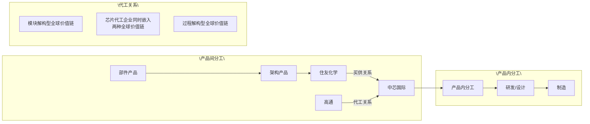
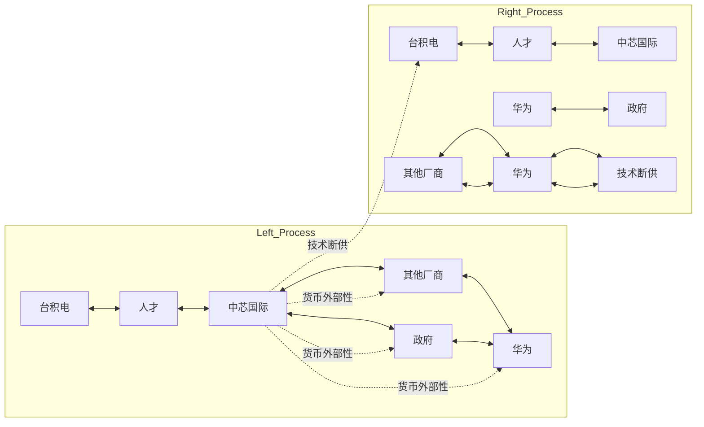

# 方式3：缺口驱动型

## 索引

| 编号 | 论文 | 内部关系主标签 |
|------|------|--------------|
| 例1 | 俞荣建、徐玉蓉、姚力、项丽瑶（管理世界，2025） | `[递进缺口]` |
| 例2 | 寇宗来、孙瑞（经济研究，2023） | `[并列缺口]` |
| 例3 | 郑世林、张容嘉（中国社会科学，2025） | `[转折对立]` |
| 例4 | 王志刚、梅锦华、郑适（南开管理评论，2025） | `[转折对立（三方）]` |

---
**例1. 俞荣建、徐玉蓉、姚力、项丽瑶（管理世界，2025）**

摘要：跨国公司对本土企业的创新溢出，是全球价值链演进的前沿问题。既往研究多关注跨国公司对本土企业的“技术转移”，鲜见迥异于技术转移的“创新溢出”效应研究，且未考虑全球价值链的异质性、产品内分工和产品间分工两个视角的全球价值链研究是分立的。代工关系（基于产品内分工的过程解构型）和买供关系（基于产品间分工的模块解构型）两种异质性全球价值链，具有何种不同的创新溢出效应、组织间关系特征对两种链条的创新溢出效应有何影响？采用同时嵌入代工关系和买供关系这两种迥异类型全球价值链的个先进制造行业代工企业、 对代工 买供关系的 条交易样本，基于 年代工企业和交易伙伴之间的年度交易额，结合专利引用和后续创新数据构成的非平衡面板数据，检验两种异质性全球价值链的创新溢出效应及其机理。研究发现，代工关系的创新溢出效应显著强于买供关系，且两种关系的创新溢出存在显著的正向交互效应。组织间关系的多维特征，对两种类型全球价值链创新溢出效应及其差异具有显著影响。研究将全球价值链技术转移研究推进到创新溢出研究，弥合了产品间分工和产品内分工两种异质性全球价值链研究相互分立的鸿沟，对全球价值链研究具有重要的探索意义。本文研究对于中国企业在全球价值链嵌入和创新决策方面具有启示意义。

关键词：全球价值链 创新溢出效应 代工关系 买供关系 组织间关系特征

DOI:10.19744/j.cnki.11-1235/f.2025.0018

## 一、引言

嵌入全球价值链，基于跨国公司的技术转移乃至创新溢出效应构建技术能力与创新能力，对本土企业创新发展具有战略意义。全球价值链理论认为，发展中国家制造企业嵌入全球价值链，通过嵌入学习可以获取跨国公司对发展中国家企业的技术转移，建构自身的技术能力（菲格雷多等， ；段等， ；安佐林等，），实现在全球价值链中“产品、工艺、功能和跨链”等 种方式的升级。跨国公司对发展中国家制造企业的技术转移方式多种多样，包括专利许可、技术转让、基于技术文本的学习、专家培训以及探索性技术学习等。影响技术转移效应的因素主要包括价值链依赖（邓等， ；苏安通姆等， ）、关系持续时间（伊萨克森等， ；伊藤等， ）、区域差异（帕斯夸利， ；伊藤等， ）、制度距离（宋华、杨雨东， ；王等，）、技术距离（帕利特等， ）以及企业自身特征等（段等， ）。然而，近年来针对中国代工企业的实证研究表明，技术能力提升并不一定能够带来所谓的“升级”。在特定情境下，技术能力的专用性反而可能加剧对外依赖，削弱议价能力，导致企业在租金分配中处于更不利地位，陷入“伪升级”困境（范书琴等， ；周等，2024）。事实上，代工企业的能力提升可能仅仅是在为跨国公司做“嫁衣裳”（俞荣建、文凯，2011；胡大立等，）。“伪升级”现象的存在表明，单纯依赖技术转移可能无法实现真正的创新能力提升，因此本文将研究焦

## 深入学习贯彻党的二十届三中全会精神

点从技术转移转向创新溢出，旨在探索如何在全球价值链中实现真正的创新能力提升。

在寻求创新驱动发展的战略背景下，全球价值链中的创新溢出成为研究的新焦点。莱玛等（2015）对巴西和印度两个发展中国家电子信息类产业的案例研究发现，跨国公司不仅向巴西和印度企业转移技术知识，同时也会向东道国企业大规模转移创新知识，具有显著的创新溢出效应。跨国公司对发展中国家制造企业的创新溢出，是全球价值链演进的前沿现象。技术知识是对工艺流程和产品开发等技术的应用知识。区别于技术知识，创新知识更关注新技术的研发创新能力，包括对工艺流程和新产品开发等技术的研发能力和持续创新能力。中国制造企业正在从技术能力向创新能力轨道转换的过程中，如何基于跨国公司对中国制造企业的创新溢出构建创新能力，是中国企业从全球范围内获取创新资源的重要议题。围绕创新溢出，现有研究探讨了全球价值链创新溢出的必要条件、形式（伊萨克森等， ；帕利特等， ）以及影响因素（楚等， ；许等，）等。但总体上，现有研究多关注全球价值链中的技术转移，全球价值链中跨国公司对本土企业的创新溢出机制，即何种主要因素、如何影响全球价值链创新溢出效应，鲜有研究涉猎。

全球价值链创新溢出效应取决于全球价值链本身的特征、国际制度差异、创新活动特征，以及企业创新能力和学习能力等多重因素。其中，具有异质性的全球价值链本身作为创新溢出的载体，毫无疑问是影响创新溢出效应的重要因素。不同类型的全球价值链具有何种迥异的创新溢出效应？全球价值链具有行业、国别、企业等多重的异质性，但理论上更具分量的异质性是全球价值链的基本类型。第一种全球价值链，是基于“研发设计—生产制造—品牌营销”等价值创造过程的产品内分工和组织解构（卢锋， ），所形成的过程解构型全球价值链，也是“微笑曲线”所表达的全球价值链类型。例如，芯片产业中“芯片设计企业（如高通）—晶圆代工企业（如中芯国际）”构成的跨国代工关系，就属于典型的过程解构型全球价值链。第二种是基于“零部件—模块/工艺设备—整件”等产品间专业化分工和组织解构（格罗斯曼、罗西-汉斯贝格，2008），所形成的模块解构型全球价值链。例如，芯片产业中“零部件供应商（如供应晶圆材料的日本企业住友化学）—晶圆代工企业（如中芯国际）”构成的跨国买供关系，就属于典型的模块解构型全球价值链。围绕全球价值链这两种分工类型，产品内分工的研究多关注嵌入、低端锁定与升级等议题（李等， ；杨桂菊等，2017；甄珍、王凤彬，2020），“跨国代工”是产品内分工视角下全球价值链研究的典型情境；产品间分工的研究多关注供应商选择与买供间治理等（亨纳特， ；夏尔马等， ），“跨国供应”是产品间分工视角下全球价值链研究的典型情境。可以看出，产品内分工和产品间分工这两种迥异类型的全球价值链研究是相互分立的。全球价值链研究需要将两种迥异类型的全球价值链研究纳入同一个框架。本文以创新溢出效应研究为切入点，尝试弥合产品内分工和产品间分工两个视角，探索全球价值链研究的新范式，对全球价值链理论发展具有重要意义。

跨国公司和发展中国家制造企业之间形成的组织间二元关系构成创新溢出的通道。组织间关系特征对不同类型全球价值链的创新溢出效应具有何种影响？借鉴（跨国）组织间关系文献，组织间关系特征的理论维度，主要包括组织间依赖结构（苏安通姆等， ；邓等， ）、关系持续时间（戴尔、延冈， ；波特、保罗拉吉， ）以及交易伙伴国别（张晓冬等， ；王华， ）等。基于资源依赖观，组织间依赖结构是两个组织之间相互依赖，所形成的均衡或不均衡的特定结构（普费弗、萨兰西克， ；吕文晶等， ）。全球价值链情境下，跨国公司和本土企业之间的组织间依赖结构，如何影响跨国公司对本土企业的创新溢出？跨国公司与本土企业之间的关系持续时间，如何影响创新溢出？此外，不同国家的跨国公司集成地承载着母国政治、制度和文化等因素，对跨国公司的创新溢出效应具有重要影响。中国制造企业嵌入全球价值链，来自不同国家或地区的交易伙伴对本土企业会产生何种差异化的创新溢出效应？

产品内分工和产品间分工研究一直割裂的一个重要原因，就是大多数发展中国家制造企业，都只嵌入于其中一种全球价值链，要么作为跨国公司的供应商或者客户嵌入于跨国公司的买供关系中，要么作为跨国公司特定价值创造过程的合作伙伴嵌入于跨国公司全球价值创造过程的某个环节中。方法论上弥合产品内分工和产品间分工研究的一个突破口，就是代工企业样本。芯片、智能手机、家用汽车等代工模式最为成熟，其中芯片产业尤甚。以芯片产业为例：台积电和中芯国际等晶圆代工企业，一方面承担高通等芯片设计企业的代工业务，与芯片设计企业构成基于产品内分工的代工关系、形成过程解构型的全球价值链。另一方面，台积电或中芯国际也从全球范围内采购晶圆等原材料或零部件，如日本的住友化学等材料巨头和台积电等代工企业之间，构成基于产品间分工的买供关系、形成模块解构型的全球价值链。由此，基于这些代工企业和代工客户之间的代工关系数据，以及这些代工企业和供应商之间的买供关系数据，在方法论层面可以实现将产品内分工与产品间分工纳入统一分析框架，分析全球价值链创新溢出效应，检验两种类型全球价值链及其组织间关系特征，对全球价值链创新溢出效应的影响机制。因此，严格筛选了中国先进制造行业以代工为主要业务的 家代工企业，基于彭博供应链数据库（ 年）构建了 种全球价值链样本；包括代工企业历年与代工客户构成的 对代工关系，形成了基于产品内分工的 条过程解构型全球价值链样本数据；与供应商构成的 对买供关系，形成了基于产品间分工的 条模块解构型全球价值链样本数据；以及与兼具代工客户和供应商角色的 个交易伙伴构成的 条双重交易关系数据（涉及 对双重交易关系），用于探究不同类型全球价值链创新溢出效应的交互作用。采用代工企业与代工客户和供应商的年度交易数据，来测度组织间关系特征。同时，用发明专利引用以及后续创新来衡量跨国公司对代工企业的创新溢出效应。基于这一方法论突破，检验异质性全球价值链创新溢出机制。

文章的理论贡献如下：第一，将全球价值链领域的研究由“技术转移”推进到“创新溢出”范畴。第二，弥合了基于产品间分工和产品内分工两种迥异类型的全球价值链研究相互分立的鸿沟，探讨了不同类型全球价值链创新溢出效应的显著差异，对全球价值链研究具有范式探索意义。第三，从组织间关系视角，解释了不同类型的全球价值链创新溢出效应的差异机制。研究结论对中国企业的全球价值链嵌入决策与创新决策具有借鉴意义。

余文结构安排如下：第二部分为理论与研究假说；第三部分为实证研究设计；第四部分为实证结果分析；第五部分做了进一步分析；第六部分进行结果讨论；最后是结论与政策启示。

## 二、理论分析与研究假说

## （一）全球价值链中的知识流动：由技术转移到创新溢出

全球价值链中的跨国公司向发展中国家制造企业转移技术，帮助供应商提升技术能力以构建更具竞争优势的全球供应链，一直以来这都是跨国公司提升全球价值链竞争力的重要策略。全球价值链中的技术转移，也是全球价值链研究的重点议题。近年来的现实观察表明，全球价值链中的跨国公司对发展中国家企业具有越来越强的创新溢出效应，即跨国公司无直接意图的创新知识溢出，发展中国家制造企业基于探索性学习获取创新知识以提升创新能力，正成为全球价值链新现象。全球价值链创新溢出与技术转移是截然不同的两个范畴，在两个维度上具有显著差异：一是知识形态的差异，创新知识迥异于技术知识。技术知识是指将知识、技能、工具和资源应用于解决实际问题或实现特定目标的方法或过程。创新知识是在现有知识、技术和资源等基础上，通过学习新思想或新方法，创造出新的技术或模式。技术知识和创新知识相互关联又截然不同，创新知识是技术知识的源泉。全球价值链中，跨国公司在技术知识和创新知识两个维度都具有显著优势，而代工企业则具备相当的技术知识水平，但代工业务模式的本质属性和跨国公司对代工企业创新的战略遏制，限定了代工企业核心技术和品牌服务等创新知识积累。

二是知识流动方式的差异，无主观意图的溢出迥异于有主观意图的转移。技术转移指的是一个主体（如企业、组织或国家）通过专利许可和转让、分享技术文本和专家培训等方式，有意识地向另一个主体转移技术知识，被转让对象围绕所转移技术开展利用性学习。创新溢出则指的是一个主体没有主观意图的创新知识溢出（段等， ；许等， ），另一个主体基于专利引用、标杆、逆向工程等方式，围绕创新知识开展探索性学习。段等（2021）研究企业创新质量时，将知识溢出分为有意识的转移和无意识的溢出。早期全球价值链知识溢出的研究，多关注技术转移，研究从发达国家向发展中国家的单向技术转移（彼得罗贝利、拉贝洛蒂， ），

## 深入学习贯彻党的二十届三中全会精神

后续研究探讨技术在跨国公司、供应链伙伴和跨国地区之间的双向或多向转移（阿尔卡塞尔、奥克斯利， ；李等， ）。还有研究关注技术转移过程中的动态因素，包括知识管理、知识共享和组织学习等（波达尔等，2021；克莱顿等，2022；比特纳等，2022；王等，2023）。针对中国代工企业的实证研究表明，技术能力提升并不一定能带来所谓的“升级”，在特定情境下会因为技术能力的专用性产生更强依赖而丧失讨价还价权力（俞荣建、文凯， ；胡大立等， ）。中国企业实践证明，科技自立自强取决于自主创新，须在继续向跨国公司学习技术的基础上，更加注重基于全球价值链创新溢出效应，在全球范围内探索学习创新知识，继而内化、整合、创造具有自主性的技术。全球价值链创新溢出效应及其内在机理，鲜见有力的理论框架和实证研究。因此，探索全球价值链创新溢出效应及其机理，对中国企业学习创新具有战略意义，也是推进全球价值链理论发展的重要方向。

## （二）异质性全球价值链：代工关系与买供关系

跨国公司同时寻求比较优势和竞争优势，推动价值创造活动在全球范围内专业化解构与网络化重构（格里芬等， ），从而形成全球价值链。因此，全球价值链的本质是分工，形态是基于分工的组织重构。分工水平，根本动力来源于市场厚度，市场厚度决定分工水平。在特定市场厚度情境下，价值创造活动基于技术层面的可分解性、比较优势和竞争优势的均衡以及供应能力等维度，进行专业化解构与网络化重构。如图 所示，分工按照两种路径展开，一是产品间分工，即更具优势的生产主体承担相应细分价值模块的生产，如 电脑作为复杂架构产品，其芯片、显示和零部件等价值模块实现了充分的模块化解构和分工，形成基于产品间分工的模块解构型全球价值链。二是产品内分工，即更具优势的生产主体承担相应细分价值创造环节，如芯片设计、芯片制造、芯片封测，就是按照价值创造过程实现了充分的过程解构和分工，形成基于产品内分工的过程解构型全球价值链。

## 1.代工关系：基于产品内分工的过程解构型全球价值链

过程解构型全球价值链中，不同价值创造过程的企业之间相互分工，形成基于产品内分工的全球价值链。芯片全球价值链中，“研发/设计—制造—封测”3个价值创造过程充分分工，形成了“芯片研发/设计—芯片制造”“芯片制造—芯片封测”“芯片研发 设计—芯片封测”之间的多重关系。其中，“芯片研发 设计—芯片制造”即为代工关系。在文章中，代工关系特指先进制造业（如芯片产业）中的代工模式，是一种具有高交易复杂度、深度技术协作和较高专业水平的企业间交易关系。这类关系涉及精密的专业技术与复杂完备的生产流程，代工企业依据客户的技术规格提供专业设计或制造服务，并通过持续工艺创新和严格制程管理来保障产品质量。例如，在芯片产业，芯片制造代工企业按照客户芯片研发 设计的技术规格，为客户提供芯片代工业务。由于代工关系中，芯片研发/设计创新性强、复杂度高，芯片制造同样具有极强的创新性，两个环节在技术上都具有高度复杂性、专业性和差异性，两个创新环节之间存在十分丰富的竞合博弈关系，是芯片全球价值链中各国竞合博弈的角力重点。因此，代工关系充分体现过程解构型全球价值链的丰富内涵，也是理论研究特别是中国等发展中国家代工企业全球价值链升级研究的焦点，自然也成为全球价值链创新溢出效应研究首先考虑的样本选择。代工关系中，芯片研发 设计企业（如高通公司）对本土芯片代工企业（如中芯国际）具有何种创新溢出效应？芯片研发 设计企业和芯片代工企业之间构成的组织间关系，其特征对创新溢出效应具有何种影响？

## 2.买供关系：基于产品间分工的模块解构型全球价值链

模块解构型全球价值链中，模块与架构产品之间、技术设备与产品之间，形成纵向的买供关系、横向同一

环节不同模块之间的耦合关系、横向同一模块之间的竞争关系。其中，纵向的买供关系是模块解构型全球价值链的主线。买供关系是指企业间基于产品间分工形成的交易关系，其核心特征是通

flowchart

图 芯片代工企业同时嵌入两种异质性全球价值链

过模块化的产品接口或标准化的技术规格实现低复杂度的交易协作。这种关系通常以市场型或模块型全球价值链模式为主导（格里芬等，2005），强调交易的规范化与灵活性，企业间互动以满足产品规格和价格要求为主，技术或知识的深度交流较少。如智能手机产业链中的“锂电池（模块产品）—智能手机（架构产品）”、芯片全球价值链中的“光刻机（技术设备）—芯片（产品）”等典型买供关系。芯片全球价值链中，光刻机等核心芯片制造技术设备，具备同样甚至超越芯片研发/设计的创新性，代表着人类制造的极致水平。光刻机领域跨国公司（如荷兰 ）对本土芯片制造企业（如中芯国际），具有何种创新溢出效应？芯片制造关键设备企业和芯片代工企业之间构成的组织间关系，其特征对创新溢出效应具有何种影响？

## 3.代工关系与买供关系：从分立到弥合

由于 个主要原因，基于产品内分工和产品间分工的两种异质性全球价值链研究，长久以来相互分立、未能纳入统一的分析框架中：一是基于产品内分工的全球价值链形成于20世纪90年代之后，时代上显著滞后于产品间分工的悠久历史；二是大多数发展中国家企业都是通过跨国买供关系和跨国公司建立联系，只有少数产业如芯片等，技术复杂、模块化生产方式发达的先进制造业存在广泛的代工业态，研究样本客观上限制了两种全球价值链研究的弥合；三是 世纪 年代初，具有巨大社会影响、关注“研发—制造—品牌”价值地位的“微笑曲线”概念，极大地将学界和实践界关于全球价值链的认知约束在基于产品内分工的全球价值链类型当中；四是不同领域（如国际贸易等经济学领域与国际商务等管理学领域）的研究范式存在显著差异，且跨领域之间的对话与交流相对不足。由于这些原因，我国大多数全球价值链研究关注的是基于产品内分工的过程解构型全球价值链，聚焦于全球价值链治理与发展中国家企业或产业升级两个主要议题（刘志彪、张杰， ，2009；刘志彪，2005；俞荣建、文凯，2011；项丽瑶等，2014；吕越等，2018，2020；胡大立等，2021；罗伟、吕越，2022）。基于产品间分工的全球价值链研究，则多为国际商务领域围绕供应链关系管理与跨国买供间关系治理等的研究，包括供应商选择、合同管理、信任建设、风险管理以及知识共享等方面（戴尔、哈奇， ；阿尔卡塞尔、奥克斯利，2014；伊萨克森等，2016；严、吴，2020）。

全球价值链理论发展，要将不同类型的全球价值链纳入同一个分析框架。这既是实践层面全球价值链嵌入战略决策的需要，如我国代工企业对代工关系和买供关系两种全球价值链类型的价值比较、治理模式、升级战略，以及产业层面嵌入或构建何种全球价值链类型等。同时也是全球价值链理论本身发展的需要，突破概念范畴局限于产品内分工类型的缺陷，构建更加系统的全球价值链。本文尝试以创新溢出效应研究为切入口，一方面揭示全球价值链创新溢出效应及其机理，推进全球价值链知识治理的研究，回答“两种不同类型的全球价值链创新溢出效应有何差异，组织间关系特征如何影响全球价值链创新溢出效应及其差异？”这一悬疑的理论问题。另一方面，探索产品内分工和产品间分工两个视角相互弥合的全球价值链研究范式，旨在为全球价值链理论的进一步发展贡献新的视角和理解。这种整合性的研究不仅能够丰富现有的全球价值链理论，也有助于企业、政策制定者以及研究者更好地理解和应对全球经济中的复杂互动和挑战。

---

---
> 技术转移共识：菲格雷多(2020)/段(2021)/安佐林(2022)
>   影响因素：价值链依赖(邓2022/苏安通姆2020)/关系持续时间(伊萨克森2016/伊藤2023)/区域差异(帕斯夸利2021)/制度距离(宋华2022/王2023)/技术距离(帕利特2022)/企业自身特征(段2021)
>   [内部关系：并列列举。影响因素来自多个独立研究脉络，各自关注不同维度]
> 伪升级困境：范书琴(2023)/周(2024) vs 俞荣建(2011)/胡大立(2021)
>   [内部关系：转折对立。前段共识(技术转移→能力) vs 新证据(能力↑≠升级)]
> 创新溢出：莱玛(2015) 巴西/印度案例 → 伊萨克森(2016)/帕利特(2022)/楚(2019)/许(2022)
>   [内部关系：递进。从技术转移到创新溢出，概念推进]
> 两类GVC：过程解构型(卢锋2004) vs 模块解构型(格罗斯曼2008)
>   [内部关系：并列缺口。两个研究传统分立，缺乏统一框架]
> 收束：需将两类GVC纳入统一框架，以创新溢出为切入点

嵌入全球价值链，基于跨国公司的技术转移乃至创新溢出效应构建技术能力与创新能力，对本土企业创新发展具有战略意义。全球价值链理论认为，发展中国家制造企业嵌入全球价值链，通过嵌入学习可以获取跨国公司对发展中国家企业的技术转移，建构自身的技术能力（菲格雷多等，2020；段等，2021；安佐林等，2022），实现在全球价值链中"产品、工艺、功能和跨链"等4种方式的升级。跨国公司对发展中国家制造企业的技术转移方式多种多样，包括专利许可、技术转让、基于技术文本的学习、专家培训以及探索性技术学习等。影响技术转移效应的因素主要包括价值链依赖（邓等，2022；苏安通姆等，2020）、关系持续时间（伊萨克森等，2016；伊藤等，2023）、区域差异（帕斯夸利，2021；伊藤等，2023）、制度距离（宋华、杨雨东，2022；王等，2023）、技术距离（帕利特等，2022）以及企业自身特征等（段等，2021）。`[->转折对立]` 然而，近年来针对中国代工企业的实证研究表明，技术能力提升并不一定能够带来所谓的"升级"。在特定情境下，技术能力的专用性反而可能加剧对外依赖，削弱议价能力，导致企业在租金分配中处于更不利地位，陷入"伪升级"困境（范书琴等，2023；周等，2024）。事实上，代工企业的能力提升可能仅仅是在为跨国公司做"嫁衣裳"（俞荣建、文凯，2011；胡大立等，2021）。"伪升级"现象的存在表明，单纯依赖技术转移可能无法实现真正的创新能力提升，因此本文将研究焦点从技术转移转向创新溢出，旨在探索如何在全球价值链中实现真正的创新能力提升。在寻求创新驱动发展的战略背景下，全球价值链中的创新溢出成为研究的新焦点。莱玛等（2015）对巴西和印度两个发展中国家电子信息类产业的案例研究发现，跨国公司不仅向巴西和印度企业转移技术知识，同时也会向东道国企业大规模转移创新知识，具有显著的创新溢出效应。跨国公司对发展中国家制造企业的创新溢出，是全球价值链演进的前沿现象。技术知识是对工艺流程和产品开发等技术的应用知识。区别于技术知识，创新知识更关注新技术的研发创新能力，包括对工艺流程和新产品开发等技术的研发能力和持续创新能力。中国制造企业正在从技术能力向创新能力轨道转换的过程中，如何基于跨国公司对中国制造企业的创新溢出构建创新能力，是中国企业从全球范围内获取创新资源的重要议题。围绕创新溢出，现有研究探讨了全球价值链创新溢出的必要条件、形式（伊萨克森等，2016；帕利特等，2022）以及影响因素（楚等，2019；许等，2022）等。但总体上，现有研究多关注全球价值链中的技术转移，全球价值链中跨国公司对本土企业的创新溢出机制，即何种主要因素、如何影响全球价值链创新溢出效应，鲜有研究涉猎。全球价值链创新溢出效应取决于全球价值链本身的特征、国际制度差异、创新活动特征，以及企业创新能力和学习能力等多重因素。其中，具有异质性的全球价值链本身作为创新溢出的载体，毫无疑问是影响创新溢出效应的重要因素。不同类型的全球价值链具有何种迥异的创新溢出效应？全球价值链具有行业、国别、企业等多重的异质性，但理论上更具分量的异质性是全球价值链的基本类型。第一种全球价值链，是基于"研发设计—生产制造—品牌营销"等价值创造过程的产品内分工和组织解构（卢锋，2004），所形成的过程解构型全球价值链，也是"微笑曲线"所表达的全球价值链类型。`[->并列群]` 第二种是基于"零部件—模块/工艺设备—整件"等产品间专业化分工和组织解构（格罗斯曼、罗西-汉斯贝格，2008），所形成的模块解构型全球价值链。围绕全球价值链这两种分工类型，产品内分工的研究多关注嵌入、低端锁定与升级等议题，"跨国代工"是产品内分工视角下全球价值链研究的典型情境；产品间分工的研究多关注供应商选择与买供间治理等，"跨国供应"是产品间分工视角下全球价值链研究的典型情境。可以看出，产品内分工和产品间分工这两种迥异类型的全球价值链研究是相互分立的。全球价值链研究需要将两种迥异类型的全球价值链研究纳入同一个框架。本文以创新溢出效应研究为切入点，尝试弥合产品内分工和产品间分工两个视角，探索全球价值链研究的新范式，对全球价值链理论发展具有重要意义。

**例2. 寇宗来、孙瑞（经济研究，2023）**

# 技术断供与自主创新激励:

# 纵向结构的视角\*

## 寇宗来 孙 瑞

内容提要:参照芯片断供的现实背景，本文在 “制造商—零售商”纵向结构框架下考察了技术断供对自主创新激励的影响。 技术断供意味着，技术领先的上游国外制造商不能向某个下游零售商提供中间品。 分析表明，技术断供前，技术落后的上游本地制造商缺乏自主创新激励的重要原因是创新的 “货币外部性”:尽管其技术追赶可以通过压缩国外制造商的抽租能力而让下游厂商获益，但其本身却无法通过赢得下游市场并从中获利技术断供后，被断供下游零售商只能从本地制造商采购中间品，这种 “绑定效应”部分内化了本地制造商的货币外部性，进而会提高其自主创新激励; 但与此同时，技术断供也会提高外国制造商为阻止本地制造商技术追赶而实施人才圈定策略的激励和能力。 所以，为破解外国制造商的 “人才圈定”策略，需要以政府采购等方式对本地制造商进行有相当力度且有持续性的创新政策支持。

关键词:技术断供 自主创新 货币外部性 创新政策

## 一、 引 言

自2018 年中美贸易摩擦以来，美国相继在芯片 高端材料和设备 系统和专用软件等核心领域对多家中国企业实施技术断供 其中最受关注的是对华为的技术断供事件，这意味着华为不再能够借助台积电的代工技术而获得麒麟芯片 自2020 年9 月15 日起，美国据其所谓的 “长臂管辖”原则，禁止凡是用到美国技术的任何企业向华为出售高端芯片和存储器，华为由此遭受重创 据相关报道，华为手机出货量从 2020 年的 1. 9 亿部下降至 2021 年的 3500 万部，同比跌幅高达81. 6%，世界排名从第二下降至第九。①另一方面，彭博社数据显示，2021 年全球 20 家增长最快的芯片行业公司中有19 家来自中国 这些公司是对芯片制造至关重要的设计软件 处理器和设备供应商，包括苏州国芯 寒武纪等等 ②华为被断供后，中国大陆最重要的芯片制造公司中芯国际相继突破了 28nm 14nm 12nm N +1( 10nm) 制程芯片量产，N + 2( 7nm) 技术开发也已经完成，当然中芯国际也被美国列入了所谓的 “实体清单” 。③本文将要探讨或者试图回答的现实问题是，从纵向结构视角看，美国对下游企业华为技术断供会对上游企业中芯国际的自主创新激励有何影响? 更进一步，对于鼓励自主创新、加快技术追赶，诸如政府采购等创新政策又是如何起作用的?

本文分析表明，在华为被技术断供后，国产芯片技术的快速提升不仅仅是政府补贴的结果，也源于市场激励的重大变化，其核心机制是技术断供使得上游国产芯片制造商与下游被技术断供的华为零售商被迫 “捆绑”在一起，这缓解了上游国产芯片制造商创新的货币外部性( pecuniaryexternality) ，由此提高了自主创新激励。 为具体刻画技术断供的影响，本文考察了一个纵向结构市场，其中上游本地制造商和国外制造商为下游两家零售商提供同质中间品。 技术断供意味着，国外制造商不得向某个下游零售商提供中间品。 参照现实情况，假设本地制造商技术相对落后，且至少在短期内，即便它取得了技术提升，其结果也只是缩小技术差距，并不能实现技术超越。故在技术断供前，国外制造商总可凭借其技术优势而为下游零售商提供更加优惠的销售合同。由此，即便本地制造商取得一定程度的技术提升，它也无法赢得下游市场并从中获利，这是导致其缺乏自主创新激励的关键原因。 但是，尽管本地制造商的技术升级不会让其本身直接获利，却会通过货币外部性机制或者压缩外国制造商的抽租能力而让下游零售商获利，因为随着技术差距缩小，外国制造商必须提供更加优惠的销售合同才能赢得下游市场。 由此可得两方面重要结论: 一方面，创新的货币外部性可以构成政府向上游制造商进行研发补贴的合理性基础，而更加微妙的是，即便受补贴企业的产品没在下游市场中得到实际采用，也不能由此简单判定研发补贴政策是失败的。 另一方面，正因为创新的货币外部性，国外制造商有激励阻碍本地制造商的技术进步，以免其从下游市场提取的租金受到压缩。 一种常见的创新阻碍方式是投入品圈定( inputforeclosure) ，即技术领先者可以通过圈定稀缺的创新要素来阻碍竞争者技术追赶。 鉴于高端人才对于芯片业技术追赶的关键作用，本文具体考虑的是人才圈定( talent foreclosure) ，并发现如果没有政府支持，国外制造商更有能力为高端人才出高价，即可以通过人才圈定策略阻碍本地制造商的技术追赶。

接着考察技术断供到底会对本地制造商的技术追赶产生什么影响。 与断供前相比，将会产生正反两个方面的变化。 一方面，由于被断供零售商现在只能从本地制造商购买中间品，本地制造商进行创新的货币外部性被部分地内化了，这会提高它的创新激励。 更具体地，如果本地制造商取得技术提升之后，与国外制造商的技术差距依然很大，则被断供零售商至少在短期内会被排斥出市场，此时本地制造商的技术提升并不会对下游市场产生直接影响。 但是，如果技术差距变得足够小，则被断供零售商就可以通过采购本地制造商的中间品而在下游市场竞争中存活下来，相应地，本地制造商所得利润也将会随其技术水平的提升而增加 但另一方面，技术断供也会提高外国制造商进行人才圈定的激励和能力 其背后的经济直觉是，一旦外国制造商成功地实施了人才圈定，本地制造商将无法实现技术提升，进而不会压缩外国制造商从下游零售商所抽取的租金。 注意到外国制造商能够抽取的租金不会超过下游企业所得利润，故断供前，此上限是两个下游零售商的双寡头利润之和; 而断供后，如果它能成功地实施人才圈定并最终将被断供零售商排斥出市场，则下游市场只剩下未被断供零售商，因而它可提取的租金上限就变成了下游市场的垄断利润。 考虑到市场竞争会导致租金耗散，垄断利润大于双寡头利润之和，故与断供前情形相比，技术断供之后外国制造商进行人才圈定的激励和能力都增加了。 这也意味着，如果没有政府扶持，单纯的技术断供可能并不能帮助本地制造商赢得人才竞争。

更进一步，前后比较可以发现，技术断供会对政府扶持政策的退出效果产生本质性的影响 直观上，不管断供与否，只要政府扶持力度足够强，本地制造商就能赢得人才竞争 但是，给定本地制造商即便赢得人才竞争也至少在短期内依然处于技术落后地位，则在断供之前，只要政府停止扶持，本地制造商就会因为创新的货币外部性而失去技术追赶的激励。 而如上分析，在技术断供之后，一旦政府扶持使得本地制造商与外国制造商的技术差距低于某个阈值，即便扶持政策退出，本地制造商和被断供零售商作为一个整体也能在市场竞争中自我存活下来，而且随着货币外部性的内化，它们的整体利润会随着技术水平的提升而不断增加

下面再对我国早先两次 “造芯片热”做简要比较，为上述理论分析提供案例佐证。 20 世纪90 年代，有感于中国大陆芯片产业的落后，中央政府先后投资 20 亿元和 100 亿元实施了 “908工程”和 “909 工程”，从而掀起了轰轰烈烈的 “造芯片热”，但最终却未能改变中国大陆芯片产业技术落后的状况，与国外技术差距反而越拉越大。 回头来看，“908 工程”失败的一个关键原因是缺乏市场激励 “908 工程”的目标是在 “八五”期间将大陆半导体技术提升到 1 微米。 但从立项到投产，历时7 年之久，此时世界主流芯片制程在 “摩尔定律”作用下已经发展到 0. 18 微米，“908 工程”生产的芯片根本没有市场，最终宣告失败。 吸取了 “908 工程”失败的经验，“909工程”成立了华虹微电子，同时与日本 NEC 合资组建上海华虹 NEC 电子有限公司，其生产的芯片主要销往 NEC。 由于投产顺利，华虹 NEC 在建立第一年就获得 5. 16 亿的利润，但在 2001 年遭遇全球半导体危机，亏损 13. 48 亿元。 由于对芯片产业发展缺乏认识，盈亏成为评价华虹NEC 是否成功的主要标准，华虹 NEC 由此遭遇了相当多的批评，其结果是，即使之后其业绩恢复，却也再未获得政府支持。 可见，“909 工程”失败的原因之一是扶持政策没有坚持到底，错失了发展半导体产业的最好机遇。 20 世纪 90 年代 “造芯片热”的失败正好对应了本文论述的技术断供之前情形，如果没有持续的政府支持，创新的货币外部性导致核心企业缺乏自主创新的市场激励。

在华为被技术断供后，中国大陆又掀起了新一轮的 “造芯片热” 事实上，在芯片生产的每个环节，中国大陆现在都有对应的国产化企业，只是技术与国外还有一定差距，特别是上游芯片原材料及 EDA 设计工具与国外技术差距较大。 与本文分析相一致，芯片断供不但提高了国内企业进行自主创新的激励和对高端芯片人才的需求，而且也会让在位的技术领先者更有积极性进行人才圈定，其结果都是加大并凸显了国内市场上高端芯片人才的供给缺口。 根据 《中国集成电路产业人才白皮书( 2019—2020 年版) 》测算，2022 年中国集成电路专业人才缺口将高达25 万。 具体看我国芯片制造领头企业中芯国际，与通常的预期相符，技术断供后中芯国际的利润大幅增长。 有些出乎意料但与本文模型却相一致的是，中芯国际面临着非常严峻的人才流失问题。 据公开年报显示，中芯国际的研发人员数量在最近三年逐渐下滑，从 2019 年的 2530 人逐步下降到2021 年的1758 人。 这似乎表明，如何破解在位领先者的人才圈定策略依然是中国高端芯片发展面临的严峻挑战。 按照本文的理论逻辑，此时政府支持可能会起到至关重要的作用，实际上国家也的确加大了相关的政策力度。 2020 年中国政府一共投入 106 亿元补贴半导体上市公司，为历史最高纪录，其中，中芯国际获得25 亿元补贴 现实情况具有极高的复杂性和不确定性，国产芯片制造企业最终能否或者何时才能实现 “突围”还有待观察，但与上一轮相比，此轮 “造芯片热”有本质性的差异，即美国的技术断供行为不但让国内企业真正意识到了高端技术自主可控的重要性，也为国产芯片制造企业的市场需求提供了 “可置信的承诺”，进而为国产芯片制造企业技术追赶提供了历史机遇

本文研究与两支文献密切相关。 第一支文献旨在探讨外商独资企业( FDI) 与自主创新之间关系，而本文模型中的国外制造商在很大程度上可以对应于相关文献中的 FDI。 从产业链角度而言，现有文献较为一致地肯定了 FDI 通过前后向关联机制对国内上下游企业创新的积极影响( Smarzynska，2004; 王然等，2010; 陈启斐和刘志彪，2014; Newman et al．，2015) ，但就 FDI 对同行业企业创新的影响却没有确定结论( 王红领等，2006; 诸竹君等，2020) 。 诸竹君等( 2020) 将 FDI对本地同行业企业的创新分为三个效应: 溢出效应 锁定效应和竞争效应。 前两者对本地企业创新的影响分别为正向和负向，竞争效应的影响则可正可负，取决于本地企业技术与外资企业技术的差距( Aghion et al．，2005; 寇宗来，2009; 张杰等，2020) 。 相比而言，本文只考虑了外国制造商与本地制造商的竞争效应，但因为采取了纵向结构，我们可以分析技术断供( 类似于 FDI 退出) 的影响。 为帮助本地企业进行技术追赶，政府通常会采取包括研发补贴、税收优惠等在内的产业和创新政策( 杨国超和芮萌，2020; 安同良和千慧雄，2021; 张杰，2021) ，但市场需求所产生的创新激励则是本地企业持续技术追赶的核心动力( 李杰等，2011; 付明卫等，2015; 叶祥松和刘敬，2020) 。鲜有文献考察二者间的关系，本文通过分析技术断供对政府补贴的影响，探讨了市场需求激励与扶持政策之间的关系。 第二支文献是市场圈定( foreclosure) 理论。 传统的市场圈定理论集中在分析纵向一体化、独家交易、捆绑等圈定行为对均衡福利的影响( Rey ＆ Tirole，2007; 赵玻等，2009) 。 尽管人才对于本地企业自主创新至关重要( 潘士远等，2019; 郑江淮和荆晶，2021) ，但在技术追赶的相关文献中，关于企业人才圈定行为的理论分析却十分少见。 本文分析人才圈定，最早是受到 Gilbert ＆ Newbery( 1982) 关于 “沉睡专利”分析的启发，他们发现技术领先企业申请并搁置专利的一个重要动机是限制竞争对手获得专利。 这种思想也与当前反垄断研究前沿对 “杀手并购”( killer acquisitions) 的研究是一致的，即大企业并购小企业只是为了中断小企业的创新项目，以此在未来竞争中抢占先机( Cunningham et al．，2021) 。 与本文最相关的一篇近期文献是Burguet ＆ Sákovics( 2017) ，他们探讨了竞争性的人才圈定，并证明上游企业对稀缺投入品的争夺会缓解纵向外部性导致的效率扭曲。 与这些文献相比，本文是在纵向结构下考虑了人才竞争问题，探讨如何通过政府采购来克服技术追赶者可能遇到的创新的货币外部性问题，丰富了已有研究结论。

据笔者有限的了解，目前尚无其他理论文章专门讨论技术断供对中国企业创新的影响Han et al． ( 2020) 是研究主题比较相近的一篇实证文献 他们利用专利相互引证数据测算了中美最近二十年的技术融合和脱钩趋势，发现美国技术断供对被制裁的行业及其下游企业有负向影响，但被制裁行业上游企业的生产率有显著提升，并产生了更多突破性创新，这与本文的理论分析结果非常一致 另外值得注意的是，最近几年涌现了大量关于供应链中断研究( Acemoglu＆ Tahbaz-Salehi，2020; Elliott ＆ Golub，2022; Alessandria et al．，2023) ，但其分析的重点是供应链网络的脆弱性与风险传递 供应链中断对其他宏观变量的冲击以及不确定环境下企业供应链安排的决策等问题，很少考虑技术断供这种极端的供应链中断情形，以及由此引发的技术 “卡脖子”和落后企业的技术追赶问题。 技术断供如何影响中国企业创新激励以及政府补贴政策的效果是个富有争议的话题。 本文的贡献是为深入探讨此问题提供了一个理论分析框架。 通过引入创新的货币外部性和人才圈定，本文可以解释为什么 20 世纪 90 年代 “造芯片热”会失败，也可以为理解技术断供如何影响自主创新激励以及如何实施对冲技术断供的创新政策提供经济学洞见。

本文后续的内容安排如下: 第二节是华为芯片断供对中芯国际创新激励影响的分析; 第三节和第四节分别考察了在技术断供之前和之后的企业自主创新激励; 第五节对本文模型的主要假设进行了讨论和拓展以此检验理论分析的稳健性; 第六节是本文的结论与政策启示。

## 二、 华为芯片断供对中芯国际创新激励的影响

本节将简单梳理华为芯片断供事件的缘由及其对中芯国际创新激励的影响，这是本文构建模型的主要现实依据 自2018 年以来，中美贸易争端已经逐渐发展到对双方科技公司的遏制，技术成为双方争夺的焦点 美国启动的301 调查报告宣称，中国长期侵犯美国的知识产权，损害了美国的利益，并同时将一百多家中国企业列入 “实体清单”，实行高科技出口管制。 这其中最具代表性也最具轰动效应的事件就是美国对华为实施技术断供 从2020 年9 月15 日开始，台积电 高通和三星等芯片设计和制造商将不再供应高端芯片给华为。

芯片是整个信息社会的基石，也是推动整个信息社会向前发展的发动机，芯片所在的半导体产业也是当今世界最重要的产业之一 芯片行业产业链可以分为三个部分，上游是芯片原材料及设备，中游是芯片的设计、制造以及封装测试，下游是汽车、计算机和消费电子等应用行业。 我国在下游以及中游的芯片封装测试部分均达到了世界领先水平，但在芯片设计、制造以及上游行业却与国外先进企业差距较大。 此次美国对华为芯片断供主要是在芯片制造环节对中国进行“卡脖子”，技术断供前，台积电作为当前技术最先进的芯片制造公司可以量产制程为 5nm 的芯片，而国内技术最先进的芯片制造公司中芯国际只能量产 28nm 制程芯片，制造工艺落后三、四代。 因此，一旦使用美国技术的台积电不能为华为制造芯片，华为高端手机将面临 “无芯可用”的尴尬局面。

flowchart

考虑到智能手机芯片收入占 2021 年台积电净收入的 44%，是台积电目前净收入的最大来源，而在遭遇技术断供之后，华为高端手机芯片制造则几乎只能依赖中芯国际的技术突破。 为简化分析逻辑，本文仅考虑一个 “芯片制造—智能手机”的纵向结构市场。 如图 1 所示，上游存在先进芯片制造技术制造商台积电和落后技术制造商中芯国际，下游存在被断供手机零售商华为和未被断供的其他手机零售商，并且台积电和中芯国际可以通过雇佣人才提升技术。 双向实线表示实际产品和利润流通路径，虚线表示潜在产品和利润流通路径。 图 1 左侧表示技术断供前情况，台积电给下游手机厂商提供芯片，获得利润，并利用利润雇佣人才进行创新，获得更多利润，形成良性循环 反观中芯国际，由于技术远落后于台积电，事实上并不直接给下游华为和其他手机零售商提供芯片，产品流通表现为虚线。 更重要的是，中芯国际面临创新的货币外部性，其技术提升的好处流向下游手机厂商，而不是中芯国际本身，这使其缺乏自主创新激励。 在此情况下，中芯国际的企业利润以及创新激励都主要来源于政府采购或者研发补贴等政府扶持，而一旦政府支持取消，中芯国际将失去技术追赶激励。 图 1 右侧表示技术断供后情况。 此时台积电被禁止出售芯片给华为，华为手机能否生存很大程度上取决于中芯国际能否提供高性能芯片; 反过来，如果华为手机可以留在市场，中芯国际就可能通过华为手机而获得技术提升的利润，这部分缓解了创新的货币外部性，进而会增强其自主创新激励。 但与此同时，因为中芯国际的技术追赶会压缩台积电从下游抽取租金的空间，而台积电为避免这种情况，必然强化对于芯片制造人才的争夺

接着通过公司年报的现实数据考察华为技术断供对台积电和中芯国际的实际影响。 2020 年9月15 日台积电正式对华为实施芯片断供，2020 年台积电的营业收入和净利润增长率都有了大幅提高，分别为25.17%和44. 3%，为2010 年以来最高纪录，并且利润增幅主要源于高端芯片销售。与此同时，2020 年台积电史无前例地招聘了8000 名员工，并在2021 年继续招聘约9000 名员工，增幅20%，再创历史新高。 自2019 年美国政府宣布对华为技术断供以来，中芯国际的营业收入和净利润也有大幅上涨，分别为24.8%和141.5%，尽管最新制程高端芯片利润占比仍相当低，但低端成熟制程芯片营收大幅上升。 在芯片制造工艺上，中芯国际也相继实现了28nm 14nm 12nm N +1( 10nm) 制程芯片量产，N + 2( 7nm) 技术开发也已经完成，自主创新进程大大加快。 但有些奇怪的是，伴随着中芯国际利润和技术提升，其研发人员数量流失问题反而更加严重，从 2019 年的 2530人下降到2021 年的1758 人，与台积电积极扩充人才行为形成鲜明对比。 2020 年中国政府对中芯国际补贴了25 亿元，部分原因就是帮助其缓解人才招聘的资金不足问题。 中芯国际遭遇人才流失的现实背景是，在华为被技术断供后的两年里，芯片制造相关从业者的市场工资大幅提升，有些岗位薪资上涨幅度达两倍以上，使得许多芯片制造人才离开中芯国际而去往工资更高的企业。

---

---
> 第一支：FDI与自主创新→纵向结构下可分析断供
> 第二支：市场圈定理论→人才圈定
> 无理论文章讨论技术断供对中国企业创新

本文研究与两支文献密切相关。第一支文献旨在探讨外商独资企业（FDI）与自主创新之间关系，而本文模型中的国外制造商在很大程度上可以对应于相关文献中的FDI。从产业链角度而言，现有文献较为一致地肯定了FDI通过前后向关联机制对国内上下游企业创新的积极影响（Smarzynska，2004；王然等，2010；陈启斐和刘志彪，2014；Newman et al.，2015），但就FDI对同行业企业创新的影响却没有确定结论（王红领等，2006；诸竹君等，2020）。诸竹君等（2020）将FDI对本地同行业企业的创新分为三个效应：溢出效应、锁定效应和竞争效应。前两者对本地企业创新的影响分别为正向和负向，竞争效应的影响则可正可负，取决于本地企业技术与外资企业技术的差距（Aghion et al.，2005；寇宗来，2009；张杰等，2020）。相比而言，本文只考虑了外国制造商与本地制造商的竞争效应，但因为采取了纵向结构，我们可以分析技术断供（类似于FDI退出）的影响。为帮助本地企业进行技术追赶，政府通常会采取包括研发补贴、税收优惠等在内的产业和创新政策（杨国超和芮萌，2020；安同良和千慧雄，2021；张杰，2021），但市场需求所产生的创新激励则是本地企业持续技术追赶的核心动力（李杰等，2011；付明卫等，2015；叶祥松和刘敬，2020）。鲜有文献考察二者间的关系，本文通过分析技术断供对政府补贴的影响，探讨了市场需求激励与扶持政策之间的关系。`[->并列群]` 第二支文献是市场圈定（foreclosure）理论。传统的市场圈定理论集中在分析纵向一体化、独家交易、捆绑等圈定行为对均衡福利的影响（Rey & Tirole，2007；赵玻等，2009）。尽管人才对于本地企业自主创新至关重要（潘士远等，2019；郑江淮和荆晶，2021），但在技术追赶的相关文献中，关于企业人才圈定行为的理论分析却十分少见。本文分析人才圈定，最早是受到Gilbert & Newbery（1982）关于"沉睡专利"分析的启发，他们发现技术领先企业申请并搁置专利的一个重要动机是限制竞争对手获得专利。这种思想也与当前反垄断研究前沿对"杀手并购"（killer acquisitions）的研究是一致的，即大企业并购小企业只是为了中断小企业的创新项目，以此在未来竞争中抢占先机（Cunningham et al.，2021）。与本文最相关的一篇近期文献是Burguet & Sákovics（2017），他们探讨了竞争性的人才圈定，并证明上游企业对稀缺投入品的争夺会缓解纵向外部性导致的效率扭曲。与这些文献相比，本文是在纵向结构下考虑了人才竞争问题，探讨如何通过政府采购来克服技术追赶者可能遇到的创新的货币外部性问题，丰富了已有研究结论。据笔者有限的了解，目前尚无其他理论文章专门讨论技术断供对中国企业创新的影响。Han et al.（2020）是研究主题比较相近的一篇实证文献。他们利用专利相互引证数据测算了中美最近二十年的技术融合和脱钩趋势，发现美国技术断供对被制裁的行业及其下游企业有负向影响，但被制裁行业上游企业的生产率有显著提升，并产生了更多突破性创新，这与本文的理论分析结果非常一致。

**例3. 郑世林、张容嘉（中国社会科学，2025）**

摘 要:产业链风险冲击是仅仅阻碍中国企业技术进步,还是进一步倒逼中国企业实现自主创新突破? 以美国实施 《出口管制改革法案》为外部冲击,分析技术封锁引发的产业链风险对中国上游企业自主创新突破的影响及其作用机制。研究发现,产业链风险冲击倒逼中国上游企业提高自主创新能力,其作用机制源于国内市场空缺激励和倒逼效应与政府扶持效应,上游企业自主创新还对下游企业产生创新溢出效应。面对日趋激烈的中美科技博弈,应加大重点领域国产化替代力度,完善支持企业自主创新的配套政策,推动产业链供应链国际合作,加快形成开放创新生态。

关键词:产业链风险 技术封锁 企业自主创新 关键核心技术

作者郑世林,中国社会科学院数量经济与技术经济研究所研究员;张容嘉,中国社会科学院数量经济与技术经济研究所助理研究员。(北京 )

## 引 言

当前,世界百年未有之大变局加速演化,单边主义、保护主义明显上升,给中国经济高质量发展带来影响。美国对华实施打压和围堵,以期遏制中国产业升级。年 月,美国正式签署 《出口管制改革法案》 (以下简称 《法案》),对芯片、高端材料和专用软件等关键中间品实施出口管制,中国企业遭受前所未有的外部断供断链冲击。为应对美国技术封锁引发的产业链风险,中国企业开始走上自主创新突破之路。年 月,华为发布搭载国产 芯片的 系列手机,表明中国企业芯片技术取得重大突破。 年 月,中国企业 更是打破美国算力封锁,在自然语言处理、多模态理解等方面达到国际领先水平。这意味着美国对中国上游产业链的技术封锁冲击 可能在一定程度上倒逼这些上游企业自主创新 从而实现关键中间品的核心技术突破。那么,这种国外技术封锁引发的产业链风险 (以下简称 “产业链风险”)究竟仅仅对中国上游企业技术创新形成全面遏制,还是激发企业自主创新动力,最终实现自主创新突破? 在大国科技博弈不断加剧的背景下,回答好这一问题 对于提升中国供应链产业链韧性和安全水平具有重要现实意义

相关文献认为,国际贸易壁垒抑制企业创新。首先,贸易壁垒使全球经济发展的不确定性上升,企业为规避经营风险,往往选择增加流动性资产,从而挤出本国企业研发投入。① 其次,由于贸易壁垒使中间品贸易成本提升,新兴技术传播速度降低,对企业创新产生负面影响。② 最后,贸易壁垒阻碍外资企业在本地市场投资,从而大幅降低市场竞争强度,导致企业创新产品意愿下降。③

然而,还有文献认为,贸易壁垒有利于技术追赶国家企业创新。一方面,技术追赶国家企业嵌入全球价值链后,主要承担低附加值的加工制造环节,多数关键中间品主要依赖国外进口,“低端锁定”导致企业丧失自主研发创新的动力。④ 贸易壁垒不仅能扩大本地企业的市场份额 也有助于减少外部竞争压力 为企业创新提供了充足的利润空间和时间窗口 ⑤ 另一方面 全球领先国家对技术追赶国家实施贸

F Benuriaetal Anxiet orPain TheIm actofTariffsand Uncertaint on ChineseFirmsintheTrade War  vol 137 2022; D. Caldara et al.，“The Economic Effects of Trade Policy Uncertainty,” Journal of Monetary Economics，vol.109，2020，pp.38-59.  
② E. Giuliani，C. Pietrobelli and R.Rabellotti，“Upgrading in Global Value Chains: Lessons from Latin American Clusters,”World Development，vol. 33，no. 4， 2005, pp.549-573.  
③ K. Teshima, Import Com petition and Innovation at the Plant Level: Evidence from NewYork ColumbiaUniversit 2008 Z Chen J Zhan andW Zhen Im ortandInnovation EvidencefromChineseFirms vol.94，2017，pp.205-220.  
④ Paul Prebisch,“Commercial Policy in the Underdeveloped Countries,”The American Economic Review，vol.49，no. 2，1959，pp. 251-273；W. M. Cohen and D. A. Levinthal，“ Innovation and Learning: The Two Faces of R&D,” The Economic vol 99 no 397 1989  569-596 P P Saviottiand Andreas “Generalized Barriers to Entry and Economic Development,” Journal of Euolutionary Economics，vol. 21，201l，pp.29-52.  
⑤ B. Selwyn，“An Historical Materialist Appraisal of Friedrich List and His Modern-Day Followers,”New Political Economy，vol. 119，no.2，2009，pp.157-180；A．H. Amsden,“Why Isn’t the Whole World Experimenting with the East Asian Model to Develop?:Review of the East Asian Miracle,”World Development，vol. 22，no.4, 1994；J. Caddel，“Domestic Competition over Trade Barriers in the US International Trade Commission,” International Studies Quarterly，vol. 58，no.2，20l4，pp. 260-268; R.K. Edeme et al.，“Impact of Trade Restrictions in European and Sub-Saharan Regions,"” Review of Market Integration，vol. 12， nos. 1-2， 2020,pp. 35-50; D. A. Irwin,“The Rise and Fall of Import Substitution,”World Development，vol. 139， 2021.

易壁垒措施,能够倒逼技术追赶国家企业创新。 等研究发现,欧盟反倾销制裁引致的出口税率上升,倒逼中国出口企业增加创新投入,推动了产品结构优化,从而增强了中国产品的国际竞争力。① 近年来,中美贸易摩擦频发, 等研究发现,美国对华反倾销倒逼中国出口企业提升其创新水平。② 等也发现,为避免美国对华加征出口关税导致企业成本上升,中国出口企业通过技术创新提升对其他国家的出口份额 ③

美国作为全球技术领先的超级大国,为维持其技术优势,通过设置非关税壁垒打压技术追赶国家。特别是近年来,为遏制中国技术进步,美国以前所未有的力度加大对华新兴和关键技术产品出口管制,研究结论却未达成一致。部分文献认为,美国出口管制对中国实体清单企业创新产生负向影响 而且 目标企业受管制清单影响后显著抑制上游企业创新。⑤ 美国出口管制具有创新抑制效应,但管制会促使中国企业转向自主研发投入的 “内生创新”。⑥ 另有文献认为,美国出口管制并未对中国企业创新产生抑制,实体清单企业创新数量和质量显著提升,但对美国供应商的创新绩效产生消极影响 寇宗来和孙瑞指出 国外技术断供留下的中国国内

① L.Jabbour et al.，“The Good，the Bad and the Ugly: Chinese Imports，European Union Anti-Dumping Measures and Firm Performance,” Journal of International Economics，vol．117，2019，pp.1-20.  
② K.G.Huang，N. Jia and Y.Ge,“Forced to Innovate? Consequences of United States' Anti-Dumping Sanctions on Innovations of Chinese Exporters,”Research Policy，vol. 53，no．1，2024.  
③ L. S. Li， Y. Liu and Y. Jia,“The Effect of the U.S.- China Trade War on Chinese CororateInnovation Workin PaersfromUniversit ofMacau Facult ofBusiness Administration，no．202418，2024.  
参见余典范、王佳希、张家才:《出口管制对中国企业创新的影响研究———以美国对华实体清单 为例》,《经 济 学 动 态》 年 第 期;Decoupling? The Impact on Innovation of US Restrictions on Chinese Firms,”TheWorld Bank Policy Research Working Paper，no．1095O，2024.  
⑤ 参见余振、尚玉、李雪: 《美国商业管制清单对中国企业创新的影响:基于供应链机制》,《世界经济研究》 年第 期。  
⑥ 参见罗长远、吴梦如: 《美国出口管制、技术距离与企业自主创新:基于 —年中国上市公司数据的研究》,《世界经济研究》 年第 期;刘斌、李秋静:《美国对华出口管制与中国企业创新》, 《财经研究》 年第 期;and D.Mei，“MappingU.S.-China Technology Decoupling:Policies，Innovation，andFirm Performance,”Management Science，vol.70，no.12，2024，pp.8386-8413.  
7 X.Lin et al.，“US Sanctions and Corporate Innovation: Evidence from Chinese Listed Firms,” International Review of Economics & Finance，vol. 98, 2025; S. Anwar et al.，“ Export Controls and Innovation Performance: Unravelling the Complex Relationship between Blacklisted Chinese Firms and U.S. Suppliers,” The World

市场空缺激励上游制造商进行技术追赶。① 从上述文献可知,关于美国出口管制对中国企业创新的影响存在观点分歧。而且,目前研究主要考察出口管制对实体清单企业创新行为的影响 鲜有研究检验 法案 限制出口新兴和关键技术领域引发的产业链风险对中国企业创新行为的影响。

鉴于此,有必要从理论层面分析产业链技术封锁后中国上游企业自主创新决策,并就产业链风险对中国上游企业自主创新突破影响进行实证检验。这一研究的主要贡献体现在以下方面:第一,拓展国际贸易壁垒对追赶国家企业创新影响的相关研究 从出口管制技术领域这一视角提供 年以来美国对华贸易壁垒促进中国企业自主创新突破的经验证据。以美国实施 《法案》带来的产业链风险重大事件为外生冲击,依据该法案划定的关键和新兴技术领域范围,采用文本分析方法识别生产关键核心技术产品的上游企业,实证检验美国贸易壁垒引发的产业链风险对于中国上游企业自主创新突破的影响。

第二 深刻剖析外部产业链风险促进中国企业自主创新的作用机制 从历史经验来看 在美国对日本及俄罗斯等技术追赶国家实施 长臂管辖 式的技术封锁后由于国内市场体量不足,企业盈利能力下降,加之泡沫经济破裂和地缘政治复杂等因素 这些国家被管制行业的技术升级严重受限 有研究表明 中国企业被断供芯片后,国内市场空缺和政府扶持是激励国内上游企业芯片技术创新的重要因素,②但该研究限于芯片领域 且目前尚未有经验证据支持以上观点 为此 运用数理分析模型和双重差分法,通过搜集上游企业国内外销售数据、上下游联合攻关专利数据,以及企业场景开放、政府引导基金等政府创新激励数据,重点检验产业链风险对中国上游企业创新的作用机制。研究发现,产业链风险倒逼中国企业自主创新水平提升的作用机制在于,国内市场空缺激励和倒逼效应与政府扶持效应。这对于深刻理解外部技术断供背景下中国企业实现自主创新突破的触发机制和条件具有一定启示意义。

第三 对我国提升产业链供应链韧性和安全水平具有重要政策价值 当前 大国科技博弈日益加剧,探讨美国出口管制影响不同进口代替特点企业自主创新表现的研究相对缺乏。通过搜集上市企业海关数据、美国上市企业数据,考察出口管制对 “长臂管辖”领域,以及对非 “长臂管辖”重点领域中技术差距大且高度依赖美国的上游企业创新的影响 开展这一研究有助于客观认识产业链风险冲击带来的多重影响 为我国降低国外技术依赖 积极应对特朗普政府新任期的产业链封锁冲击通过提升自主创新能力实现高水平科技自立自强具有重要政策参考价值。

## 一、制度背景和理论模型

## (一)制度背景

年以来,美国对华政策由 “接触”转变为 “竞争”与 “打压”,企图通过产业链供应链技术封锁遏制中国科技和经济发展。特别是 年 月 日, 《法案》正式生效,在原有商业管控清单上新增了 项 “新兴和关键技术”产品。这些产品均属于关键中间品,包含人工智能系统、半导体与微电子和量子计算机等。《法案》明确禁止实体清单企业进口以上关键中间品,尽管其他企业能够通过申请许可证进口关键中间品,但许可证通过概率极小。《法案》实施后,美国将大批中国高科技巨头纳入实体清单,旨在通过断供先进芯片及设备、航天材料和人工智能系统等关键中间品,精准打击龙头企业。 年,拜登政府执政后,不仅打造 “小院高墙”,在商业管控清单中新增超级计算机、半导体制造零部件,将多家中国半导体企业纳入实体清单,还联合其盟友国家试图对华开展 “技术围堵”,进一步提升中国产业链风险。 年 月,特朗普开启其第二任期,重点坚持 “美国优先”战略,极有可能继续加大对华出口管制,施压盟友限制对华出口半导体等关键领域产品。

产业链技术封锁短期内对中国企业造成了巨大冲击,但也激发了企业自主创新热情。一方面,国外技术断供后留下国内市场空缺,激发了中国上游企业创新动力。以半导体为例,为满足下游企业对先进芯片的需求, 年后中芯国际、华虹集团等企业分别进行 及以下芯片工艺研发和试产 景嘉微 龙芯和海思集团等企业均成立 先进架构研发中心,加大了对高性能 芯片的研发投入。与此同时,芯片研发人员数量大幅增加。另一方面,我国明确围绕关键核心技术攻关,强调发挥新型举国体制优势,积极促进有为政府和有效市场更好结合,同时围绕健全新型举国体制出台一系列政府扶持措施,主要从财税激励、信贷体系以及加强应用场景发力,引导企业进行自主创新突破。正是在企业研发投入加强和政府扶持的共同作用下,在芯片、新能源、高端医疗设备、智能交通以及人工智能等重要领域,中国上游自主创新突破成果竞相涌出。可见,尽管国外产业链风险短期内对中国企业形成较大冲击,但也在一定程度上倒逼企业提升自主创新能力。

## (二)理论模型

为分析产业链技术封锁后 中国上游企业的创新激励变化及政府作用 构建如下理论模型 假设中国市场存在两家上游企业 国外企业 和国内企业 在产品市场进行差异化竞争。国外企业 掌握高端的关键核心技术,国内企业 掌握相对低端的技术,两家企业分别以 ( , )的成本进行生产。鉴于主要关注国内企业的创新追赶,为简化分析,假设掌握高端关键核心技术的国外企业 已实现规模经济,其边际生产成本为常数,并将常数标准化为 ,从而得到  国内企业采取边际成本递增的低端生产技术,② 生产总成本为  。两家企业在市场上进行差异化古诺竞争时,其产量为  ),产品价格为  ),利润为  ( , )。 表示高端技术产品质量 (初步假设  ),消费者购买高端技术产品能够获得更高的效用,其支付意愿也会增加。

## 《法案》实施前

中国市场存在国外企业 和国内企业 进行差异化古诺竞争 中国作为技术追赶国家,两家企业的技术创新水平存在差距,国外企业 的高端关键核心技术能够为其带来更高的消费者偏好和收益。为简化分析,假设市场具有线性需求函数,国外企业 和国内企业 的反需求函数分别为:

国外企业 和国内企业 的利润  和  分别为:

由  和  ,解得国外企业 和国内企业 的利润最大化产量分别为:

由于  为保证国内企业 生产的产品能够参与市场竞争 即  ，需满足  ,表示国内企业 与国外企业 的产品虽存在差距,但仍具有一定的可替代性 使国内企业 能够占有一部分市场份额 否则国外企业 将垄断市场代入式 和式 解得实施出口管制政策前 国外企业 和国内企业 获得的利润分别为:

## 《法案》实施后

国外企业 被迫退出中国市场,此时仅剩国内企业 。考虑一个三阶段博弈。第一阶段,国内企业 决定是否开展研发创新活动。如果国内企业 决定创新以达到国外企业 的高端技术水平  ),其边际生产成本为 ,假设实现产品质量 需要投入的研发成本为 2 国内企业 创新成功存在一定概率 假设国内企业研发成功的概率为  )。第二阶段,若国内企业 选择开展研发创新活动,政府选择是否进行研发扶持 (包括补贴、减税、信贷支持和加强场景应用等行为),表示政府扶持力度 根据北京 上海 成都等地相关政策中的补贴比例 设置政府扶持系数为  。第三阶段,国内企业 选择产量实现利润最大化。通过逆向归纳法进行求解。若国内企业 选择不进行创新活动,仍以原来的低端技术进行生产,生产成本为  ,此时国内企业 的利润为:

若国内企业 开展研发创新活动且成功时,国内企业 的利润为:

解得均衡产量和均衡利润为:

若国内企业 开展研发创新活动但失败时,仍以低端技术进行生产,但企业付出了研发成本,此时国内企业 的均衡产量和利润为:

国内企业 选择创新时的利润期望为

若要使国内企业 愿意开展研发创新活动,需要满足其开展研发创新时获得利润大于不创新时获得的利润,即  。

也就是说,需要满足  时,国内企业 才愿意进行创新。上式中参数较多,这里采用数值模拟的方法进行讨论。由于  ,对  分别赋值  ,观察  )和  )的变化对  )的影响。研究发现,随着  增加,  )的最小值虽为负但不断上升,且  的可能性逐渐增加。当  时,  )恒大于 ,此时企业创新的利润一定大于不创新的利润。只要存在创新成功的可能,企业就有动机开展研发创新活动,以期获取更多的利润。整体来看,在创新成功概率  一定的条件下,s较小时,  )更可能大于 。也就是说,当国内企业 具备一定技术基础时,研发创新动机更强,期望通过实现产品升级以获得更大的利润。由此推出以下研究假说:

研究假说 :美国实施 《法案》后,国内上游企业具有进行自主创新的意愿。

对比 《法案》实施前后,国内企业 的产量可以发现:

国外企业 退出国内市场后,国内企业 的市场发展空间扩大,如果国内企业能够成功突破高端技术,其所占市场份额将进一步扩大。也就是说,在有足够大的市场规模支持的基础上,国内企业 更愿意开展研发创新活动,以期实现高端技术突破 获取由市场规模扩大带来的超额利润 由此推出以下研究假说

研究假说 美国实施 法案 后 国内市场空缺激励能够促进国内上游企业创新。

---

---
> 抑制论：不确定性↑→流动性资产挤出研发 / 中间品成本↑→技术传播↓ / 外资撤离→竞争↓→创新意愿↓
>   [内部关系：并列列举。三条机制各自独立，分别从不确定性/成本/竞争角度论证]
> 促进论：低端锁定打破→市场份额扩大 / 倒逼效应(Jabbour/Huang/Li)
>   [内部关系：转折对立。抑制论+促进论→同一个贸易壁垒现象得出相反方向]
> 实体清单分歧：部分认为负向影响 / 部分认为创新数量质量↑ / 寇宗来→国内市场空缺激励
>   [内部关系：转折对立。实体清单层面的分歧是抑制论/促进论在具体政策上的延续]
> 收束：分歧未解→产业链风险角度（《法案》+新兴关键技术领域）待检验

相关文献认为，国际贸易壁垒抑制企业创新。首先，贸易壁垒使全球经济发展的不确定性上升，企业为规避经营风险，往往选择增加流动性资产，从而挤出本国企业研发投入。其次，由于贸易壁垒使中间品贸易成本提升，新兴技术传播速度降低，对企业创新产生负面影响。最后，贸易壁垒阻碍外资企业在本地市场投资，从而大幅降低市场竞争强度，导致企业创新产品意愿下降。`[->转折对立]` 然而，还有文献认为，贸易壁垒有利于技术追赶国家企业创新。一方面，技术追赶国家企业嵌入全球价值链后，主要承担低附加值的加工制造环节，多数关键中间品主要依赖国外进口，"低端锁定"导致企业丧失自主研发创新的动力。贸易壁垒不仅能扩大本地企业的市场份额，也有助于减少外部竞争压力，为企业创新提供了充足的利润空间和时间窗口。另一方面，全球领先国家对技术追赶国家实施贸易壁垒措施，能够倒逼技术追赶国家企业创新。Jabbour等研究发现，欧盟反倾销制裁引致的出口税率上升，倒逼中国出口企业增加创新投入，推动了产品结构优化，从而增强了中国产品的国际竞争力。近年来，中美贸易摩擦频发，Huang等研究发现，美国对华反倾销倒逼中国出口企业提升其创新水平。Li等也发现，为避免美国对华加征出口关税导致企业成本上升，中国出口企业通过技术创新提升对其他国家的出口份额。美国作为全球技术领先的超级大国，为维持其技术优势，通过设置非关税壁垒，打压技术追赶国家。特别是近年来，为遏制中国技术进步，美国以前所未有的力度加大对华新兴和关键技术产品出口管制，研究结论却未达成一致。部分文献认为，美国出口管制对中国实体清单企业创新产生负向影响，而且，目标企业受管制清单影响后显著抑制上游企业创新。美国出口管制具有创新抑制效应，但管制会促使中国企业转向自主研发投入的"内生创新"。另有文献认为，美国出口管制并未对中国企业创新产生抑制，实体清单企业创新数量和质量显著提升，但对美国供应商的创新绩效产生消极影响。寇宗来和孙瑞指出，国外技术断供留下的中国国内市场空缺激励上游制造商进行技术追赶。从上述文献可知，关于美国出口管制对中国企业创新的影响存在观点分歧，而且，目前研究主要考察出口管制对实体清单企业创新行为的影响，鲜有研究检验《法案》限制出口新兴和关键技术领域引发的产业链风险对中国企业创新行为的影响。

**例4. 王志刚、梅锦华、郑适（南开管理评论，2025）**

摘要] 近年来，美国对华实施出口管制对中国企业自主创新产生重大影响，如何应对这种出口管制并提升创新绩效备受关注。本文选取2010-2023年中国A股上市公司数据，通过区分技术创新类型，实证分析了出口管制对中国企业整体创新绩效、核心技术创新绩效和边缘技术创新绩效的影响。研究发现：整体上，出口管制降低了企业的创新绩效；从技术创新类型来看，出口管制提升了企业核心技术的创新绩效，但降低了边缘技术的创新绩效；在影响机制方面，出口管制降低了企业的研发效率，进而导致企业创新绩效下降，然而出口管制也迫使企业增加研发资金和人员的投入，从而提升了企业核心技术的创新绩效；进一步的，本文通过拆分企业研发投入的来源发现企业研发投入增加并非来自企业内部的留存资金，而是来自政府补贴和融资约束的缓解；异质性分析显示，在国有企业和海外高管较少的企业中，出口管制对企业研发投入的激励作用更为明显。根据上述结论，本文提出保障企业边缘技术研发、提升企业内生研发动力、提高企业研发效率、加大对国家有重大贡献但抗风险能力较弱的民营高科技企业的支持等政策建议。本文的研究为企业如何应对国外出口管制、提高创新绩效提供了重要启示。

[关键词] 出口管制；创新绩效；研发投入；研发效率

[文献标识码]A

DOI:

## 、引言

创新是推动经济转型和高质量发展的核心动力。党的十八大以来，中国将创新驱动发展作为国家战略，强调实现高水平科技自立自强。然而，由于技术基础薄弱，中国在关键领域长期依赖国外技术。近年来，以美国为首的西方国家通过出口管制加剧了对中国的技术封锁，导致“卡脖子”问题凸显。为此，提升企业自主创新能力成为当务之急。党的二十大报告指出，面对外部遏制与封锁，中国需保持战略定力，掌握发展主动权。实践证明，中国企业已在部分领域实现突破，例如华为在5G技术上取得全球领先地位，中国芯片产业也逐步跻身国际前列①。中国的技术进步经历了从技术引进、模仿到自主创新的演变。改革开放初期，中国通过“市场换技术”推动科技发展；进入新时代后，中国科技实力显著提升，但西方国家的“中国威胁论”随之兴起。2018年以来，美国通过《国防授权法案》《创新与竞争法案》及《芯片与科学法案》等政策，限制中国获取核心技术与产品，将中国企业列入“实体清单”，并阻止技术并购合作，试图维护其科技霸权，进一步加剧了技术封锁的力度。

2017年特朗普上任后，随着西方国家对中国实施出口管制的程度日益加深，中国企业创新绩效将会受到怎样的影响引发越来越多的关注。针对这个问题，主要有三种观点，分别是“抑制论”，“持中论”和“促进论”。①抑制论。企业核心技术的研发遭遇前所未有的严峻挑战，面临着巨大的困境，亟待突破“卡脖子”的瓶颈，实现自主创新与突破（李正卫等，2023）。就抑制路径而言，可谓多种多样：谢在阳（2023）实证发现，西方国家与中国“脱钩”，会通过限制制造业企业引进海外技术和降低其在全球价值链中的参与度，降低企业的创新绩效；同时，干越倩和王佳希(2023)实证得出，出口管制通过阻碍知识在全球创新网络中流入中国，进而抑制企业创新；与此相对，余典范等（2022）研究证实，美国的出口管制措施通过降低进口产品质量、缩小海外业务规模，从而抑制了中国企业的创新能力。②持中论。有多位海外人士秉持持中论：新加坡副总理黄循才表示，尽管科技禁令可能会在某种程度上延缓中国获得先进科技的速度，但这并不足以完全阻碍中国的发展①；与此同时，日本电气首席执行官森田隆之对美国的制裁措施的长期有效性表示了怀疑，他认为中国科技进步的整体趋势将保持不变②。③促进论。持促进论的学者相对较多：寇宗来和孙瑞(2023)构建了一个纵向结构模型，论证了技术断供会通过内部绑定缓解“货币外部性”，进而提升企业的创新激励；魏浩等(2019)发现美国的进口竞争有助于提升中国企业的创新总产出和专利结构的优化；何欢浪等(2020)指出，贸易摩擦通过规模经济效应可以提高受保护国家企业的创新水平，增加企业专利产出，从而改善社会福利。此外，业界人士也有类似观点，如中国电信行业协会信息消费联盟（Information Consumer Alliance）总干事项立刚表示，美国政府通过出口管制来遏制中国在科技领域崛起的努力愈演愈烈，这将损害美国公司的利益，并加速中国企业的技术突破③。在美国对华科技遏制的背景下，中国科技企业正加强自主研发并促进进口替代。2014年中国芯片市场国产半导体产品份额不到 20%，但 2024 年中国的芯片产能占全球芯片市场的份额已达到35%，相比起2015年近乎倍增④。总之，出口管制对中国科技创新的影响众说纷纭，莫衷一是，现有文献未取得应有的共识。

上述出口管制对企业创新影响的争议性结论，源于学界对创新投入结构和技术类型异质性的忽视。具体而言，促进论强调出口管制可能激发企业研发投入总量的增加，但其隐含假设研发投入的同质性，未能区分企业内部研发投入与外部研发支持。抑制论则认为出口管制导致企业整体创新绩效下降，但其将创新绩效视为单一维度，忽略了技术类型的非对称效应：在核心技术领域，企业可能因“卡脖子”压力而被迫集中资源攻关，反而提升突破式创新产出；而边缘技术则因资源挤占出现渐进式创新停滞。

南北技术扩散理论强调：传统技术由于南方国家模仿能力非常强，技术含量低，北方国家出于自身利益最大化不会限制其流入南方国家。而对于先进技术，南方国家如果模仿能力略弱，同时南方国家缺乏知识产权保护，北方国家会延迟先进技术进入南方国家（寇宗来等，2021）。美国对华出口管制旨在抑制中国先进技术的发展，这一策略对企业创新绩效的影响主要体现在核心技术领域⑤。核心技术指的是企业在其行业中处于领先地位，具有高附加值和战略意义的技术。这些技术通常是企业的竞争力所在，也是国家重点保护和支持的对象。与之相对的是边缘技术，边缘技术是指相对较为次要，并非直接决定企业核心竞争力的技术。这些技术在企业运营中起到辅助作用，可以提升企业整体技术水平和市场适应能力。核心技术和边缘技术在出口管制力度、企业战略地位以及国家重视程度方面均存在显著差异。在出口管制的背景下，中国核心技术发展面临严峻挑战，攻克关键技术、解决“卡脖子”问题已刻不容缓，加大研发投入力度或成唯一出路。然而，在市场缩减和创新环境显著恶化的情况下，企业是否会加大研发投入尚未可知。在这种背景下，企业核心技术创新绩效将会呈现怎样的变化？边缘技术创新绩效是否会受到影响？企业整体创新绩效又将产生何种影响？企业是否具备大幅增加研发投入的能力和意愿？政府在这一过程中又发挥怎样的作用？这些问题有待深入探索。

既有研究多将企业技术视为同质化整体，忽视了核心技术（如半导体光刻工艺、操作系统架构）与边缘技术（如生产流程优化、设备迭代升级）在研发周期、风险属性及价值创造逻辑上的根本差异。这种理论盲区导致两个亟待破解的现实困境：其一，当外部技术封锁迫使企业转向自主创新时，核心技术研发所需的长期资源承诺与边缘技术改进的短期生存需求之间如何形成资源挤占效应？其二，在创新预算刚性约束下，企业面对核心技术突破的强正外部性（如产业链协同创新）与边缘技术迭代的私有收益独占性（如成本节约内部化）时，如何平衡社会价值创造与个体理性决策的冲突？例如，半导体企业若将有限资源向光刻机核心技术攻关倾斜，可能挤压封装测试环节的自动化升级投入，这种“长短期目标互斥”的资源配置矛盾，本质上反映了企业创新生态系统在技术遏制下的适应性困境。破解上述问题，不仅需要解构技术异质性对创新要素配置效率的调节作用，更关乎在“逆全球化”浪潮中构建兼顾战略安全性与市场可持续性的技术创新范式。唯有解构技术异质性对资源分配、政策响应及创新生态系统的影响，才能厘清企业在战略抉择中如何平衡短期生存压力与长期能力构建，进而为突破“卡脖子”困境提供理论依据与实践启示。

鉴于此，本文的研究设计旨在突破上述理论局限：首先，通过解构创新绩效的二元维度（核心技术创新突破 vs. 边缘技术渐进提升），揭示出口管制对核心技术（如半导体光刻工艺）与边缘技术（如生产线自动化）的差异化影响；其次，区分研发投入的双重渠道（内部留存资金 vs. 外部政策补贴），厘清技术封锁情境下“政策驱动型创新”与“市场驱动型创新”的博弈逻辑。这一发现不仅弥合了三论对“量-质”关系与“长-短”期效应的认知割裂，更通过构建“技术类型-资源渠道-政策响应”的整合框架，为破解技术遏制困境提供了新的理论坐标。本文区分创新类型，采用2010年到2023年中国A股上市公司的数据，实证分析出口管制对中国企业创新绩效的影响机制。研究发现：总体上，出口管制降低了企业的创新绩效；细分创新类型，出口管制提升了企业核心技术的创新绩效，而降低了边缘技术的创新绩效；出口管制削弱了研发效率，导致企业创新绩效下降，然而出口管制促使企业增加研发资金和人员的投入，从而提升了企业核心技术的创新绩效；进一步细分研发投入的来源发现，企业研发投入的增加不是来源于企业内部资金投入的增加（反而相对减少），而是来自于政府补贴和融资约束的缓解。

本文的边际贡献如下: ①拆解了企业的创新技术为核心技术和边缘技术，揭示了出口管制对企业不同类型技术创新绩效的具体影响，弥补了现有文献缺乏细致拆分只从整体上进行研究的不足。现有文献大多集中于研究出口管制对企业整体创新绩效的影响，未能细化不同技术层面的影响，即使在实证中区分了不同类型的创新绩效，也只是作为一种稳健性检验，未作深入探讨（罗长远和吴梦如，2022；干越倩和王佳希，2023）。本文考虑了中国企业在核心技术和边缘技术上的决策模式、国家战略支持力度及国际出口管制重点的差异性，通过拆分技术创新类型，更加准确地厘清了出口管制对企业不同类型技术创新绩效的影响。

②将企业研发投入来源渠道细分为企业内部留存资金、企业外部融资和政府补贴，分析了出口管制对这三种渠道的影响，揭示了企业、社会和国家在面对出口管制时增加研发投入的意愿，弥补了现有文献只从整体上衡量研发投入的不足。现有文献在研究出口管制对企业研发投入的影响时，因统计口径不同而得出不同结论（纪建悦等，2024；余典范等，2022；杨策和郑建明，2022），并且这些文献将研发投入作为一个整体进行考虑，未对研发投入的范围作出清晰的界定，也未能细化研发投入的不同来源渠道。现有文献发现出口管制激励管理层提高研发投入（杨策和郑建明，2022），但若细致拆分研发投入会发现，研发投入的提高主要来自政府补贴，而企业内部研发投入不仅没有提高反而降低了。本文通过创新性的细分，全面厘清了不同来源渠道在应对出口管制时的具体表现，避免了只从整体分析可能带来的偏差。  
③构建了一个更为具体清晰的逻辑框架，探讨了研发投入和研发效率在出口管制对企业创新绩效影响中不同方向的中介效应，揭示了出口管制对企业创新绩效的影响路径。部分文献研究了出口管制对研发投入的影响，而另一些文献则关注出口管制对创新产出的影响。由于研发投入和创新产出均被用作衡量创新绩效的变量，其结论容易引起读者误解，使人难以明确判断出口管制究竟是提升了企业的创新绩效，还是对其产生了抑制作用（李正卫等，2023；刘斌和李秋静，2023）：现有文献发现出口管制提高了研发投入，而降低了创新产出，出口管制对于中国企业创新是利还是弊让人捉摸不定，令人困惑。本文用创新产出代表创新绩效，将研发投入作为出国管制影响企业创新绩效的中介变量进行分析，将两者纳入统一的分析框架，有效避免了研发投入和创新产出同时作为创新绩效造成混淆的问题。

## 文献回顾与研究假说

## （一）文献回顾

近年来，出口管制的多维度影响研究已形成较为完整的分析框架。现有文献主要沿着“政策演变-传导路径-经济后果”的逻辑链条展开，其中对中国企业的影响机制研究呈现出明显的层级递进特征：从价值链重构（程凯和金缀桥，2023）、投资抑制（首陈霄和谈振林，2024）等显性经济效应，逐步深入到生产率制约（曾国安和苏诗琴，2023）等中长期发展维度。值得注意的是，这些研究不约而同地指向一个核心命题——在技术封锁常态化背景下，研发创新已成为决定企业存续发展的关键变量，这为后续研究确立了重要理论基点。

在研发创新影响研究领域，学界已形成方法多元、视角互补的研究图谱。理论研究通过构建“制造商-零售商”博弈模型（寇宗来和孙瑞，2023）和网络合作模型（渠慎宁等，2023），揭示了技术断供倒逼创新的理论可能性；案例研究则从科大讯飞等典型企业（胡登峰等，2022）提炼出“危机驱动型创新”的实践路径；而统计模拟研究（薛军等，2021）通过构建两国动态模型，量化验证了技术壁垒对企业创新的阻滞效应。这种“理论推演-个案验证-宏观模拟”的三维研究范式，为理解出口管制的创新效应提供了立体化的分析框架。

随着实证研究条件的成熟，学界开始聚焦量化证据的挖掘。就创新绩效维度而言，现有研究已识别出知识流动阻滞（刘斌和李秋静，2023；干越倩和王佳希，2023）、进口质量下降（余典范等，2022）、供应链传导（余振等，2024）等关键作用渠道，并发现影响效果具有显著的时空异质性——既存在供应链位置的调节效应（罗长远和吴梦如，2022），也呈现短期抑制与长期适应的动态特征（李正卫等，2023）。而在研发投入层面，研究结论呈现出看似矛盾的双重面相：既有证据显示管制政策通过挤压利润空间抑制研发投入（纪建悦等，2024；余典范等，2022），也有研究发现其通过倒逼机制激发创新投入（杨策和郑建明，2022；刘斌和李秋静，2023）。这种分歧实质上揭示了现有研究在分析维度上的局限：当我们将研发投入视为同质化变量时，可能掩盖了不同资金渠道（内部资金/社会资金/政策补贴）的差异化响应机制。

现有研究体系存在两个亟待突破的理论缺口：其一，创新绩效的“黑箱”尚未完全打开。核心技术与边缘技术在研发周期、政策支持强度、管制敏感度等方面存在本质差异（如芯片制造与普通电子元件），混合测算可能导致结论偏差；其二，研发投入的资金结构效应被长期忽视。企业留存收益、社会资本、政府补贴这三类资金渠道对管制冲击的敏感性存在显著差异，仅观测研发投入总量可能产生“合成谬误”——这正是既有研究出现矛盾结论的关键症结。例如，当内部投资缩减与政府补贴增加同时发生时，总量层面的正向结果可能掩盖企业真实创新能力的结构性衰退。这种理论盲点的存在，为本研究确立了两个突破方向：①构建“核心技术-边缘技术”的二分分析框架；②建立“资金渠道-创新质量”的关联模型，从而在更精细的维度上解析出口管制的真实创新效应。

## （二）微观经济学分析

核心技术是指对企业长期竞争力和国家战略安全具有决定性作用的技术，其研发周期长、资产专用性高、技术壁垒强，且能通过产业链协同产生显著知识溢出效应。此类技术通常以发明专利为表征，因其需通过严格的新颖性、创造性审查，且权利要求覆盖范围广、技术关联性强。

边缘技术则聚焦于产品或工艺的局部改进与效率优化，研发周期短、市场转化快，主要用于降低内部成本或提升短期竞争力。此类技术多体现为实用新型专利（针对功能或结构改进）与外观设计专利（针对美学设计），其技术复杂度和经济附加值较低，且易被替代或外包。

该部分将利用微观经济学中的生产可能性曲线和等收益线，通过图示说明出口管制如何对企业核心技术和边缘技术创新绩效以及整体创新绩效造成影响。具体分析如

## 1、出口管制前的初始均衡（A点）

首先，分析生产可能性边界（PPF₁）的形成。PPF表示在固定资源（如研发资金、人力）下，企业能够实现的核心技术与边缘技术创新产出的最大组合。其凹向原点的形状源于边际转换率（MRT）递增。MRT表示企业每增加一单位核心技术创新，需放弃的边缘技术产出量。随着资源向核心技术倾斜，边缘技术的替代成本逐渐上升。其次，分析等收益线（TR₁）的形成与均衡点。等收益线表示企业通过不同技术组合实现相同总收益的轨迹，其斜率表示边际收益比。均衡点A为PPF₁与TR₁的切点，满足边际转换率等于边际收益比。此时企业实现资源配置效率最大化，总创新绩效为 OJ+OG。

## 2、出口管制的直接效应（B点）

首先，研发效率下降导致PPF内移（PPF₁→PPF₂）。出口管制通过以下途径降低研发效率。一是知识流动阻断，被制裁企业无法获取国际前沿技术，逆向工程成本上升。二是供应链中断，关键设备或材料断供，延长研发周期。在图中的表现为等产量曲线整体向原点收缩，边际转换率（MRT）增大，表明替代成本进一步上升。其次，政策导向调整改变等收益线斜率（TR₁→TR₂）。出口管制背景下，两种技术的边际收益比变化。得益于国家补贴（如“大基金”注资）和市场预期（如国产替代需求），核心技术边际收益（MR）上升。由于资源挤占与政策忽视，边缘技术边际收益（MR）下降，企业更倾向选择核心技术创新。最后，形成新均衡点B。PPF₂与TR₂相切于B点，新的边际转换率等于新的边际收益比。核心技术创新绩效降至OT，边缘技术降至OS，总绩效 OT+OS<OJ+OG。

## 3、研发投入增加的调整效应（C点）

首先，研发投入扩张推动 PPF 外移（PPF₂→PPF₃）。得益于政府补贴或外部融资约束缓解增加总研发投入（见下文分析），生产等可能曲线外移，但受政策导向约束，资源更多配置至核心技术。其次，等收益线斜率不变。政策持续倾斜（补贴专用于核心技术），维持TR2的斜率。最后，形成新均衡点C。PPF₃与TR₂相切，核心绩效回升至OK，但边缘绩效进一步降至OH。总绩效OK+OH 仍低于初始水平 OJ+OG。

contour

| Point | Core Technology | Edge Technology | PPF |
| --- | --- | --- | --- |
| A | JK | G | TR3 |
| B | T | S | TR2 |
| C | JK | H | TR2 |
| S | T | H | TR2 |
| H | T | H | TR2 |

图 1 微观经济学分析

综上所述，出口管制后，企业核心技术创新绩效增加，边缘技术创新绩效降低，企业创新绩效降低。表1列示了各个均衡点企业创新绩效的具体数值和数量关系。

表 1 均衡点企业创新绩效的具体数值和数量关系

<table><tr><td>均衡点</td><td>含义</td><td>核心技术创新绩效</td><td>边缘技术创新绩效</td><td>企业创新绩效</td></tr><tr><td>A</td><td>出口管制前</td><td>OJ</td><td>OG</td><td>OJ+OG</td></tr><tr><td>B</td><td>出口管制后,研发投入前</td><td>OT</td><td>OS</td><td>OT+OS</td></tr><tr><td>C</td><td>出口管制后,研发投入后</td><td>OK</td><td>OH</td><td>OK+OH</td></tr><tr><td></td><td>数量关系</td><td>C&gt;A&gt;B</td><td>A&gt;B&gt;C</td><td>A&gt;C&gt;B</td></tr><

---

---
> ①抑制论：谢在阳(2023) 脱钩→技术引进↓/价值链参与↓ / 干越倩(2023) 知识流入受阻 / 余典范(2022) 进口质量↓/海外业务↓
>   [内部关系：并列列举。三个学者从不同机制渠道论证抑制效应]
> ②持中论：黄循才(新加坡) 延缓但不足阻止 / 森田隆之(NEC) 长期趋势不变
>   [内部关系：并列。两则政策判断，非学术论文]
> ③促进论：寇宗来(2023) 绑定效应 / 魏浩(2019) 进口竞争→创新↑ / 何欢浪(2020) 规模经济→专利↑
>   [内部关系：并列列举。三个学者从不同理论机制论证促进效应]
> 收束：三方分歧并非结论错误，而是各自忽视了投入结构异质性和技术类型非对称——这份"收束判断"是本文对分歧的二次解读

针对这个问题，主要有三种观点，分别是"抑制论"，"持中论"和"促进论"。①抑制论。企业核心技术的研发遭遇前所未有的严峻挑战，面临着巨大的困境，亟待突破"卡脖子"的瓶颈，实现自主创新与突破（李正卫等，2023）。就抑制路径而言，可谓多种多样：谢在阳（2023）实证发现，西方国家与中国"脱钩"，会通过限制制造业企业引进海外技术和降低其在全球价值链中的参与度，降低企业的创新绩效；同时，干越倩和王佳希（2023）实证得出，出口管制通过阻碍知识在全球创新网络中流入中国，进而抑制企业创新；与此相对，余典范等（2022）研究证实，美国的出口管制措施通过降低进口产品质量、缩小海外业务规模，从而抑制了中国企业的创新能力。②持中论。有多位海外人士秉持持中论：新加坡副总理黄循才表示，尽管科技禁令可能会在某种程度上延缓中国获得先进科技的速度，但这并不足以完全阻碍中国的发展；与此同时，日本电气首席执行官森田隆之对美国的制裁措施的长期有效性表示了怀疑，他认为中国科技进步的整体趋势将保持不变。③促进论。持促进论的学者相对较多：寇宗来和孙瑞（2023）构建了一个纵向结构模型，论证了技术断供会通过内部绑定缓解"货币外部性"，进而提升企业的创新激励；魏浩等（2019）发现美国的进口竞争有助于提升中国企业的创新总产出和专利结构的优化；何欢浪等（2020）指出，贸易摩擦通过规模经济效应可以提高受保护国家企业的创新水平，增加企业专利产出，从而改善社会福利。上述出口管制对企业创新影响的争议性结论，源于学界对创新投入结构和技术类型异质性的忽视。具体而言，促进论强调出口管制可能激发企业研发投入总量的增加，但其隐含假设研发投入的同质性，未能区分企业内部研发投入与外部研发支持。抑制论则认为出口管制导致企业整体创新绩效下降，但其将创新绩效视为单一维度，忽略了技术类型的非对称效应：在核心技术领域，企业可能因"卡脖子"压力而被迫集中资源攻关，反而提升突破式创新产出；而边缘技术则因资源挤占出现渐进式创新停滞。

---
